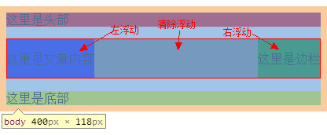
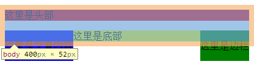
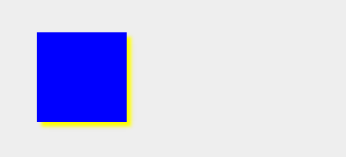
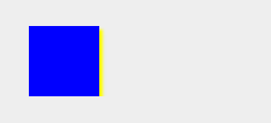

希望在读该文章之前您已经对可视化格式模型有了一定的认识，如果还不是很了解你可以看一下我之前写的[可视化格式模型](http://kai-lee.com/2013/09/27/visual-format-model/)。
CSS的FLOAT属性到底是个什么东东？以下是个人对FLOAT属性的神话描述：
在战火连绵的年远古代，人们饱受战争带来的痛苦！为了和平，一位女子在上古卷轴的指引下找到了足以撼动地球的力量——CSS果实。虽然人们不知道这果实会给人间带来什么，但是相信这将是一个伟大的开始！此女子想要通过得到神之力平息战乱便吃下了CSS果实。果然吃下果实，这名女子获得了神之力，拥有强大的法术并切平息了战争，人间获得了和平······之后，女子诞下的儿女，生来就拥有超凡的法术给人间带来了不小的麻烦···这都是后话了，不过接下来介绍的便是其中一子，名曰：浮动。ps：本故事纯属虚构如有雷同纯属巧合。

<!--more-->

## 浮动是何方神圣？
相信大家看到过报纸、杂志或者海报之类的设计中有图文混排。网页设计中，为了实现文本环绕图片效果FLOAT横空出世。浮动的元素仍然是网页流的一部分。这与使用绝对定位的页面元素脱离文档流不同。FLOAT属性有四个可用的值：
- left/right 使元素左或右浮动
- none使元素不浮动
- inherit将从父级元素继承

## 浮动你能干什么？
浮动本就是用来混排图文的。但不少人觉得用浮动创建网页布局也是一个不错的方式，所以浮动也大肆用来布局网页。
### HEML代码部分

    <body>
   	  <header>
   	 	  
这里是头部

   	  </header>
   	  <article>
   		<section>
   			
这里是文章内容

   		</section>
   		<aside>
   			
这里是边栏

   		</aside>
   	  </article>
   	  <footer>
   		  
这里是底部

   	  </footer>
    </body> 

### CSS代码部分

    header{
   	  width: 400px;
   	  background: red;
​    }
​    article{
   	  width: 400px;
   	  overflow: hidden;
   	  background: gray;
​    }
​    section{
   	  float: left;
   	  background: blue;
​    }
​    aside{
   	  float: right;
   	  background: green;
​    }
​    footer{
   	  width: 400px;
   	  background: yellow;
​    }

### 分析如图

## 浮动带来的影响
上例展现了一个简单的浮动布局，你可能已经注意到了，我对`article`
应用了`overflow: hidden;`，它产生了怎样的效应？看一下去掉这条属性后的表现：

我擦嘞，这是怎么了？好吧我承认自己故作震惊。没错，这就是浮动给人间造成的危害。毕竟神力本不是人家所有的，所以人们也要承担一定的风险：父盒子高度**塌陷**，布局崩盘这真是令人不爽啊。

## 解决浮动带来的负面影响
### 添加额外标签
该方法比较容易理解吧，但是对于大部分代码要求高的程序员来说是绝不能容忍的，而且后期代码维护势必会带来不便。

    <article>
     <section>
      
这里是文章内容

     </section>
     <aside>
      
这里是边栏

     </aside>
     

/*clear:both;清除浮动*/
    </article>

### 父元素设置`overflow: hidden;`

    /*在父元素里添加一条，这里继上例*/
    article{
        overflow: hidden;
    }

这里解决大部分的浮动造成的影响是没有问题的,列举几个不合适的地方：
1. 如果使用了`overflow: hidden;`的元素要定位到外面来，比如说要`position: absolute;`就泛滥了。
2. 对CSS3的box-shadow属性来说，它会裁剪阴影。 
    1. 
    2.   

### 浮动父元素      

    /*在父元素里添加一条，这里继上例*/
    article{
        float: left;
    }

浮动布局的兼容性布局一直备受争议，所以给父元素也浮动，难道要给所有的都加浮动吗？不建议这样用。    

### 使用:after伪类

    .clearfix:after{
        visibility: hidden;
        display: block;
        font-size: 0;
        content: "clear";
        clear: both;
        height: 0;
    }
    .clearfix{
        *zoom: 1;/*兼容IE6/7*/
    }

以上代码通过创建一个**内容为空的块**来为目标元素解决浮动造成的影响。该方法提到了兼容IE6/7的处理办法`zoom: 1;`是为了触发**hasLayout**本文暂不涉及他的相关知识它是IE特有的。    

## 综述
对于浮动我个人并没有厌恶之情，厌恶的是做浏览器兼容。同样是浮动，不同的浏览器实现起来却五花八门，这才是最让人憎恶之物！这里我有用处理浮动造成的影响和清除浮动这两种说法，之所以这样用是因为他们是不同的概念。浮动造成使父元素高度塌陷的负面效应，要处理浮动带来的负面影响本文列举了四种方法，其中不乏**清除浮动**`clear: left/right/both;`来处理高度塌陷。不知这样是否够清楚，如有不明，请留言。
文章仅列举了四中解决浮动造成的影响的方案，如果您有更好的方式，提前感谢您留言交流。文中有错的地方还请指正，谢谢！