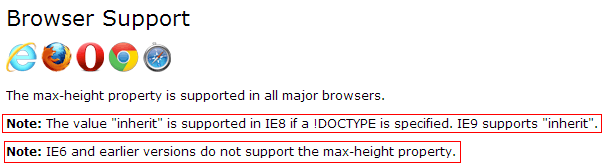

我也曾有这样的问题：“IE6下`max-width`怎么不起作用呢？”特别是给``使用`max-width`的时候，图片都表现得参差不齐的实在不美观啊！现在可以解决这个问题了，记录一下。

<!--more-->

## 解决办法
在此之前，我们不妨看一下浏览器对`max-width`的支持情况：

## CSS解决方式
这里用expression语句
### CSS代码部分
Hack语句少用为妙，expression语句也比较耗资源。总之，一句话：慎用Hack！

    img {  
      max-height: 300px;  
      _height:expression(this.scrollHeight > 300 ? "300px" : "auto"); 
      /* 设置 max-height for IE6 */  
      max-width: 600px;  
      _width:expression(this.scrollWidth > 600 ? "600px" : "auto"); 
      /* 设置 max-width for IE6 */  
    } 

## jQuery解决方式
### jQ代码部分
在使用这段代码之前，你最好已经安装了jQuery。

    if($.browser.msie&&($.browser.version == "6.0")&&!$.support.style){  
        $("img").each(function(){  
            if($(this)[0].scrollHeight>300){  
              $(this).css({"height":"300px","overflow":"hidden"});
            }  
        });
        $("img").each(function(){  
            if($(this)[0].scrollWidth>600){  
              $(this).css({"height":"600px","overflow":"hidden"});
            }  
        });
    }

## 参考文献
- [jQuery](http://jquery.com/)
- [JQuery For Setting A Dynamic max-width](http://stackoverflow.com/questions/8183549/jquery-for-setting-a-dynamic-max-width)
- [jQuery 教程](http://www.w3school.com.cn/jquery/)
- [jquery 在线手册,CHM 1.7](http://www.php100.com/manual/jquery/)
- [max-width](http://css-tricks.com/almanac/properties/m/max-width/)
- [Image mysteriously ignoring max-width in Firefox & IE](http://stackoverflow.com/questions/14550356/image-mysteriously-ignoring-max-width-in-firefox-ie)
- [How max-width fails in IE8](http://www.zeilenwechsel.de/it/articles/5/How-max-width-fails-in-IE8.html)
- [max-width property](https://msdn.microsoft.com/en-us/library/ie/ms530811(v=vs.85).aspx)

