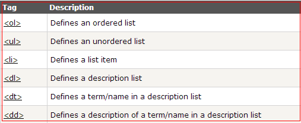
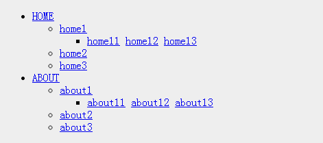
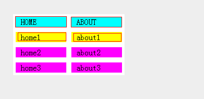
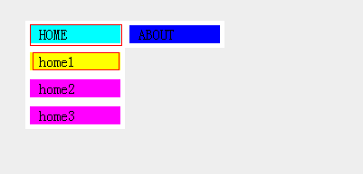
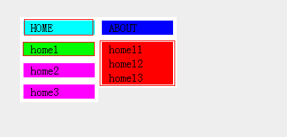
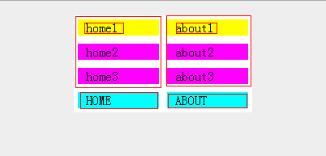
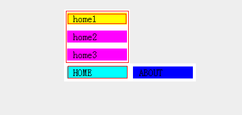
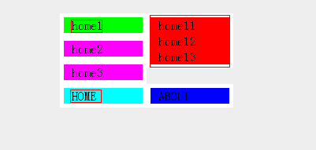

我个人对下拉菜单还是比较感冒的，而且如果意识不清醒嵌套的层级多了就容易犯浑。话不多说直奔主题。

<!--more-->

## 列表元素

## 制作下拉菜单
这些列表元素的定义属性不是我们讨论的重点，这里我们以无序列表为例，将通过`<ul>` `<li>`的嵌套实现下拉菜单。
### HTML代码部分

    

        <ul>
            <li><a class="dn" href="#">HOME</a>
                <ul>
                    <li><a class="dn" href="#">home1</a>
                        <ul>
                            <li>
                                <a href="#">home11</a>
                                <a href="#">home12</a>
                                <a href="#">home13</a>
                            </li>
                        </ul>
                    </li>
                    <li><a href="#">home2</a></li>
                    <li><a href="#">home3</a></li>
                </ul>
            </li>
            <li><a class="dn" href="#">ABOUT</a>
                <ul>
                    <li><a class="dn" href="#">about1</a>
                        <ul>
                            <li>
                                <a href="#">about11</a>
                                <a href="#">about12</a>
                                <a href="#">about13</a>
                            </li>
                        </ul>
                    </li>
                    <li><a href="#">about2</a></li>
                    <li><a href="#">about3</a></li>
                </ul>
            </li>
        </ul>
    

### CSS代码部分

    /*normal*/
    .menu{
        position: relative;
    }
    .menu ul{
        margin: 0;
        padding: 0;
        list-style: none;
    }
    .menu ul li{
        position: relative;
        width: 100px;
        border: 5px solid #fff;
        float: left;            
    }
    .menu ul li a,.menu ul li a:visited{
        display: block;
        padding-left: 10px;
        text-decoration: none;
        color: #000;
        font-size: 16px;
        height: 20px;
        line-height: 20px;
        background-color: #00f;
    }
    .menu ul li ul{
        display: none;
    }
    /*hover*/
    .menu ul li:hover a{
        color: #000;
        background-color: #0ff;
    }
    .menu ul li:hover ul{
        display: block;
        position: absolute;
        left: -5px;
        top: 25px;
    }
    .menu ul li:hover ul li{
        display: block;
        color: #000;
        border: 5px solid #fff;
    }
    .menu ul li:hover ul li .dn{
        color: #000;
        background-color: #ff0;        
    }
    .menu ul li:hover ul li:hover a.dn{
        color: #000;
        background-color: #0f0;
    }
    .menu ul li:hover ul li ul{
        display: none;
    }
    .menu ul li:hover ul li a{
        display: block;
        padding-left: 10px;
        background-color: #f0f;
    }
    .menu ul li:hover ul li a:hover{
        background-color: #f00;
    }
    .menu ul li:hover ul li:hover ul{
        display: block;
        position: absolute;
        left: 105px;
        top: -5px;            
    }
    .menu ul li:hover ul li:hover ul li a{
        color: #000;
        background-color: #f00;
    }
    .menu ul li:hover ul li:hover ul li a:hover{
        background-color: #666;
    }

### 效果展示
1. 
2.  
3.   

配色啥的都不专业，关键看一下下拉菜单效果。由`<ul>` `<li>`嵌套，通过相对定位与绝对定位实现合适的布局。改代码实现下拉菜单向下弹出，通过修改`<top>` `<bottom>`的值可以调整下拉菜单向上弹出。

### CSS代码添加一项修改

    .menu ul li:hover ul{
        display: block;
        position: absolute;
        left: -5px;
        /*top: 25px;*/
        top: -95px;
    }

### 修改后菜单向上弹出的效果 
1. 
2. 
3.    

### 注意
IE6仅支持`<a>`的`:hover`,并不支持诸如`li:hover`，所以在IE6下要修改一下，本篇暂不分析。

## 结语
因为这个地方自己老是犯浑所以记录一下，同时也与大家分享一下，如果您有一些好的方法提前感谢您留言。文章中的不足之处还请指出，本人一定认真对待。