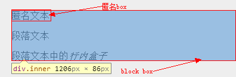
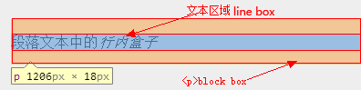
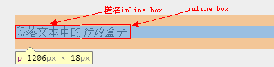
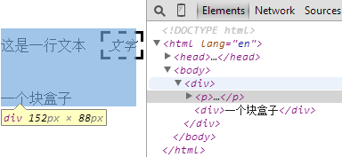
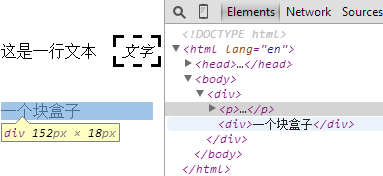
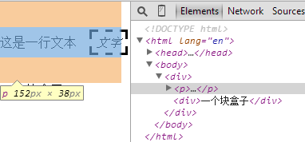
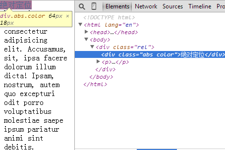
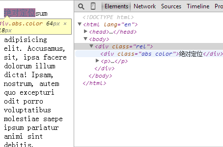

对可视化格式模型的介绍，对文档树的渲染情况做简单的阐述：比如视点、盒子。可视化格式模型：用户端在图形媒介下如何处理文档树。在可视化模型中，每个文档树中的元素根据盒模型（包含盒模型）产生零个或者多个控制盒。这些盒的布局由下列内容控制：
1. 盒子的尺寸和类型
2. 定位方案（常规流，浮动，绝对定位）
3. 文档树中元素间的关系
4. 外部信息（比如：视点大小，图形的内在尺寸等）

<!--more-->

## 视点
连续媒介的用户端通常提供给用户一个**视点**（屏幕上的一个窗口或浏览区域），通过它来使用户浏览文档。当视点尺寸改变时，用户端可能改变文档的布局。
如果视点比文档初始包含块小，用户端可能提供滚动机制。对于一个**渲染区域**而言，最多只能有一个视点，不过用户端可以对多个渲染区域加以渲染（即对同一文档提供不同的视角）。

## 包含块
在**CSS2.1**中，很多盒子的位置和尺寸的计算都基于称作是**包含块**的长方形盒子的四边。通常地，生成的盒子表现为其派生盒子的包含盒子。短语“一个盒子的包含块”意味着“该盒子所在的那个包含盒子”，而不是他所生成的块。
每个盒子基于他的包含块会有一个定位，但是他不被包含块所限制，他有可能溢出。

## 控制盒子的生成
接下来描述了CSS2中可能生成的盒子的类型。一个盒子的类型的影响因素，一定程度上取决于它在可视化格式模型中的表现。一下讨论的`display`属性决定了盒子的类型。正所谓龙生龙凤生凤，老鼠的孩子会打洞。块级元素生成一个原始块级盒子。内联元素生成一个原始的内联盒子。

## 盒子类型示例
### HTML代码部分

    

        

            匿名文本
    	
段落文本中的<em>行内盒子</em>

        

    

### 分析如图：    
1. 
2. 
3. 

## display属性
1. `block`该属性值导致一个元素生成一个块级盒子。
2. `inline`该属性值导致一个元素生成一个内联盒子。
3. `inline-block`该属性值导致一个元素生成一个格式化为行内元素的块级盒子。
4. `list-item`该属性值导致一个元素生成一个块级盒子和一个列表项内联盒子。
5. `none`不产生盒子。
6. `table`/`inline-table`...使呈现出表格元素的响应特性（这里且不谈表格）

## 盒子的定位方案
1. 常规流
2. 浮动
3. 绝对定位
上面这三种方案随便拿出一个都可以算得上一个不小的课题。这里我们不想把它做成课题研究当然我也做不了，先从基础开始了解盒子的定位吧。在我后续的文章里会深入挖掘这些定位方案的一些神奇之处。

### 常规流
常规流中盒子一个接一个地水平放置（内联盒子）or垂直放置（块级盒子），它们的起点是包含容器的顶部。下面是一段简单的示例代码：
#### HTML部分

    

        
这是一行文本<em>文字</em>

        
一个块盒子

      

#### CSS部分

    /*我们可以给它们些样式*/
    p{
        margin-top: 2em;
        margin-bottom: 2em;
    }
    em{
        padding: 5px;
        margin: 1em;
        border-width: medium;
        border-style: dashed;
        line-height: 2.4em;
    }

 #### 如图分析
 1.  
 2.  
 3.  

### 浮动方案
浮动的元素将格式化为一个块级盒子，他并没有脱离文档流，只是使内容排列在左浮动的右边；右浮动的左边。看下面这个例子:
#### HTML部分

    
左浮动

    
右浮动

    
Lorem ipsum dolor sit amet, consectetur adipisicing elit. Accusamus, sit, ipsa facere dolorum illum dicta! Ipsam, nostrum, autem quo excepturi odit porro voluptatibus molestiae saepe ipsum pariatur animi sint debitis.

#### CSS部分

    div{
        width: 100px;
        height: 100px;
    }
    .r{
          float: right;
          background: red;      
    }
    .r div{
          background: red;
    }
    .l{
          float: left;
    }
    .l{
          background: blue;
    }

 #### 如图分析
 1.  
 2.  
 3.  

### 绝对定位方案
决定对位方式使该盒子完全从常规流中脱离出来。它又分为，固定定位（fixed）、相对定位（relative）、绝对定位（absolute）三种。
#### Fixed
对于固定定位，他的盒子有视点创建。对于连续媒体，固定盒子并不随文档的滚动而移动。敌不动我不动，敌动了我还是不动，以不动应万动呵呵，好贯口。看一段示例代码：
##### HTML部分

    /*HTML 部分*/
    

##### CSS部分

    /*CSS 部分*/
    #header{
        position: fixed;
        width: 100%;
        height: 15%;
        top: 0;
        left: 0;
    }

#### Relative与Absolute
相对定位往往和绝对定位搭配所以这里我干脆把他俩放在了一起，在一起，在一起···如果放任`absolute`他会相对于窗口定位，我们指定`left`，`right`，`top`，`bottom`值是相对于窗口的，但是如果给使用了绝对定位的元素的父元素使用relative，绝对定位将会相对于相对定位而定位，即相对于设置了`relative`的父元素定位而不再是窗口。`relative`把`absolute`**封印**在了自己体内独自承受痛苦与力量。呵呵这不就是CSS里面的鸣人君吗？看例子：
##### HTML部分

    /*HTML 部分*/
    <body>
      

绝对定位

      
Lorem ipsum dolor sit amet, consectetur adipisicing elit. Accusamus, sit, ipsa facere dolorum illum dicta! Ipsam, nostrum, autem quo excepturi odit porro voluptatibus molestiae saepe ipsum pariatur animi sint debitis.

    </body>

##### CSS部分

    /*CSS 部分*/
    .rel{
          position: relative;
    }
    .abs{
          position: absolute;
          left: 0;
          top: 0;
    }
    .color{      
          background: red;
    }

##### 如图分析
1. Absolute下的效果

2. Relative下的Absolute的效果

## 参考文献
- [Visual formatting model](http://www.w3.org/TR/CSS21/visuren.html)
- [Visual formatting model details](http://www.w3.org/TR/CSS2/visudet.html)
- [Visual formatting model](http://librocket.com/wiki/documentation/RCSS/VisualFormattingModel)
- [CSS Visual Formatting](http://www.tutorialrepublic.com/css-tutorial/css-visual-formatting.php)
- [可视化格式模型](http://sunnylost.com/article/css.visuren.html)
- [10 可视化格式模型的细节](http://www.css88.com/book/css2/visudet.html)
- [KB007: 可视化格式模型( visual formatting model )简介](http://w3help.org/zh-cn/kb/007/)
- [10步掌握CSS定位](http://www.see-design.com.tw/i/css_position.html)
- [CSS 定位 (Positioning)](http://www.w3school.com.cn/css/css_positioning.asp)
- [CSS Positioning](http://www.w3schools.com/css/css_positioning.asp)
- [Detailed Positioning](http://learn.shayhowe.com/advanced-html-css/detailed-css-positioning/)
- [position](http://learnlayout.com/position.html)
- [CSS/Properties/position](http://www.w3.org/wiki/CSS/Properties/position)
- [CSS Positioned Layout Module Level 3](http://dev.w3.org/csswg/css-position-3/)
