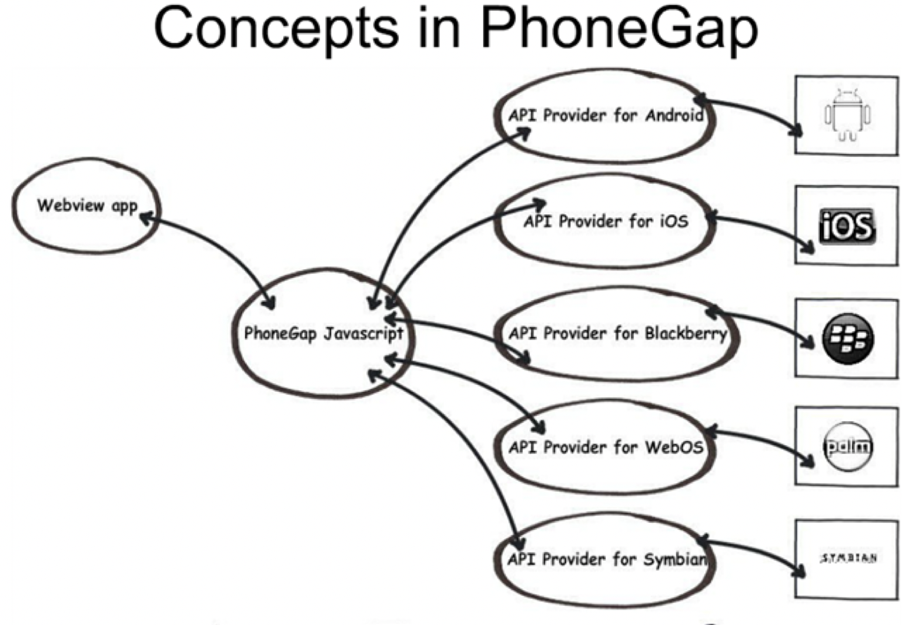

## 前言

发现自己好长时间不写博客了，今天介绍点儿新东西--**PhoneGap**。这个新，可能仅仅对我而言，如果你是老鸟，轻喷。

PhoneGap 给我的直观感受是，我可以做更多事情了。过去一年的时间里，我也就是码一点儿页面，写点儿`js`的交互。虽然很直观的能看到自己的成果，但是总感觉是个外行程序员。看人家后台工程师看人家正火的移动开发工程师，牛的一批！但是，现在通过 PhoneGap 我也可以做出移动手机软件了！欧耶

<!--more-->

## PhoneGap 简介

### 它被视为HTML5移动应用平台，它包括：

- 移动应用框架：采用`Web/HTML5`技术编写应用，支持设备能力（如`GPS`、重力感应等）调用；支持能力插件灵活扩展。
- 手机应用创建工具：将遵循 PhoneGap 应用框架编写的程序转换/封装生成各平台支持的手机应用。如上图生产车间的感觉。

### **PhoneGAP基本技术原理：**

基于PhoneGap应用框架实现的手机应用相当于展示某个网页应用的特别浏览器。PhoneGap将Web程序打包成系统支持的手机应用格式（方便应用的分发、使用），通过调用系统的浏览器功能实现应用的运行及交互操作。

- 开发语言选择：`web` 浏览器几乎是各手机智能平台共同支持，开发技术`html/css/js`

-  应用呈现：各个智能平台都具备并开放了浏览器功能，因此，PhoneGap通过调用`WebView`（浏览视图，具有浏览器基本功能的组件）实现应用`UI`的呈现及业务逻辑处理

- ` JS API`扩展：PhoneGap针对不同平台的`WebView`做了扩展和封装，使得应用可以通过 `js `访问各种本地设备`API`

- **插件**扩展：实现了一套灵活的插件扩展框架，允许开发者自行扩展插件。

## 使用 PhoneGap 打包一个Android 应用

使用PhoneGap搭建Android开发的项目整体步骤如下：

1. 安装`java`环境。
2. 安装`ant`构建工具。
3. 安装`android`的开发环境并配置环境变量。
4. 安装`Node.js`环境并配置环境变量。
5. 安装`git`
6. 使用`npm`安装`PhoneGap`全局环境。
7. 使用`PhoneGap`命令创建`PhoneGap`项目。
8. 将`PhoneGap`编译为`android`项目。
9. 将上述项目导入`ADT`进行后续开发。
10. 安装`.apk`文件

以上步骤，就不一一讲解了。我只说几点，我遇到的几个问题：

- Java 环境变量的配置，小心别遗漏`.;`
- ant  是一个构建工具，没有深究
- Android 开发环境的搭建，也是参考了一些资料。准备抽时间单拎出来写一篇博客

希望，看完这篇博客，你也手痒痒想去试试。Just do it！

## 参考文献

- [PhoneGap](https://phonegap.com/getstarted/)
- [PhoneGap DOC](http://docs.phonegap.com/en/4.0.0/index.html)
- [PhoneGap docs for android](http://docs.phonegap.com/en/2.1.0/guide_getting-started_android_index.md.html#Getting%20Started%20with%20Android)
- [PhoneGap GitHub Repo](https://github.com/phonegap/phonegap)
- [PhoneGap GitHub](https://github.com/phonegap)
- [PhoneGap GitHub DOCS](https://github.com/phonegap/phonegap-docs)
- [HTML5漫谈（4）--HTML5应用平台:PhoneGAP](http://www.zixuephp.com/html/html5/201411073970.html)
- [如何使用PhoneGap打包Web App](https://yanhaijing.com/mobile/2014/06/24/12-how-use-phonegap-package-web-app/)