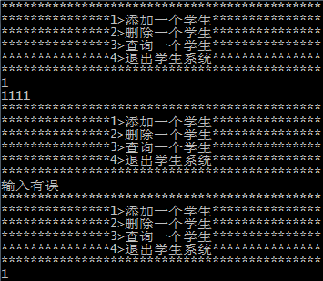
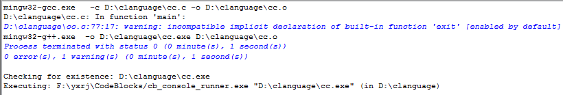
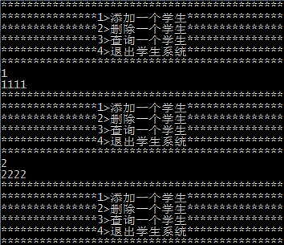
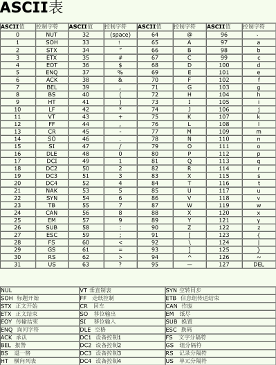

## 写在前面的话
学习 C 语言的过程中发现自己之前不太注意或者想当然的理解的错误做一个记录、改正和提炼。同时，希望对看到这篇博文的读者也能够有所帮助。
<!--more-->
##  SCANF函数
早在之前，我对 *scanf()* 函数的理解还是停留在它用来接收用户输入，但是当我真正去编写代码，运行代码时会发现没有什么是想当然的简单，有时候甚至因为手贱多敲了个空格而大费周章的调试代码，蓦然回首却发现是手滑打了个空格。没错在代码编写的时候这样的错误实在是比比皆是，而且多半是因为粗心造成的，现在我也更愿意说是不熟练造成的。接下来，我想通过最近在论坛里解决的一个问题谈一下这个 *scanf()* 函数。

### 一个问题引发的思考

    #include<stdio.h>
    #define TRUE 1
    
    void printscreen()
    {
    printf("********************************************\n");
        printf("***************1>添加一个学生***************\n");
        printf("***************2>删除一个学生***************\n");
        printf("***************3>查询一个学生***************\n");
        printf("***************4>退出学生系统***************\n");
        printf("********************************************\n");
    }
    
    int main()
    {
        char order;
        while (TRUE)
        {
            printscreen();
            scanf("%c", &order);
            switch (order)
            {
                case '1':
                    printf("1111\n");
                    break;
                case '2':
                    printf("2222\n");
                    break;
                case '3':
                    printf("3333\n");
                    break;
                case '4':
                    exit(1);
                    break;
                default:
                    printf("输入有误\n");
                    break;
            }
        }
        return 0;
    }

拿过问题，我在电脑上运行了，毕竟实践出真知嘛，一下是这样的：
1. 运行界面

2. 编译结果

我们可以看到运行界面中出现的“输入有误”的打印绝不是我们想要的，另外有一条很不爽的警告 *“incompatible implicit declaration of built-in function 'exit'”* 。于是，我查阅了一下资料发现这条警告可以通过添加 *stdlib* 头文件解决。接下来就是如何处理那行错误打印了。每次输入一个值退出 *switch* 选择后再到 *while* 执行 *printscreen* 函数，之后会在用户没额外输入值的情况下执行了 *switch* 的 *default* 语句。用户没有额外输入按理说应该会卡在那里等待输入才对，那么既然它往下执行了说明有值给了 *scanf* 且不是1、2,、3、4的其中一个。输入错误那当然能是执行 *default* ，所以每次都会输出“输入有误”，疑问的是到底是给了 *scanf* 什么值呢？我把 *default* 改了一下

    default:
    printf("order = %d\n", order);
    break;    

我的目的是想打印一下 *order* 看看到底是什么值，得到的结果是10（是时候查下 ASCII 码表）好了明白了，是因为结束 *switch* 循环后在执行 *scanf* 的时候在用户没有输入值的情况下其实 *scanf* 接受了键盘缓存的换行符那么自然会执行 *default* 语句了。那么又如何解决这个问题呢？键盘缓存机制我不想多说，不过 C 语言提供了刷新缓存的函数，于是我对代码做了下修改：

    while(TRUE)
    {
        printscreen();
        // 刷新缓存
        fflush(stdin);
        scanf("%c", &order);
        switch (order)
        {
            case '1':
                printf("1111\n");
                break;
            case '2':
                printf("2222\n");
                break;
            case '3':
                printf("3333\n");
                break;
            case '4':
                exit(1);
                break;
            default:
                printf("order = %d\n", order);
                break;
        }
    }

这样问题算是解决了，看一下运行结果，同时一并附上 ASCII 码表。
1.修改后的运行结果

2.ASCII 码表

此外，程序中还涉及到了 *exit* 函数，我查阅资料得到它可以退出应用程序，删除进程使用的内存空间，并将应用程序的一个状态返回给 OS (操作系统)，这个状态标识了应用程序的一些运行信息，这个信息和机器和操作系统有关，一般是 0 为正常退出，非0 为非正常退出。不过这里在*main*函数下调用效果确实和 *return 1*；差不多。

### 必要的总结
有必要一并把 *scanf* 函数总结一下：
- 它是一个阻塞式函数
- 只接受变量的地址,在变量名前加一个 & 符号
- 不要因为手贱带入空白符，比如：空格、制表符( \t )、回车符( \r )、换行符( \n )
- 它返回成功读入的项目的个数，反之返回0。可以利用这一点来检测和处理不匹配的输入，这里不赘述

## 写在最后的话
C 语言的学习当然不止于此，我拿 *scanf()* 函数开刀，是因为之前我对它的理解太过想当然了。我通过一个题引发了一连串的思考，包括：发现问题，解决问题，查阅资料。最重要的是自己改正了之前错误的观点，毕竟一篇学习笔记类型的博文不可能涵盖“辣墨多”知识点，我觉得一个错误的更正，一种观念的改变要比罗列知识来的更有效果。希望我的博文可以给看到文章最后的您带来些许的帮助，谢谢！在接下来的学习中我会不断的总结知识，然后记录到博客上来，今天有了[C 语言学习笔记一](http://kai-lee.com/2015/04/22/C%E8%AF%AD%E8%A8%80%E5%AD%A6%E4%B9%A0%E7%AC%94%E8%AE%B0%E4%B8%80/)的横空出世，那么**C 语言学习笔记二**还会远吗？敬请期待！

## 参考文献

- [美]Prate,S. C Primer Plus[M]. 第5版. 云巅工作室，译. 北京：人民邮电出版社，2011.4：60-85.
- [Why scanf requires &?](http://stackoverflow.com/questions/10597606/why-scanf-requires)
- [常用对照表](http://tool.oschina.net/commons?type=4)