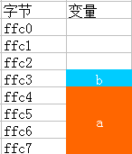
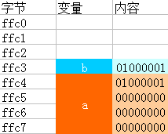
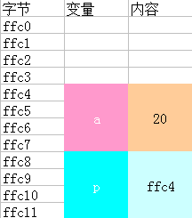
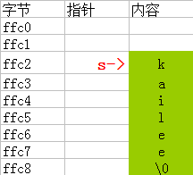

## 写在前面的话

“指针是C语言中非常重要的数据类型，如果你说C语言中除了指针，其他你都学得很好，那你干脆说没学过C语言。”
可以给正打算学习 OC 的人提前打个预防针，如果搞不懂指针对于 OC 的学习也将非常痛苦，因为在 OC 里面你想修改对象，你想操纵对象，就必须用指针，那如果指针都搞不懂，问题就严重了。另外，对于结构体的学习也应该摆在相当重要的位置。本篇博文，现就指针的学习做一下总结，希望对那些刚开始学习指针的人提供些许的帮助。
<!--more-->
##  理解指针要做的铺垫

我现在一下子把指针拿出来讲这，讲那会显得很突兀，按照从简单到复杂，从低级到高级的学习路线，先了解一下 **变量** 是明智的选择。

### 变量

#### 变量的声明

    变量类型  变量名;
    int a;
    char b;

每次使用变量都要事先声明一下，也就是告诉计算机给名为 a 的变量开辟一个整数类型的空间（32位编程中占2个字节），和一个名为 b 的变量开辟一个字符型的空间（32位编程中占一个字节）。我学着用表格来模拟一下内存中的存储（注意是从高位寻址）如图：

这样我们就有了两个不同类型的变量了。

#### 变量的赋值

    a = 20;
    b = 'A';

我们当然知道是，把 30 存入 a 变量的内存空间，将字符 A 存入 b 变量的内存空间中。同样我来模拟一下（注意只是模拟）：

这样感觉应该比较清晰了吧！我这里还要提一下变量使用中的常见错误
- 变量名相同，肯定是不被允许的
- 变量的作用域不对
    - 变量的创建和释放过程
    - 代码块作用域

## 重头戏来了

### 指针是什么

举一个生活中的例子：比如说你去找人，但是没有碰到，于是你发了条信息说是：我来找你你不在，看到信息到学校对面肯德基一楼7号位找我，我在那里等你。当你打开手机看到这条信息，你就知道了我来找过你并给你留下信息。你想想看，这条短信的作用，信息本身不是我吧，你不能那信息当做我本人。那么你又如何知道我的位置呢？因为短信上写着我的位置嘛！其实这条短息就是一个指针了。它上面的内容不是我本身，而是找到我的地址，你通过这条短信这个指针找到了我。理解了这一点，让我们来看看 C 中指针到底是何方神圣。

#### 指针变量

    变量类型 *变量名
    int *p;
    int a = 20;    
    p = &a;

不要觉得指针多么神奇，其实就是个变量嘛，如果上面讲到的变量你理解了，这里应该不是问题。32位的编译器给指针开辟了4个字节的空间，有必要提一下的是指针不同于一般变量，存的是变量的地址，在同一架构下地址长度都是相同的（ cpu 的最大寻址内存空间），所以不同类型的指针长度都一样，在32位的编译器下指针长度为4字节可以记录的地址范围是 0x00000000~0xFFFFFFFF ，这个范围才是指针变量的值比如说一个 char 1字节，可以存在 0x0 ，也可以位于 0xFFFFFFFF 而和 char 占用1字节还是100字节无关，指针的范围只和机器字和系统有关，在64位操作系统下那么就都是8。既然这样，为什么还要给指针定义类型？给指针定义类型是为了指针取值和赋值的时候让计算机知道，应该取或者赋什么类型的变量。
- 内存分析如图：

- %p 输出指针里面存储的地址值
- 其他指针类型说明，比如 

    float *p;  char *p;

- 不能乱用类型，比如 

    int a = 10;  float *p = &a;

- 清空指针

    p = 0;
    p = NULL;

- 指针变量未经初始化不要拿来乱用

### 指针与数组

- 指针变量值指向数组的首元素

    int ages[5] = {1, 3, 6, 9, 8};
    int *p;
    p = &ages[0]; // 或者 p = ages; // 因为数组名即数组的首地址

- 指针变量的 +1 不是数值的 +1；它取决于指针的类型：int 类型的要 +4；char 类型的要 +1；double 类型的要 +8。

    p->&ages[0];
    p+1->&ages[1];
    p+i->&age[i];

- 只要指针指向了数组的首元素，指针变量名[下标]同样可以访问数组

    p[1] == ages[1]; // 返回 true 证明我们的结论是正确的，而且的确是对的

- 当数组作为参数时，要用指针

    // 这样写会有警告
    void change(int array[]){} 
    // 这样写才是更加合理的，因为数组当做函数参数传递时，会当做指针来使用
    void change(int *array){} 

### 指针与字符串

- 用指针来定义一个字符串

    char *s = "kailee";
    // 或者
    char *s;
    s = "kailee";

- 内存分析

- 指针操作字符串变量和字符串常量

    char a[] = "kailee"; // 定义了一个字符长变量
    char *p = "kailee"; // 定义了一个字符串常量
    *a = "K";
    *p = 'K'; // 该代码错误，字符串常量内部的字符不能修改
    printf("%s", a); // 打印为：Kailee
    printf("%s", p); 
    // 打印时会报错，你听说字符串常量内部的字符可以修改吗？明白了吧

### 指针与函数

- 指针也是 C 语言中的一种数据类型，因此一个函数的返回值肯定可以是指针类型的
- 返回指针的函数的一般形式为：

    类型名 * 函数名(参数列表)

- 指向函数的指针，函数作为一段程序，在内存中也要占据部分存储空间，它也有一个起始地址，即函数的入口地址。函数有自己的地址，指针变量就是用来存储地址的。因此，可以利用一个指针指向一个函数。其中，函数名就代表着函数的地址。
- 定义的一般形式：函数的返回值类型 (\*指针变量名)(形式参数1, 形式参数2, ...);
- 使用指向函数的指针的好处
    - 调用函数
    - 把函数作为参数，在函数之间传递

### 指向指针的指针

指针是有地址的，那么指针就可以指向指针。举个例子吧：

    int a = 10;
    int *p = &a; // int 类型的指针变量 p 指向了变量 a
    int **q = &p; // 这样理解简单些：(int *)*q = &p;指针类型的变量 q 指向了指针 p
    
    // 现在要用指针改变 a 的值为20可以如下操作：
    // *p 访问指针变量 p 指向的存储空间（即 a 的空间），并将20赋值给 a
    *p = 20; 
    // *q 访问指针变量 p 的地址在通过 **q 找到 p 指向的存储空间（即 a 的空间），并将20赋值给 a
    **q = 20; 

## 写在最后的话
写博客真的是件锻炼人的事儿，不仅要自己明白还要让读这篇博客的人明白，很多人做到了自己明白去不能让别人明白，希望我的博文可以给看到文章最后的您带来些许的帮助，谢谢！敬请期待！

## 参考文献
- [operator precedence](http://unixwiz.net/techtips/reading-cdecl.html)
- 姚云飞. 彻底搞定C指针[M]. 完全版.
- [【C语言】11-指针](http://www.cnblogs.com/mjios/archive/2013/03/16/2963645.html#label6)
- [美]Prate,S. C Primer Plus[M]. 第5版. 云巅工作室，译.
- [【C语言】14-返回指针的函数与指向函数的指针](http://www.cnblogs.com/mjios/archive/2013/03/19/2967037.html)
- [《征服C指针》Web版](http://avnpc.com/pages/c-pointer)
- [Does the size of pointers vary in C?](http://stackoverflow.com/questions/3520059/does-the-size-of-pointers-vary-in-c)
- [C size of pointer variable](http://www.c4learn.com/c-programming/c-size-of-pointer-variable/)