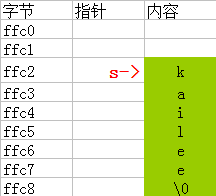

 C语言中没有专门的**字符串变量**，如果要将一个字符串存放在变量中，必须使用**字符数组**，即用一个字符型数组来存放一个字符串，数组中每一个元素存放一个字符。

<!--more-->

## 字符数组定义与初始化

```c
char c[11] = {'h','e','l','l','o','w','o','r','l','d','!'};
```


**字符型**与**整型**互相通用，因此 `int c[11]` 也可以定义字符数组。但由于两种类型分配字节不同，用整型来定义会浪费空间，另外这样定义实际意义也不大，只是为了说明其合法性。

如果初值个数小于数组长度，则只将这些字符赋绐数组中前面的元素，其余元素自动定为空字符(即`'\0'`)。

一般我们用**字符数组**来存放字符串时，都要先确定一个足够大的数组，而实际并用不了那么多，而我们只关心其有效位，为测定字符串实际长度，C规定了一个*字符串结束标志*，以字符 `'\0'` 代表。如果有一个字符串，其中第12个字符为`'\0'`，则此字符串的有效字符为11个。也就是说，在遇到字符`'\0'`时，表示字符串结束，由它前面的字符组成字符串。 

### 结束符

- 字符数组不要求最后一个字符为`'\0'`，而为了使处理字符数组和字符串的方法一致，便于测定字符串的实际长度以及方便在程序中处理， 在字符数组末尾也常加上一个`'\0'`。
- 系统对字符串常量自动加一个`'\0'`作为结束符。

###用字符串常量来初始化字符数组 

```c
char c1[] = {"Hello world !"};
char c2[]= "Hello world !";
```

C语言中数组名代表该数组的起始地址

## 字符数组的输入输出

- 逐个字符输入输出。用格式符`%c`输入或输出一个字符。

- 将整个字符串一次输入或输出。用`%S`格式符，意思是输出字符串`String`
- 一个字符数组中包含一个以上`'\0'`，则遇第一个`'\0'`时输出就结束。

- 若输入字符串长度超过字符数组所定义的长度时，将造成数组下标**越界**，但系统对此并不报错。

- 用`%S`格式输入字符时，遇`空格`、`Tab键`和`回车`将自动结束输入。
- 用`scanf`函数输入时，遇到`空格`则认为一个字符串结束


## 回顾C语言学习笔记二--指针

### 指针与字符串

- 用指针来定义一个字符串

```
char *s = "kailee";
// 或者
char *s;
s = "kailee";
```

- 内存分析
  
- 指针操作字符串变量和字符串常量

```
char a[] = "kailee"; // 定义了一个字符长变量
char *p = "kailee"; // 定义了一个字符串常量
*a = "K";
*p = 'K'; // 该代码错误，字符串常量内部的字符不能修改
printf("%s", a); // 打印为：Kailee
printf("%s", p); 
// 打印时会报错，你听说字符串常量内部的字符可以修改吗？明白了吧
```


## 参考文献

- [美]Prate,S. C Primer Plus[M]. 第5版. 云巅工作室，译.