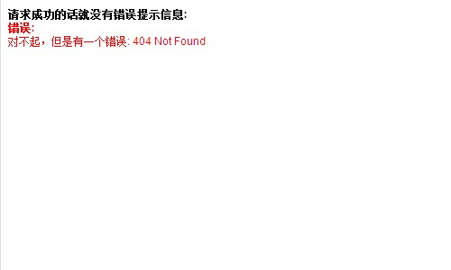

通过jQuery来实现网页局部刷新。要实现这一功能我们首先要了解AJAX – Load()方法。

<!--more-->

## 学习AJAX – Load()方法
jQuery API Documentation 这样描述`.load()`方法：

> Load data from the server and place the returned HTML into the matched element.

所以，`.load()`方法是：调用从服务器加载数据，并将返回的 html 放置到匹配的元素。
调用load方法的完整格式是：

    .load( url [, data ] [, complete(responseText, textStatus, XMLHttpRequest) ] )

- url：是要导入文件的地址。
- data：可选参数；因为Load不仅仅可以导入静态的html文件，还可以导入动态脚本。
- Callback：可选参数；是回调函数指调用load方法并得到服务器响应后再执行。
详细参数介绍可以到[.load()](https://api.jquery.com/load/)参考学习。

## 应用示例
通过以下代码可以实现页面局部刷新:

    $("#refresh").load(location.href+" #refresh>*","");

我去，有没有搞错？没错就一行代码就可以搞定哦！！
### 具体实例

    <!doctype html>
    <html lang="en">
    <head>
      <meta charset="utf-8">
      <title>load demo</title>
      
      
    </head>
    <body>
     
    <b>请求成功的话就没有错误提示信息:</b>
    

    <b style="color:red;">错误:</b>
    

     
    
     
    </body>
    </html>

### 查看Demo截图

## jQuery实现定时网页局部刷新
定时局部刷新用到jQuery里面的setInterval方法，setInterval方法两个参数，第一个是设置定时执行的函数名，第二个是时间。如下代码所示，设置每隔10000毫秒定时刷新。这里提前打个预防针：如果你在jQuery中使用setInterval时，直接在ready中调用其他方法，会提示缺少对象的错误，我这里使用setInterval方法时内置了一个function。写成：

    $(function(){
    	  setInterval(function() {$("#refresh").load(location.href+" #refresh>*","");}, 10000); 
    	  // 10000毫秒等待
      });

我搜了一下在没有参数传递时有以下两种方法：
1. 解决方法是去掉引号和括号，采用最原始的方法：

    function show(){
	​	  alter("show!");
	  }
	  $(function(){
	​	  setInterval(show,10000);//注意没有引号和括号
	  });

2. jQuery的扩展同样可以解决问题。
	  $(function(){
	​	  $.extend({
	​		  show:function(){
	​			alter("show!");
	​		}
	​	  });
	​	  setInterval("$.show()",10000);
	  });	

## 结语
总结以上，jQuery实现页面局部刷新重点掌握AJAX的`.load()`方法以及拓展的定时刷新中需要了解`setInterval()`方法。希望前端高手能指出文中的不足和错误！同时期待您有好的方法拿出来分享，谢谢！	