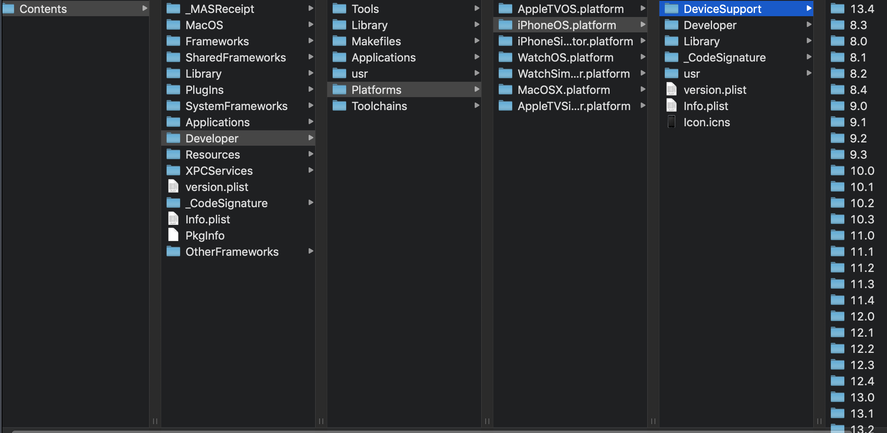

## Xcode 6 遇到的问题

- 去掉了`pch`文件。如果你想有`pch`需要在`building setting`中的`precompile header`设置下路径`$(SRCROOT)/xxx/xxxx.pch`, 然后将`Precompile Prefix Header`为`YES`，预编译后的`pch`文件会被缓存起来，可以提高编译速度。`pch`是预编译文件,我们的一些头文件导入会写到这里如`Foundation.h` 
- 模拟器路径的变更
  - `/Users/username/Library/Developer/CoreSimulator`

<!--more-->

- 应用沙盒地址的变更

  - `应用程序文件`、`Document`文件夹、`Library`文件夹、`tmp`文件夹这四个文件放在了不同的目录中。

    - 应用程序文件路径：`/Users/username/Library/Developer/CoreSimulator/Devices/模拟器UDID/data/Containers/Bundle/Application`文件夹下
    - `Document`文件夹、`Library`文件夹、`tmp`文件夹路径：`/Users/username/Library/Developer/CoreSimulator/Devices/模拟器UDID/data/Containers/Data/Application`文件下。这两个路径打开后的文件名，还是经过编码过的，而且，同一个应用中的应用程序文件和`Document`、`Library`、`tmp`文件夹所在的文件夹的文件名是不同的，只能自己找。 

- `NSUserDefault` 文件存储位置变更，`NSUserDefault`是iOS提供的本地化数据存储方式，会在沙盒中自动创建一个`.plist`的配置文件，将数据保存起来，在读取时，以`NSDictionary`字典来进行接收 

  - `/Users/username/Library/Developer/CoreSimulator/Devices/模拟器UDID/data/Library/Preferences`文件夹下

## Xcode 7 遇到的问题

- `does not contain bitcode` 。在`Build Setting `里面搜索`bitcode`,把`Enable Bitcode` 更改位`NO`.

- 网络请求失败：`App Transport Security has blocked a cleartext HTTP (http://) resource load since it is insecure. Temporary exceptions can be configured via your app's Info.plist file.`

  - 原因：`iOS9`默认使用`HTTPS`请求。解决：暂时退回`http`请求：在工程的`Info.plist`文件里添加`NSAppTransportSecurity`字典类型的，添加一个元素：`key`为`NSAllowsArbitraryLoads`，值为`YES`

  ```json
  <key>NSAppTransportSecurity</key>
  <dict>
  	<key>NSAllowsArbitraryLoads</key>
  	<true/>
  </dict>
  ```

- `iOS 9` 使用 `URL scheme`必须将其加入**白名单**

  - `canOpenURL: failed for URL: "mqqopensdkapiV2://qqapp" - error: "This app is not allowed to query for schememqqopensdkapiV2”`
  - 解决方法：`Info.plist`文件中添加一个`key`为`LSApplicationQueriesSchemes`的数组值，里面包含需要添加白名单的`string`类型的` scheme`。在项目中使用了qq，微信等分享登录功能，需要添加对应的key

- 系统`framework`问题，升级之后`framework`全变红了（并不影响程序运行），替换成`9.0`版本的`framework`即可，旧版本的` .dylib`后缀库文件在`Xcode7`中已经换成` .tbd`了，相应进行替换即可


## XCode 10 遇到的问题

> ld: library not found for -lstdc++.6.0.9
> clang: error: linker command failed with exit code 1 (use -v to see invocation)
> linker command failed with exit code 1 (use -v to see invocation)

**解决：**

把以下3个文件copy到 
`/Applications/Xcode.app/Contents/Developer/Platforms/iPhoneOS.platform/Developer/SDKs/iPhoneOS.sdk/usr/lib` 目录

- libstdc++.6.0.9.tbd
- libstdc++.6.tbd
- libstdc++.tbd


## Xcode更新后,无法跳转和查看注释

本来默认有跳转功能,但是更新后一直都是`Symbol not found`,原因是工程的索引文件在更新后被破坏了,必须到`~/Library/Developer/Xcode/DerivedData`下把相应的工程的文件夹给删除就行了.删除之后再`rebuild`一次,就可以看到索引了.`Xcode`经常出一些莫名其妙的问题。


## 让使用ARC机制的代码不使用ARC机制

**导航文件--> 选中`Targets`--> 选择 `Build Phases` --> 展开`Compile Sources`**

**Compiler Flags**，只需要输入 `-fno-objc-arc`


## Xcode 常用快捷键

| 按键                         | 描述                               |
| ---------------------------- | ---------------------------------- |
| **Command + Shift + F**      | 跳转到搜索导航器【**非常实用**】   |
| **Command + Shift + j**      | **显示当前文件，在导航拦中的位置** |
| Command+Control+ 上下箭头    | **切换头文件和源文件**             |
| Command + g                  | 在当前文件中查找下一个搜索到的字符 |
| Option+Command+[             | **向上移动该行（可多行）**         |
| Option+Command+]             | **向下移动该行**                   |
| Command + [                  | 左移代码块                         |
| Command + ]                  | 右移代码块                         |
| command + ctrl + 左右方向键  | 返回刚才的文件                     |
| Option + command +左右方向键 | 折叠或展开代码块                   |
| Command + ctrl + o           | 跳转到官方文档                     |
| Command + ctrl + j           | 跳转到变量的定义文件               |
| Ctrl+k                       | 删除本行                           |
| Ctrl+d                       | 删除光标右边的字符                 |
| Ctrl+t                       | 交换光标左右两边的字符             |
| Command + .                  | 结束运行                           |
| Command + 左箭头/右箭头      | 模拟器横竖屏切换                   |
| Command + 鼠标单击           | 跳转到定义                         |
| Alt +   鼠标放在模拟器上     | 可以模拟多点触摸                   |


## could not find developer disk image

**解决**
将你对应缺少的 Disk Image 版本放入
> /Applications/Xcode.app/Contents/Developer/Platforms/iPhoneOS.platform/DeviceSupport



## 参考文献

- [Xcode操作流](https://blog.csdn.net/phunxm/article/details/17044337)

- [Xcode6 模拟器路径【修改】](https://blog.csdn.net/simon699/article/details/39398453)
- [升级Xcode7后遇到的一些问题](https://blog.csdn.net/he15023306643/article/details/48684229)