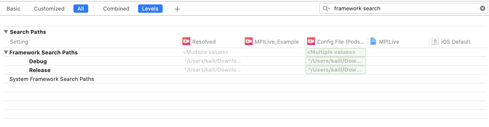

## Xcode 12 (Version 12.0 beta 6 (12A8189n))

### Xcode 12, building for iOS Simulator, but linking in object file built for iOS, for architecture arm64

解决：

> I've seen quite a bit of weird behavior with frameworks, I think due to changes to the simulators to support Apple silicon. My temporary workaround is, in my app/extension targets, to add "arm64" to the Excluded Architectures build setting when building for the simulator (as your preview appears to be trying to do), and setting "Build Active Architecture Only" to No for all schemes. Might be worth a try.


解决：

```
Keychain Access
->
Right-click on login
->
Lock & unlock again
->
Clean Xcode project
->
Make build again
```


## `$(SRCROOT)` 和 `$(PROJECT_DIR)`

[What the different between SRCROOT and PROJECT_DIR?
](https://stackoverflow.com/questions/36323031/what-the-different-between-srcroot-and-project-dir/40739356)

> Exchangeable in practice, while the documentation makes these subtle theoretical distinctions:
> 1. SRCROOT
> Directory path. Identifies the directory containing the target’s source files: contains the path to the project file that defines the target.
> SOURCE_ROOT is an undocumented alias to SRCROOT
> 2. PROJECT_DIR
Identifies the directory containing the project (.xcodeproj)
$(PROJECT_DIR)/build is used as the create the default value for:
> Intermediate Build Files Path OBJROOT
Build Products Path SYMROOT
Typically these paths are not set per target, but are set per-project or per-user.
> 3. PROJECT_FILE_PATH
Identifies the project itself.
Equivalent to $(PROJECT_DIR)/$(PROJECT_NAME).xcodeproj
> Conceptually different (#1 is about the project which defines the target while #2 is about the project independently of any target), they are always pointing to the same location since you are, in essence, always building a target.
> References
> - Xcode 8.3 Build Settings reference
> - Xcode Build System Guide (Retired 2016-09-29)


## Search Paths

常用路径 `path` ，就是下面三种啦：

- `Framework Search Paths`
   附加到项目中的`framework` 的搜索路径。
- `Library Search Paths`
   附加到项目中的第三方`Library`的搜索路径。
- `Header Search Path`
   头文件的搜索路径。
- `User Header Search Paths`
   只有在`Always Search User Paths`为`Yes`时才会被搜索。


## Library Search Paths / Header Search Paths

> I'm looking for a documentation, too. But I made the experience, that `$(inherited)` can be used to inherit build settings from the project level to the target level. When you define library or header search paths at the project level you can use `$(inherited)` in the target build settings to use these search paths in the search paths of the project targets.

> 注意：
>
> - 路径中有空格必须要加引号
>
> - 双引号的作用是如果在路径中有空格，可以识别该路径。
> - 没有双引号但是路径中有空格，它会自动变成两个路径。
> - 多个路径可以用空格隔开
> - 如果取的是绝对路径那么工程移到别的地方就有可能导致运行出错。所以要改成相对路径


```
举例：
// 情况1：
$(inherited) "$(SRCROOT)/.a文件所在的文件名"
// 情况2：如果有多个.a文件格式就像这样 
$(inherited) "$(SRCROOT)/xxxx" "$(SRCROOT)/xx"
```


## $(inherited)

> [What is $(inherited) in Xcode's search path settings?](https://stackoverflow.com/questions/15343122/what-is-inherited-in-xcodes-search-path-settings)
>
> I'm looking for a documentation, too. But I made the experience, that `$(inherited)` can be used to inherit build settings from the project level to the target level. When you define library or header search paths at the project level you can use `$(inherited)` in the target build settings to use these search paths in the search paths of the project targets.

`$(inherited)`可用于将构建设置从项目级别继承到目标级别。




> You can see the flow of `inherited` from right to left
>
> ```
> Resolved <- Target <- xcconfig <- Project <- iOS Default
> ```
>
> So in `inherited` in Target means that Target inherits settings from xcconfig and Project


## Framework Search Paths

>[Framework Programming Guide](https://developer.apple.com/library/archive/documentation/MacOSX/Conceptual/BPFrameworks/Tasks/IncludingFrameworks.html)
>
>## Locating Frameworks in Non-Standard Directories
>
>If your project links to frameworks that are not included in any of the standard locations, you must explicitly specify the location of that framework before Xcode can locate its header files. To specify the location of such a framework, add the directory containing the framework to the “Framework Search Paths” option of your Xcode project. Xcode passes this list of directories to the compiler and linker, which both use the list to search for the framework resources.
>
>
>
>**Note:** The standard locations for frameworks are the `/System/Library/Frameworks` directory and the `/Library/Frameworks` directory on the local system.

文档指出，如果你引用的 `Frameworks` 没有在标准位置（`standard locations`），那么，你需要在工程的配置文件里设置` “Framework Search Paths”`， 用来为编译器（`compiler`）和连接器（`linker`）指定搜索路径。


## Xcode 6 遇到的问题

- 去掉了`pch`文件。如果你想有`pch`需要在`building setting`中的`precompile header`设置下路径`$(SRCROOT)/xxx/xxxx.pch`, 然后将`Precompile Prefix Header`为`YES`，预编译后的`pch`文件会被缓存起来，可以提高编译速度。`pch`是预编译文件,我们的一些头文件导入会写到这里如`Foundation.h` 
- 模拟器路径的变更
  - `/Users/username/Library/Developer/CoreSimulator`

<!--more-->

- 应用沙盒地址的变更

  - `应用程序文件`、`Document`文件夹、`Library`文件夹、`tmp`文件夹这四个文件放在了不同的目录中。

    - 应用程序文件路径：`/Users/username/Library/Developer/CoreSimulator/Devices/模拟器UDID/data/Containers/Bundle/Application`文件夹下
    - `Document`文件夹、`Library`文件夹、`tmp`文件夹路径：`/Users/username/Library/Developer/CoreSimulator/Devices/模拟器UDID/data/Containers/Data/Application`文件下。这两个路径打开后的文件名，还是经过编码过的，而且，同一个应用中的应用程序文件和`Document`、`Library`、`tmp`文件夹所在的文件夹的文件名是不同的，只能自己找。 

- `NSUserDefault` 文件存储位置变更，`NSUserDefault`是iOS提供的本地化数据存储方式，会在沙盒中自动创建一个`.plist`的配置文件，将数据保存起来，在读取时，以`NSDictionary`字典来进行接收 

  - `/Users/username/Library/Developer/CoreSimulator/Devices/模拟器UDID/data/Library/Preferences`文件夹下

## Xcode 7 遇到的问题

### does not contain bitcode
在`Build Setting `里面搜索`bitcode`,把`Enable Bitcode` 更改位`NO`

#### Bitcode
LLVM 是目前苹果采用的编译器工具链，Bitcode 是 LLVM 编译器的**中间代码**的一种编码LLVM的前端可以理解为C/C++/OC/Swift等编程语言，LLVM的后端可以理解为各个芯片平台上的汇编指令或者可执行机器指令数据，那么，BitCode就是位于这两者直接的中间码。 

LLVM的编译工作原理是前端负责把项目程序源代码翻译成 Bitcode 中间码，然后再根据不同目标机器芯片平台转换为相应的汇编指令以及翻译为机器码。这样设计就可以让LLVM成为了一个编译器架构，可以轻而易举的在LLVM架构之上发明新的语言(前端)，以及在 LLVM 架构下面支持新的CPU(后端)指令输出，虽然Bitcode仅仅只是一个中间码不能在任何平台上运行，但是它可以转化为任何被支持的CPU架构，包括现在还没被发明的CPU架构，也就是说现在打开Bitcode功能提交一个App到应用商店，以后如果苹果新出了一款手机并CPU也是全新设计的，在苹果后台服务器一样可以从这个App的 Bitcode 开始编译转化为新CPU上的可执行程序，可供新手机用户下载运行这个App。

上传到服务器的bitcode给苹果带来更好处是: 
以后新设计了新指令集的新CPU，可以继续从这份bitcode开始编译出新CPU上执行的可执行文件，以供用户下载安装。

但是bitcode给开发者带来的不便之处就是: 
没用bitcode之前，当应用程序奔溃后，开发者可以根据获取的的奔溃日志再配上上传到苹果服务器的二进制文件的调试符号表信息DSYM可以还原程序运行过程到奔溃时后调用栈信息，对问题进行定位排查。但是用了bitcode之后，用户安装的二进制不是开发者这边生成的，而是苹果服务器经过优化后生成的，其对应的调试符号信息丢失了，也就无法进行前面说的还原奔溃现场找原因了。


### 网络请求失败：`App Transport Security has blocked a cleartext HTTP (http://) resource load since it is insecure. Temporary exceptions can be configured via your app's Info.plist file.`

原因：`iOS9`默认使用`HTTPS`请求。解决：暂时退回`http`请求：在工程的`Info.plist`文件里添加`NSAppTransportSecurity`字典类型的，添加一个元素：`key`为`NSAllowsArbitraryLoads`，值为`YES`

  ```json
  <key>NSAppTransportSecurity</key>
  <dict>
  	<key>NSAllowsArbitraryLoads</key>
  	<true/>
  </dict>
  ```

### `iOS 9` 使用 `URL scheme`必须将其加入**白名单**

  - `canOpenURL: failed for URL: "mqqopensdkapiV2://qqapp" - error: "This app is not allowed to query for schememqqopensdkapiV2”`
  - 解决方法：`Info.plist`文件中添加一个`key`为`LSApplicationQueriesSchemes`的数组值，里面包含需要添加白名单的`string`类型的` scheme`。在项目中使用了qq，微信等分享登录功能，需要添加对应的key

- 系统`framework`问题，升级之后`framework`全变红了（并不影响程序运行），替换成`9.0`版本的`framework`即可，旧版本的` .dylib`后缀库文件在`Xcode7`中已经换成` .tbd`了，相应进行替换即可


## XCode 10 遇到的问题

> ld: library not found for -lstdc++.6.0.9
> clang: error: linker command failed with exit code 1 (use -v to see invocation)
> linker command failed with exit code 1 (use -v to see invocation)

**解决：**

把以下3个文件copy到 
`/Applications/Xcode.app/Contents/Developer/Platforms/iPhoneOS.platform/Developer/SDKs/iPhoneOS.sdk/usr/lib` 目录

- libstdc++.6.0.9.tbd
- libstdc++.6.tbd
- libstdc++.tbd


## Xcode更新后,无法跳转和查看注释

本来默认有跳转功能,但是更新后一直都是`Symbol not found`,原因是工程的索引文件在更新后被破坏了,必须到`~/Library/Developer/Xcode/DerivedData`下把相应的工程的文件夹给删除就行了.删除之后再`rebuild`一次,就可以看到索引了.`Xcode`经常出一些莫名其妙的问题。


## 让使用ARC机制的代码不使用ARC机制

**导航文件--> 选中`Targets`--> 选择 `Build Phases` --> 展开`Compile Sources`**

**Compiler Flags**，只需要输入 `-fno-objc-arc`


## Xcode 常用快捷键

| 按键                         | 描述                               |
| ---------------------------- | ---------------------------------- |
| **Command + Shift + F**      | 跳转到搜索导航器【**非常实用**】   |
| **Command + Shift + j**      | **显示当前文件，在导航拦中的位置** |
| Command+Control+ 上下箭头    | **切换头文件和源文件**             |
| Command + g                  | 在当前文件中查找下一个搜索到的字符 |
| Option+Command+[             | **向上移动该行（可多行）**         |
| Option+Command+]             | **向下移动该行**                   |
| Command + [                  | 左移代码块                         |
| Command + ]                  | 右移代码块                         |
| command + ctrl + 左右方向键  | 返回刚才的文件                     |
| Option + command +左右方向键 | 折叠或展开代码块                   |
| Command + ctrl + o           | 跳转到官方文档                     |
| Command + ctrl + j           | 跳转到变量的定义文件               |
| Ctrl+k                       | 删除本行                           |
| Ctrl+d                       | 删除光标右边的字符                 |
| Ctrl+t                       | 交换光标左右两边的字符             |
| Command + .                  | 结束运行                           |
| Command + 左箭头/右箭头      | 模拟器横竖屏切换                   |
| Command + 鼠标单击           | 跳转到定义                         |
| Alt +   鼠标放在模拟器上     | 可以模拟多点触摸                   |


## could not find developer disk image

**解决**
将你对应缺少的 Disk Image 版本放入
> /Applications/Xcode.app/Contents/Developer/Platforms/iPhoneOS.platform/DeviceSupport


## 参考文献

- [Xcode操作流](https://blog.csdn.net/phunxm/article/details/17044337)

- [Xcode6 模拟器路径【修改】](https://blog.csdn.net/simon699/article/details/39398453)
- [升级Xcode7后遇到的一些问题](https://blog.csdn.net/he15023306643/article/details/48684229)
- [关于bitcode, 知道这些就够了]( http://xelz.info/blog/2018/11/24/all-you-need-to-know-about-bitcode/)