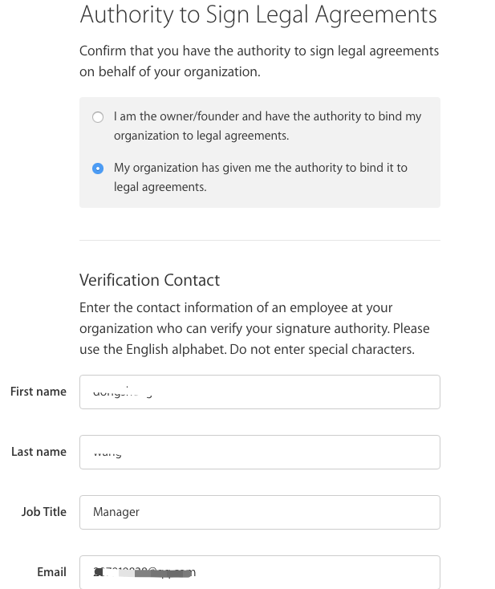
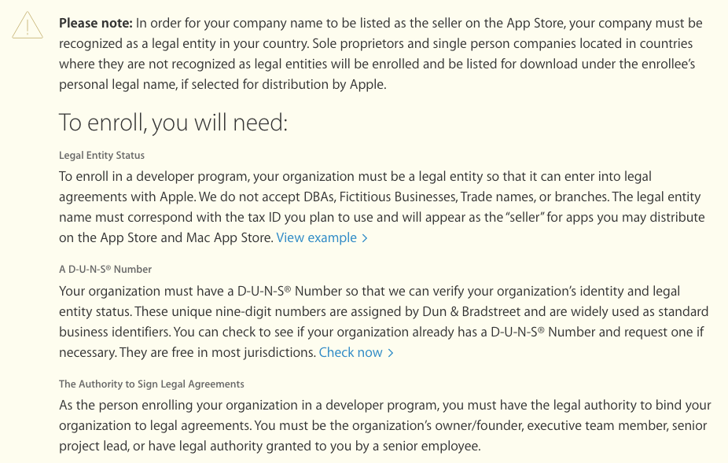

## 背景

iOS APP 上架审核是需要排队等待审核的，大约在一周左右。如果摊上了线上崩溃的问题，需要紧急修复重新上架，老板恨不得马上修复，马上就可以解决用户的问题。所以，就不停的催，老大的压力也就大，作为小兵也不会好受。很不幸，我就摊上了。。。

<!--more-->

## 加急审核可以用

**打包**、**上传**那些事儿，这里就不聊了，直接切入主题，如何加急审核？

### 苹果公司提供的入口

[加急申请](<https://developer.apple.com/appstore/contact/appreviewteam/index.html>)

1. 打开网页，在`I would like to`那里选择`request an expedited app review `
2. 填写基本联系信息
3. 填写应用信息
4. 最关键的是填写，原因和理由。
   1. 少一些套路，直白一点就行
   2. 英文水平捉急就用中文，关键是描述清楚

## 不是救命稻草

加急真的管用，不到两天就审核上架了。

比较傻逼的事情是，这个月的第二次上线，我们又用了加急通道。结果收到了苹果审核人员的邮件！！！没错，人家苹果直接找上们来说，你们不要经常使用这种方式，请走正常的商家渠道。

所以，还是慎用为好。最好不用，用的话，准不是好消息。

## 有用的信息

- [联系电话](https://developer.apple.com/contact/phone/)
- [加急申请渠道](<https://developer.apple.com/appstore/contact/appreviewteam/index.html>)

20210817 补充 AppStore的灰度是假灰度。它是针对「开启了自动更新的用户」做的灰度。

假灰度？即便把灰度暂停下来，用户还是可以通过搜索的方式查到新版本。灰度的过程中，那些「没有开启自动更新的用户」，自己去AppStore搜索，看到的也是新版本。

TestFlight 可以用来验 AppStore 正式包，审核通过之前就能安装。

### 2015-申请账号

ps. 提供相应的资料，邓氏码也比较快的。不用花额外的钱。加急什么的