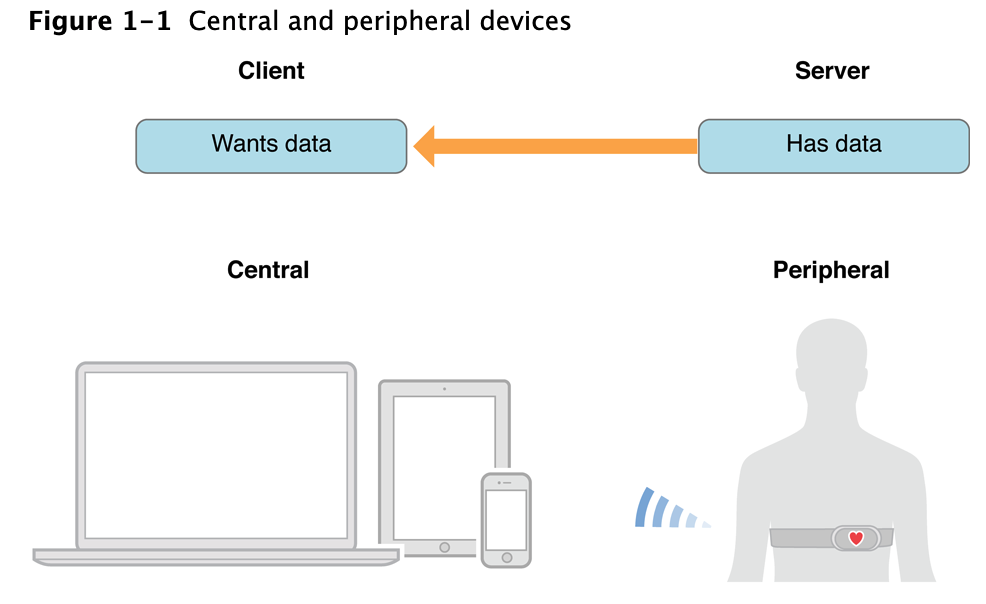
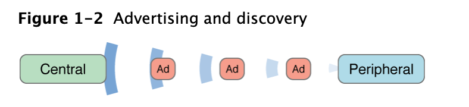
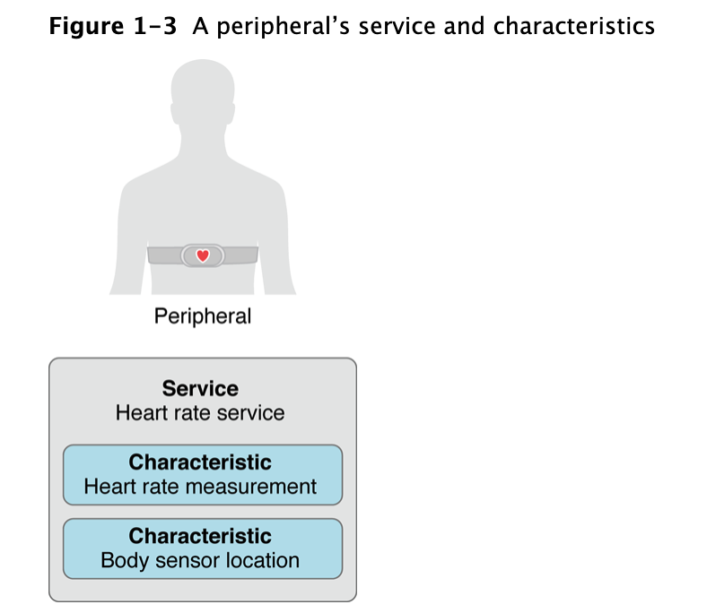
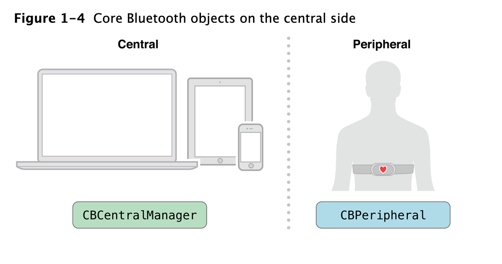
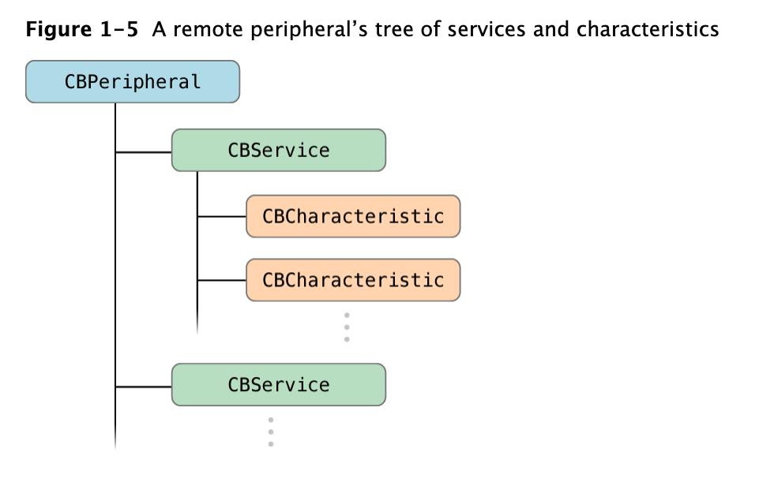
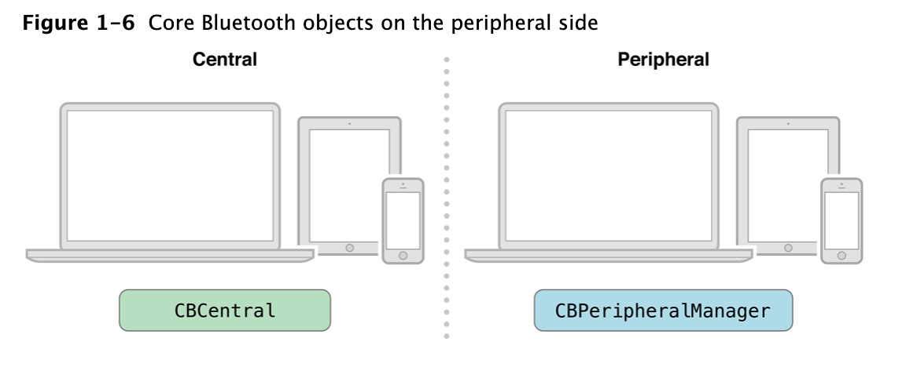
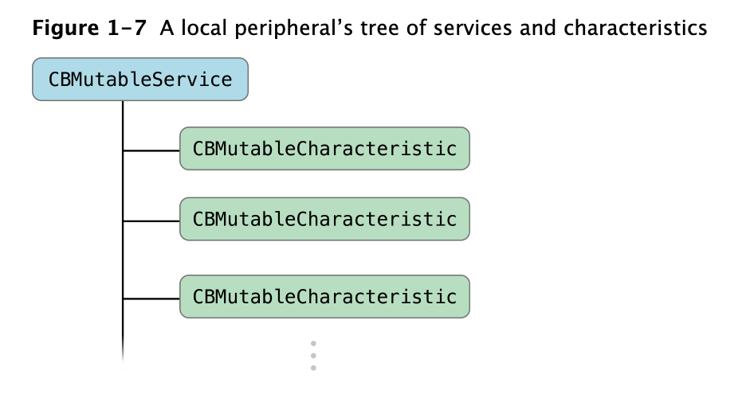

##  背景介绍

公司里，我所在的业务线有刷卡器这块，蓝牙刷卡器通过蓝牙与iPhone手机通讯。手机端的app通过发送不同的指令(通过蓝牙)控制刷卡器执行一些动作，比如读`磁条卡`，读金融`IC`卡等。所以，有对 iOS `Core Bluetooth`框架学习的机会和实践场景。该框架基于BLE4.0规范，直接适用于蓝牙低功率设备的使用。也就是说，该框架隐藏了很多开发规范的底层实现细节，使您更容易开发出与蓝牙低功耗设备进行交互的app。本人实力有限，而且连接设备使用的还是设备厂商提供的SDK，了解的深度不是很广，所以还请各位看官轻拍！

<!--more-->


##  Core Bluetooth 框架概述

所有涉及蓝牙低功耗的交互中有两个主要的角色：中心`Central`和外围设备`Perpheral`。根据一些传统的`客户端-服务端`结构，`Peripheral`通常具有其他设备所需要的数据，而`Central`通常通过使用`Perpheral`的信息来实现一些特定的功能。蓝牙刷卡器为例，例如，刷卡器可能含有一些有用的信息，你的 iOS app 可能需要以用户友好的方式与蓝牙刷卡器建立连接，获取信息。

### Core Bluetooth 核心类

####  iPhone作为central，远端的蓝牙设备peripheral












```
CBCenterManager-->CBPeripheral

CBService
   |
   CBCharacteristics

```

#### iPhone作为远端设备

> As of macOS 10.9 and iOS 6, Mac and iOS devices can function as Bluetooth low energy peripherals, serving data to other devices, including other Mac, iPhone, and iPad devices. When setting up your device to implement the peripheral role, you are performing actions on the peripheral side of Bluetooth low energy communication.





```
CBPeripheralManager-->CBCentral

CBMutableService
	|
	CBMutableCharacterisic
```


#### Central 发现并连接广播中的 Peripheral

`Peripheral`向外**广播**一些广告包形式的数据，广告包是一个相对较小的束，可能包含`Peripheral`提供的有用信息资料，如外设的名称和主要功能。

`Central`可以扫描和监听任何对广播内容感兴趣的`Peripheral`。`Central`可以请求连接任何已对外广播内容的`Peripheral`。

`Central`可以通过读取或者写入`Service`中`Characteristic`的`value`与`Peripheral`进行交互。


#### 服务和特征

`Service`是指实现一个函数或者功能的设备（或者设备的一部分）的数据采集和相关行为的集合。`Service`本身由`Characteristic`或者其他被包含的`Service`所组成。

`Characteristic`是与外界交互的最小单元。

## 蓝牙简单练习

### 建立的步骤

1. 建立中心角色

2. 扫描外设（scan）

3. 连接外设(connect)

4. 扫描外设中的服务和特征(discover)

5. 与外设做数据交互(explore and interact

6. 断开连接(disconnect)。


### 实现细节
首先在我自己类的头文件中要包含`Core Bluetooth`的头文件，并继承两个协议`<CBCentralManagerDelegate,CBPeripheralDelegate>`，代码如下:

```objective-c
import <CoreBluetooth/CoreBluetooth.h>
...
dispatch_queue_t centralQueue = dispatch_queue_create(“centralQueue",DISPATCH_QUEUE_SERIAL);
CBCentralManager *manager= [[CBCentralManager alloc] initWithDelegate:self queue:centralQueue];
...
```


2. 扫描外设--scan

```objective-c
...
// 这个参数应该也是可以指定特定的peripheral的UUID，我们这里不指定
[manager scanForPeripheralsWithServices:nil options:options];
...
```

 

3. 连接外设--connect

当扫描到4.0的设备后，通过回调函数拿到设备的信息，然后我们就可以连接相应的设备

```objective-c
// 扫描到的外设保存到_discoveredPeripherals
- (void)centralManager:(CBCentralManager *)central didDiscoverPeripheral:(CBPeripheral *)peripheral advertisementData:(NSDictionary *)advertisementData RSSI:(NSNumber *)RSSI {
  if(![_discoveredPeripherals containsObject:peripheral]) {
      [_discoveredPeripherals addObject:peripheral];
      NSLog(@"discoveredPeripherals:%@", _discoveredPeripherals);
  }
}
// 连接指定的设备
- (BOOL)connect:(CBPeripheral *)peripheral {
    NSLog(@"connect start");
    _testPeripheral = nil;
    [manager connectPeripheral:peripheral
                       options:[NSDictionary dictionaryWithObject:[NSNumber numberWithBool:YES] forKey:CBConnectPeripheralOptionNotifyOnDisconnectionKey]];
    
    // 开一个定时器监控连接超时的情况
    connectTimer = [NSTimer scheduledTimerWithTimeInterval:3.0f target:self selector:@selector(connectTimeout:) userInfo:peripheral repeats:NO];
     
    return YES;
}

```

 

4. 扫描外设中的服务和特征--discover

同样的，当连接成功后

```objective-c
- (void)centralManager:(CBCentralManager *)central didConnectPeripheral:(CBPeripheral *)peripheral {
  	[connectTimer invalidate];// 停止时钟
    
  	NSLog(@"Did connect to peripheral: %@", peripheral);
  	_testPeripheral = peripheral;
  	peripheral.delegate = self;
    [central stopScan];
    // 扫描设备下所有的服务和特征
  	[peripheral discoverServices:nil];
}

```


一个设备里的服务和特征往往比较多，大部分情况下我们只是关心其中几个，所以一般会在发现服务和特征的回调里去匹配我们关心信息。

```objective-c
// 搜索到服务的回调
- (void)peripheral:(CBPeripheral *)peripheral didDiscoverServices:(NSError *)error {
    NSLog(@"didDiscoverServices");
    if (error) { // 错误
      NSLog(@"Discovered services for %@ with error: %@", peripheral.name, [error localizedDescription]);
        if ([self.delegate respondsToSelector:@selector(DidNotifyFailConnectService:withPeripheral:error:)]) {
            [self.delegate DidNotifyFailConnectService:nil withPeripheral:nil error:nil];
        }
        return;
    }
    for (CBService *service in peripheral.services) {
        if ([service.UUID isEqual:[CBUUID UUIDWithString:UUIDSTR_ISSC_PROPRIETARY_SERVICE]]) {
            NSLog(@"Service found with UUID: %@", service.UUID);
            // 搜索服务对应的特征
            [peripheral discoverCharacteristics:nil forService:service];
            isMyCareDevice = YES;
            break;
        }
  	}
}
// 搜索到特征的回调
- (void)peripheral:(CBPeripheral *)peripheral didDiscoverCharacteristicsForService:(CBService *)service error:(NSError *)error {
    if (error) { // 错误
      NSLog(@"Discovered characteristics for %@ with error: %@", service.UUID, [error localizedDescription]);
        if ([self.delegate respondsToSelector:@selector(DidNotifyFailConnectChar:withPeripheral:error:)]) {
            [self.delegate DidNotifyFailConnectChar:nil withPeripheral:nil error:nil];
        }
        return;
    }
    for (CBCharacteristic *characteristic in service.characteristics) {
      if ([characteristic.UUID isEqual:[CBUUID UUIDWithString:UUIDSTR_ISSC_TRANS_TX]]) {
          	NSLog(@"Discovered read characteristics:%@ for service: %@", characteristic.UUID, service.UUID);
            _readCharacteristic = characteristic; // 保存读的特征
            
            if ([self.delegate respondsToSelector:@selector(DidFoundReadChar:)]) {
                [self.delegate DidFoundReadChar:characteristic];
            }
            break;
        }
    }
    for (CBCharacteristic * characteristic in service.characteristics) {
        if ([characteristic.UUID isEqual:[CBUUID UUIDWithString:UUIDSTR_ISSC_TRANS_RX]]) {
            NSLog(@"Discovered write characteristics:%@ for service: %@", characteristic.UUID, service.UUID);
            _writeCharacteristic = characteristic; // 保存写的特征
            
            if ([self.delegate respondsToSelector:@selector(DidFoundWriteChar:)]) {
                [self.delegate DidFoundWriteChar:characteristic];
            }
            break;
        }
    }
    if ([self.delegate respondsToSelector:@selector(DidFoundCharacteristic:withPeripheral:error:)]) {
      [self.delegate DidFoundCharacteristic:nil withPeripheral:nil error:nil];
    }
}
```


5. 与外设做数据交互--explore and interact

```objective-c
// 写数据
- (void)writeData:(NSData *)data
{
    [_testPeripheral writeValue:data forCharacteristic:writeCharacteristic type:CBCharacteristicWriteWithResponse];
}
```

`_testPeripheral`和`_writeCharacteristic`是前面我们保存的设备对象和可以读写的特征。

然后我们可以在外部调用它，比如当然我要触发刷卡时，先组好数据包，然后发送数据。


数据的读分为两种，

>
>
>- You can explicitly poll for a characteristic’s value by calling the `readValueForCharacteristic:` method each time you need the value.
>- You can subscribe to the characteristic’s value by calling the `setNotifyValue:forCharacteristic:` method once to receive a notification from the peripheral when the value changes.

- 每次需要该值时，都可以通过调用`readValueForCharacteristic:`方法显式轮询特征值。
- 可以通过调用`setNotifyValue:forCharacteristic:`方法来订阅特征值，以便在值更改时从外设接收通知。

特征有个`properties`字段`characteristic.properties`它是一个整型值,有如下几个定义:

```
enum {
     CBCharacteristicPropertyBroadcast = 0x01,
     CBCharacteristicPropertyRead = 0x02,
     CBCharacteristicPropertyWriteWithoutResponse = 0x04,
     CBCharacteristicPropertyWrite = 0x08,
     CBCharacteristicPropertyNotify = 0x10,
     CBCharacteristicPropertyIndicate = 0x20,
     CBCharacteristicPropertyAuthenticatedSignedWrites = 0x40,
     CBCharacteristicPropertyExtendedProperties = 0x80,
     };
```


```objective-c
// 监听设备
-(void)subscribe {
    [_testPeripheral setNotifyValue:YES forCharacteristic:readCharacteristic];
}
```


当设备有数据返回时，同样是通过一个系统回调通知我，如下所示:

```objective-c
- (void)peripheral:(CBPeripheral *)peripheral didUpdateValueForCharacteristic:(CBCharacteristic *)characteristic error:(NSError *)error {
    // ....
}

```


6. 断开连接--disconnect

```objective-c
// 主动断开设备
- (void)disConnect {
    if (_testPeripheral != nil) {
        NSLog(@"主动断开");
        [manager cancelPeripheralConnection:_testPeripheral];
    }
}

```


如果你顺利完成了上一步的操作，并且看到了蓝牙返回的数据，那么恭喜你，蓝牙的常用操作你已经了解大半了。因为蓝牙的任务大部分就是围绕发送指令，获取指令，将蓝牙数据呈现给用户。整个蓝牙开发实现方便，但回调方法非常多，容易晕。按部就班把每个回调方法实现，即可保证蓝牙开发的顺利进行。同时，涉及到多线程的地方，务必保证**回到主线程刷新UI**！！！

---

---

## 2016-01-09 20:48 补充

本来是想把开发中遇到的问题单独写一篇文章，后来又觉得没多少内容。于是，今天在这里补充以下3点：

### 1. 看清楚硬件设备支持的蓝牙版本

我们开发调试的蓝牙设备主要指蓝牙 POS，是厂商烧录好的，支持 蓝牙4.0 版本，我们手里的测试机主要有，两台n手的 iPhone 4、一台 iPhone 4s和一台iPhone 5。从 iPhone 4s 开始支持 蓝牙 4.0，而且我们的厂商根本也没有苹果MFi认证，所以。。。老板的iPhone 4不能用，实在是搞不定啊：~结果，如何这里不再BB

### 2. 搜索设备时用的 Service UUID

```objective-c
[manager scanForPeripheralsWithServices:@[[CBUUID UUIDWithString:@"xxx"] options:@{CBCentralManagerScanOptionAllowDuplicatesKey:@YES}];

```

以上函数，第一个参数传`nil`代表搜索周围的全部设备；传`UUID`代表搜索包含该服务的特定设备。但是见鬼的事情就发生了：传`nil`可以搜到，传`UUID`却搜不到，而且是明确知道该设备包含了该服务的。

造成这个问题的原因是：硬件没有将该Service添加到广播包时，即广播时没有将该UUID广播出来，所以iOS设备在搜索时候就会找不到对应的设备。**解决办法**：与硬件工程师沟通，让他在广播包里加上。ps.老板图便宜找得小厂就是不靠谱啊，按住不表。。。

### 3. 获取 Mac 地址

产品给我们提的需求是，已经连过的设备就不需要用户重新连接了。新用户使用时需要扫描设备，并显示出每台设备的mac地址。

我是觉得很合理，但是实现起来有点蛋疼，随后的解决方案虽然有点儿帅锅，但是完美解决：

> 让乙方硬件工程师在广播包中添加mac地址，这样就能轻松实现显示mac 地址 和 重连了。

阴险的笑了。谁让我们是甲方呢，哈哈哈


## 参考文献

- [Core Bluetooth](https://developer.apple.com/documentation/corebluetooth)
- [Core Bluetooth Programming Guide](https://developer.apple.com/library/archive/documentation/NetworkingInternetWeb/Conceptual/CoreBluetooth_concepts/AboutCoreBluetooth/Introduction.html#//apple_ref/doc/uid/TP40013257-CH1-SW1)
- [Core Bluetooth Programming Guide-Core Bluetooth Overview](https://developer.apple.com/library/archive/documentation/NetworkingInternetWeb/Conceptual/CoreBluetooth_concepts/CoreBluetoothOverview/CoreBluetoothOverview.html#//apple_ref/doc/uid/TP40013257-CH2-SW1)