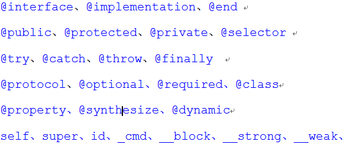

## 写在前面的话
在学习 OC 之前我有学过 C、PHP、javascript等语言 OC 确实是新深入接触的一门编程语言。在开始之前，我有查过资料说： OC 是 C的一个严格的“超集”，这就意味着它完全兼容 C。有过这样一个概念之后，我开始学习 OC 的这门编程语言，但是当我看到一坨一坨的以 **@** 开头的关键字的时候我就想：“这是什么鬼东西”！不过经过之后的学习，我觉得 OC 这门语言也挺有意思的，相信你看到我能写出一篇关于 OC 的博客也能想到我现在开始喜欢上它了。这篇博文将介绍一下我对 OC 编程语言的初体验，同时希望，通过我的感受给同样学习 OC 的人带来学习 OC 的兴趣。那么废话不多说就让我来谈一下 OC 吧。
<!--more-->
##  OC 简介
> Objective-C is the primary programming language you use when writing software for OS X and iOS. It’s a superset of the C programming language and provides object-oriented capabilities and a dynamic runtime. Objective-C inherits the syntax, primitive types, and flow control statements of C and adds syntax for defining classes and methods. It also adds language-level support for object graph management and object literals while providing dynamic typing and binding, deferring many responsibilities until runtime.

Objective-C，是扩充 C 的面向对象编程语言。它主要使用于Mac OS Objective-C，通常写作 ObjC 和较少用的 Objective C 或 Obj-C，是在 C 的基础上，加入面向对象特性扩充而成的编程语言。目前，Objective-C 主要应用于 Mac OS X 和 iOS 这两个 NeXTSTEP 的衍生系统，而在 NeXTSTEP 和 OpenStep 中它更是基本语言。Objective-C 可以在任何 gcc 支持的平台上进行编译，因为 gcc 原生支持 Objective-C。

下面截取自2014年8月份的编程语言热门排行榜：

## OC 语法浅谈

### 挥之不去的 @

OC 的关键字大都是以**@**开头的，只有少数前边没有加 @ 符号。贴张图让大家看看：

当时我看到这一坨晕的不行，我想每个刚开始接触它的人都会有一种自发地排斥感，但是当我们慢慢的深入，就会发现他的优点。此外，字符串以 @ 开头比如：

    @"Hello" //是OC中的字符串，而"Hello"则是C语言中的字符串

### 各种 NS 前缀

刚开始学 **Foundation** 框架整天遇到各种 **NS** 打头的类，就连日志输出都是 **NSLog** 比如：

    NSObject // 基类
    NSString // 字符串类
    NSArray // 数组类

这些类为什么都加上个 NS 前缀？相信学过编程的至少都听说过：在 Java 中为了防止两个类名相同的类冲突，而将2个类放在不同的包里面的案例。OC 中并没有"包"的概念，也就是没有命名空间机制，取而代之的是开发人员给类名加上前缀，使用前缀可以有效的防止类名冲突。

### OC vs C

OC 是 C的超集，很明显 C 打不过 OC嘛！呵呵！！！我这里实在是没有让他们打架的意思，我这里主要是想进行一下比较。干说没意思，那么来段代码吧：

    #import <Foundation/Foundation.h>
    int main()
    {
        NSLog(@"第2个OC程序");
        return 0;
    }

#### '#import' 的作用
它跟 '#include' 一样，是用来拷贝某个文件的内容，只不过它可以自动防止文件内容被拷贝多次，也就意味着头文件中不用加入下面的预处理指令了

    #ifndef     _STDIO_H_
    #define _STDIO_H_
    #endif

#### Foundation 框架
我跟着学习视频走，刚开始就是学得这个框架，它是开发OC、iOS、Mac程序必备的框架，此框架中包含了很多常用的API（应用编程接口）框架中包含了很多头文件，若想使用整个框架的内容，包含它的主头文件就像上面引入它的头文件即可。

#### NSLog 与 printf 的区别
NSLog 接收 OC 字符串作为参数，printf 接收 C 语言字符串作为参数 NSLog 输出后会自动换行，printf 输出后不会自动换行使用 NSLog 需要 引入 Foundation 框架的头文件，而使用 printf 需要 引入'stdio.h'这一头文件。

## 写在最后的话
Objective-C 的学习是在为学习iOS开发做准备，就像之前学习 C 语言为 OC 的学习打基础一样。接下来我将把我学习 OC 中总结的知识发表到博客上来以与大家共同交流，OC 学习系列博文已经起航，敬请期待！

## 参考文献

- [【Objective-C】01-Objective-C概述](http://www.cnblogs.com/mjios/archive/2013/03/28/2983753.html)
- [About Objective-C](https://developer.apple.com/library/mac/documentation/Cocoa/Conceptual/ProgrammingWithObjectiveC/Introduction/Introduction.html)
- [Objective-C](http://zh.wikipedia.org/wiki/Objective-C)
- [MVC 和 Objective-C 介绍](http://open.163.com/movie/2011/11/T/P/M807AH0S5_M807F02TP.html)