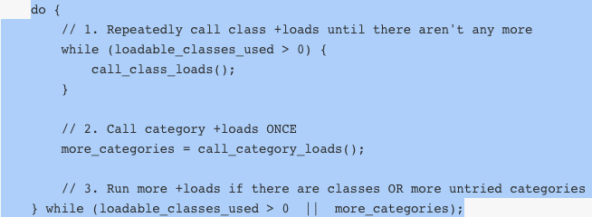

## 写在前面的话

在之前写的[OC 中的方法“重写”小结（一）](http://kai-lee.com/2015/04/29/%E5%B0%8F%E7%BB%93OC%E4%B8%AD%E7%9A%84%E6%96%B9%E6%B3%95%E9%87%8D%E5%86%99/)与[OC 中的方法“重写”小结（二）](http://kai-lee.com/2015/04/30/%E5%B0%8F%E7%BB%93OC%E4%B8%AD%E7%9A%84%E6%96%B9%E6%B3%95%E9%87%8D%E5%86%992/)文章中介绍了重写某些方法的知识点，而且了解到在实际的开发中，为了方便，经常会自定义某些方法，也就是说会重写某些方法。文中提到了，在 OC 的**继承**中，**子类**可以**重写**其**父类**的方法，还有我们可以重写**构造方法**重写**dealloc** 方法和 **description** 方法等。那么今天我将总结一下通过**继承**和**分类**在不改变类模型的前提下，给类扩充一些方法。希望对读者有所帮助。
<!--more-->

## 类

开始之前有必要了解一下什么是类。其实类也是一个对象，是 Class 类型的对象，简称**类对象**。

    typedef struct objc_class *Class;

类名就代表着类对象，每个类只有一个类对象。

在程序启动的时候会加载所有的类和分类，并调用所有类和分类的 `+load` 方法；先加载父类，再加载子类（即先调用父类的 `+load` ，再调用子类的 `+load`方法）；先加载原始类，再加载分类;不管程序运行过程有没有用到这个类，都会调用 `+load` 加载，直到第一次使用某个类时（比如创建对象等）就会调用一次初始化方法（`+initialize`），一个类只会调用一次初始化方法，同时仍旧是父类在前，子类在后。

## 继承

### 如何通过继承扩充方法

现在可以来说一说通过继承来扩充类方法了。我们知道只要 A 类继承了 B 类，那么 A 是子类， B 是父类。 A 将继承 B 的所有属性和方法。这里我们只谈到了 A 继承 B 那么可不可以 A 再继承 C 或者其他的类呢？答案是： NO 。OC 中的继承是**单继承**。

那么，现在我们创建一些个类和对象（其中有继承关系），系统就会给类和对象开辟内存空间，其中这里我们关注的**类**存放的是方法列表，同时每个子类有个 **superclass 指针**指向它的父类。子类方法和属性的访问过程是这样的：调用某个对象的方法（或者类的方法）时，优先通过 **isa 指针**去自己的类中找方法，如果自己的类中没有该方法，就顺着superclass指针到父类中找。出于这种访问机制，我们有理由通过继承关系，利用子类方法来扩充父类的方法。

### 继承扩充类方法的利弊

- 不改变原来的模型的基础上，拓展方法
- 建立了类与类之间的关系
- 抽取了公共代码
- 但是增加了耦合性，也可以说上边的优点同时成了他的缺点，真是把双刃剑！


## 分类

### 基本使用

    // 分类的声明
    @interface 类名 (分类名称)
    // 方法声明
    @end
    
    // 分类的实现
    @implementation 类名 (分类名称)
    // 方法实现
    @end

### 分类给 NSString 类扩充方法


    #import <Foundation/Foundation.h>
    
    @interface NSString (Arab)
    // 类方法声明，计算某个字符串中阿拉伯数字的个数
    + (int)countNumOfString:(NSString *)str;
    //  对象方法声明，计算某个字符串中阿拉伯数字的个数
    - (int)countNum;
    
    @end
    
    @implementation NSString (Arab)
    // 类方法实现，计算某个字符串中阿拉伯数字的个数
    + (int)countNumOfString:(NSString *)str
    {
        
        return [str countNum];
        
    }
    //  对象方法实现，计算某个字符串中阿拉伯数字的个数
    - (int)countNum
    {
        int count = 0;
        int len = [self length];
        int i = 0;
    
        for (; i < len; i++)
        {
            unichar c = [self characterAtIndex:i];
            if (c>=48 && c<=57)
            // if (c>='0' && c<='9')
            {
                count++;
            }
            
        }
    
        return count;
        
    }
    @end
    
    int main()
    {
        int co1 = [NSString countNumOfString:@"nihao2015"];
    
        NSLog(@"The number's amount is %d", co1);
    
        int co2 = [@"jack'sbirthdayis20150101" countNum];
    
        NSLog(@"The number's amount is %d", co2);
    
        return 0;
    }


### 利弊分析与使用注意

- 分类只能增加方法，不能增加成员变量。如果想添加变量，可以考虑通过继承创建子类
- 分类的实现可以访问原来类中声明的成员变量
- 当你调用一个方法，它先会去分类里面找，分类里面找不到再找原类，原类找不到再找父类
- 分类可以重新实现原来类中的方法，但是会覆盖掉原来的方法，会导致原来的方法没法再使用，一般不建议覆盖掉原类的方法
- 分类下的方法优先级高
- 后编译的分类方法会覆盖掉先编译的类方法
- 编译只编译源文件 `.m` , `.h` 不参加编译哦！
- 分类利于分模块开发，一个庞大的类可以由多个人来编写，更利于团队合作

## 写在最后的话

希望我的博文可以给看到文章最后的您带来些许的帮助，有的地方会是浅尝辄止，有的地方可能出现了错误，所以对于文中的不足，还请加以指正，谢谢！同时，我还会不断总结学习中遇到的知识点，敬请期待！

## 参考文献

- [面向对象程序设计](http://zh.wikipedia.org/wiki/%E9%9D%A2%E5%90%91%E5%AF%B9%E8%B1%A1%E7%A8%8B%E5%BA%8F%E8%AE%BE%E8%AE%A1)
- [ OC学习那些事：Category](http://blog.csdn.net/p106786860/article/details/10170081)


### <font color=red>20210903 关于 +load 和 +initialize</font>

- `+ load` 和 `+initialize`方法是如何被调用的？
- `+ load` 和 `+initialize`方法为什么会有这种调用顺序？


示例代码：

```objective-c
@interface DemoObj : NSObject

@end

@implementation DemoObj

+ (void)load {
    NSLog(@"DemoObj load");
}
@end

@interface DemoObj (Ext2)

@end

@implementation DemoObj (Ext2)

+ (void)load {
    NSLog(@"DemoObj Ext2 load");
}

@end

@interface DemoObj (Ext)

@end

@implementation DemoObj (Ext)

+ (void)load {
    NSLog(@"DemoObj Ext load");
}

@end

@interface DemoObj (Ext1)

@end

@implementation DemoObj (Ext1)

+ (void)load {
    NSLog(@"DemoObj Ext1 load");
}

@end


@interface SubDemoObj : DemoObj

@end

@implementation SubDemoObj

+ (void)load {
    NSLog(@"SubDemoObj load");
}
@end


int main(int argc, char * argv[]) {
    @autoreleasepool {}
    return 0;
}
// TestDemo[2868:1118683] DemoObj load
// TestDemo[2868:1118683] SubDemoObj load
// TestDemo[2868:1118683] DemoObj Ext2 load
// TestDemo[2868:1118683] DemoObj Ext load
// TestDemo[2868:1118683] DemoObj Ext1 load
```

### + load


*上图，是我在 M1 芯片，运行XCode12，* 断点查看左侧的调用栈：

```
0 +[DemoObj load]
1 call_load_methods
9 _dyld_start
```


> [dyld](https://developer.apple.com/library/ios/documentation/System/Conceptual/ManPages_iPhoneOS/man3/dyld.3.html) 是 the dynamic link editor 的缩写，它是苹果的*动态链接器*。
>
> 在系统内核做好程序准备工作之后，交由 dyld 负责余下的工作。本文不会对其进行解释
>
> 我们可以通过 `lldb` 打印镜像列表
>
> ```
> (lldb) image list
> [  0] 7F8AA3C7-F32F-31C0-8E78-0CDC49959172 0x0000000104250000 /Users/kaili/Library/Developer/Xcode/DerivedData/TestDemo-csfurnjbnlfiamamhxiqmgutrook/Build/Products/Debug-iphoneos/TestDemo.app/TestDemo 
> [  1] DD964E17-2412-33DF-BAC7-AB6199DF95E7 0x00000001042a0000 /Users/kaili/Library/Developer/Xcode/iOS DeviceSupport/12.0.1 (16A405) arm64e/Symbols/usr/lib/dyld 
> [  2] D517DA6F-EC98-3485-BA06-4014775BDCED 0x00000001b7044000 /Users/kaili/Library/Developer/Xcode/iOS DeviceSupport/12.0.1 (16A405) arm64e/Symbols/System/Library/Frameworks/Foundation.framework/Foundation 
> [  3] 2C3E3990-8F1D-3A0C-8866-59587752C61D 0x00000001b58b6000 /Users/kaili/Library/Developer/Xcode/iOS DeviceSupport/12.0.1 (16A405) arm64e/Symbols/usr/lib/libobjc.A.dylib 
> [  4] 6BBCE85E-E722-3439-B9E9-EBF8A95B5910 0x00000001b5842000 /Users/kaili/Library/Developer/Xcode/iOS DeviceSupport/12.0.1 (16A405) arm64e/Symbols/usr/lib/libSystem.B.dylib 
> [  5] 5A8EE6E9-7B45-355C-99C2-1026CF710B0A 0x00000001b65a1000 /Users/kaili/Library/Developer/Xcode/iOS DeviceSupport/12.0.1 (16A405) arm64e/Symbols/System/Library/Frameworks/CoreFoundation.framework/CoreFoundation 
> [  6] 7A4B93C2-36F1-3F2D-AA7F-127DB4F8B3C5 0x00000001c0e88000 /Users/kaili/Library/Developer/Xcode/iOS DeviceSupport/12.0.1 (16A405) arm64e/Symbols/System/Library/Frameworks/UIKit.framework/UIKit 
> [  7] E7F65383-2592-33F1-90EC-DD9BC17AA1F2 0x00000001b7530000 /Users/kaili/Library/Developer/Xcode/iOS DeviceSupport/12.0.1 (16A405) arm64e/Symbols/usr/lib/libarchive.2.dylib 
> ...
> [300] 3CCFE4C7-494F-3B67-9C4B-612EF44A39D4 0x00000001c184b000 /Users/kaili/Library/Developer/Xcode/iOS DeviceSupport/12.0.1 (16A405) arm64e/Symbols/System/Library/PrivateFrameworks/Marco.framework/Marco 
> [301] 3E5DF4ED-1FEF-383B-97BC-0D1689F3E4BB 0x00000001c1b92000 /Users/kaili/Library/Developer/Xcode/iOS DeviceSupport/12.0.1 (16A405) arm64e/Symbols/System/Library/PrivateFrameworks/IDSFoundation.framework/IDSFoundation 
> [302] 1FEC8944-8BCC-3E36-B2AA-25776A064BB7 0x00000001c1b79000 /Users/kaili/Library/Developer/Xcode/iOS DeviceSupport/12.0.1 (16A405) arm64e/Symbols/System/Library/PrivateFrameworks/Engram.framework/Engram 
> [303] 03AD24E1-605E-37E9-9A4E-90C660A30E32 0x00000001c1849000 /Users/kaili/Library/Developer/Xcode/iOS DeviceSupport/12.0.1 (16A405) arm64e/Symbols/System/Library/PrivateFrameworks/DiagnosticLogCollection.framework/DiagnosticLogCollection 
> [304] A844B4B5-24CC-3AAA-BC4D-F98B1D89B5AF 0x00000001c184d000 /Users/kaili/Library/Developer/Xcode/iOS DeviceSupport/12.0.1 (16A405) arm64e/Symbols/System/Library/PrivateFrameworks/MessageProtection.framework/MessageProtection 
> [305] 471C4CEA-7FE4-3838-B70D-A6E8A801ADA5 0x00000001c256a000 /Users/kaili/Library/Developer/Xcode/iOS DeviceSupport/12.0.1 (16A405) arm64e/Symbols/System/Library/Frameworks/ModelIO.framework/ModelIO 
> [306] 9AF440B8-11B4-32EA-BA6A-32B67646BCFC 0x00000001cacd9000 /Users/kaili/Library/Developer/Xcode/iOS DeviceSupport/12.0.1 (16A405) arm64e/Symbols/System/Library/Frameworks/MetalKit.framework/MetalKit 
> ```
>
> - 模块的 UUID `7F8AA3C7-F32F-31C0-8E78-0CDC49959172`
> - 模块加载地址  `0x0000000104250000`
> - 模块的二进制文件在本地的全路径 `/Users/kaili/Library/Developer/Xcode/DerivedData/TestDemo-csfurnjbnlfiamamhxiqmgutrook/Build/Products/Debug-iphoneos/TestDemo.app/TestDemo`
>
> 这里面有很多动态链接库，还有苹果官方的框架等等

#### call_load_methods

我阅读了 *objc runtime 代码参考 objc4-750* 的相关部分代码

```objc
/***********************************************************************
* load_images
* Process +load in the given images which are being mapped in by dyld.
*
* Locking: write-locks runtimeLock and loadMethodLock
**********************************************************************/
extern bool hasLoadMethods(const headerType *mhdr);
extern void prepare_load_methods(const headerType *mhdr);

void
load_images(const char *path __unused, const struct mach_header *mh)
{
    // Return without taking locks if there are no +load methods here.
    if (!hasLoadMethods((const headerType *)mh)) return;

    recursive_mutex_locker_t lock(loadMethodLock);

    // Discover load methods
    {
        mutex_locker_t lock2(runtimeLock);
        prepare_load_methods((const headerType *)mh);
    }

    // Call +load methods (without runtimeLock - re-entrant)
    call_load_methods();
}
```


```objc
/*
 * Copyright (c) 2004-2006 Apple Inc.  All Rights Reserved.
 * 
 * @APPLE_LICENSE_HEADER_START@
 * 
 * This file contains Original Code and/or Modifications of Original Code
 * as defined in and that are subject to the Apple Public Source License
 * Version 2.0 (the 'License'). You may not use this file except in
 * compliance with the License. Please obtain a copy of the License at
 * http://www.opensource.apple.com/apsl/ and read it before using this
 * file.
 * 
 * The Original Code and all software distributed under the License are
 * distributed on an 'AS IS' basis, WITHOUT WARRANTY OF ANY KIND, EITHER
 * EXPRESS OR IMPLIED, AND APPLE HEREBY DISCLAIMS ALL SUCH WARRANTIES,
 * INCLUDING WITHOUT LIMITATION, ANY WARRANTIES OF MERCHANTABILITY,
 * FITNESS FOR A PARTICULAR PURPOSE, QUIET ENJOYMENT OR NON-INFRINGEMENT.
 * Please see the License for the specific language governing rights and
 * limitations under the License.
 * 
 * @APPLE_LICENSE_HEADER_END@
 */

/***********************************************************************
* objc-loadmethod.m
* Support for +load methods.
**********************************************************************/

#include "objc-loadmethod.h"
#include "objc-private.h"

typedef void(*load_method_t)(id, SEL);


// ....


/***********************************************************************
* call_class_loads
* Call all pending class +load methods.
* If new classes become loadable, +load is NOT called for them.
*
* Called only by call_load_methods().
**********************************************************************/
static void call_class_loads(void)
{
    int i;
    
    // Detach current loadable list.
    struct loadable_class *classes = loadable_classes;
    int used = loadable_classes_used;
    loadable_classes = nil;
    loadable_classes_allocated = 0;
    loadable_classes_used = 0;
    
    // Call all +loads for the detached list.
    for (i = 0; i < used; i++) {
        Class cls = classes[i].cls;
        load_method_t load_method = (load_method_t)classes[i].method;
        if (!cls) continue; 

        if (PrintLoading) {
            _objc_inform("LOAD: +[%s load]\n", cls->nameForLogging());
        }
        (*load_method)(cls, SEL_load);
    }
    
    // Destroy the detached list.
    if (classes) free(classes);
}


/***********************************************************************
* call_category_loads
* Call some pending category +load methods.
* The parent class of the +load-implementing categories has all of 
*   its categories attached, in case some are lazily waiting for +initalize.
* Don't call +load unless the parent class is connected.
* If new categories become loadable, +load is NOT called, and they 
*   are added to the end of the loadable list, and we return TRUE.
* Return FALSE if no new categories became loadable.
*
* Called only by call_load_methods().
**********************************************************************/
static bool call_category_loads(void)
{
    int i, shift;
    bool new_categories_added = NO;
    
    // Detach current loadable list.（获取当前可以加载的分类列表）
    struct loadable_category *cats = loadable_categories;
    int used = loadable_categories_used;
    int allocated = loadable_categories_allocated;
    loadable_categories = nil;
    loadable_categories_allocated = 0;
    loadable_categories_used = 0;

    // Call all +loads for the detached list. 调用分类的 load
    for (i = 0; i < used; i++) {
        Category cat = cats[i].cat;
        load_method_t load_method = (load_method_t)cats[i].method;
        Class cls;
        if (!cat) continue;

        cls = _category_getClass(cat);
        if (cls  &&  cls->isLoadable()) {
            if (PrintLoading) {
                _objc_inform("LOAD: +[%s(%s) load]\n", 
                             cls->nameForLogging(), 
                             _category_getName(cat));
            }
            // 调用分类的 load 方法
            (*load_method)(cls, SEL_load);
            cats[i].cat = nil;
        }
    }

    // Compact detached list (order-preserving)（将所有加载过的分类移出列表）
    shift = 0;
    for (i = 0; i < used; i++) {
        if (cats[i].cat) {
            cats[i-shift] = cats[i];
        } else {
            shift++;
        }
    }
    used -= shift;

    // Copy any new +load candidates from the new list to the detached list.
    // 为 loadable_categories 重新分配内存，重新设置它的值
    new_categories_added = (loadable_categories_used > 0);
    for (i = 0; i < loadable_categories_used; i++) {
        if (used == allocated) {
            allocated = allocated*2 + 16;
            cats = (struct loadable_category *)
                realloc(cats, allocated *
                                  sizeof(struct loadable_category));
        }
        cats[used++] = loadable_categories[i];
    }

    // Destroy the new list.
    if (loadable_categories) free(loadable_categories);

    // Reattach the (now augmented) detached list. 
    // But if there's nothing left to load, destroy the list.
    if (used) {
        loadable_categories = cats;
        loadable_categories_used = used;
        loadable_categories_allocated = allocated;
    } else {
        if (cats) free(cats);
        loadable_categories = nil;
        loadable_categories_used = 0;
        loadable_categories_allocated = 0;
    }

    if (PrintLoading) {
        if (loadable_categories_used != 0) {
            _objc_inform("LOAD: %d categories still waiting for +load\n",
                         loadable_categories_used);
        }
    }

    return new_categories_added;
}


/***********************************************************************
* call_load_methods
* Call all pending class and category +load methods.
* Class +load methods are called superclass-first. 
* Category +load methods are not called until after the parent class's +load.
* 
* This method must be RE-ENTRANT, because a +load could trigger 
* more image mapping. In addition, the superclass-first ordering 
* must be preserved in the face of re-entrant calls. Therefore, 
* only the OUTERMOST call of this function will do anything, and 
* that call will handle all loadable classes, even those generated 
* while it was running.
*
* The sequence below preserves +load ordering in the face of 
* image loading during a +load, and make sure that no 
* +load method is forgotten because it was added during 
* a +load call.
* Sequence:
* 1. Repeatedly call class +loads until there aren't any more
* 2. Call category +loads ONCE.
* 3. Run more +loads if:
*    (a) there are more classes to load, OR
*    (b) there are some potential category +loads that have 
*        still never been attempted.
* Category +loads are only run once to ensure "parent class first" 
* ordering, even if a category +load triggers a new loadable class 
* and a new loadable category attached to that class. 
*
* Locking: loadMethodLock must be held by the caller 
*   All other locks must not be held.
**********************************************************************/
void call_load_methods(void)
{
    static bool loading = NO;
    bool more_categories;

    loadMethodLock.assertLocked();

    // Re-entrant calls do nothing; the outermost call will finish the job.
    if (loading) return;
    loading = YES;

    void *pool = objc_autoreleasePoolPush();

    do {
        // 1. Repeatedly call class +loads until there aren't any more
        while (loadable_classes_used > 0) {
            call_class_loads();
        }

        // 2. Call category +loads ONCE
        more_categories = call_category_loads();

        // 3. Run more +loads if there are classes OR more untried categories
    } while (loadable_classes_used > 0  ||  more_categories);

    objc_autoreleasePoolPop(pool);

    loading = NO;
}
```

回到我们从断点看到的调用栈：

```
0 +[DemoObj load]
1 call_load_methods
9 _dyld_start
```

我们可清晰地看到：

```
load_images -> call_load_methods
```


其中 `call_class_loads` 会从一个待加载的类列表 `loadable_classes` 中寻找对应的类，然后找到 `@selector(load)` 的实现并执行。这行 `(*load_method)(cls, SEL_load)` 代码就会调用 `+[DemoObj load]` 方法。

#### `call_class_loads`/`call_category_loads`

方法调用： `prepare_load_methods -> schedule_class_load -> add_class_to_loadable_list` 

```c


void prepare_load_methods(const headerType *mhdr)
{
    size_t count, i;

    runtimeLock.assertLocked();

    classref_t *classlist = 
        _getObjc2NonlazyClassList(mhdr, &count);
    for (i = 0; i < count; i++) {
        schedule_class_load(remapClass(classlist[i]));
    }

    category_t **categorylist = _getObjc2NonlazyCategoryList(mhdr, &count);
    for (i = 0; i < count; i++) {
        category_t *cat = categorylist[i];
        Class cls = remapClass(cat->cls);
        if (!cls) continue;  // category for ignored weak-linked class
        realizeClass(cls);
        assert(cls->ISA()->isRealized());
        add_category_to_loadable_list(cat);
    }
}
/***********************************************************************
* prepare_load_methods
* Schedule +load for classes in this image, any un-+load-ed 
* superclasses in other images, and any categories in this image.
**********************************************************************/
// Recursively schedule +load for cls and any un-+load-ed superclasses.
// cls must already be connected.
static void schedule_class_load(Class cls)
{
    if (!cls) return;
    assert(cls->isRealized());  // _read_images should realize

    if (cls->data()->flags & RW_LOADED) return;

    // Ensure superclass-first ordering
    // 保证没有调用 load 方法的父类先于子类加入 loadable_classes
    schedule_class_load(cls->superclass);

    add_class_to_loadable_list(cls);
    cls->setInfo(RW_LOADED); 
}


// ---------------分割线--------------

struct loadable_class {
    Class cls;  // may be nil
    IMP method;
};

struct loadable_category {
    Category cat;  // may be nil
    IMP method;
};


// List of classes that need +load called (pending superclass +load)
// This list always has superclasses first because of the way it is constructed
static struct loadable_class *loadable_classes = nil;
static int loadable_classes_used = 0;
static int loadable_classes_allocated = 0;

// List of categories that need +load called (pending parent class +load)
static struct loadable_category *loadable_categories = nil;
static int loadable_categories_used = 0;
static int loadable_categories_allocated = 0;


/***********************************************************************
* add_class_to_loadable_list
* Class cls has just become connected. Schedule it for +load if
* it implements a +load method.
**********************************************************************/
void add_class_to_loadable_list(Class cls)
{
    IMP method;

    loadMethodLock.assertLocked();
		// 从 class 中获取 load 方法
    method = cls->getLoadMethod();
    if (!method) return;  // Don't bother if cls has no +load method
    
    if (PrintLoading) {
        _objc_inform("LOAD: class '%s' scheduled for +load", 
                     cls->nameForLogging());
    }
    // 判断当前 loadable_classes 这个数组是否已经被全部占用
    if (loadable_classes_used == loadable_classes_allocated) {
        loadable_classes_allocated = loadable_classes_allocated*2 + 16;
        // 在当前数组的基础上扩大数组的大小
        loadable_classes = (struct loadable_class *)
            realloc(loadable_classes,
                              loadable_classes_allocated *
                              sizeof(struct loadable_class));
    }
    // 把传入的 class 以及对应的方法的实现加入到列表中
    loadable_classes[loadable_classes_used].cls = cls;
    loadable_classes[loadable_classes_used].method = method;
    loadable_classes_used++;
}


/***********************************************************************
* add_category_to_loadable_list
* Category cat's parent class exists and the category has been attached
* to its class. Schedule this category for +load after its parent class
* becomes connected and has its own +load method called.
**********************************************************************/
void add_category_to_loadable_list(Category cat)
{
    IMP method;

    loadMethodLock.assertLocked();

    method = _category_getLoadMethod(cat);

    // Don't bother if cat has no +load method
    if (!method) return;

    if (PrintLoading) {
        _objc_inform("LOAD: category '%s(%s)' scheduled for +load", 
                     _category_getClassName(cat), _category_getName(cat));
    }
    
    if (loadable_categories_used == loadable_categories_allocated) {
        loadable_categories_allocated = loadable_categories_allocated*2 + 16;
        loadable_categories = (struct loadable_category *)
            realloc(loadable_categories,
                              loadable_categories_allocated *
                              sizeof(struct loadable_category));
    }

    loadable_categories[loadable_categories_used].cat = cat;
    loadable_categories[loadable_categories_used].method = method;
    loadable_categories_used++;
}


/***********************************************************************
* remove_class_from_loadable_list
* Class cls may have been loadable before, but it is now no longer 
* loadable (because its image is being unmapped). 
**********************************************************************/
void remove_class_from_loadable_list(Class cls)
{
    loadMethodLock.assertLocked();

    if (loadable_classes) {
        int i;
        for (i = 0; i < loadable_classes_used; i++) {
            if (loadable_classes[i].cls == cls) {
                loadable_classes[i].cls = nil;
                if (PrintLoading) {
                    _objc_inform("LOAD: class '%s' unscheduled for +load", 
                                 cls->nameForLogging());
                }
                return;
            }
        }
    }
}


/***********************************************************************
* remove_category_from_loadable_list
* Category cat may have been loadable before, but it is now no longer 
* loadable (because its image is being unmapped). 
**********************************************************************/
void remove_category_from_loadable_list(Category cat)
{
    loadMethodLock.assertLocked();

    if (loadable_categories) {
        int i;
        for (i = 0; i < loadable_categories_used; i++) {
            if (loadable_categories[i].cat == cat) {
                loadable_categories[i].cat = nil;
                if (PrintLoading) {
                    _objc_inform("LOAD: category '%s(%s)' unscheduled for +load",
                                 _category_getClassName(cat), 
                                 _category_getName(cat));
                }
                return;
            }
        }
    }
}
```

图1


图2



图3


图1-3 保证了：

1. 父类先于子类
2. 类先于分类

图2 `do while` 语句能够在一定程度上确保，类的 `load` 方法会先于分类调用。但是这里不能完全保证调用顺序的正确。如果**分类的镜像在类的镜像之前加载到运行时**，上面的代码就没法保证顺序的正确了，所以，我们还需要在图3  `call_category_loads` 中判断类是否已经加载到内存中（调用 `load` 方法）


关于他的应用，你肯定想到了 **`Method Swizzling`**，因为它的调用不是*惰性*的，且其只会在程序调用期间调用一次，最最重要的是，如果在类与分类中都实现了 `load` 方法，它们都会被调用，不像其它的在分类中实现的方法会被覆盖。而且此时 调用 framework 中的方法都是可用的。


### initialize

> Initializes the class before it receives its first message.
>
> The runtime sends `initialize` to each class in a program just before the class, or any class that inherits from it, is sent its first message from within the program. Superclasses receive this message before their subclasses.
>
> The runtime sends the `initialize` message to classes in a thread-safe manner. That is, `initialize` is run by the first thread to send a message to a class, and any other thread that tries to send a message to that class will block until `initialize` completes.
>
> The superclass implementation may be called multiple times if subclasses do not implement `initialize`—the runtime will call the inherited implementation—or if subclasses explicitly call `[super initialize]`. If you want to protect yourself from being run multiple times, you can structure your implementation along these lines:
>
> ```objective-c
> + (void)initialize {  
> 		if (self == [ClassName self]) {
>       // ... do the initialization ...  
>     }
> }
> ```
>
> Because `initialize` is called in a blocking manner, it’s important to limit method implementations to the minimum amount of work necessary possible. Specifically, any code that takes locks that might be required by other classes in their `initialize` methods is liable to lead to deadlocks. Therefore, you should not rely on `initialize` for complex initialization, and should instead limit it to straightforward, class local initialization.

1. 当一个类收到第一条消息时，就会调用这个类的`initialize`；

2. 可能会调用多次；

3. 调用顺序：先调用父类的，再调用子类的；

4. 如果分类实现了`initialize`，只会调用分类的。[注意， 我们已经知道category其实并不是完全替换掉原来类的同名方法，只是category在方法列表的前面而已，所以我们只要顺着方法列表找到最后一个对应名字的方法，就可以调用原来类的方法](https://tech.meituan.com/2015/03/03/diveintocategory.html)

```c
Class currentClass = [MyClass class];
MyClass *my = [[MyClass alloc] init];

if (currentClass) {
    unsigned int methodCount;
    Method *methodList = class_copyMethodList(currentClass, &methodCount);
    IMP lastImp = NULL;
    SEL lastSel = NULL;
    for (NSInteger i = 0; i < methodCount; i++) {
        Method method = methodList[i];
        NSString *methodName = [NSString stringWithCString:sel_getName(method_getName(method)) 
        								encoding:NSUTF8StringEncoding];
        if ([@"printName" isEqualToString:methodName]) {
            lastImp = method_getImplementation(method);
            lastSel = method_getName(method);
        }
    }
    typedef void (*fn)(id,SEL);
    
    if (lastImp != NULL) {
        fn f = (fn)lastImp;
        f(my,lastSel);
    }
    free(methodList);
}   
```


参考：

- [NSObject +load and +initialize - What do they do?](https://stackoverflow.com/questions/13326435/nsobject-load-and-initialize-what-do-they-do)

- [**Friday Q&A 2009-05-22: Objective-C Class Loading and Initialization**](https://www.mikeash.com/pyblog/friday-qa-2009-05-22-objective-c-class-loading-and-initialization.html)

 *objc runtime 代码参考 objc4-750* 的相关部分代码，

```c
/***********************************************************************
* lookUpImpOrForward.
* The standard IMP lookup. 
* initialize==NO tries to avoid +initialize (but sometimes fails)
* cache==NO skips optimistic unlocked lookup (but uses cache elsewhere)
* Most callers should use initialize==YES and cache==YES.
* inst is an instance of cls or a subclass thereof, or nil if none is known. 
*   If cls is an un-initialized metaclass then a non-nil inst is faster.
* May return _objc_msgForward_impcache. IMPs destined for external use 
*   must be converted to _objc_msgForward or _objc_msgForward_stret.
*   If you don't want forwarding at all, use lookUpImpOrNil() instead.
**********************************************************************/
IMP lookUpImpOrForward(Class cls, SEL sel, id inst, 
                       bool initialize, bool cache, bool resolver)
{
    IMP imp = nil;
    bool triedResolver = NO;

    runtimeLock.assertUnlocked();

    // Optimistic cache lookup
    if (cache) {
        imp = cache_getImp(cls, sel);
        if (imp) return imp;
    }

    // runtimeLock is held during isRealized and isInitialized checking
    // to prevent races against concurrent realization.

    // runtimeLock is held during method search to make
    // method-lookup + cache-fill atomic with respect to method addition.
    // Otherwise, a category could be added but ignored indefinitely because
    // the cache was re-filled with the old value after the cache flush on
    // behalf of the category.

    runtimeLock.lock();
    checkIsKnownClass(cls);

    if (!cls->isRealized()) {
        realizeClass(cls);
    }

    if (initialize  &&  !cls->isInitialized()) {
        runtimeLock.unlock();
        _class_initialize (_class_getNonMetaClass(cls, inst));
        runtimeLock.lock();
        // If sel == initialize, _class_initialize will send +initialize and 
        // then the messenger will send +initialize again after this 
        // procedure finishes. Of course, if this is not being called 
        // from the messenger then it won't happen. 2778172
    }

    
 retry:    
    runtimeLock.assertLocked();

    // Try this class's cache.

    imp = cache_getImp(cls, sel);
    if (imp) goto done;

    // Try this class's method lists.
    {
        Method meth = getMethodNoSuper_nolock(cls, sel);
        if (meth) {
            log_and_fill_cache(cls, meth->imp, sel, inst, cls);
            imp = meth->imp;
            goto done;
        }
    }

    // Try superclass caches and method lists.
    {
        unsigned attempts = unreasonableClassCount();
        for (Class curClass = cls->superclass;
             curClass != nil;
             curClass = curClass->superclass)
        {
            // Halt if there is a cycle in the superclass chain.
            if (--attempts == 0) {
                _objc_fatal("Memory corruption in class list.");
            }
            
            // Superclass cache.
            imp = cache_getImp(curClass, sel);
            if (imp) {
                if (imp != (IMP)_objc_msgForward_impcache) {
                    // Found the method in a superclass. Cache it in this class.
                    log_and_fill_cache(cls, imp, sel, inst, curClass);
                    goto done;
                }
                else {
                    // Found a forward:: entry in a superclass.
                    // Stop searching, but don't cache yet; call method 
                    // resolver for this class first.
                    break;
                }
            }
            
            // Superclass method list.
            Method meth = getMethodNoSuper_nolock(curClass, sel);
            if (meth) {
                log_and_fill_cache(cls, meth->imp, sel, inst, curClass);
                imp = meth->imp;
                goto done;
            }
        }
    }

    // No implementation found. Try method resolver once.

    if (resolver  &&  !triedResolver) {
        runtimeLock.unlock();
        _class_resolveMethod(cls, sel, inst);
        runtimeLock.lock();
        // Don't cache the result; we don't hold the lock so it may have 
        // changed already. Re-do the search from scratch instead.
        triedResolver = YES;
        goto retry;
    }

    // No implementation found, and method resolver didn't help. 
    // Use forwarding.

    imp = (IMP)_objc_msgForward_impcache;
    cache_fill(cls, sel, imp, inst);

 done:
    runtimeLock.unlock();

    return imp;
}
/***********************************************************************
* class_initialize.  Send the '+initialize' message on demand to any
* uninitialized class. Force initialization of superclasses first.
**********************************************************************/
void _class_initialize(Class cls)
{
    assert(!cls->isMetaClass());

    Class supercls;
    bool reallyInitialize = NO;

    // Make sure super is done initializing BEFORE beginning to initialize cls.
    // See note about deadlock above.
    supercls = cls->superclass;
    if (supercls  &&  !supercls->isInitialized()) {
        _class_initialize(supercls);
    }
    
    // Try to atomically set CLS_INITIALIZING.
    {
        monitor_locker_t lock(classInitLock);
        if (!cls->isInitialized() && !cls->isInitializing()) {
            cls->setInitializing();
            reallyInitialize = YES;
        }
    }
    
    if (reallyInitialize) {
        // We successfully set the CLS_INITIALIZING bit. Initialize the class.
        
        // Record that we're initializing this class so we can message it.
        _setThisThreadIsInitializingClass(cls);

        if (MultithreadedForkChild) {
            // LOL JK we don't really call +initialize methods after fork().
            performForkChildInitialize(cls, supercls);
            return;
        }
        
        // Send the +initialize message.
        // Note that +initialize is sent to the superclass (again) if 
        // this class doesn't implement +initialize. 2157218
        if (PrintInitializing) {
            _objc_inform("INITIALIZE: thread %p: calling +[%s initialize]",
                         pthread_self(), cls->nameForLogging());
        }

        // Exceptions: A +initialize call that throws an exception 
        // is deemed to be a complete and successful +initialize.
        //
        // Only __OBJC2__ adds these handlers. !__OBJC2__ has a
        // bootstrapping problem of this versus CF's call to
        // objc_exception_set_functions().
#if __OBJC2__
        @try
#endif
        {
            callInitialize(cls);

            if (PrintInitializing) {
                _objc_inform("INITIALIZE: thread %p: finished +[%s initialize]",
                             pthread_self(), cls->nameForLogging());
            }
        }
#if __OBJC2__
        @catch (...) {
            if (PrintInitializing) {
                _objc_inform("INITIALIZE: thread %p: +[%s initialize] "
                             "threw an exception",
                             pthread_self(), cls->nameForLogging());
            }
            @throw;
        }
        @finally
#endif
        {
            // Done initializing.
            lockAndFinishInitializing(cls, supercls);
        }
        return;
    }
    
    else if (cls->isInitializing()) {
        // We couldn't set INITIALIZING because INITIALIZING was already set.
        // If this thread set it earlier, continue normally.
        // If some other thread set it, block until initialize is done.
        // It's ok if INITIALIZING changes to INITIALIZED while we're here, 
        //   because we safely check for INITIALIZED inside the lock 
        //   before blocking.
        if (_thisThreadIsInitializingClass(cls)) {
            return;
        } else if (!MultithreadedForkChild) {
            waitForInitializeToComplete(cls);
            return;
        } else {
            // We're on the child side of fork(), facing a class that
            // was initializing by some other thread when fork() was called.
            _setThisThreadIsInitializingClass(cls);
            performForkChildInitialize(cls, supercls);
        }
    }
    
    else if (cls->isInitialized()) {
        // Set CLS_INITIALIZING failed because someone else already 
        //   initialized the class. Continue normally.
        // NOTE this check must come AFTER the ISINITIALIZING case.
        // Otherwise: Another thread is initializing this class. ISINITIALIZED 
        //   is false. Skip this clause. Then the other thread finishes 
        //   initialization and sets INITIALIZING=no and INITIALIZED=yes. 
        //   Skip the ISINITIALIZING clause. Die horribly.
        return;
    }
    
    else {
        // We shouldn't be here. 
        _objc_fatal("thread-safe class init in objc runtime is buggy!");
    }
}
```

图1


图2


图2 保证了父类的 initialize 先于子类
