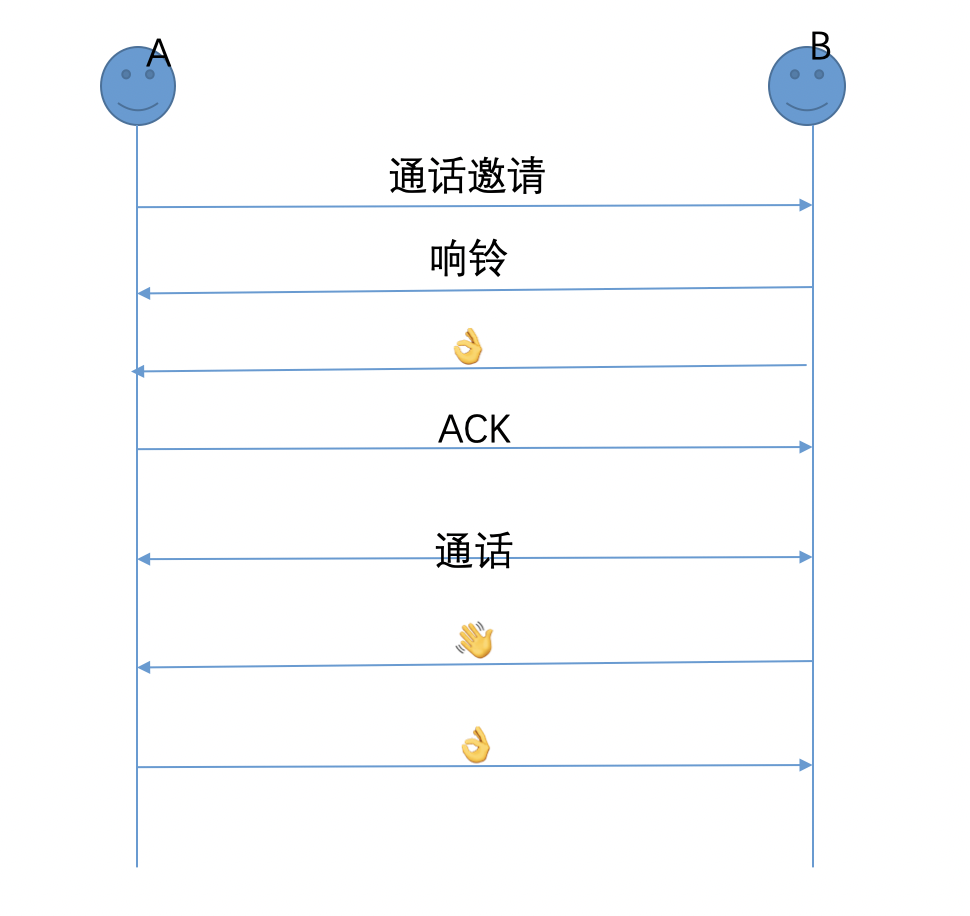

在一个寒冷的冬天，老板突然拎着热腾腾的咖啡过来找你，准没好事儿：（

> 老板：视频通话这块你了解吗？

> 我委婉的说：不是很解

> 老板：SIP 协议知道吧

> 我懵逼的说：不太清楚

> 老板：咱们有意向做这方面的开发你有兴趣参与进来吗？

> 我无可奈何的说：嗯，收到

<!--more-->

## 我直接受益的文章和库

[iOS - 工程引入doubango （idoubs编译）](https://blog.csdn.net/boring_cat/article/details/52759373)

[idoubs](https://github.com/DoubangoTelecom/idoubs)

[doubango](https://github.com/DoubangoTelecom/doubango)

​	

[idoubs编译笔记](http://oriochan.com/14732594613218.html)

## SIP 概念

> SIP（Session Initiation Protocol，会话初始协议）是由IETF（Internet Engineering Task Force，因特网工程任务组）制定的多媒体通信协议。它是一个基于文本的应用层控制协议，用于创建、修改和释放一个或多个参与者的会话。广泛应用于CS（Circuit Switched，电路交换）、NGN（Next Generation Network，下一代网络）以及IMS（IP Multimedia Subsystem，IP多媒体子系统）的网络中，可以支持并应用于语音、视频、数据等多媒体业务，同时也可以应用于Presence（呈现）、Instant Message（即时消息）等特色业务。可以说，有IP网络的地方就有SIP协议的存在。
>
> SIP（Session Initiation Protocol），即会话发起协议，在`RFC2543`、`RFC3261`等中被定义，是一个`VOIP`信令协议，其目的是在IP网络中实现电话功能，即软电话功能。
>
> 在互联网基础期，SIP协议常在硬件电话终端中，随着网络的发展，越来越多的软件也使用SIP来作为语音视频通话的控制协议。因此，SIP在协议还原领域从未缺位，并且地位相当重要。
>
> SIP协议是纯文本协议，通常为`UDP`承载，使用端口`5060`，本文对SIP协议的流程作简单描述，然后对格式进行分析。
>
> 注意：网络流量中SIP协议还会使用`TCP`承载，也会使用其它端口。
>
>

## SIP 通话流程

## 代码参考

代码直接参考 [**ZYDoubs**](https://github.com/NULLGIRL/ZYDoubs) 我就不搬砖了。开发期间有何作者[NULLGIRL](https://github.com/NULLGIRL)沟通过，人也是很nice。谢谢！