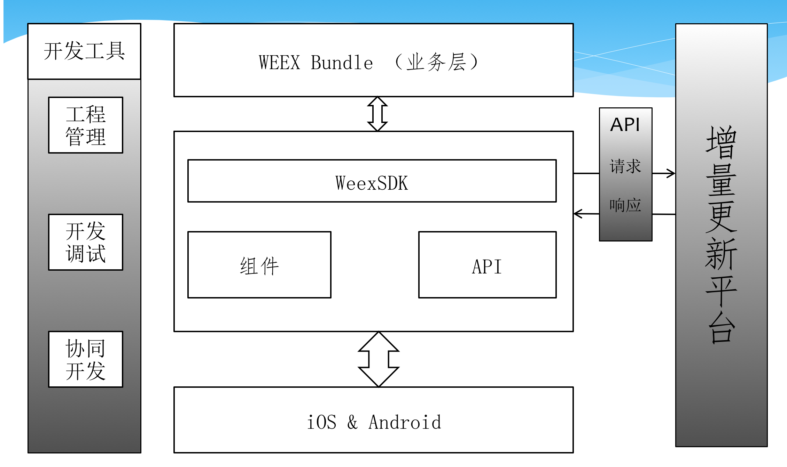
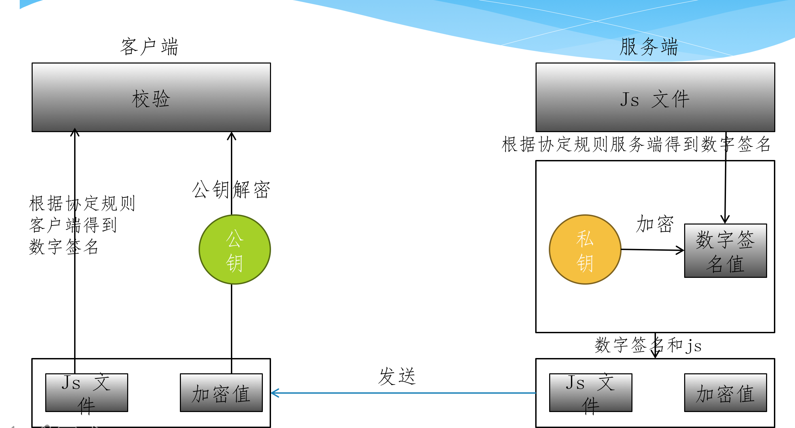

## WEEX 工作原理

`Weex` 是跨平台，可扩展的动态化技术. 能通过在 `Weex` 源码中写`<template>`, `<style>` 和 `<script>`标签，然后把这些标签转换为`JS Bundle`用于部署, 在服务端以这些`JS Bundle`响应请求. 当客户端接收到`JS Bundle`时，它能用被客户端中的`JS`引擎用于管理`Native`渲染;`API`调用和用户交互。


<!--more-->


## 本地开发环境

`Weex` 的本地开发环境基于 `web` 开发体验而设计，`web` 开发者可以通过自己熟悉的 `HTML/CSS/JavaScript` 技术和语法实现移动应用的界面。同时 `Weex` 也对 `Vue.js` 这一非常优秀的前端框架做了官方的支持。

除此之外，`Weex` 的工程设计也是 `web` 开发者非常熟悉的，首先 `web` 开发者可以使用自己熟悉的 `npm` 进行依赖管理；其次 `web` 开发者在通过项目脚手架初始化工程、开发、调试、质量控制等各个环节，都可以参考 `web` 开发已有的最佳实践。

和如今 `web` 开发的最佳实践一样，`Weex` 会把一个页面的源代码全部编译打包成一个 `JS bundle`，在浏览器中，我们需要把这个` JS bundle` 作为一段 `<script> `载入网页，在客户端里，我们把这段` JS bundle` 载入本地，并通过 `WeexSDK` 直接执行


## 云端部署和分发

`Weex` 的` JS bundle` 可以作为 `web` 开发中的一段静态资源进行部署和下发。几乎可以复用 HTML5 所有的工程体系和最佳实践。比如在本地开发环境通过部署工具将 `JS bundle` 部署到` CDN`、通过 `CMS` 或搭建平台把业务数据和模块化的前端组件自动化拼接生成 `JS bundle`、通过服务端` JS bundle` 的流量和日志统计页面的访问情况、通过 `App Cache` 或类似的方式对 `JS bundle` 在客户端进行缓存或预加载以降低网络通信的成本等

> CMS : Content Management System （内容管理系统）
> CDN: Content Delivery Network（内容分发网络）


## 原生项目集成 WEEX

问题：
1. 如何集成` WEEX `到` iOS` 原生当前项目中？

2. 如何用 `WEEX` 提供的原生组件实现界面？

3. 如何实现符合自己业务的原生组件？

4. 写完的` JS` 如何打包给 `Native` 使用？

工具：

- 命令行工具：`weex-toolkit`
- 调试工具：`weex-devtool`
- APP 工具：`playground App`  ps. iOS老崩溃，😅


## 扩展

`Weex` 本身提供了很多内置组件和模块，也具备横向扩展的能力，允许开发者自行扩展和定制。需要注意的是，`Weex` 是一个跨平台的解决方案，扩展其内置组件或模块，需要在三端（`Android`、`iOS`、`Web`）中都有相应的实现。

- `iOS` 扩展
- `Android` 扩展
- `HTML5` 扩展 
-  拓展 `JS Framework`，还在讨论尝试中，可能随时会有调整，请留意
  接下来，仍将以`iOS`视角讲述：

### iOS module 扩展

`Weex SDK` 只提供渲染，而不是其他的能力，如果需要 像网络，图片，URL跳转这些特性，需要自己动手实现他们。 扩展一个url地址跳转`Module`

1. 自定义`Module`

> 自定义的 `module` 类 必须实现` WXModuleProtocol`
>
> 必须添加宏` WX_EXPORT_METHOD` , 它可以被 `weex` 识别，它的参数是` JavaScript` 调用 `module `指定方法的参数
>
> 添加` @synthesized weexInstance`，每个` moudle `对象被绑定到一个指定的实例上
>
> `Module `方法会在`UI`线程中被调用，所以不要做太多耗时的任务在这里，如果要在其他线程执行整个`module` 方法，需要实现 `WXModuleProtocol` 中`- (NSThread *)targetExecuteThread`的方法，这样，分发到这个module的任务会在指定的线程中运行
>
> `Weex` 的参数可以是 `String 或者Map`
>
> `Module` 支持返回值给` JavaScript`中的回调，回调的类型是`WXModuleCallback`,回调的参数可以是`String或者Map`
>
>

2. 注册自己的`Module`

> 通过调用 `WXSDKEngine` 中的` registerModule:withClass`方法来注册自己的`module`

3. 使用自己的`Module`

> 这里的 `require`里面的`event `就是在 上一步调用`registerModule: `注册`module` 时候的`name`
>
> ```js
> function $openURL(url) {
>     var event = this._app.requireModule("event")
>     event.openURL(url)
> }
> ```
>
>


### Handle 扩展

`Weex`可以看做是一个提供了基础套件的`UI`渲染库。核心功能还是需要开发者自己来实现，比如：图片下载逻辑、网络请求、导航跳转等等。比如：图片加载逻辑

- 实现` WXImgLoaderProtocol `协议
- 通过`WXSDKEngine` 中的` registerHandler:withProtocol`注册`handler`


### Component 扩展

虽然 `WeexSDK` 中有很多的 `native` 的 `Component`，但这并不能满足我们的需求。
以 `WeexSDK` 中已经存在的` Component`：`<image>` 为例子，介绍一下如何构建一个 `native` `Component`。

1. 注册` Component`

> 注册一个 component 比较简单，调用`WXSDKEngine` 中的 `registerComponent:withClass: `方法，传入组件的标签名称，还有对应的` class` 然后你可以创建一个 `WXImageComponent` 表示` image `组件的实现。在 `.we` 文件中，只需要写` <image></image>` 
>
>

2. 添加属性`property`

> 现在我们要做一些让 image component 更加强大的事情。既然作为一个图片的 component，那它应该要有源，给他加上一个 src 的属性，同时给它加上一个 resize
> 的属性（可以配置的有 contain/cover/stretch）
>
> ```objective-c
> @property (nonatomic, assign) UIViewContentMode resizeMode;
> ```
>
>
>
> 初始化，attribute 中拿到的值的类型都是 id，我们可以用转换方法把它转换到任何值。Weex SDK 提供了一些基础的转换方法，可以参考 WXConvert 类，或者你可以添加自己的转换函数
>
> ```objective-c
> _resizeMode = [WXConvert UIViewCOntentMode:attributes[@"resize"]];
> ```
>
> ​	

3. `Hocking` 渲染生命周期

> native 的 component 是由 Weex 管理的，Weex 创建，布局，渲染，销毁。
>
> Weex的  component  生命周期都是可以 **hook**  的，你可以在这些生命周期中去做自己的事情
>
>

| 方法               | 描述                                |
| ------------------ | ----------------------------------- |
| initWithRef:type:… | 用给定的属性初始化一个component.    |
| layoutDidFinish    | 在component完成布局时候会调用.      |
| loadView           | 创建component管理的view.            |
| viewWillLoad       | 在component的view加载之前会调用.    |
| viewDidLoad        | 在component的view加载完之后调用.    |
| viewWillUnload     | 在component的view被释放之前调用.    |
| viewDidUnload      | 在component的view被释放之后调用.    |
| updateStyles:      | 在component的style更新时候调用.     |
| updateAttributes:  | 在component的attribute更新时候调用. |
| addEvent:          | 给component添加event的时候调用.     |
| removeEvent:       | 在event移除的时候调用.              |

4. 使用自定义`Component`

```html
<image
style="your-custom-style" src="image-remote-source"
resize="contain/cover/stretch"></image>
```


## 组织结构




## 安全问题

安全问题在于，热更新过程中JS脚本可能被中间人攻击替换代码。

- 方案：RSA 校验




## 参考文献

- [weex-扩展 iOS 的功能](https://weex.incubator.apache.org/cn/guide/extend-ios.html)
- [集成到已有应用](https://weex.incubator.apache.org/cn/guide/integrate-to-your-app.html)
- [JSPatch 部署安全策略](http://blog.cnbang.net/tech/2879/)
- [Weex iOS SDK 集成指南](https://open.taobao.com/doc.htm?docId=104829&docType=1)

