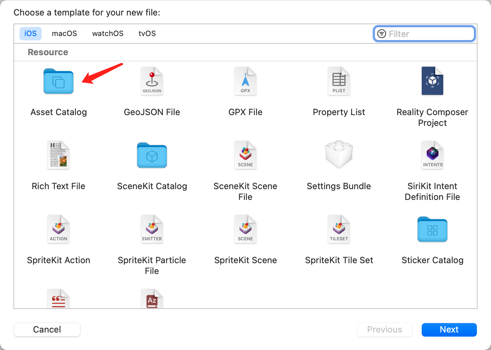
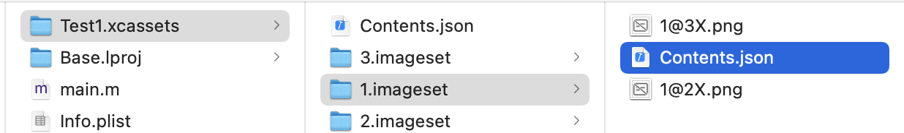

## 新手引导

新手引导，对于游戏类的应用，可以说是至关重要的一环：

> 打造直观且引人入胜的游戏新手引导体验，能给玩家留下良好的第一印象，并吸引玩家留下来。新手引导向玩家介绍游戏的基本玩法、如何购买道具、返回游戏的好处等等。要取得成功，这一体验必须简短、有趣并且有帮助，让玩家可以从中掌握游戏要领并快速开始游戏。


### 1 图片需要适配不同的机型

#### 1.1 关于 Asset Catalog






系统展示图片的时候，会先解析这个文件，然后根据设备的分辨率，找到对应的图片。

```json
{
  "images" : [
    {
      "idiom" : "universal",
      "scale" : "1x"
    },
    {
      "filename" : "1@2X.png",
      "idiom" : "universal",
      "scale" : "2x"
    },
    {
      "filename" : "1@3X.png",
      "idiom" : "universal",
      "scale" : "3x"
    }
  ],
  "info" : {
    "author" : "xcode",
    "version" : 1
  }
}

```


### 2 关于*雪碧图*

只需要将多个小图片放入大图中。加载一次，通过偏移来展示对应的图标。这个在 网页开发中并不少见。

ps. 不适合需要经常更换的图片，否则你就要永远失去 UI 小姐姐了


### 3 UIBezierPath 创建展示路径

自己实现一个UIView，通过设置其layer的mask属性来实现镂空区域。

优点：UI只提供描述图片，灵活适配不同机型

缺点：后期迭代界面改动要更新控件 `frame`

```objective-c

- (void)creatControlWithType:(GPType)type completion:(FinishBlock)completion
{
    _finish = completion;
 
    // 遮盖视图
    CGRect frame = [UIScreen mainScreen].bounds;
    UIView *bgView = [[UIView alloc] initWithFrame:frame];
    bgView.backgroundColor = [[UIColor blackColor] colorWithAlphaComponent:0.7f];
    // 点击事件
    [bgView addGestureRecognizer:[[UITapGestureRecognizer alloc] initWithTarget:self action:@selector(tap:)]];
    [[UIApplication sharedApplication].keyWindow addSubview:bgView];
    
    // 信息提示视图
    UIImageView *imgView = [[UIImageView alloc] init];
    [bgView addSubview:imgView];
    
    // 第一个路径
    UIBezierPath *path = [UIBezierPath bezierPathWithRect:frame];
    switch (type) {
        case GPTypeOne:
            // 下一个路径，圆形
            [path appendPath:[UIBezierPath bezierPathWithArcCenter:KSuitPoint(227, 188) radius:KSuitFloat(46) startAngle:0 endAngle:2 * M_PI clockwise:NO]];
            imgView.frame = KSuitRect(220, 40, 100, 100);
            imgView.image = [UIImage imageNamed:@"1"];
            _guidePageKey = GPOneKey;
            break;
            
        case GPTypeTwo:
            // 下一个路径，矩形
            [path appendPath:[[UIBezierPath bezierPathWithRoundedRect:KSuitRect(5, 436, 90, 40) cornerRadius:5] bezierPathByReversingPath]];
            imgView.frame = KSuitRect(100, 320, 120, 120);
            imgView.image = [UIImage imageNamed:@"2"];
            _guidePageKey = GPTwoKey;
            break;
            
        default:
            break;
    }
    
    // 绘制透明区域
    CAShapeLayer *shapeLayer = [CAShapeLayer layer];
    shapeLayer.path = path.CGPath;
    [bgView.layer setMask:shapeLayer];
}

```

