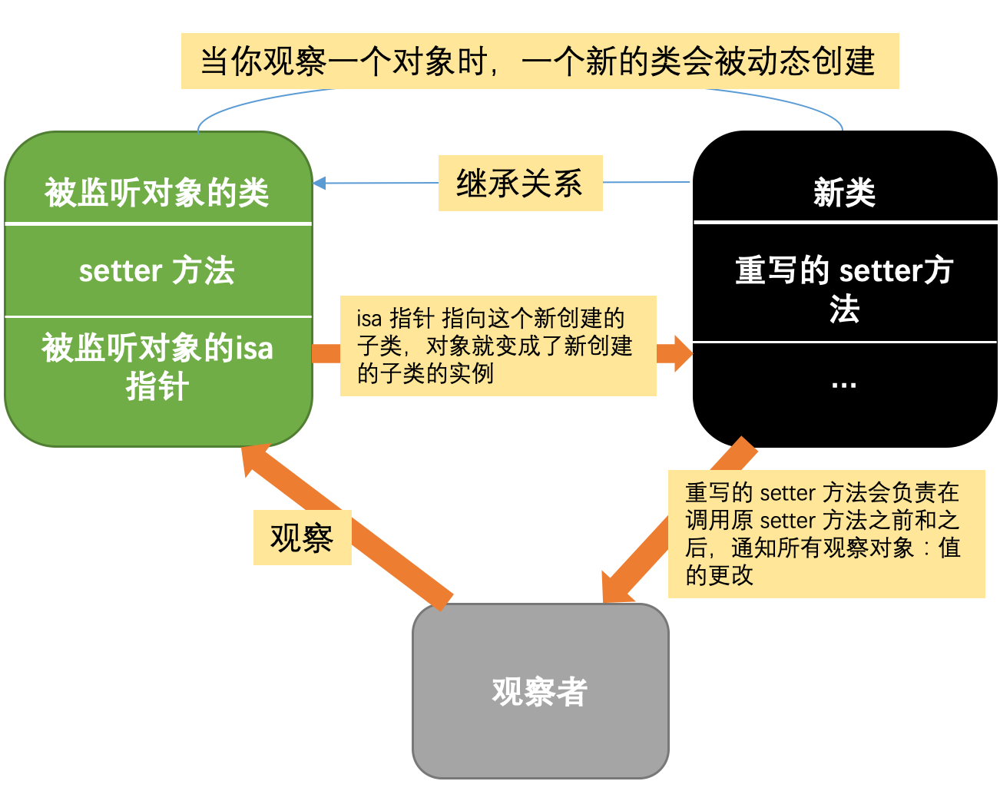

## KVO

> KVO 即 Key-Value Observing，翻译成键值观察。它是一种观察者模式的衍生。其基本思想是，对目标对象的某属性添加观察，当该属性发生变化时，通过触发观察者对象实现的KVO接口方法，来自动的通知观察者。

<!--more-->

## KVO 实现机制

Mike Ash 2009 年的文章[how Key-Value Observing (KVO) is actually implemented at the runtime level](https://www.mikeash.com/pyblog/friday-qa-2009-01-23.html)

当你观察一个对象时，一个新的类会被动态创建。这个类继承自该对象的原本的类，并重写了被观察属性的 setter 方法。重写的 setter 方法会负责在调用原 setter 方法之前和之后，通知所有观察对象：值的更改。最后通过 `isa 混写（isa-swizzling）` 把这个对象的 isa 指针 ( isa 指针告诉 Runtime 系统这个对象的类是什么 ) 指向这个新创建的子类，对象就变成了新创建的子类的实例。这个中间类，继承自原本的那个类。不仅如此，Apple 还重写了 `-class` 方法，企图欺骗我们这个类没有变，就是原本那个类。




## KVO 使用

### 注册与解除注册

```objective-c
// Foundation/NSKeyValueObserving.h
/*
observer:观察者，也就是KVO通知的订阅者。订阅着必须实现 
observeValueForKeyPath:ofObject:change:context:方法
keyPath：描述将要观察的属性，相对于被观察者。
options：KVO的一些属性配置；有四个选项。
	NSKeyValueObservingOptionNew：change字典包括改变后的值
    NSKeyValueObservingOptionOld:change字典包括改变前的值
    NSKeyValueObservingOptionInitial:注册后立刻触发KVO通知
    NSKeyValueObservingOptionPrior:值改变前是否也要通知（这个key决定了是否在改变前改变后通知两次）
context: 上下文，这个会传递到订阅着的函数中，用来区分消息，所以应当是不同的。
*/

- (void)addObserver:(NSObject *)observer forKeyPath:(NSString *)keyPath options:(NSKeyValueObservingOptions)options context:(void *)context;

- (void)removeObserver:(NSObject *)observer forKeyPath:(NSString *)keyPath;
```

### 值变更

每当监听的 `keyPath` 发生变化了，就会在这个函数中回调。

```objective-c
- (void)observeValueForKeyPath:(NSString *)keyPath
                      ofObject:(id)object
                        change:(NSDictionary *)change
                       context:(void *)context
```

在这里，`change` 保存了变更信息，具体是哪些信息取决于注册时的 `NSKeyValueObservingOptions`。

### 手动设定实例变量的KVO

如果将一个对象设定成属性，这个属性是自动支持KVO的。如果这个对象是一个实例变量，那么，这个KVO是需要我们自己来实现的。

具体可参考[手动设定实例变量的KVO实现监听](https://yq.aliyun.com/articles/30483)这篇文章

```objective-c
#import <Foundation/Foundation.h>

@interface Student : NSObject

{
    NSString  *_age;
}
- (void)setAge:(NSString *)age;
- (NSString *)age;

@property (nonatomic, strong) NSString  *name;

@end
```

```objective-c
// 手动设定KVO
- (void)setAge:(NSString *)age
{
    [self willChangeValueForKey:@"age"];
    _age = age;
    [self didChangeValueForKey:@"age"];
}
- (NSString *)age
{
    return _age;
}
+ (BOOL)automaticallyNotifiesObserversForKey:(NSString *)key
{
    // 如果监测到键值为age,则指定为非自动监听对象
    if ([key isEqualToString:@"age"])
    {
        return NO;
    }
    
    return [super automaticallyNotifiesObserversForKey:key];
}
```


## 参考文献

- [如何自己动手实现 KVO](https://tech.glowing.com/cn/implement-kvo/)
- [手动设定实例变量的KVO实现监听](https://yq.aliyun.com/articles/30483)
- [(译)KVO的内部实现](http://www.cocoachina.com/ios/20140107/7667.html)
- [KVC 和 KVO](https://objccn.io/issue-7-3/)
- [NSKeyValueObserving](https://developer.apple.com/documentation/foundation/notifications/nskeyvalueobserving#//apple_ref/occ/instm/NSObject/observationInfo)
- [Introduction to Key-Value Observing Programming Guide](https://developer.apple.com/library/archive/documentation/Cocoa/Conceptual/KeyValueObserving/KeyValueObserving.html)
- [Foundation: NSKeyValueObserving(KVO)](http://southpeak.github.io/2015/04/23/cocoa-foundation-nskeyvalueobserving/)

