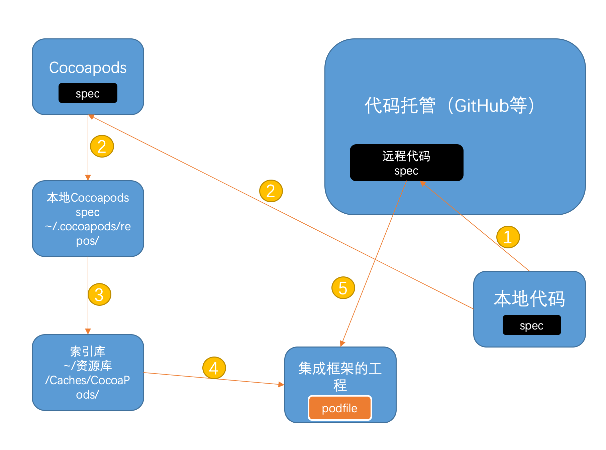

## 简单说下背景

默认所有的`Podspec`文件都放在了`https://github.com/CocoaPods/Specs`地址上，所以第一次`pod setup`时如果你的项目依赖很多Cocoapods管理的库，将会耗费许多时间。所以，对于公司级别的开发，需要搭建许多私有的类库，这就需要我们创建一个私有的`repo`。



<!--more-->

## 大体流程

```shell
1. git push / git push --tags
2. pod trunk push / pod repo add 
4. pod search
5. pod install
```


## 创建一个私有库 :

```shell
 $ cd /opt/git
 $ mkdir Specs.git
 $ cd Specs.git
 $ git init --bare 
 // 要使用git传输协议,需要创建git-export-daemon-ok文件,然后
 touch git-daemon-export-ok  
```

## 在设置中添加这个远程库,远程库名称定义为 myTest-specs

```shell
 $ pod repo add myTest-specs git@github:artsy/Specs.git
 $ cd ~/.cocoapods/repos/artsy-specs
 $ pod repo lint .
```

## 添加自己的私有库

```shell
 pod repo push myTest-specs hello-world.podspec --verbose --allow-warnings
 // 任何一丁点的警告都会导致提交失败,所以要允许所有警告.
```

## 最后在使用私有库时,在Podfile上写上这句:

```shell
 source 'git://10.5.121.119/Specs.git'	
 source 'https://github.com/CocoaPods/Specs.git'
```

## pods的repo仓库的目录结构是:

```shell
├── Specs
	└── [SPEC_NAME]
   		└── [VERSION]
       	 		└── [SPEC_NAME].podspec
```

## 删除spec的某个版本:

```shell
pod repo xxx delete PodName VERSION
```

## 私有库podspec文件的编写

官方文档对于podspec文件的编写进行了[比较详细的说明](https://guides.cocoapods.org/syntax/podspec.html)简单的介绍。如下：

```ruby

    
// 源文件,我们使用git的管理库的源文件,用当前版本号作为tag
spec.source = { :git => 'https://github.com/AFNetworking/AFNetworking.git',
            :tag => spec.version }

    
// 安装前准备的命令脚本
spec.prepare_command = <<-CMD
                    sed -i 's/MyNameSpacedHeader/Header/g' ./**/*.h
                    sed -i 's/MyNameOtherSpacedHeader/OtherHeader/g' ./**/*.h
               CMD
// 要求版本
spec.ios.deployment_target = '8.0'

// 依赖 版本简单介绍一下,如果不写版本,表示使用最新版本, ~>表示大于多少版本 '1.0'表示使用1.0版本
spec.dependency 'AFNetworking', '~> 1.0'

// 是否使用arc,默认使用
spec.requires_arc = true

// 也可以这样来指定文件使用ARC,但是不使用ARC的文件,就必须用`-fno-objc-arc` compiler flag来设置了
spec.requires_arc = ['Classes/*ARC.m', 'Classes/ARC.mm']

// 依赖的framework, Foundation和 UIKit可以忽略
spec.frameworks = 'QuartzCore', 'CoreData'

// 系统库的连接,这里是 libxml2.tbd的东西.
spec.libraries = 'xml2', 'z'

// compiler flag
spec.compiler_flags = '-DOS_OBJECT_USE_OBJC=0', '-Wno-format'

// 源文件
spec.source_files = 'Classes/**/*.{h,m}', 'More_Classes/**/*.{h,m}'

// 公开头文件,如果不设置,那所有的头文件都是公开的.
spec.public_header_files = 'Headers/Public/*.h'

// 如果要导入一个第三方或者自己的framework文件,需要使用--use-libraries
spec.vendored_frameworks = 'MyFramework.framework', 'YourFramework.framework'

// 需要导入的.a库.
spec.vendored_libraries = 'libProj4.a', 'libJavaScriptCore.a'

// 需要导入的资源文件,注意,不能嵌套文件夹,简单来说,Sounds/*下面所有的文件都被导入到Pod中,包括文件夹,如Test下有个文件夹/test1/123.png,也会被导入,但是最后的123.png文件却不会被正确加载到项目中.如果要正常文件夹形式,只能通过 subspec即子库的方式来实现.
spec.resources = ['Images/*.png', 'Sounds/*']

// 子库,只有子库才能创建文件夹....
subspec 'Pinboard' do |sp|
  sp.source_files = 'Classes/Pinboard'
end

// 指定一个默认子库,这个子库却是加载全部...而如果不设置默认子库,也会默认加载全部
s.default_subspec = 'All'

```

## 编写好之后,上传podspec文件

在git仓库确定打好`tag`,修改好正确`podspec`文件后，就可以提交了。首先，现在本地连接上可以修改版本的`pod repo`

```shell
pod repo add myTest-specs xxx@10.5.121.119:/usr/local/cocoaPodsRepo/Specs.git
```

关于`pod repo`常用的命令有 :

```shell
// 查看当前的repo库列表 ,默认会有一个master,是连接到github上的公有库
pod repo list
// 更新 ,默认 pod install update时,都会进行pod repo update操作来加载主干库,所以使用参数--no-repo-update.
pod repo update
// 删除一个
pod repo remove abc-specs
```

然后 提交 :

```shell
pod repo push myTest-specs TestFunc.podspec --verbose  --allow-warnings
```

`verbose`打印出过程，`--allow-warnings`允许警告，默认情况下，任何警告都会导致提交失败。如果使用了`vendored_frameworks`，还要加上参数`--use-libraries`。由于`pod`提交时比较麻烦，必须先构建一遍，且不能只提供指定架构版本，所以我们常常直接操作`pod`仓库，而不是通过命令`pod repo push`去提交。

## 需要注意的地方:

- podspec中依赖`framework`,使用`vendored_library` 和`vendored_frameworks`属性时,提交podspec时,会报错:

  ```shell
    The 'Pods' target has transitive dependencies that include static binaries:xxx.framework`
  ```

  解决方法是，`pod repo push`时添加参数`--use-libraries`.

- podspec中设置`other link flag` :

  ```json
    s.xconfig = {
            'OTHER_LDFLAGS' => '$(inherited) -lstdc++',
        }
  ```

- podspec设置资源文件，关于资源文件的话，资源文件只能传递一层，所以不应该使用嵌套的文件夹来存放资源文件，事实上，如源代码一样，想要分包装代码或者资源文件，就必须建立`subspec`了。可以使用`imagesets`来保存图片.

- 本地的缓存路径在 `~/Library/Caches/CocoaPods/Pods`

- 删除库时，执行完了`update`后,但是项目中设置的`other link flags`还在，所以需要再执行一次`pod install`来删除配置.

- 所有的静态库都要以`lib`开头，如使用`vendored_library`加载`libABC.a`时，会在`other link flag`上设置`-l "ABC"`

- `pod repo`是有缓存的，如果你成功上传一个podspec，但是版本没有改变的话，然后在本地通过 `pod update`想要下载这一份最新的库时,得到的只是本地的缓存而已。所以如果不改动版本，必须删除本地的缓存。

- 关于ARC的设置，可以考虑使用`subspec`来设置子库一部分支持ARC，一部分不支持ARC.

- 会出现`ArgumentError - invalid byte sequence in US-ASCII`编码集错误，主要因为编译机器不是UTF-8编码的，进行编码声明`export LC_ALL=en_US.UTF-8`

## CocoaPods 在主干上发布pods

`CocoaPods Trunk` 是一个基于授权的`CocoaPodsAPI`服务。 要在主干上发布或者更新库，需要注册，并获得一个 验证了的主干`Session`在当前的设备上。0.33版本开始支持。

以邮箱注册账号，同时会根据当前设备，生成一个会话。

```shell
pod trunk register fmslikai@gmail.com 'karl' --description='karl,macpro'
```

后面的`--description`是附加的，给用户自己看的当前session描述，因为会话是绑定设备的，所以描述一下设备，还是有必要的。

然后去邮箱验证，验证后，可以通过命令 `pod trunk me`来查看账号所有`Session`

然后通过命令`pod trunk push`来发布pod。

### 注意

如果你之前提交过Pod，那么`trunk`之后你需要去[Claim your Pod](https://link.jianshu.com/?t=https://trunk.cocoapods.org/claims/new)认领下，收工。