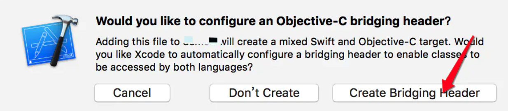

# Charts 使用


## 前言

接触到一个图表显示的应用。找到了 Charts 这个开元的图形库。这个库是 swift 语言的，所以涉及到了 swift 和 OC 混编。


## 集成使用

### 混编

创建一个 swift 文件，会看到如下提示：



点击箭头所指的选项，会生成你创建的 `.swift` 文件和 `工程名-Bridiging-Header.h` 头文件。

在头文件中 `@import Charts`。下面，在 viewcontroller 中使用 Charts

```objective-c
#import "ViewController.h"
#import "工程名-Bridging-Header.h"
@interface ViewController ()
@end
@implementation ViewController
- (void)viewDidLoad {
    [super viewDidLoad];
  	//柱状图，还提供了 LineChartView PieChart ScatterChart CandleStickChart 等
    BarChartView *chartView = [[BarChartView alloc] initWithFrame:self.view.bounds];
    chartView.backgroundColor = [UIColor colorWithRed:0.184 green:1.000 blue:0.738 alpha:1.000];
    [self.view addSubview:chartView];
}
@end
```


对于 Charts 的具体使用，可参见[Charts](https://github.com/danielgindi/Charts)


**注：**

**凡是用Swift写的类，如果不继成自NSObject或NSObject 的派生类，哪么编译后将不会生成对应的转换类。从而使得OC 中找不到相应的声明。**