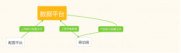

在保证移动端流量不会受较大影响的前提下，`PM` 们总是希望埋点覆盖面越广越好与此同时，作为开发者的我们更希望以一种可复用、解耦、动态可配、易于维护的可执行方案。所以，本文旨在**探讨**一种可复、解耦、动态可配的、容易维护的**用户行为统计** (`User Behavior Statistics, UBS`) 方案。我将尽量从整体设计的视野，以 iOS 技术实现为例，与大家一起探讨 `UBS `（俗称：**埋点**）。

<!--more-->

本文整体分为三部分：

- 第一部分谈常规做法的优缺点
- 第二部分谈可复用、解耦方案
- 第三部分探索动态可配与易维护

## 常规做法的优缺点

目前常规的做法是将埋点代码封装成工具类，但凡工程中需要埋点(如点击事件、页面跳转)的地方都插入埋点代码：

- 优点：
  - 哪里需要哪里注入代码，简单明了；不会出现莫名其妙的崩溃问题。 ps.相较于使用` Runtime` 的实现而言
- 缺点：
  - 随着项目越来越复杂，埋点的代码散落在程序的各个角落，不利于维护以及复用；统计操作完全依赖于移动端的版本升级，无法动态配置；工作量大

## 可复用、解耦方案初步落成

我们的项目中是怎么处理的呢？首先谈一下解耦，避免埋点代码散落在程序的各个角落与业务代码糅杂在一起。同时，不得不谈到 `AOP `名词这里不做过多解释了，自己Google 吧。在 iOS 中实现 `AOP `编程的技术就是基于 `Objective-C Runtime` 特性的` Method Swizzling`。上干货：

```objective-c
+ (void)swizzlingInClass:(Class)cls originalSelector:(SEL)originalSelector swizzledSelector:(SEL)swizzledSelector
{
    Class class = cls;
    
    Method originalMethod = class_getInstanceMethod(class, originalSelector);
    Method swizzledMethod = class_getInstanceMethod(class, swizzledSelector);
    
    BOOL didAddMethod =
    class_addMethod(class,
                    originalSelector,
                    method_getImplementation(swizzledMethod),
                    method_getTypeEncoding(swizzledMethod));
    
    if (didAddMethod) {
        class_replaceMethod(class,
                            swizzledSelector,
                            method_getImplementation(originalMethod),
                            method_getTypeEncoding(originalMethod));
    } else {
        method_exchangeImplementations(originalMethod, swizzledMethod);
    }
}
```

接下来就是 hook 的方法：

- 对于页面事件的收集，主要通过 `hook `系统类` UIViewController` 的生命周期方法来实现，比如：`viewDidAppear`
- 所有的 `UIControl` 类型的控件、`UITabBarButton` 以及在导航栏上自定义添加的 `UIBarButtonItem` 的点击事件，都可以通过 `hook `系统类`UIApplication` 的 `sendAction:to:from:forEvent: `方法进行拦截。但是，这个方法并不能拦截到导航栏上系统自动添加的返回按钮的点击，因此又` hook` 了 `UINavigationController` 的 `navigationBar:shouldPopItem: `方法来实现对它的点击的拦截

这时候问题来了，项目中每个页面都会有自己的`页面事件编号`(`pad`)，此处的埋点代码如何知道要发送什么` pad `给服务端呢？轻松祭出` KVC`与`Dictionary` ，创建一个配置文件 `GSUserStatisticsConfig.plist` 代码示例：

```json
{
    "GSLoginViewController": {
        "pad": {
            "enter":"at1"
        },
        "ped": {
            "onxxxBtnPressed":"xxx"
        }
    }
}
```

通过上述处理，基本上实现了埋点代码与业务代码的解耦，作为一个统计模块复用性也非常显著。接下来谈一下

## 探索动态可配与易维护

在探索动态可配与已维护的数据采集方面，业界有一种方案称之为**无埋点**也叫全埋点，即不需要用户主动埋点，可以收集用户所有的操作行为。
接下来贴一张图来的更为直观一点：

从上图可以看出，在实现无埋点数据收集时，主要分为3步：

- 上传统计配置文件
- 请求统计配置文件
- 业务数据的收集与上报。

配置文件的设计与自身业务息息相关不再详述，请求配置文件也不是要讨论的核心，核心在于业务数据根据配置文件的动态收集，业界开发者称之为无埋点去获取配置文件中想要的业务数据。
参考案例：

- [GrowingIo](https://blog.growingio.com/categories/growth)
- [网易HubbleData无埋点SDK在iOS端的设计与实现](https://neyoufan.github.io/2017/04/19/ios/%E7%BD%91%E6%98%93HubbleData%E6%97%A0%E5%9F%8B%E7%82%B9SDK%E5%9C%A8iOS%E7%AB%AF%E7%9A%84%E8%AE%BE%E8%AE%A1%E4%B8%8E%E5%AE%9E%E7%8E%B0/)

### 学习该方案与我们自身产品业务埋点的梳理：

优点非常突出：

- 维护成本，主要管理配置文件即可
- 弥补埋点时存在错埋、漏埋等情况，动态更新及添加
- 埋点代码无需跟随APP版本一起发布，不耽误数据的收集与统计
- 对于一些动态事件做到很好的支持，例如：同一位置显示不同的内容，同一内容显示在不同的位置
- 可以统计同一个按钮事件，在产品上可能代表不同的状态，例如在播放状态下关闭按钮和回放状态下关闭按钮，按钮的事件是一样的，但是需求去判断是播放状态还是回放状态

缺点：

- 我们的埋点注重的是用户的浏览行为是一条路径（亦可称之为一条线），对单点操作行为统计要求不强，有点“杀鸡焉用牛刀”的感觉；
- 无埋点方案需要大量`hook`系统方法，该行为导致 `crash` 的几率升高；
- 如果收集数据量比较庞大，遍历事件然后拿到配置文件匹配事件的能耗会显现出来导致 APP 卡顿；
- 开发周期会相对长一些：需要前端要搭建配置文件的平台；需要 BI 配合下发和处理 采集的数据；需要 iOS 和 Android 两端攻克无埋点采集数据的技术难点。

### 补充：

`weex` 页面的业务埋点思路同上，但是需要再做额外的处理；

最后，探讨毕竟是探讨，欢迎留言讨论。