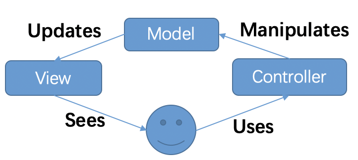
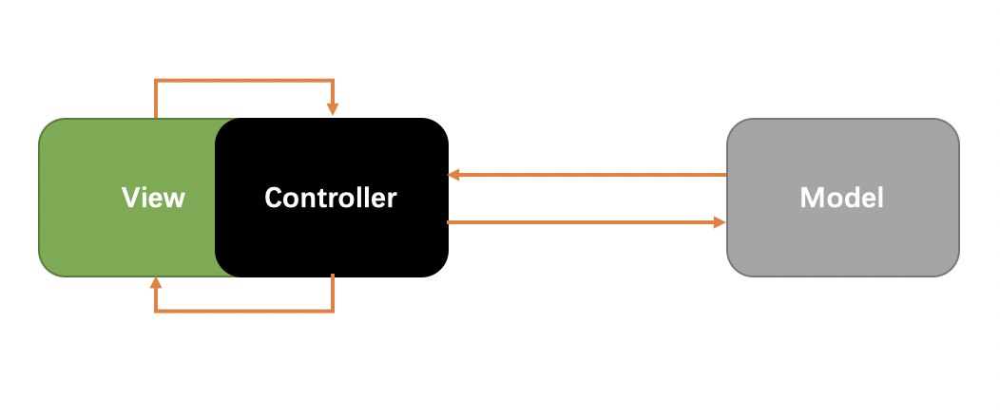
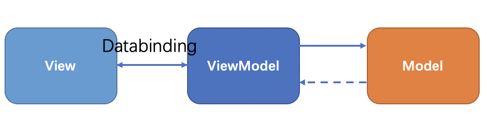
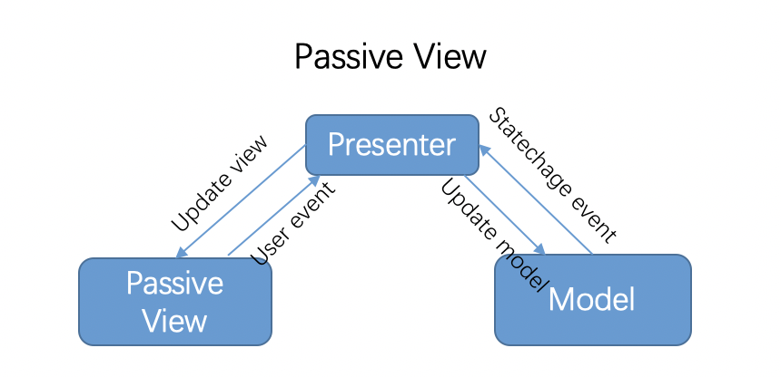
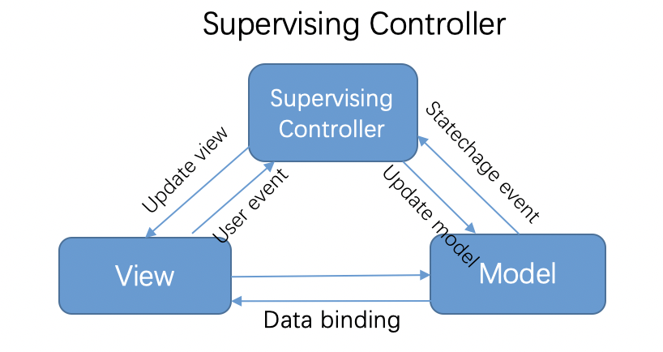
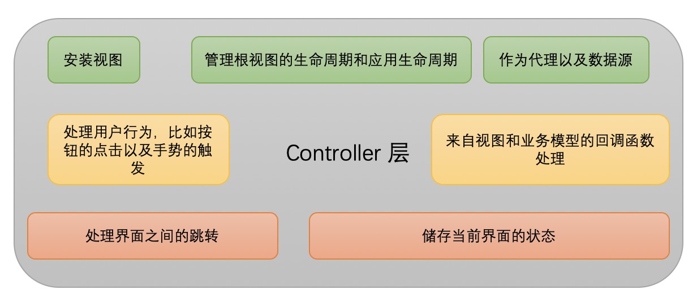
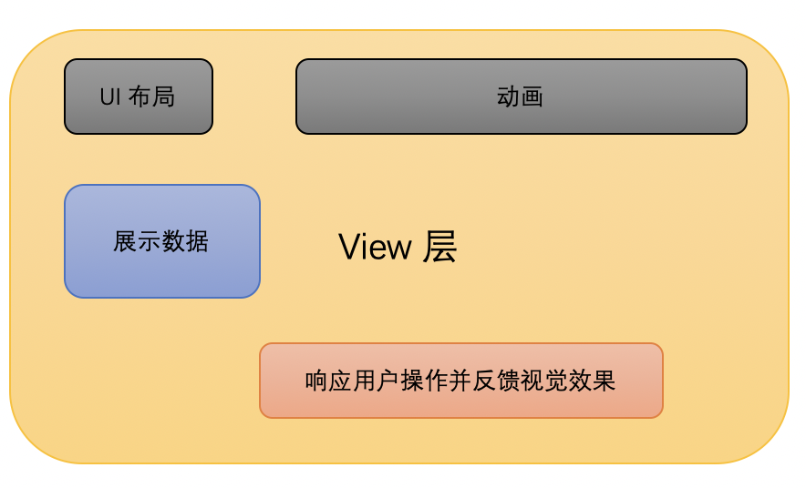
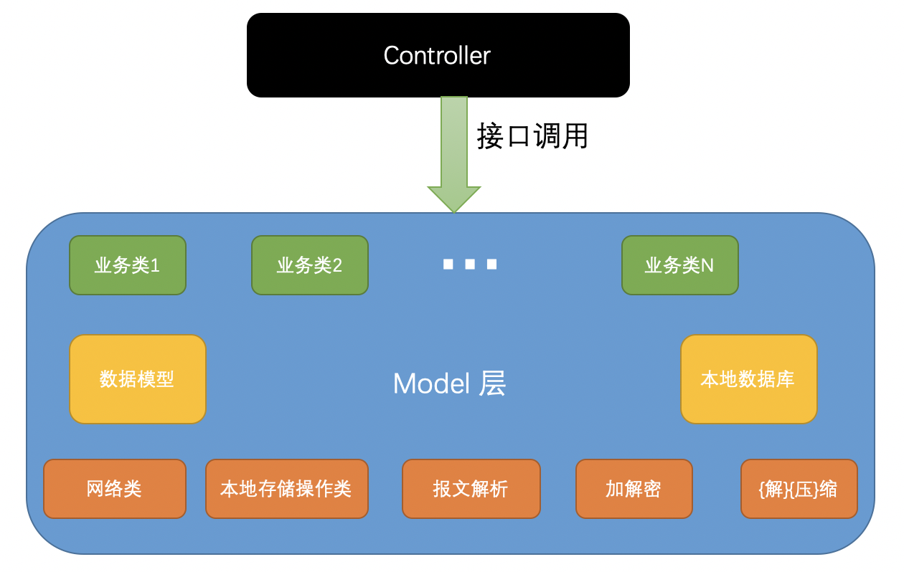

## 前言

在移动应用**架构**与**设计模式**的选用时，我并没有感到非常**纠结**。并不是因为我很牛逼，恰恰相反因为iOS平台本身往往对应用层有着自己的设计，我们在开发客户端应用时，只需要遵循平台固有的设计就可以完成应用的开发。所以，与其说不纠结，倒不如说**道行浅**。

不过，在有些时候，由于工程变得**庞大**、业务逻辑变得异常**复杂**，诸如手机淘宝、百度、微信、美团、头条、滴滴等巨无霸类型的 APP，的确需要考虑**架构**以满足复杂工程的**高效开发**。

<!--more-->

## 几种设计模式

### MVC

>  [**MVC**](https://en.wikipedia.org/wiki/Model%E2%80%93view%E2%80%93controller)
>
> **Model–view–controller** is an [architectural pattern](https://en.wikipedia.org/wiki/Architectural_pattern) commonly used for developing [user interfaces](https://en.wikipedia.org/wiki/User_interface) that divides an application into three interconnected parts. This is done to separate internal representations of information from the ways information is presented to and accepted from the user.[[1\]](https://en.wikipedia.org/wiki/Model%E2%80%93view%E2%80%93controller#cite_note-1)[[2\]](https://en.wikipedia.org/wiki/Model%E2%80%93view%E2%80%93controller#cite_note-2) The MVC design pattern decouples these major components allowing for efficient [code reuse](https://en.wikipedia.org/wiki/Code_reuse) and parallel development.
>
> Traditionally used for desktop [graphical user interfaces](https://en.wikipedia.org/wiki/Graphical_user_interface) (GUIs), this architecture has become popular for designing [web applications](https://en.wikipedia.org/wiki/Web_application) and even mobile, desktop and other clients.[[3\]](https://en.wikipedia.org/wiki/Model%E2%80%93view%E2%80%93controller#cite_note-3) Popular programming languages like [Java](https://en.wikipedia.org/wiki/Java_(programming_language)), [C#](https://en.wikipedia.org/wiki/C_Sharp_(programming_language)), [Ruby](https://en.wikipedia.org/wiki/Ruby_(programming_language)), [PHP](https://en.wikipedia.org/wiki/PHP) have MVC frameworks that are used in web application development straight [out of the box](https://en.wikipedia.org/wiki/Out_of_the_box_(feature)).
>
> From wikipedia



看到维基百科的这个 `MVC`的架构图，作为iOS开发者，我非常困惑。View 层和 COntroller 层没有直接关联？通过 Model 层来通讯吗？

以下是摘录自[Concepts in Objective-C Programming](https://developer.apple.com/library/archive/documentation/General/Conceptual/CocoaEncyclopedia/Model-View-Controller/Model-View-Controller.html#//apple_ref/doc/uid/TP40010810-CH14-SW14)：

> The MVC design pattern considers there to be three types of objects: model objects, view objects, and controller objects. The MVC pattern defines the roles that these types of objects play in the application and their lines of communication. When designing an application, a major step is choosing—or creating custom classes for—objects that fall into one of these three groups. Each of the three types of objects is separated from the others by abstract boundaries and communicates with objects of the other types across those boundaries.



由于 `UIViewController` 类持有一个根视图 `UIView`，所以视图层与控制器层是耦合度很高，iOS 项目经常遇到视图控制器非常臃肿，然后开发者们就开始不断的对 MVC 进行**演进**以实现更好的工程结构。

### MVVM

>[**MVVM(Model–view–viewmodel )**](https://en.wikipedia.org/wiki/Model%E2%80%93view%E2%80%93viewmodel)
>
>MVVM facilitates a [separation](https://en.wikipedia.org/wiki/Separation_of_concerns) of development of the [graphical user interface](https://en.wikipedia.org/wiki/Graphical_user_interface) – be it via a [markup language](https://en.wikipedia.org/wiki/Markup_language) or GUI code – from development of the [business logic](https://en.wikipedia.org/wiki/Business_logic) or [back-end](https://en.wikipedia.org/wiki/Front_and_back_ends) logic (the *data model*). The *view model* of MVVM is a value converter,[[1\]](https://en.wikipedia.org/wiki/Model%E2%80%93view%E2%80%93viewmodel#cite_note-MVVM-eliminates-valueconverters-1) meaning the view model is responsible for exposing (converting) the [data objects](https://en.wikipedia.org/wiki/Data_object) from the model in such a way that objects are easily managed and presented. In this respect, the view model is more model than view, and handles most if not all of the view's display logic.[[1\]](https://en.wikipedia.org/wiki/Model%E2%80%93view%E2%80%93viewmodel#cite_note-MVVM-eliminates-valueconverters-1) The view model may implement a [mediator pattern](https://en.wikipedia.org/wiki/Mediator_pattern), organizing access to the back-end logic around the set of [use cases](https://en.wikipedia.org/wiki/Use_case)supported by the view.
>
>MVVM is a variation of [Martin Fowler](https://en.wikipedia.org/wiki/Martin_Fowler)'s Presentation Model design pattern.[[2\]](https://en.wikipedia.org/wiki/Model%E2%80%93view%E2%80%93viewmodel#cite_note-2)[[3\]](https://en.wikipedia.org/wiki/Model%E2%80%93view%E2%80%93viewmodel#cite_note-JoshSmith-3) MVVM abstracts a view's [state](https://en.wikipedia.org/wiki/State_(computer_science)) and behavior in the same way,[[3\]](https://en.wikipedia.org/wiki/Model%E2%80%93view%E2%80%93viewmodel#cite_note-JoshSmith-3) but a Presentation Model abstracts a view (creates a *view model*) in a manner *not* dependent on a specific user-interface platform.
>
>MVVM was invented by [Microsoft](https://en.wikipedia.org/wiki/Microsoft) architects Ken Cooper and Ted Peters specifically to simplify [event-driven programming](https://en.wikipedia.org/wiki/Event-driven_programming) of user interfaces. The pattern was incorporated into [Windows Presentation Foundation (WPF)](https://en.wikipedia.org/wiki/Windows_Presentation_Foundation) (Microsoft's [.NET](https://en.wikipedia.org/wiki/.NET) graphics system) and [Silverlight](https://en.wikipedia.org/wiki/Silverlight) (WPF's Internet application derivative).[[3\]](https://en.wikipedia.org/wiki/Model%E2%80%93view%E2%80%93viewmodel#cite_note-JoshSmith-3) John Gossman, one of Microsoft's WPF and Silverlight architects, [announced MVVM on his blog](https://blogs.msdn.microsoft.com/johngossman/2005/10/08/introduction-to-modelviewviewmodel-pattern-for-building-wpf-apps/) in 2005.[[3\]](https://en.wikipedia.org/wiki/Model%E2%80%93view%E2%80%93viewmodel#cite_note-JoshSmith-3)
>
>Model–view–viewmodel is also referred to as **model–view–binder**, especially in implementations not involving the .NET platform. [ZK](https://en.wikipedia.org/wiki/ZK_(framework)) (a [web application framework](https://en.wikipedia.org/wiki/Web_application_framework) written in [Java](https://en.wikipedia.org/wiki/Java_(programming_language))) and [KnockoutJS](https://en.wikipedia.org/wiki/KnockoutJS) (a [JavaScript](https://en.wikipedia.org/wiki/JavaScript) [library](https://en.wikipedia.org/wiki/Library_(computing))) use model–view–binder.[[3\]](https://en.wikipedia.org/wiki/Model%E2%80%93view%E2%80%93viewmodel#cite_note-JoshSmith-3)[[4\]](https://en.wikipedia.org/wiki/Model%E2%80%93view%E2%80%93viewmodel#cite_note-SMassey-4)[[5\]](https://en.wikipedia.org/wiki/Model%E2%80%93view%E2%80%93viewmodel#cite_note-5)



除了我们非常熟悉的 `Model`、`View` 和 `ViewModel `这三个部分，在` MVVM `的实现中，还引入了**隐式的**一个 `Binder 层`来同步视图和展示模型/视图模型之间的状态。主要使用**观察者模式**、**双向绑定**等机制。

最为关键的是**展示模型/视图模型**创建了一个**视图的抽象**，**将视图中的状态和行为抽离出一个新的抽象**，这是 MVVM 中需要注意的。

### MVP

> [**MVP**](https://en.wikipedia.org/wiki/Model%E2%80%93view%E2%80%93presenter)
>
> **Model–view–presenter** (**MVP**) is a derivation of the [model–view–controller](https://en.wikipedia.org/wiki/Model%E2%80%93view%E2%80%93controller) (MVC) [architectural pattern](https://en.wikipedia.org/wiki/Architectural_pattern), and is used mostly for building user interfaces.

目前常见的 MVP 架构模式：[Passive View](https://www.martinfowler.com/eaaDev/PassiveScreen.html) 和 [Supervising Controller](https://www.martinfowler.com/eaaDev/SupervisingPresenter.html)



**被动视图**

- 当视图接收到来自用户的事件时，会将事件转交给` Presenter `进行处理；

- 被动的视图向外界暴露接口，当需要更新视图时`Presenter` 通过视图暴露的接口更新视图的内容；

- `Presenter` 负责对模型进行操作和更新，在需要时取出其中存储的信息；

- 当模型层改变时，可以将改变的信息发送给**观察者** `Presenter`；
- 在 `MVP` 的变种被动视图中，模型的操作以及视图的更新都仅通过 `Presenter` 作为**中间人**进行。



在**监督控制器**中，`View`接管了一部分视图逻辑，主要内容就是同步**简单的**视图和模型的状态；而监督控制器就需要负责**响应**用户的输入以及一部分更加复杂的视图、模型状态**同步**工作。

对于用户输入的处理，监督控制器的做法与标准 `MVP` 中的 `Presenter` 完全相同；但是对于视图、模型的同步工作，监督控制器会尽可能地将所有简单的属性**以数据绑定的形式声明在视图层中**，剩下的无法通过上述方式直接绑定的属性就需要通过监督控制器来**操作**和**更新**。

## 我如何使用MVC

### Controller 包括但不仅限于以下几个方面：



这也就是为什么在 iOS 应用中的 `Controller` 层都非常庞大、**臃肿**的原因了，而 **MVVM**、**MVP** 等架构模式的目的之一就是给 Controller 做**减法**。

```objective-c
#pragma mark - property
@property (nonatomic, storng) ...


#pragma mark - life Cycle
- viewDidload
- viewWillAppear
- viewDidDisappear    

#pragma mark - delegate
    
#pragma mark - event response
    
#pragma mark - private method
    
#pragma mark - getter & setter methods   
    
```


### View 包括但不仅限于以下几个方面：



随着**大屏幕**的到来，iOS开发者面对的不再是那个曾经的 `640 * 960`/`640*1136`的时代了，开发者需要适配不同尺寸的屏幕。`View` 层的**布局**，经历了从 `frame` 布局到`Autolayout`布局，以及像`AsyncDisplayKit`这样的布局框架的发展。**动画**效果也越来越炫酷，用户对**流畅**度的体验也越来越高。我们一方面希望通过框架设计使之**组件**化，即插即用，同时可以带来每秒不低于`60FPS`的体验来提高开发效率，满足产品需求。


### Model 

谈到  Model 我其实没有太多发言权，因为起初接触 iOS 开发的时候， 对于 `Model` 的理解就是定义个继承自`NSObject` 的类，类中定义几个属性，属性的名称和接口字段对应 。`Controller` 使用数据的的时候，直接拿到对应的 `model`类 获取`属性`就完事儿！这就是我最早对 `Model` 的理解。**low 到死**。。。

**Model**是什么？他是数据模型吗？事到如今，我觉得它的合适定义应该是**业务模型**。也就是你所有**业务数据**和**业务实现逻辑**都应该定义在 `M` 层里面，而且业务逻辑的实现和定义应该和具体的界面无关或者尽可能少的纠缠，也就是和视图以及控制之间应该降低**耦合**度。




## 参考文献

- [Model-View-Controller](https://developer.apple.com/library/archive/documentation/General/Conceptual/CocoaEncyclopedia/Model-View-Controller/Model-View-Controller.html#//apple_ref/doc/uid/TP40010810-CH14-SW14)
- [浅谈 MVC、MVP 和 MVVM 架构模式](https://draveness.me/mvx)
- [Passive View](https://www.martinfowler.com/eaaDev/PassiveScreen.html)
- [Supervising Controller](https://www.martinfowler.com/eaaDev/SupervisingPresenter.html)
- [**MVC**](https://en.wikipedia.org/wiki/Model%E2%80%93view%E2%80%93controller)
- [**MVVM(Model–view–viewmodel )**](https://en.wikipedia.org/wiki/Model%E2%80%93view%E2%80%93viewmodel)
- [**MVVM(Model–view–viewmodel )**](https://en.wikipedia.org/wiki/Model%E2%80%93view%E2%80%93viewmodel)
- [论MVVM伪框架结构和MVC中M的实现机制](https://www.jianshu.com/p/33c7e2f3a613)