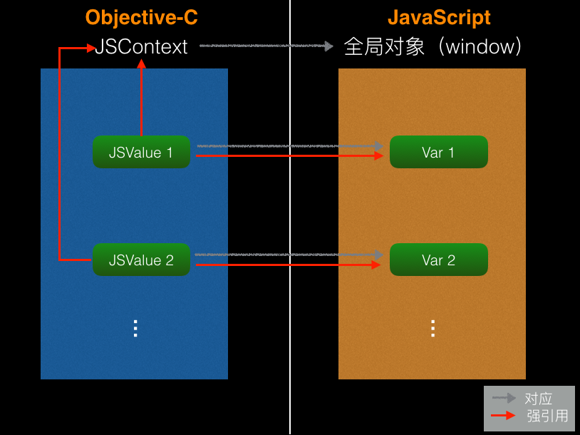
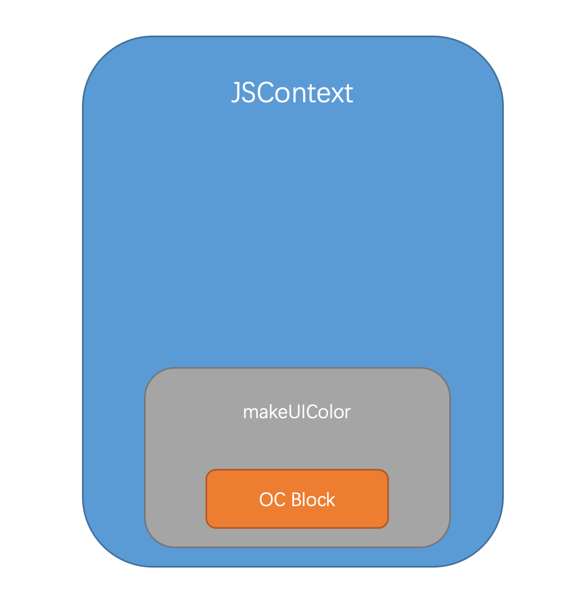
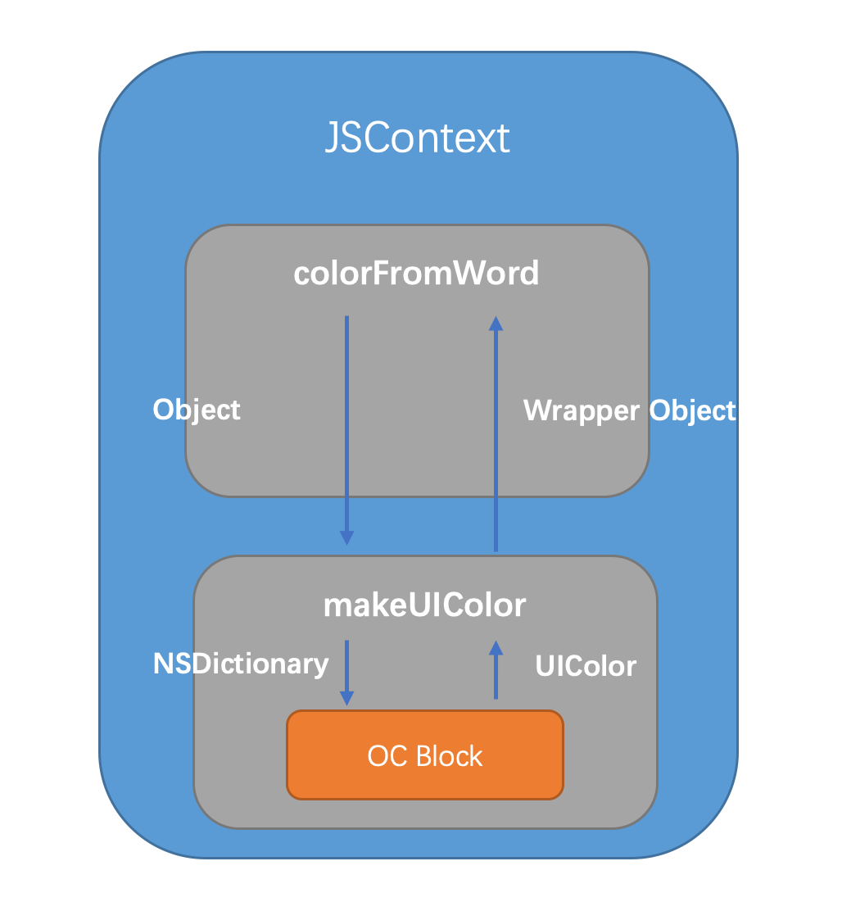
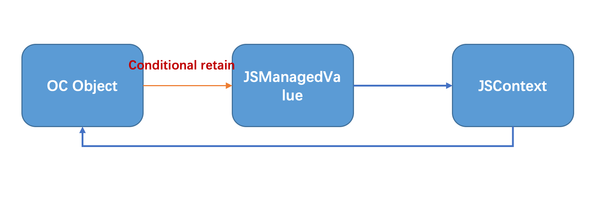

## 前言

在文章的一开始，我想先解释几个开发的名词：`Native`/`Web App`/`Hybrid`/`React Native`/`Weex `

> **Native** App **是**一种基于智能手机本地操作系统如 iOS、Android 等，并使用原生程式编写运行的第三方应用程序，也叫本地 App。 一般使用的**开发**语言为**JAVA**、**C++**、**Objective-C**

>**web **App 是移动端的网站，常被称为**H5**应用，说白了就是特定运行在移动端浏览器上的网站应用。一般泛指 SPA(Single Page Application)模式开发出的网站，与MPA（Multi-page Application）对应。

>**Hybrid**  App 是混合模式移动应用，介于Web App、Native App**这两者之间**的App开发技术，兼具“Native App良好交互体验的优势”和“ Web App 跨平台开发的优势”（百度百科）

>**React Native** 是 Facebook 开源的App开发方案，简称**RN**。使用**JSX**语言写原生界面，**js**通过**jsBridge**调用原生API渲染UI交互通信。

>**weex** 是Alibaba 开源的一套开发方案，团队称借鉴**RN**的优秀案例并有淘宝众多业务实践场景，备受开发者关注。2016年4月正式开源，并在**Vue2.0**版本官方支持**Vue.js**，也就有了人们口中的**Vue Native**。

那么现在看来，开发一款移动应用就有了以上几种优秀的技术方案。而我，作为一个 Native 移动应用开发者而且是一名iOS开发者也应该紧追时代步伐，学习前端开发语言（javascript/css/html），学习前端开发的技术解决方案，诸如 React、Vue 等优秀的技术框架。 

这样一来，我们不难看出，**native 端 js 与 oc（or java）的交互**是`Web App`/`Hybrid`/`React Native`/`Weex `几种方案的**核心**功能模块。这也就是本文着重要讲的地方。

<!--more-->

## 基于 JavaScriptCore 框架 实现 js<->oc

### 简介

`JavaScriptCore框架` 是一个苹果在`iOS7`引入的框架，该框架让` Objective-C` 和` JavaScript` 代码直接的交互变得更加的简单方便。

`JavaScriptCore框架`其实就是基于`webkit`中以`C/C++`实现的`JavaScriptCore`的一个包装即提供了Objective-C的封装接口。在旧版本iOS开发中，很多开发者也会自行将`webkit`编译出`JavaScriptCore.a`库引入项目编译使用。现在iOS7把它当成了标准库。

### oc 与 javascript 交互

#### JSContext

- JSContext 为JS代码的执行提供了上下文环境，通过`jSCore`执行的JS代码都得通过JSContext来执行。
- JSContext 对应于一个 JS 中的全局对象。JSContext对应着一个`全局对象`，相当于浏览器中的`window对象`，JSContext中有一个`GlobalObject`属性，实际上JS代码都是在这个`GlobalObject`上执行的，但是为了容易理解，可以把JSContext等价于全局对象。

#### JSValue

- JSValue 是对 JS 值的包装，就相当于JS 中的 var。

| JavaScript Type | `JSValue` method                           | Objective-C Type                         | Swift Type                            |
| --------------- | ------------------------------------------ | ---------------------------------------- | ------------------------------------- |
| string          | `toString`                                 | `NSString`                               | `String!`                             |
| boolean         | `toBool`                                   | `BOOL`                                   | `Bool`                                |
| number          | `toNumber` `toDouble` `toInt32` `toUInt32` | `NSNumber` `double` `int32_t` `uint32_t` | `NSNumber!` `Double` `Int32` `UInt32` |
| Date            | `toDate`                                   | `NSDate`                                 | `NSDate!`                             |
| Array           | `toArray`                                  | `NSArray`                                | `[AnyObject]!`                        |
| Object          | `toDictionary`                             | `NSDictionary`                           | `[NSObject : AnyObject]!`             |
| Object          | `toObject` `toObjectOfClass:`              | *custom type*                            | *custom type*                         |

- JSValue 存在于 JSContext 中，它必须存在于某一个JSContext中，就像浏览器中所有的元素都包含于`Window对象`中一样，一个JSContext中可以包含多个JSValue。

-  **都是强引用**
   这点很关键，JSValue对其对应的JS值和其所属的JSContext对象都是强引用的关系。因为jSValue需要这两个东西来执行JS代码，所以JSValue会一直持有着它们。下面这张图可以更直观的描述出它们之间的关系：




通过下面这些方法来创建一个JSValue对象：

```objective-c
/*!
@methodgroup Creating JavaScript Values
*/
/*!
@method
@abstract Create a JSValue by converting an Objective-C object.
@discussion The resulting JSValue retains the provided Objective-C object.
@param value The Objective-C object to be converted.
@result The new JSValue.
*/
+ (JSValue *)valueWithObject:(id)value inContext:(JSContext *)context;

/*!
@method
@abstract Create a JavaScript value from a BOOL primitive.
@param context The JSContext in which the resulting JSValue will be created.
@result The new JSValue representing the equivalent boolean value.
*/
+ (JSValue *)valueWithBool:(BOOL)value inContext:(JSContext *)context;

/*!
@method
@abstract Create a JavaScript value from a double primitive.
@param context The JSContext in which the resulting JSValue will be created.
@result The new JSValue representing the equivalent boolean value.
*/
+ (JSValue *)valueWithDouble:(double)value inContext:(JSContext *)context;

/*!
@method
@abstract Create a JavaScript value from an <code>int32_t</code> primitive.
@param context The JSContext in which the resulting JSValue will be created.
@result The new JSValue representing the equivalent boolean value.
*/
+ (JSValue *)valueWithInt32:(int32_t)value inContext:(JSContext *)context;

/*!
@method
@abstract Create a JavaScript value from a <code>uint32_t</code> primitive.
@param context The JSContext in which the resulting JSValue will be created.
@result The new JSValue representing the equivalent boolean value.
*/
+ (JSValue *)valueWithUInt32:(uint32_t)value inContext:(JSContext *)context;

/*!
@method
@abstract Create a new, empty JavaScript object.
@param context The JSContext in which the resulting object will be created.
@result The new JavaScript object.
*/
+ (JSValue *)valueWithNewObjectInContext:(JSContext *)context;

/*!
@method
@abstract Create a new, empty JavaScript array.
@param context The JSContext in which the resulting array will be created.
@result The new JavaScript array.
*/
+ (JSValue *)valueWithNewArrayInContext:(JSContext *)context;

/*!
@method
@abstract Create a new JavaScript regular expression object.
@param pattern The regular expression pattern.
@param flags The regular expression flags.
@param context The JSContext in which the resulting regular expression object will be created.
@result The new JavaScript regular expression object.
*/
+ (JSValue *)valueWithNewRegularExpressionFromPattern:(NSString *)pattern flags:(NSString *)flags inContext:(JSContext *)context;

/*!
@method
@abstract Create a new JavaScript error object.
@param message The error message.
@param context The JSContext in which the resulting error object will be created.
@result The new JavaScript error object.
*/
+ (JSValue *)valueWithNewErrorFromMessage:(NSString *)message inContext:(JSContext *)context;

/*!
@method
@abstract Create the JavaScript value <code>null</code>.
@param context The JSContext to which the resulting JSValue belongs.
@result The JSValue representing the JavaScript value <code>null</code>.
*/
+ (JSValue *)valueWithNullInContext:(JSContext *)context;

/*!
@method
@abstract Create the JavaScript value <code>undefined</code>.
@param context The JSContext to which the resulting JSValue belongs.
@result The JSValue representing the JavaScript value <code>undefined</code>.
*/
+ (JSValue *)valueWithUndefinedInContext:(JSContext *)context;

```


你可以将OC中的类型，转换成JS中的对应的类型（参见前面那个类型对照表），并包装在JSValue中，包括基本类型，`Null`和`undfined`。

或者你也可以创建一个新的对象，数组，正则表达式，错误，这几个方法达到的效果就相当于在JS中写 `var a = new Array();`

也可以将一个OC对象，转成JS中的对象，但是这样转换后的对象中的属性和方法，在JS中是获取不到的，怎样才能让JS中获取的OC对象中的属性和方法，我们后面再说。

#### 实际使用

首先，从`bundle`中加载这段JS代码。 

```javascript
var factorial = function(n) {
    if (n<0) return;
    if (n == 0) return 1;
    return n * factorial(n-1);
};
```

如下代码，实现在oc中调用`factorial`函数

```objective-c
NSString *factorialStr = [self loadJSBundle];
JSContext *context = [[JSContext alloc] init];
JSValue *value = [context evaluateScript:factorialStr];

JSValue *func = context[@"factorial"];
JSValue *result = [func callWithArguements:@[@10]];

```


上述代码，创建一个JSContext，并用他来执行这段JS代码，这句的效果就相当于在一个全局对象中声明了一个叫`fatorial`的函数，但是没有调用它，只是声明，所以执行完这段JS代码后没有返回值。

再从这个全局对象中获取这个函数，这里我们用到了一种类似字典的下标写法来获取对应的JS函数，就像在一个字典中取这个key对应的value一样简单，实际上，JS中的对象就是以 `key : Value` 的形式存储属性的，且JS中的`object对象类型`，对应到OC中就是`字典类型`，所以这种写法自然且合理。

> 这种类似字典的下标方式不仅可以取值，也可以存值。不仅可以作用于Context，也可以作用与JSValue，他会用中括号中填的key值去匹配JSValue包含的JS值中有没有对应的属性字段，找到了就返回，没找到就返回undefined。

然后，我们拿到了包装这个阶乘函数的的JSValue对象，在其上调用`callWithArguments`方法，即可调用该函数，这个方法接收一个数组为参数，这是因为JS中的函数的参数都不是固定的，我们构建了一个数组，并把`NSNumber`类型的10传了过去（ 这里会把NSNumber类型转成JS中number类型）然后再去调用这个函数。

最后，如果函数有返回值，就会将函数返回值返回，如果没有返回值则返回undefined，当然在经过JSCore之后，这些JS中的类型都被包装成了JSValue，最后我们拿到返回的JSValue对象，转成对应的类型并输出。


### javascript 与 oc 交互

JavaScript 与 Objective-C 交互主要通过2种方式：

-  **Block** : 第一种方式是使用block，block也可以称作闭包和匿名函数，使用block可以很方便的将OC中的单个方法暴露给JS调用，具体实现我们稍后再说。
-  **JSExport 协议** : 第二种方式，是使用`JSExport`协议，可以将OC的中某个对象直接暴露给JS使用，而且在JS中使用就像调用JS的对象一样自然。

简而言之，Block是用来暴露单个方法的，而JSExport 协议可以暴露一个OC对象，下面我们详细说一下这两种方式。

#### Block

上面说过，使用Block可以很方便的将OC中的单个方法(即Block)暴露给JS调用，JSCore会自动将这个Block包装成一个JS方法，上代码：

```objective-c
context[@"makeUIColor"] = ^(NSDictionary *rgba) {
    float *r = [color[@"red"] floatValue];
    float *g = [color[@"green"] floatValue];
    float *b = [color[@"blue"] floatValue];
    float *a = [color[@"alpha"] floatValue];
    return [UIColor colorWithRed:r/255.0 green:g/255.0 blue:b/255.0 alpha:a];
}
```


把一个OC Block注入了context中，这个block接收一个NSDictionary类型的参数，并返回了一个`UIColor`类型的对象。JSCore会自动在全局对象中(因为是直接在Context上赋值的，context对应于全局对象)创建一个叫`makeUIColor`的函数，将这个Block包装起来。如图：



然后，在JS中，我们来调用这个暴露过来的block，其实直接调用的是那个封装着Block的`MakeUIColor`方法。

```javascript
var colorFromWord = function(word) {
    if (!colorMap[word]) return;
    return makeUIColor(colorMap[word]);
}

var colorMap = {
    "red": {"red":255, "green":0, "blue": 0},
    "green": {"red":0, "green":255, "blue": 0},
    "blue": {"red":0, "green":0, "blue": 255}
}
```


这里有一个叫`colorFromWord`的JS方法，它接收一个`word`参数，这个`colorMap`是一个JS对象，里面按颜色名字保存着一些色值信息，这些色值信息也是一个个的JS对象，这个`ColorFromWord`函数就是通过颜色名字来取得对应的颜色对象。然后这函数里面调用了`MakeUIColor`方法，并传入从`colorMap`中根据`word`字段取出来的颜色对象，注意这个颜色对象是一个JS对象，是一个`object`类型，但是我们传进来的Block接收的是一个`NSDIctionary`类型的参数啊，不用担心，这时JSCore会自动帮我们把JS对象类型转成`NSDictionary`类型，就像前面那个表里写的一样，`NSDictionary`对应着JS中的`Object`类型。

现在，我们有一个包装着Block的JS函数`makeUIColor`，然后又有一个`colorFromWrod`函数来调用它，具体过程就像这样：



图从左边看起，`colorFromWrod`调用`makeUIColor`，传过去的参数是JS Object类型(从`colorMap`中取出的颜色对象)，JSCore会将这个传过来的`Object`参数转换成`NSDictionary`类型，然后`makeUIColor`用其去调用内部包装的Block，Block返回一个`UIColor(NSObject)`类型的返回值，JScore会将其转换成一个`wrapper Object`(其实也是JS `Object`类型)，返回给`colorFromWrod`。


#### 使用 Block 的坑

使用Block暴露方法很方便，但是有2个坑需要注意一下：

- 不要在Block中直接使用JSValue
- 不要在Block中直接使用JSContext

因为Block会强引用它里面用到的外部变量，如果直接在Block中使用JSValue的话，那么这个JSvalue就会被这个Block强引用，而每个JSValue都是强引用着它所属的那个JSContext的，这是前面说过的，而这个Block又是注入到这个Context中，所以这个Block会被context强引用，这样会造成循环引用，导致**内存泄露**。不能直接使用JSContext的原因同理。

那怎么办呢，针对第一点，建议把JSValue当做参数传到Block中，而不是直接在Block内部使用，这样Block就不会强引用JSValue了。

针对第二点，可以使用`[JSContext currentContext] `方法来获取当前的Context。

#### JSExport 协议

##### 介绍

然后是JS和OC交互的第二种方式：`JSExport 协议`，通过JSExport 协议可以很方便的将OC中的对象暴露给JS使用，且在JS中用起来就和JS对象一样。

```objective-c
#import <JavaScriptCore/JavaScriptCore.h>
@class Car;
@protocol CarExports <JSExport, NSObject>

@property (nonatomic, copy) NSString *name;
@property (nonatomic, copy) NSString *cID;

- (NSString *)description;

+ (MyPoint *)productCarWithName:(NSString *)carName
                          carID:(NSString *)cID;

/**
需要注意的是，OC中的函数声明格式与JS中的不太一样（应该说和大部分语言都不一样。。），OC函数中多个参数是用冒号:声明的，这显然不能直接暴露给JS调用

所以需要对带参数的方法名做一些调整，当我们暴露一个带参数的OC方法给JS时，JSCore会用以下两个规则生成一个对应的JS函数：
1. 移除所有的冒号
2. 将跟在冒号后面的第一个小写字母大写

比如上面的那个类方法，转换之前方法名应该是 productCarWithName:carID:，在JS中生成的对应的方法名就会变成 productCarWithNameCarID。

苹果知道这种不一致可能会逼死某些强迫症。。所以加了一个宏JSExportAs来处理这种情况，它的作用是：给JSCore在JS中为OC方法生成的对应方法指定名字。

比如，还是上面这个方法productCarWithName:carID:，可以这样写：
JSExportAs(productCar,
+ (Car *)productCarWithName:(NSString *)carName carID:(NSString *)cID
);
*/

@end
```

我们在Objective-C中有一个`Car`类，它有两个`NSString`类型的属性，`name` `cID`，一个实例方法`description` 和一个类方法 `productCarWithName:carID:`

如果我们使用JSExport协议把这个类的对象暴露给JS，那么在JS中，我们怎么使用这个暴露过来的JS对象呢？他的属性可以直接调用，就像调用JS对象的属性一样，他的实例方法也可以直接调用，就像调用JS对象中的方法一样，然后他的类方法，也可以直接用某个全局对象直接调用。就像普通的JS一样，但是操作的却是一个OC对象。

```javascript
car.name
car.name = '奔驰'
car.description()

Car.productCarWithNameCarID('宝马','20170727')

// Car.productCar('宝马','20170727')

```

> 注意：**JSExportAs** 这个宏只对**带参数**的OC方法有效。

### 内存管理

我们都知道，Objective-C 用的是`ARC (Automatic Reference Counting)`，不能自动解决循环引用问题(`retain cycle`)，需要程序员手动处理，而JavaScript 用的是`GC (准确的说是 Tracing Garbage Collection)`，所有的引用都是强引用，但是垃圾回收器会帮我解决循环引用问题，JavaScriptCore 也一样，一般来说，大多数时候不需要我们去手动管理内存。

但是下面2种情况需要注意一下：

- **不要在JS中给OC对象增加成员变量**，这句话的意思就是说，当我们将一个OC对象暴露给JS后，就像前面说的使用JSExport协议，我们能想操纵JS对象一样操纵OC对象，但是这时候，不要在JS中给这个OC对象添加成员变量，因为这个动作产生的后果就是，只会在JS中为这个OC对象增加一个额外的成员变量，但是OC中并不会同步增加。所以说这样做并没有什么意义，还有可能造成一些奇怪的内存管理问题。

- **OC对象不要直接强引用JSValue对象**，这句话再说直白点，就是不要直接将一个JSValue类型的对象当成属性或者成员变量保存在一个OC对象中，尤其是这个OC对象还暴露给JS的时候。这样会造成循环引用。


如何解决这个问题呢？分析一下，在这里，我们需要一种弱的引用关系，因为强引用会造成循环引用，但是又不能让这个JSValue因无人引用它而被释放。简而言之就是，弱引用但能保持JSValue不被释放。

于是，苹果提供了一种新的引用关系，叫`conditional retain`，有条件的强引用，通过这种引用就能实现我们前面分析所需要的效果，而`JSManagedValue`就是苹果用来实现`conditional retain`的类。



#### JSManagedValue

这是JSManagedValue的一般使用步骤：

- 首先，用JSValue创建一个JSManagedValue对象，JSManagedValue里面其实就是包着一个JSValue对象，可以通过它里面一个只读的value属性取到，这一步其实是添加一个对JSValue的弱引用。
- 如果只有第一步，这个JSValue会在其对应的JS值被垃圾回收器回收之后被释放，这样效果就和弱引用一样，所以还需要加一步，在虚拟机上为这个JSManagedValue对象添加Owner（这个虚拟机就是给JS执行提供资源的，待会再讲），这样做之后，就给JSValue增加一个强关系，只要以下两点有一点成立，这个JSManagedValue里面包含的JSValue就不会被释放：
  - JSValue对应的JS值没有被垃圾回收器回收
  - Owner对象没有被释放

这样做，就即避免了循环引用，又保证了JSValue不会因为弱引用而被立刻释放。

### 多线程

说多线程之前得先说下另一个类 `JSVirtualMachine`, 它为JavaScript的运行提供了底层资源，有自己独立的堆栈以及垃圾回收机制。

`JSVirtualMachine`还是JSContext的容器，可以包含若干个JSContext，在一个进程中，你可以有多个`JSVirtualMachine`，里面包含着若干个JSContext，而JSContext中又有若干个JSValue。需要注意的是，你可以在同一个`JSVirtualMachine`的不同JSContext中，互相传递JSValue，但是不能再不同的`JSVirtualMachine`中的JSContext之间传递JSValue。这是因为，每个`JSVirtualMachine`都有自己独立的堆栈和垃圾回收器，一个`JSVirtualMachine`的垃圾回收器不知道怎么处理从另一个堆栈传过来的值。

说回多线程，JavaScriptCore提供的API本身就是线程安全的。

你可以在不同的线程中，创建JSValue，用JSContext执行JS语句，但是当一个线程正在执行JS语句时，其他线程想要使用这个正在执行JS语句的JSContext所属的`JSVirtualMachine`就必须得等待，等待前前一个线程执行完，才能使用这个`JSVirtualMachine`。

当然，这个强制串行的粒度是`JSVirtualMachine`，如果你想要在不用线程中并发执行JS代码，可以为不同的线程创建不同`JSVirtualMachine`。

---

---


## 基于 UIWebView/WKWebView 原生控件实现 js<->oc

### Native 直接调用 js

```objective-c

- (nullable NSString *)stringByEvaluatingJavaScriptFromString:(NSString *)script;

- (void)evaluateJavaScript:(NSString *)javaScriptString completionHandler:(void (^ __nullable)(__nullable id, NSError * __nullable error))completionHandler;//WKWebView使用，以下类推)

```


### js 间接调用 Native 的方式：
#### UIWebView

```objective-c

- (BOOL)webView:(UIWebView *)webView shouldStartLoadWithRequest:(NSURLRequest *)request navigationType:(UIWebViewNavigationType)navigationType;

```

这个方法，可以每次在UIWebView进行**重定向URL**的时候，进行触发，只要把一个js调用native的方法包装成一个重定向URL,就可以在本地接收到相应的方法。

#### WKWebView

```objective-c

- (void)webView:(WKWebView *)webView decidePolicyForNavigationAction:(WKNavigationAction *)navigationAction decisionHandler:(void (^)(WKNavigationActionPolicy))decisionHandler;

```

**小结：native可以直接调用js，js将方法包装成重定向请求，使得native截取并分析，执行相应代码。**

---

----


## JavaScriptCore 和 UIWebView 的结合使用

通过上面的demo，应该差不多了解OC如何和JS进行通信。下面我们看看如何对 `UIWebView` 进行操作，我们不再通过URL拦截，我们直接取 `UIWebView` 的 `context`，然后进行对JS操作。

在`UIWebView`的finish的回调中进行获取

```objective-c

- (void)webViewDidFinishLoad:(UIWebView *)webView
{
    self.context = [webView valueForKeyPath:@"documentView.webView.mainFrame.javaScriptContext"];
    
}

```

上面用了私有属性，可能会被苹果给拒了。这边要注意的是每个页面加载完都是一个新的`context`，但是都是同一个`JSVirtualMachine`。如果JS调用OC方法进行操作UI的时候，请注意线程是不是主线程。具体可以参考[iOS引入JavaScriptCore引擎框架](https://segmentfault.com/a/1190000004285316)这篇文章。

## 结尾

文章有点儿长了，文中有不同程度的引用，在参考文献表明。欢迎邮件联系，指正！！！


### 补充 JS 原型链知识

> #### [继承与原型链](https://developer.mozilla.org/zh-CN/docs/Web/JavaScript/Inheritance_and_the_prototype_chain) MDN Web Docs
>
> 对于使用过基于类的语言 (如 Java 或 C++) 的开发人员来说，JavaScript 有点令人困惑，因为它是动态的，并且本身不提供一个 `class` 实现。（在 ES2015/ES6 中引入了 `class` 关键字，但那只是语法糖，JavaScript 仍然是基于原型的）。
>
> 当谈到继承时，JavaScript 只有一种结构：**对象**。每个实例对象（ object ）都有一个私有属性（称之为 `__proto__` ）指向它的构造函数的原型对象（**prototype** ）。该原型对象也有一个自己的原型对象( `__proto__` ) ，层层向上直到一个对象的原型对象为 `null`。根据定义，`null` 没有原型，并作为这个**原型链**中的最后一个环节。
>
> 几乎所有 JavaScript 中的对象都是位于原型链顶端的 [`Object`](https://developer.mozilla.org/zh-CN/docs/Web/JavaScript/Reference/Global_Objects/Object) 的实例。
>
> 尽管这种原型继承通常被认为是 JavaScript 的弱点之一，但是原型继承模型本身实际上比经典模型更强大。例如，在原型模型的基础上构建经典模型相当简单。


> #### JavaScript高级程序设计:
>
> 继承是OO语言中的一个最为人津津乐道的概念。许多OO语言都支持两种继承方式： **接口继承** 和 **实现继承** 。接口继承只继承方法签名，而实现继承则继承实际的方法。由于js中方法没有签名，在`ECMAScript` 中无法实现接口继承。`ECMAScript` 只支持实现继承，而且其 `实现继承` 主要是依靠**原型链**来实现的。
>
> 如果试图引用对象(实例`instance`)的某个属性，会首先在对象内部寻找该属性，直至找不到，然后才在该对象的原型(`instance.prototype`)里去找这个属性。


> 如果让原型对象指向另一个类型的实例.....有趣的事情便发生了。
>
> 即: `constructor1.prototype = instance2`
>
> 鉴于上述游戏规则生效，如果试图引用`constructor1`构造的实例`instance1`的某个属性`p1`:
>
> 1).首先会在`instance1`内部属性中找一遍;
>
> 2).接着会在`instance1.__proto__(constructor1.prototype)`中找一遍，而`constructor1.prototype` 实际上是`instance2`，也就是说在`instance2`中寻找该属性`p1`；
>
> 3).如果`instance2`中还是没有，此时程序不会灰心，它会继续在`instance2.__proto__(constructor2.prototype)`中寻找...直至`Object`的原型对象
>
> > 搜索轨迹:` instance1--> instance2 --> constructor2.prototype…-->Object.prototype`
>
> 这种搜索的轨迹,形似一条长链, 又因`prototype`在这个游戏规则中充当**链接**的作用，于是我们把这种实例与原型的链条称作 **原型链** 。下面有个例子
>
> ```javascript
> function Father(){
> 	this.property = true;
> }
> Father.prototype.getFatherValue = function(){
> 	return this.property;
> }
> function Son(){
> 	this.sonProperty = false;
> }
> //继承 Father
> Son.prototype = new Father(); //Son.prototype被重写，导致Son.prototype.constructor 也一同被重写
> 
> Son.prototype.getSonVaule = function(){
> 	return this.sonProperty;
> }
> var instance = new Son();
> alert(instance.getFatherValue());//true
> 
> /*
> instance实例通过原型链找到了Father原型中的getFatherValue方法.
> 
> 注意: 此时instance.constructor指向的是Father,这是因为Son.prototype中的constructor被重写的缘故.
> */
> ```
>
> 原文见，https://juejin.cn/post/6844903475021627400 作者 路易斯，著作权归作者所有。


## 参考文献

- [JavaScriptCore](https://nshipster.com/javascriptcore/)
- [JavaScriptCore API Reference](https://link.jianshu.com/?t=https://developer.apple.com/reference/javascriptcore?language=objc)
- [深入浅出 JavaScriptCore](https://www.jianshu.com/p/ac534f508fb0)
- [iOS引入JavaScriptCore引擎框架](https://segmentfault.com/a/1190000004285316)
- [iOS中UIWebView与WKWebView、JavaScript与OC交互、Cookie管理看我就够（上）](https://www.jianshu.com/p/ac45d99cf912)

