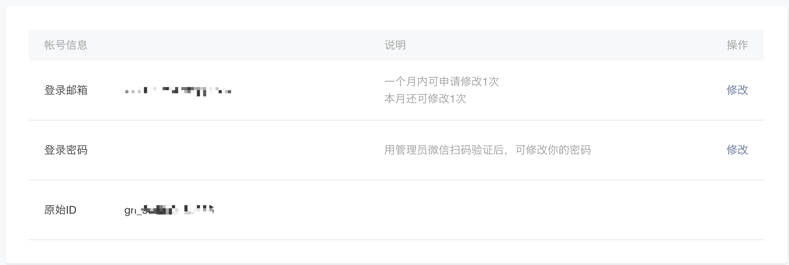
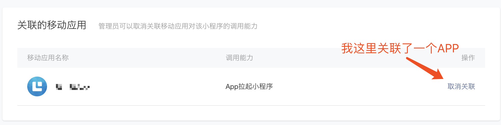

## 移动应用拉起小程序

> 移动应用拉起小程序是指用户可以通过接入该功能的第三方移动应用（APP）跳转至某一微信小程序的指定页面，完成服务后跳回至原移动应用（APP）。ps. 与微信小程序打开APP不同，这个是回调。
> 移动应用拉起小程序功能已向全体开发者开放，开发者在微信开放平台帐号下申请移动应用并通过审核后，即可获得移动应用拉起小程序功能权限。
> 可在**“管理中心-移动应用-应用详情-关联小程序信息”**，为通过审核的移动应用发起关联小程序操作。
> 在同一开放平台账号下的移动应用及小程序无需关联即可完成跳转，非同一开放平台账号下的小程序需与移动应用（APP）成功关联后才支持跳转。
>
> 一个移动应用只能最多同时绑定3个小程序，每月支持绑定3次。同一个小程序可被500个移动应用关联。

<!--more-->

## iOS开发示例

1. 导入 **SDK**

2. `APPDelegate` 中注册 `[WXApi registerApp:@"wxd930ea5d5a258f4f" enableMTA:YES];`

3. 移动应用跳转到小程序示例：

   ```objective-c
   WXLaunchMiniProgramReq *launchMiniProgramReq = [WXLaunchMiniProgramReq object];
   launchMiniProgramReq.userName = userName;  //拉起的小程序的username
   launchMiniProgramReq.path = path;    //拉起小程序页面的可带参路径，不填默认拉起小程序首页
   launchMiniProgramReq.miniProgramType = miniProgramType; //拉起小程序的类型
   return  [WXApi sendReq:launchMiniProgramReq];
   ```

   **回调说明**

   ```objective-c
   -(void)onResp:(BaseResp *)resp 
   {
        if ([resp isKindOfClass:[WXLaunchMiniProgramResp class]])
        {
             NSString *string = resp.extMsg;
             // 对应小程序组件 <button open-type="launchApp"> 中的 app-parameter 属性
        }
   }
   ```

## Android 开发示例

1. 导入 **SDK**

2. 调用接口：`WXLaunchMiniProgram` 移动应用跳转到小程序示例：

   ```java
   String appId = "wxd930ea5d5a258f4f"; // 填应用AppId
   IWXAPI api = WXAPIFactory.createWXAPI(context, appId);
   
   WXLaunchMiniProgram.Req req = new WXLaunchMiniProgram.Req();
   req.userName = "gh_d43f693ca31f"; // 填小程序原始id
   req.path = path;                  //拉起小程序页面的可带参路径，不填默认拉起小程序首页
   req.miniprogramType = WXLaunchMiniProgram.Req.MINIPTOGRAM_TYPE_RELEASE;// 可选打开 开发版，体验版和正式版
   api.sendReq(req);
   ```

   **回调说明**

   WXEntryActivity中

   ```java
   public void onResp(BaseResp resp) {
       if (resp.getType() == ConstantsAPI.COMMAND_LAUNCH_WX_MINIPROGRAM) {
           WXLaunchMiniProgram.Resp launchMiniProResp = (WXLaunchMiniProgram.Resp) resp;
           String extraData =launchMiniProResp.extMsg; //对应小程序组件 <button open-type="launchApp"> 中的 app-parameter 属性
       }
   }
   ```

## 代码之外

- 微信开放平台中，基本信息看准不要填错了
  - `appId`
  - `userName`



- `miniprogramType` 对应 **1**开发版，**2**体验版和**0**正式版
- 你的是否拥有拉起微信小程序的**权限**，**关联**好你要拉起的应用





## 参考文献

- [微信公众平台](https://mp.weixin.qq.com/?token=&lang=zh_CN)

- [App打开小程序及内容安全等能力开放](https://developers.weixin.qq.com/community/develop/doc/000aa032da0fa85b9bc6b88c056001)

- [移动应用拉起小程序](https://open.weixin.qq.com/cgi-bin/showdocument?action=dir_list&t=resource/res_list&verify=1&id=21526646385rK1Bs&token=5d0460853e4058cda3c86f93ad697853eed084be&lang=zh_CN)