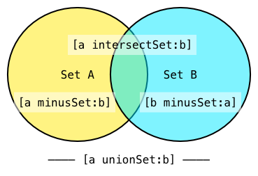

## 前言

上篇文章[iOS集合相关算法知识 - NSArray](https://dnduuhn.com/2018/12/23/iOS%E9%9B%86%E5%90%88%E7%9B%B8%E5%85%B3%E7%AE%97%E6%B3%95%E7%9F%A5%E8%AF%86%EF%BC%88%E4%B8%80%EF%BC%89/) 介绍了`NSArray`，本篇文章将继续介绍 `NSDictionary`和`NSSet`

<!--more-->


## NSDictionary

> A static collection of objects associated with unique keys.

一个与唯一键关联的静态对象集合。

### 性能

> CF-1153.18/CFDictionary.h
>
> Computational Complexity
>
> ​    The access time for a value in the dictionary is guaranteed to be at
>
> ​    worst O(N) for any implementation, current and future, but will
>
> ​    often be O(1) (constant time). Insertion or deletion operations
>
> ​    will typically be constant time as well, but are O(N*N) in the
>
> ​    worst case in some implementations. Access of values through a key
>
> ​    is faster than accessing values directly (if there are any such
>
> ​    operations). Dictionaries will tend to use significantly more memory
>
> ​    than a array with the same number of values.

对于字典中值的访问时间，不管是在现在还是将来，我们保证在任何一种实现下最坏情况是 `O(N)`。但通常来说它会是` O(1) (常数时间)`。**插入和删除**操作一般来说也会是`常数时间`，但是在某些实现中最坏情况将为 `O(N*N)`。**通过键来访问值将比直接访问值要快（如果你有这样的操作要做的话）**。对于同样数目的值，字典需要花费比数组多得多的内存空间。

### 枚举

```objective-c
// Using keysOfEntriesWithOptions:passingTest:,optionally concurrent
NSSet *matchingKeys = [randomDict keysOfEntriesWithOptions:NSEnumerationConcurrent 
                                               passingTest:^BOOL(id key, id obj, BOOL *stop) 
{
    return testObj(obj);
}];
NSArray *keys = matchingKeys.allObjects;
NSArray *values = [randomDict objectsForKeys:keys notFoundMarker:NSNull.null];
__unused NSDictionary *filteredDictionary = [NSDictionary dictionaryWithObjects:values 
                                                                        forKeys:keys];    

// 基于block的枚举(Block-based enumeration.)
NSMutableDictionary *mutableDictionary = [NSMutableDictionary dictionary];
[randomDict enumerateKeysAndObjectsUsingBlock:^(id key, id obj, BOOL *stop) {
    if (testObj(obj)) {
        mutableDictionary[key] = obj;
    }
}];

// NSFastEnumeration
NSMutableDictionary *mutableDictionary = [NSMutableDictionary dictionary];
for (id key in randomDict) {
    id obj = randomDict[key];
    if (testObj(obj)) {
        mutableDictionary[key] = obj;
    }
}

 // NSEnumeration
 NSMutableDictionary *mutableDictionary = [NSMutableDictionary dictionary];
 NSEnumerator *enumerator = [randomDict keyEnumerator];
 id key = nil;
 while ((key = [enumerator nextObject]) != nil) {
       id obj = randomDict[key];
       if (testObj(obj)) {
           mutableDictionary[key] = obj;
       }
 }

// 基于 C 数组(C-based array enumeration via getObjects:andKeys:)
NSMutableDictionary *mutableDictionary = [NSMutableDictionary dictionary];
id __unsafe_unretained objects[numberOfEntries];
id __unsafe_unretained keys[numberOfEntries];
[randomDict getObjects:objects andKeys:keys];
for (int i = 0; i < numberOfEntries; i++) {
    id obj = objects[i];
    id key = keys[i];
    if (testObj(obj)) {
       mutableDictionary[key] = obj;
    }
 }
```


> 测试环境：
>
> MacBook Pro (13-inch, Late 2016, Four Thunderbolt 3 Ports)
>
> ​	2.9 GHz Intel Core i5
>
> ​	8 GB 2133 MHz LPDDR3
>
> ​	MacOS Mojave 10.14.2 
>
> ​		Xcode Version 10.1 (10B61)
>
> ​			Simulator: iPhone XR 

| 过滤/枚举方法                           | Time [ms], 10.000.000 elements | 10.000 elements |
| --------------------------------------- | ------------------------------ | --------------- |
| `keysOfEntriesWithOptions:`, concurrent | 2624.72                        | 2.59            |
| `getObjects:andKeys:`                   | 2034.00                        | 2.06            |
| `keysOfEntriesWithOptions:`             | 2558.24                        | 3.08            |
| `enumerateKeysAndObjectsUsingBlock:`    | 2471.07                        | 2.69            |
| `NSFastEnumeration`                     | 2599.19                        | 2.61            |
| `NSEnumeration`                         | 2886.84                        | 2.61            |


## NSSet

> `NSSet` and its mutable variant `NSMutableSet` are an unordered collection of objects. Checking for existence is usually an O(1) operation, making this much faster for this use case than `NSArray`. `NSSet` can only work efficiently if the hashing method used is balanced; if all objects are in the same hash bucket, then `NSSet` is not much faster in object-existence checking than `NSArray`.

`NSSet` 和它的可变变体 `NSMutableSet` 是无序对象集合。检查一个对象是否存在通常是一个` O(1) `的操作，使得比 `NSArray` 快很多。`NSSet` 只在被使用的哈希方法平衡的情况下能高效的工作；如果所有的对象都在同一个哈希`bucket`，`NSSet` 在查找对象是否存在时并不比 `NSArray` 快多少。

`NSSet` 还有变体 `NSCountedSet`，以及非` toll-free` 计数变体 `CFBag` / `CFMutableBag`。

`NSSet` 会 `retain` 它其中的对象，但是根据 `set `的规定，对象应该是不可变的。添加一个对象到 `set `中随后改变它会导致一些奇怪的问题并破坏` set `的状态。

`NSSet` 的方法比 `NSArray` 少的多。没有排序方法，但有一些方便的枚举方法。重要的方法有 `allObjects`，将对象转化为 `NSArray`，`anyObject` 则返回任意的对象，如果 `set` 为空，则返回` nil`。


### Set 操作

`NSMutableSet` 有几个很强大的方法，例如 `intersectSet:`，`minusSet:` 和 `unionSet:`。




### NSSet 性能特征

苹果在 `CFSet.h`中没有提供任何关于算法复杂度的注释。

> 测试环境：
>
> MacBook Pro (13-inch, Late 2016, Four Thunderbolt 3 Ports)
>
> ​	2.9 GHz Intel Core i5
>
> ​	8 GB 2133 MHz LPDDR3
>
> ​	MacOS Mojave 10.14.2 
>
> ​		Xcode Version 10.1 (10B61)
>
> ​			Simulator: iPhone XR 

| 类 / 时间 [ms]                  | 10.000.000 elements |1.000.000 elements |
| ------------------------------- | ------------------ |------------------ |
| `NSMutableSet`, adding          | 6135.44  | 449.32             |
| `NSMutableArray`, adding        | 1830.98  | 198.44             |
| `NSMutableSet`, random access   | 9.91       |1.50               |
| `NSMutableArray`, random access | 18.95      |1.72               |

这个检测符合我们的预期：`NSSet` 在每一个被添加的对象上执行 `hash` 和 `isEqual:` 方法并管理一系列哈希值，所以在添加元素时耗费了更多的时间。`set`的随机访问比较难以测试，因为这里执行的都是 `anyObject`。


## 参考文献

- [NSArray, NSSet, NSOrderedSet, and NSDictionary](https://www.objc.io/issues/7-foundation/collections/#nsset)
- [基础集合类](https://objccn.io/issue-7-1/)