## 一场技术沙龙-2

### 支付业务架构
ps. *此架构图，是以一个财务角度画的。*

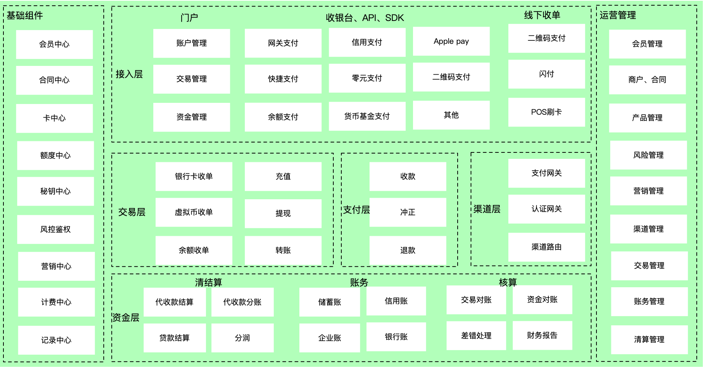

#### 概述

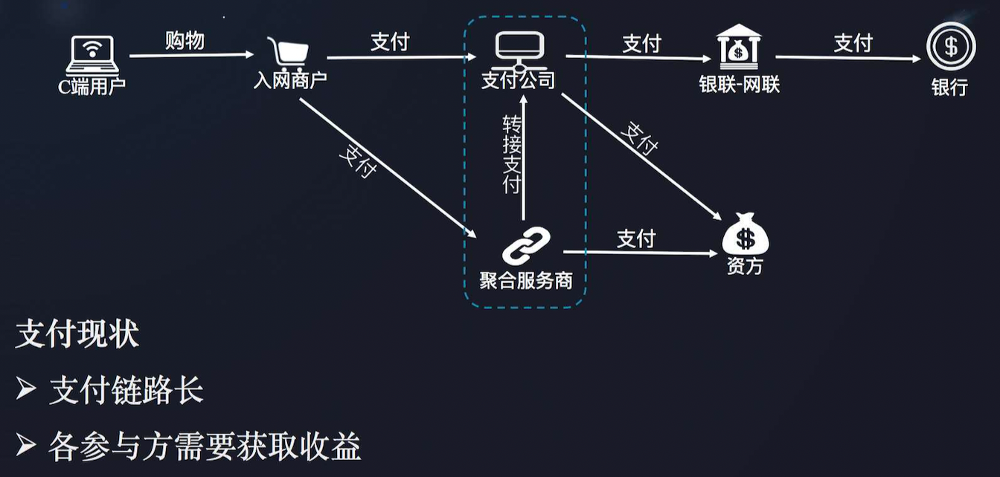

#### 资金层系统关系

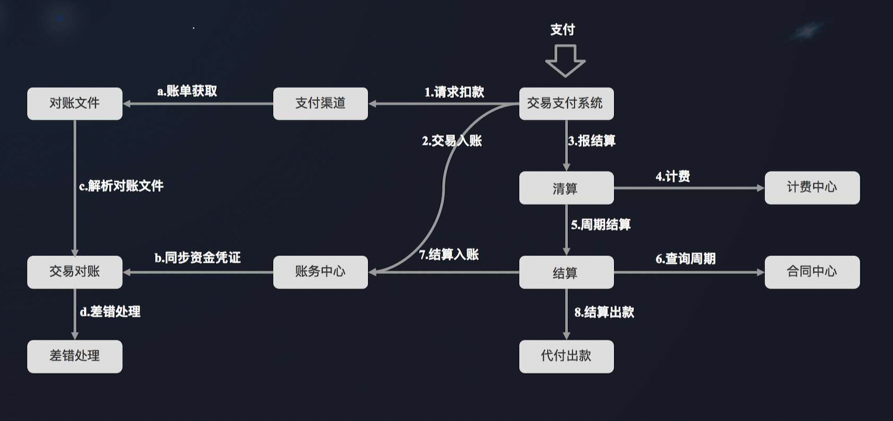

#### 账务系统

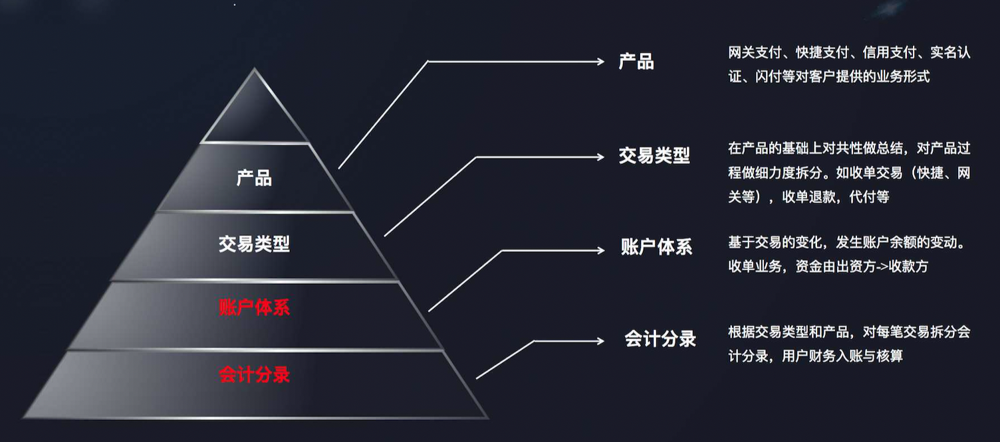

| 胖核心                                                       | 瘦核心                                                       |
| ------------------------------------------------------------ | ------------------------------------------------------------ |
| 账务系统属于交易黄金链路的一环，应该影响所有交易的最终状态。即如果账务系统入账失败，交易应该记失败 | 账务系统部分隶属黄金链路，仅与真实资金和信用额度相关的交易才需要被账务控制，其他交易补入账务系统即可。 |
| 对商户的资金结算依据账务系统交易为依据即结算依据账务流水。   | 账务不直接与商户交互。对商户结算根据业务系统提供成功时间为准。 |
| 账务核算依据账务系统账期为准，对商户和银行的首付款和账务系统账期一致，保证公司内部账务明确。 | 公司内部数据核算依据账期为准，涉外的核算，包括商户手续费，银行成本，代理商等依据业务系统与客户系统的成功时间为准。 |

##### 账户体系

##### 账户组成

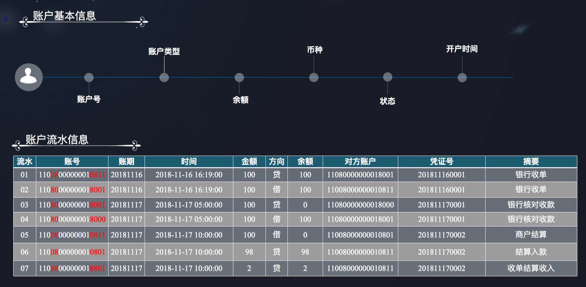

##### 入账实例

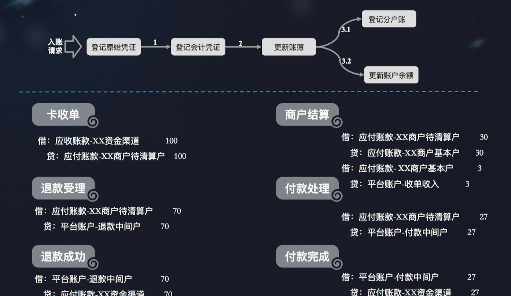

##### 热点账户

**1 热点账户**

>  是指在正常交易过程的某个特定时间段内，出现频次特别高的账户。如果是数据库的异常重试或交易故障的人工恢复等故障处理导致高频，一般不当成热点账户。
>
> 账务处理是避免不了数据库行锁的。如果一次账务处理事务 10ms，对热点账务处理的 tps 最大是 100，一旦超过。频繁的锁竞争会使得数据库性能急剧下降。

**2 热点处置**

热点账户分出款热点和入款热点。

入款热点常用的做法是缓冲入账，将入款交易缓冲，按照一定的处理速度做入账更新，在逐笔缓冲处理仍有压力的情况下，使用汇总缓冲。

出款热点，如果采用缓冲，可能会导致资损，一般不采用，通常有3中处理方式：

#### 对账

> 定义：核对账目，是指在业务和财务核算过程中，为保证账薄的真实、正确、可靠，对账簿中记录的有关数据进行检查和核对的工作。
>
> 目的：保证记录的真实可靠，对检查和核对过程中出现的记录不一致，要根据实际情况进行记录调整，以保证数据的准确。

按业务角度分析，对账包含：勾兑和差错处理两个阶段。

按财务角度分析，对账包含轧账和平账两个阶段。

1. 勾兑|轧账：按照设定条件进行记录作弊检查，并对记录进行勾兑。
2. 处理|平账：对勾兑过程中不相等的情况，通过合法调整编程相等的行为。

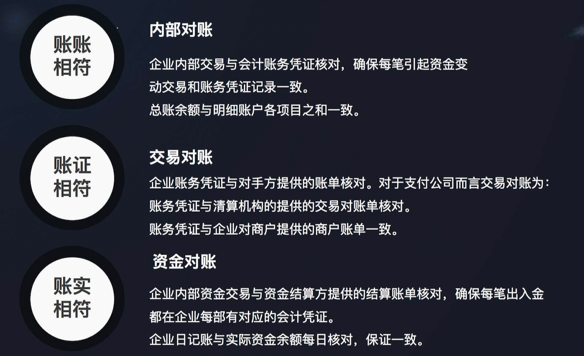

##### 对账功能

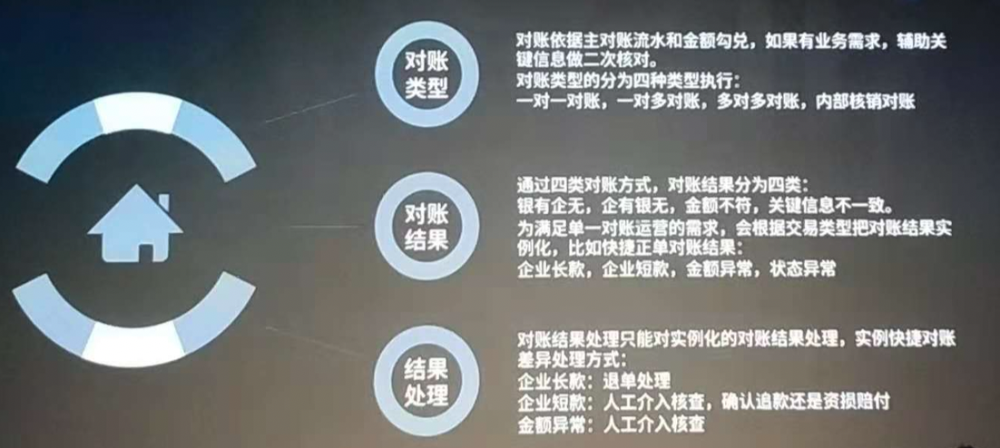

|          | 描述                                                         |                                                              |
| -------- | ------------------------------------------------------------ | ------------------------------------------------------------ |
| 对账类型 | 一对一对账；一对多；多对多；内部核销对账                     | 对账依据主对账流水和金额勾兑，如果有业务需求，辅助关键信息做二次核对。 |
| 对账结果 | 银有企无；企有银无；金额不符；关键信息不一致                 | 为满足单一对账运营的需求，会根据交易类型把对账结果实例化，比如快捷正单对账结果：企业长款，企业短款，金额异常，状态异常。 |
| 结果处理 | 企业长款：退单处理；企业短款：人工接入核查，确认退款还是资损赔付；金额异常：人工接入核查 | 对账结果处理之鞥你对实例化的对账结果处理，实例快捷对账差异处理方式 |

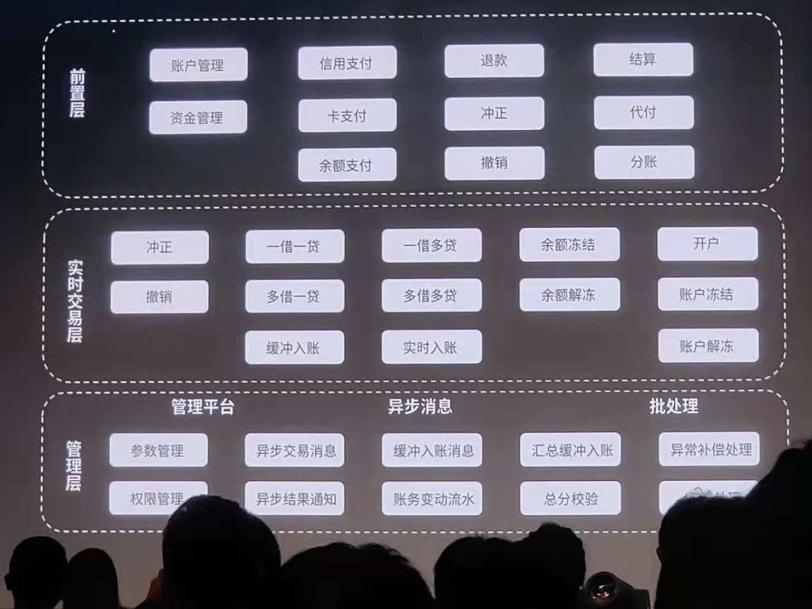

##### 对账流程

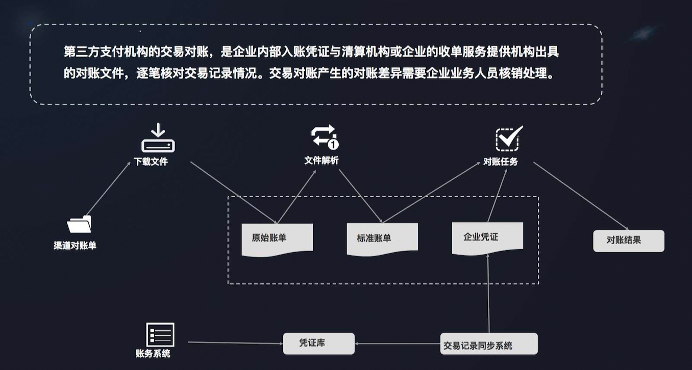

##### 对账实例

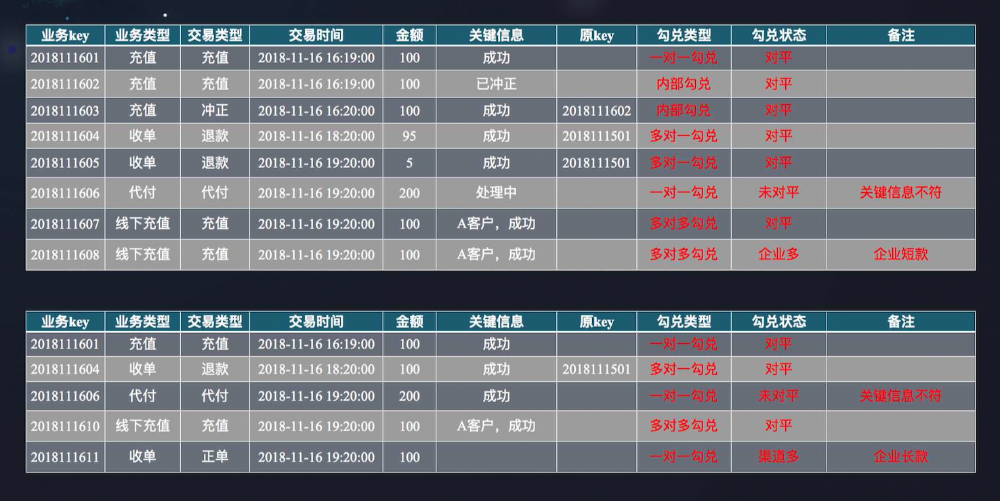

##### 海量数据对账

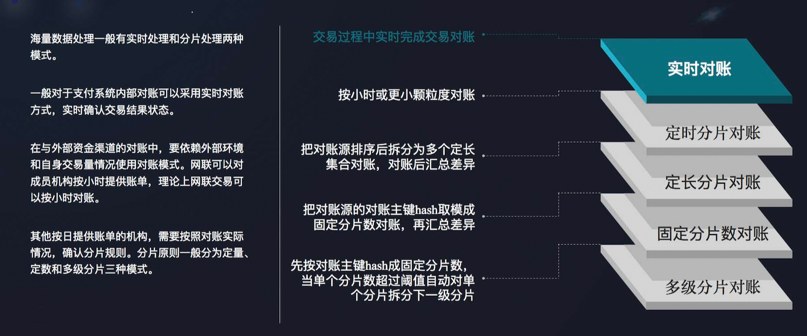

#### 清结算系统

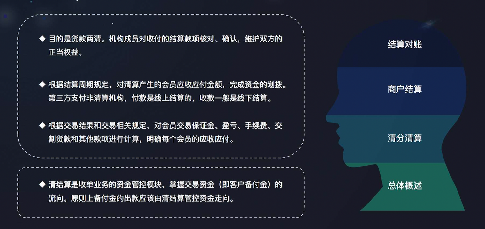

##### 能力

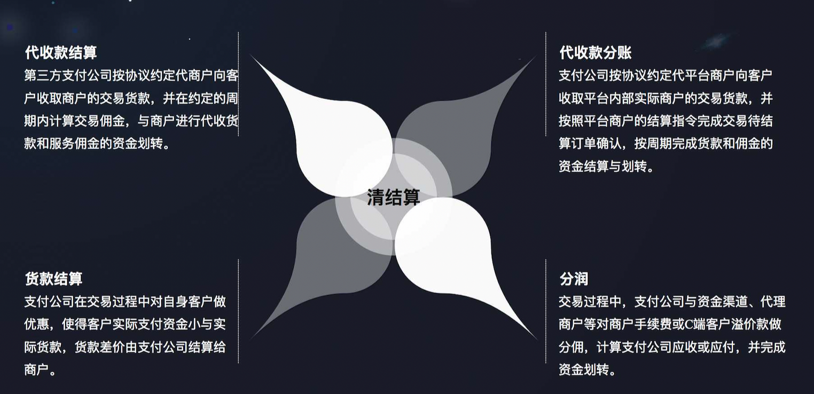

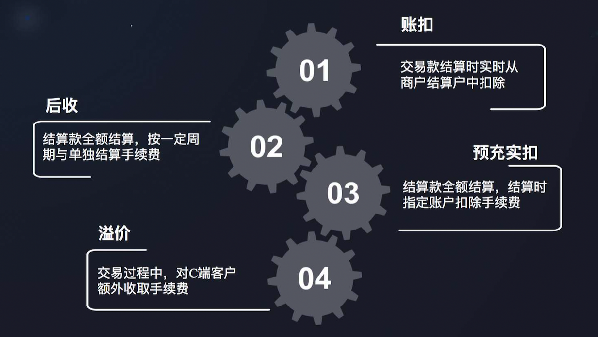

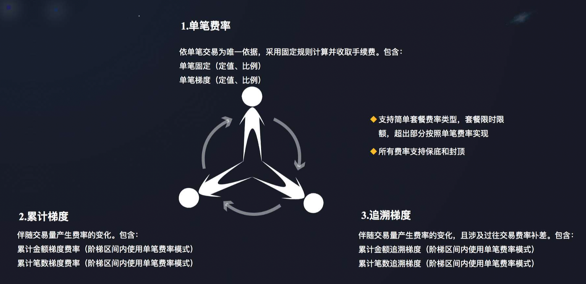

