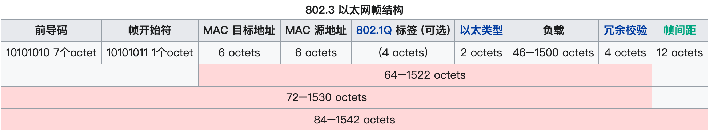
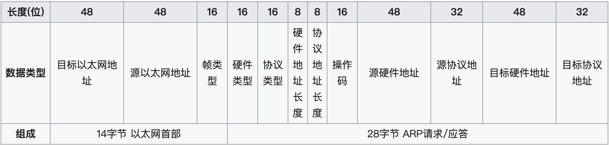

## 互联网协议（二）

上篇文章[互联网协议（一）](./2018-7-23-互联网协议1.md) 聊到了  OSI 网络模型，TCP/IP 还有五层网络模型。

### 局域网通讯

#### 以太网

> **以太网**（英语：Ethernet）是一种[计算机](https://zh.wikipedia.org/wiki/计算机)[局域网](https://zh.wikipedia.org/wiki/局域网)技术。[IEEE](https://zh.wikipedia.org/wiki/IEEE)组织的IEEE 802.3标准制定了以太网的技术标准，它规定了包括[物理层](https://zh.wikipedia.org/wiki/OSI模型)的连线、电子信号和[介质访问控制](https://zh.wikipedia.org/wiki/介质访问控制)的内容。以太网是目前应用最普遍的局域网技术，取代了其他局域网标准如[令牌环](https://zh.wikipedia.org/wiki/令牌环)、[FDDI](https://zh.wikipedia.org/wiki/FDDI)和[ARCNET](https://zh.wikipedia.org/w/index.php?title=ARCNET&action=edit&redlink=1)。
>
> 以太网的标准[拓扑](https://zh.wikipedia.org/wiki/網絡拓撲)结构为[总线型拓扑](https://zh.wikipedia.org/wiki/匯流排拓撲)，但目前的快速以太网（[100BASE-T](https://zh.wikipedia.org/w/index.php?title=100BASE-T&action=edit&redlink=1)、[1000BASE-T](https://zh.wikipedia.org/wiki/1000BASE-T)标准）为了减少冲突，将能提高的网络速度和使用效率最大化，使用[交换机](https://zh.wikipedia.org/wiki/網路交換器)（Switch hub）来进行网络连接和组织。如此一来，以太网的拓扑结构就成了[星型](https://zh.wikipedia.org/wiki/星型网)；但在逻辑上，以太网仍然使用总线型拓扑和[CSMA/CD](https://zh.wikipedia.org/wiki/CSMA/CD)（Carrier Sense Multiple Access/Collision Detection，即载波多重访问/碰撞侦测）的总线技术。

所有的计算机和终端设备都需要通过**网络适配器**连接到局域网中，每一个适配器都有唯一的链路层地址，也被叫做 LAN 地址或者 MAC 地址，MAC 地址被设计成了扁平结构，它们不会随着所处网络的不同而发生改变。

#### MAC 地址

> **MAC地址**（**英语：Media Access Control Address）**，直译为**媒体访问控制地址**，也称为**局域网地址**（LAN Address），**以太网地址**（Ethernet Address）或**物理地址**（Physical Address），它是一个用来确认网络设备位置的地址。在[OSI模型](https://zh.wikipedia.org/wiki/OSI模型)中，第三层网络层负责[IP地址](https://zh.wikipedia.org/wiki/IP地址)，第二层数据链接层则负责MAC地址。MAC地址用于在网络中唯一标示一个[网卡](https://zh.wikipedia.org/wiki/网卡)，一台设备若有一或多个网卡，则每个网卡都需要并会有一个唯一的MAC地址。
>
> MAC地址共48位（6个字节），以[十六进制](https://zh.wikipedia.org/wiki/十六進位)表示。
>
> 第1Bit为广播地址(0)/群播地址(1)，第2Bit为广域地址(0)/区域地址(1)。前3~24位由[IEEE](https://zh.wikipedia.org/wiki/IEEE)决定如何分配给每一家制造商[设备制造商的标识符](https://draveness.me/whys-the-design-non-unique-mac-address/#fn:2)（Organizationally Unique Identifier，OUI），且不重复，后24位由实际生产该网络设备的厂商自行指定（网络接口控制器（Network interface controller, NIC））且不重复。
>
> ff:ff:ff:ff:ff:ff则作为广播地址。
>
> 01:xx:xx:xx:xx:xx是多播地址，01:00:5e:xx:xx:xx是[IPv4](https://zh.wikipedia.org/wiki/IPv4)多播地址。

上述中，两次提到了**唯一**，全球唯一的 MAC 地址是非常理想的情况，但是在实际生活的网络场景中并不需要必须唯一。这个后边介绍。

当设备的网络适配器想要向其他的适配器发送数据帧时，它会将目的适配器的 MAC 地址插入到如下所示的以太网帧：

以太网数据包必须知道 MAC 目标地址，那么一块网卡怎么会知道另一块网卡的 MAC 地址呢？我们又引出一个概念 

#### ARP协议

因为 IP 数据包是放在以太网数据包里发送的，所以我们必须知道两个地址

- MAC 地址
- IP 地址

通常情况下，IP 地址是已知的因为不管是"静态IP地址"还是"动态IP地址"，电脑上网的首要步骤，是确定四个参数：

> - 本机的IP地址
> - 子网掩码
>
> - 网关的IP地址
>
> - DNS的IP地址

ARP 协议就是在已知 IP 的情况下，通过**广播**交换得到 MAC 地址。ARP 协议的原理：

在每台安装有[TCP/IP协议](https://zh.wikipedia.org/wiki/TCP/IP协议)的电脑或路由器里都有一个ARP缓存表，表里的IP地址与MAC地址是一对应的，如下表所示。

| 主机名称 |    IP地址     |      MAC地址      |
| :------: | :-----------: | :---------------: |
|    A     | 192.168.38.10 | 00-AA-00-62-D2-02 |
|    B     | 192.168.38.11 | 00-BB-00-62-C2-02 |
|    C     | 192.168.38.12 | 00-CC-00-62-C2-02 |
|    D     | 192.168.38.13 | 00-DD-00-62-C2-02 |
|    E     | 192.168.38.14 | 00-EE-00-62-C2-02 |
|   ...    |      ...      |        ...        |

以主机A（192.168.38.10）向主机B（192.168.38.11）发送数据为例。

1. 当发送数据时，主机A会在自己的ARP缓存表中寻找是否有目标IP地址。如果找到就知道目标MAC地址为（00-BB-00-62-C2-02），直接把目标MAC地址写入[帧](https://zh.wikipedia.org/wiki/訊框)里面发送就可。
2. 如果在ARP缓存表中没有找到相对应的IP地址，主机A就会在网络上发送一个**广播（ARP request）**，目标MAC地址是“FF.FF.FF.FF.FF.FF”，这表示向同一网段内的所有主机发出这样的询问：“192.168.38.11的[MAC地址](https://zh.wikipedia.org/wiki/MAC地址)是什么？”
3. 网络上其他主机并不响应ARP询问，只有主机B接收到这个帧时，才向主机A做出这样的回应（ARP response）：“192.168.38.11的MAC地址是00-BB-00-62-C2-02”，此回应以**单播**方式。这样，主机A就知道主机B的MAC地址，它就可以向主机B发送信息。同时它还更新自己的ARP高速缓存（ARP cache），下次再向主机B发送信息时，直接从ARP缓存表里查找就可。

ARP缓存表采用**老化机制**，在一段时间内如果表中的某一行没有使用，就会被删除，这样可减少缓存表的长度，加快查询速度。

> #### 拓展：
>
> 1.为什么不需要唯一？2.同一局域网中 MAC 地址可以相同吗？
>
> 答案来自：[为什么 MAC 地址不需要全球唯一](https://draveness.me/whys-the-design-non-unique-mac-address/)
>
> 1. 原因如下：
>
> - MAC 地址可以通过软件进行修改，而第三方的山寨厂商不会在 IEEE 中申请独立的 MAC 地址段，它们也可能会盗用其他厂商申请的 MAC 地址；
> - 保证 MAC 地址在局域网中唯一就不会造成网络问题，不同局域网中的 MAC 地址可以相同；
>
> 2. 在局域网中我们一般会使用集线器（Hub）或者交换机（Switch）来连接不同的网络设备。因为在集线器连接的局域网中，所有的数据帧都会被广播给局域网内的全部主机，所以使用相同的 MAC 地址一般也不会出现太多的问题；但是交换机会学习局域网中不同设备的 MAC 地址并将数据帧转发给特定主机，所以如果局域网是由交换机构成的，就会影响网络的通信。
>
> 假设局域网中的具有两台 MAC 地址完全相同的网络设备 A 和 B，即 `6e:77:0f:b8:8b:6b`，当设备 A 想要向设备 B 发送以太网帧时会遇到如下所示的情况：
>
> 1. 设备 A 在构造的以太网帧中将源地址和目的地址都设置为 `6e:77:0f:b8:8b:6b` 并向交换机发送数据；
> 2. 交换机接收到了设备 A 发送的数据帧后，会从数据帧的源地址学习到设备 A 的 MAC 地址并将 `6e:77:0f:b8:8b:6b -> A` 这条记录插入本地缓存中；
> 3. 交换机发现收到数据帧的目的地址会指向了网络设备 A，所以它会将该数据转发回 A；
>
> 因为交换机的 MAC 地址学习策略，所以我们不能在同一个局域网中使用相同的 MAC 地址，但是因为 MAC 地址是链路层网络中的概念，跨局域网的网络传输需要通过网络层的 IP 协议，所以在不同的局域网中使用相同的 MAC 地址就不存在类似的问题了。

#### 小结

局域网中的数据传输不是通过网络层的 IP 地址进行路由和转发的。通过上述有了数据包的定义、网卡的MAC地址、广播的发送方式，"链接层"就可以在多台计算机之间传送数据了。

## 参考文献

- [地址解析协议 ARP(Address Resolution Protocol)](https://zh.wikipedia.org/wiki/%E5%9C%B0%E5%9D%80%E8%A7%A3%E6%9E%90%E5%8D%8F%E8%AE%AE)
- [以太网帧格式](https://zh.wikipedia.org/wiki/%E4%BB%A5%E5%A4%AA%E7%BD%91%E5%B8%A7%E6%A0%BC%E5%BC%8F)
- Organizationally Unique Identifier Vendor List http://standards-oui.ieee.org/oui.txt [↩︎](https://draveness.me/whys-the-design-non-unique-mac-address/#fnref:2)
- [RFC Editor](https://www.rfc-editor.org/)
- [tools.ietf.org](https://tools.ietf.org/)

- [RFC](https://zh.wikipedia.org/wiki/RFC) (Requests for Comments )

  - | RFC [826](https://tools.ietf.org/html/rfc826) | [ARP](https://zh.wikipedia.org/wiki/ARP)     |
    | --------------------------------------------- | -------------------------------------------- |
    | RFC [894](https://tools.ietf.org/html/rfc894) | IP over Ethernet                             |
    | RFC [791](https://tools.ietf.org/html/rfc791) | [IP](https://zh.wikipedia.org/wiki/网际协议) |
    | RFC [792](https://tools.ietf.org/html/rfc792) | [ICMP](https://zh.wikipedia.org/wiki/ICMP)   |