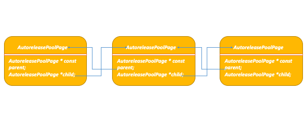

## 背景

> 老大：咱们的手势页面有卡顿问题，查一下原因吧！
>
> 我：好的，收到。

问题解决了，但是涉及到的知识点 `Autorelease Pool` 往大了说，就是内存管理这块知识。是时候花时间梳理一番。

<!--more-->

贴一下问题代码：

```objective-c
- (UIImage *)imageWithColor:(UIColor *)color size:(CGSize)size{
    CGRect rect = CGRectMake(0.0f, 0.0f, size.width, size.height);
    UIGraphicsBeginImageContext(rect.size);
    CGContextRef context = UIGraphicsGetCurrentContext();

    CGContextSetFillColorWithColor(context, [color CGColor]);
    CGContextFillRect(context, rect);

    UIImage *image = UIGraphicsGetImageFromCurrentImageContext();
    UIGraphicsEndImageContext();

    return image;
}
```

有问题吗？单拎出来代码实则没问题，我只加了两行代码：

```objective-c
- (UIImage *)imageWithColor:(UIColor *)color size:(CGSize)size{
    @autoreleasepool {
        // ...
    }
}
```

问题解决了，我们先来分析一下 **Autorelease Pool**

---

---

## Autorelease Pool

> An autorelease pool stores objects that are sent a `release` message when the pool itself is drained.

### @autoreleasepool

下面，请看这块代码你一定不陌生，而且我们清楚地看到了`@autoreleasepool{}`

```objective-c
/**
 * main.m
 */
#import <UIKit/UIKit.h>
#import "AppDelegate.h"

int main(int argc, char * argv[]) {
    @autoreleasepool {
        return UIApplicationMain(argc, argv, nil, NSStringFromClass([AppDelegate class]));
    }
}
```

我们对`main.m`执行如下

```shell
➜  ~ clang -rewrite-objc
```

结果:

```shell
xxx/main.m
warning: include path for stdlibc++ headers not found; pass '-std=libc++' on the command line to use the
      libc++ standard library instead [-Wstdlibcxx-not-found]
xxx/main.m:9:9: fatal error:
      'UIKit/UIKit.h' file not found
#import <UIKit/UIKit.h>
        ^~~~~~~~~~~~~~~
1 warning and 1 error generated.
```

警告暂且不管他，错误就必须处理了。首先确保你的Xcode 装了命令行开发工具，没装的话执行：

```shell
➜  xxx git:(xxx) ✗ xcode-select --install
xcode-select: note: install requested for command line developer tools
```

然后

```shell
➜  xxx git:(xxx) ✗ xcrun -sdk iphonesimulator clang -rewrite-objc main.m
warning: include path for stdlibc++ headers not found; pass '-std=libc++' on the command line to use the libc++ standard library instead [-Wstdlibcxx-not-found]
1 warning generated.
warning: include path for stdlibc++ headers not found; pass '-std=libc++' on the command line to use the libc++ standard library instead [-Wstdlibcxx-not-found]
/var/folders/kw/y2lcj6g90xn8_6xpmh0v87rr0000gn/T/main-8e06ea.mi:35843:9: warning: 'EAGLContext' is deprecated: first deprecated in iOS 12.0 - OpenGLES API deprecated. (Define
      GLES_SILENCE_DEPRECATION to silence these warnings) [-Wdeprecated-declarations]
typedef EAGLContext *CVEAGLContext;
        ^
/var/folders/kw/y2lcj6g90xn8_6xpmh0v87rr0000gn/T/main-8e06ea.mi:33777:12: note: 'EAGLContext' has been explicitly marked deprecated here
@interface EAGLContext : NSObject
           ^
2 warnings generated.
```

生成了一大堆警告之后，当前目录下多了一个 `main.cpp` 文件，摘录部分如下：

```c++
int main(int argc, char * argv[]) {
    /* @autoreleasepool */ { __AtAutoreleasePool __autoreleasepool; 
        return UIApplicationMain(argc, argv, __null, NSStringFromClass(((Class (*)(id, SEL))(void *)objc_msgSend)((id)objc_getClass("AppDelegate"), sel_registerName("class"))));
    }
}
static struct IMAGE_INFO { unsigned version; unsigned flag; } _OBJC_IMAGE_INFO = { 0, 2 };
```


```c++
extern "C" __declspec(dllimport) void * objc_autoreleasePoolPush(void);
extern "C" __declspec(dllimport) void objc_autoreleasePoolPop(void *);

struct __AtAutoreleasePool {
  __AtAutoreleasePool() {atautoreleasepoolobj = objc_autoreleasePoolPush();}
  ~__AtAutoreleasePool() {objc_autoreleasePoolPop(atautoreleasepoolobj);}
  void * atautoreleasepoolobj;
};
```

到目前为止，我们可以写出如下 `main.m`伪代码：

```objective-c
int main(int argc, const char * argv[]) {
    {
        void * atautoreleasepoolobj = objc_autoreleasePoolPush();

        // code block

        objc_autoreleasePoolPop(atautoreleasepoolobj);
    }
    return 0;
}
```


### Autorelease Pool 原理分析

- 自动释放池是由 `AutoreleasePoolPage` 以**双向链**表的方式实现的
- 当对象调用 `autorelease` 方法时，会将对象加入 `AutoreleasePoolPage` 的栈中
- 调用 `AutoreleasePoolPage::pop` 方法会向栈中的对象发送释放消息



#### AutoreleasePoolPage

[objc4-723](https://opensource.apple.com/tarballs/objc4/)/runtime/NSObject.mm

```c++
class AutoreleasePoolPage 
{
    // EMPTY_POOL_PLACEHOLDER is stored in TLS when exactly one pool is 
    // pushed and it has never contained any objects. This saves memory 
    // when the top level (i.e. libdispatch) pushes and pops pools but 
    // never uses them.
#   define EMPTY_POOL_PLACEHOLDER ((id*)1)

#   define POOL_BOUNDARY nil
    static pthread_key_t const key = AUTORELEASE_POOL_KEY;
    static uint8_t const SCRIBBLE = 0xA3;  // 0xA3A3A3A3 after releasing
    static size_t const SIZE = 
#if PROTECT_AUTORELEASEPOOL
        PAGE_MAX_SIZE;  // must be multiple of vm page size
#else
        PAGE_MAX_SIZE;  // size and alignment, power of 2
#endif
    static size_t const COUNT = SIZE / sizeof(id);

    magic_t const magic;
    id *next;
    pthread_t const thread;
    AutoreleasePoolPage * const parent;
    AutoreleasePoolPage *child;
    uint32_t const depth;
    uint32_t hiwat;
    // ...
```

- `magic` 用于对当前 `AutoreleasePoolPage` **完整性**的校验
- `thread` 保存了当前页所在的线程
- 上面的`id *next`指针作为游标指向栈顶最新`add`进来的`autorelease`对象的下一个位置
- `thread` 指向当前线程
- `parent`指向父结点，第一个结点的 parent 值为`nil`
- `child`指向子结点，最后一个结点的 child 值为 `nil`
- `depth`代表深度，从 0 开始，往后递增 1
- 当 `next == begin()` 时，表示 AutoreleasePoolPage 为空；当 `next == end()` 时，表示 AutoreleasePoolPage 已满。
- 一个`AutoreleasePoolPage`的空间被占满时，会新建一个`AutoreleasePoolPage`对象，连接链表，后来的`autorelease`对象在新的`page`加入
- 每一个` AutoreleasePoolPage` 的大小都是 `4096` 字节（16 进制 0x1000）

```c++
#define I386_PGBYTES		4096		/* bytes per 80386 page */
#define PAGE_SIZE I386_PGBYTES
```

这一部分，可以移步看下这篇文章[黑幕背后的Autorelease](http://blog.sunnyxx.com/2014/10/15/behind-autorelease/) 我在这里不再赘述。


## Autorelease Pool 中的对象何时释放

> The Application Kit creates an autorelease pool on the main thread at the beginning of every cycle of the event loop, and drains it at the end, thereby releasing any autoreleased objects generated while processing an event

这里又涉及到了 `runLoop`的知识，因为篇幅问题暂且不做展开。

苹果文档中说，在开始每一个事件循环之前系统会在主线程创建一个自动释放池, 并且在事件循环结束的时候把前面创建的释放池释放, 回收内存。

### Autorelease 对象延迟释放

正因为自动释放池中的对象是在一个事件运行循环结束的时候才释放，所以可以达到延迟释放对象的效果。这样一来，有利的方面是，可以**降低内存峰值**。尤其是写循环，循环里面包含了大量临时创建的对象时体现的尤为明显。

```objective-c
NSArray *urls = <# An array of file URLs #>;
for (NSURL *url in urls) {
 
    @autoreleasepool {
        NSError *error;
        NSString *fileContents = [NSString stringWithContentsOfURL:url
                                         encoding:NSUTF8StringEncoding error:&error];
        /* Process the string, creating and autoreleasing more objects. */
    }
}
```


### Autorelease 对象提前释放

自己创建`Pool`并进行释放

```objective-c
NSAutoreleasePool *pool = [[NSAutoreleasePool alloc] init];
NSArray *array = [[[NSArray alloc] init] autorelease];
[pool drain];
```

上面的`array`就会在`[pool drain]`执行时被释放。


## Autorelease Pool 怎么用起来

以下内容参考文档[NSAutoreleasePool](https://developer.apple.com/documentation/foundation/nsautoreleasepool#//apple_ref/occ/cl/NSAutoreleasePool)和[Using Autorelease Pool Blocks](https://developer.apple.com/library/archive/documentation/Cocoa/Conceptual/MemoryMgmt/Articles/mmAutoreleasePools.html)大家也可以直接阅读文档。

### 1. NSAutoReleasePool(MRC)

#### 管理自动释放池

```objc
- release // Releases and pops the receiver.
```

```objc
/*
In a reference-counted environment, releases and pops the receiver; in a garbage-collected environment, triggers garbage collection if the memory allocated since the last collection is greater than the current threshold.
*/
- drain 
```

```objc
- autorelease // Raises an exception.
```

```objc
- retain // Raises an exception.
```

#### 往自动释放池添加对象

```objc
+ addObject: // Adds a given object to the active autorelease pool in the current thread.
```

```objc
- addObject: // Adds a given object to the receiver
```

#### 调试

```objc
+ showPools // Displays the state of the current thread's autorelease pool stack to stderr.
```


### 2. 使用Autorelease Pool Blocks(MRC和ARC)

```objective-c
@autoreleasepool {
    // Code that creates autoreleased objects.
}
```

可以嵌套：

```objective-c
@autoreleasepool {
    // . . .
    @autoreleasepool {
        // . . .
    }
    . . .
}
```

使用场景：

> There are, however, three occasions when you might use your own autorelease pool blocks:
>
> - If you are writing a program that is not based on a UI framework, such as a command-line tool.
>
> - If you write a loop that creates many temporary objects.
>
>   You may use an autorelease pool block inside the loop to dispose of those objects before the next iteration. Using an autorelease pool block in the loop helps to reduce the maximum memory footprint of the application.
>
> - If you spawn a secondary thread.
>
>   You must create your own autorelease pool block as soon as the thread begins executing; otherwise, your application will leak objects. (See [Autorelease Pool Blocks and Threads](https://developer.apple.com/library/archive/documentation/Cocoa/Conceptual/MemoryMgmt/Articles/mmAutoreleasePools.html#//apple_ref/doc/uid/20000047-1041876)for details.)


- 写基于命令行的的程序时，就是没有`UI`框架，如`AppKit`等`Cocoa`框架时。
- 写循环，循环里面包含了大量临时创建的对象。（本文的例子）
- 创建了新的线程。（非`Cocoa`程序创建线程时才需要）
- 长时间在后台运行的任务。


## Autorelease Pool 与 线程

每一个线程(包括主线程)都有一个`NSAutoreleasePool Stack`。 当一个新的`pool`被创建的时候，`push`进栈。当`pool`被释放内存时， `pop`出栈。 对象调用`autorelease`方法进入栈顶的`pool`中。当线程结束的时候，它会自动地销毁掉所有跟它有关联的`pool`。


## 参考文献

- [黑幕背后的Autorelease](http://blog.sunnyxx.com/2014/10/15/behind-autorelease/)

- [Objective-C Autorelease Pool 的实现原理](http://blog.leichunfeng.com/blog/2015/05/31/objective-c-autorelease-pool-implementation-principle/)

- [NSAutoreleasePool](https://developer.apple.com/documentation/foundation/nsautoreleasepool#//apple_ref/occ/cl/NSAutoreleasePool)

- [Using Autorelease Pool Blocks](https://developer.apple.com/library/archive/documentation/Cocoa/Conceptual/MemoryMgmt/Articles/mmAutoreleasePools.html)