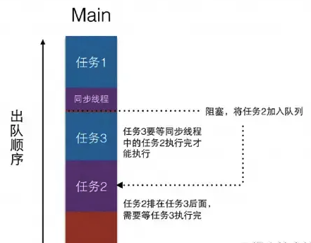
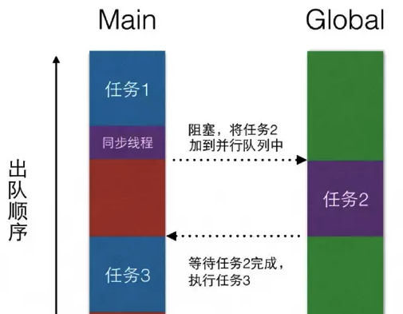
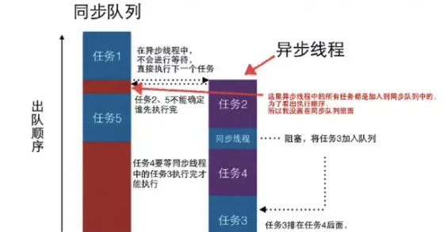
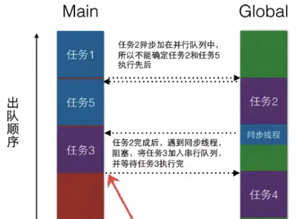
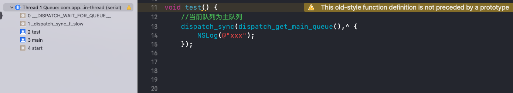
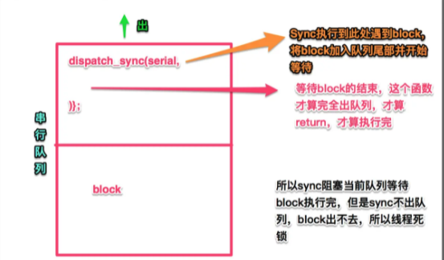

在[iOS 多线程编程知识整理](https://dnduuhn.com/2018/12/02/iOS-%E5%A4%9A%E7%BA%BF%E7%A8%8B%E7%BC%96%E7%A8%8B%E7%9F%A5%E8%AF%86%E6%95%B4%E7%90%86/)一篇文章中，文章结尾留了个小尾巴--**线程安全**。那么什么是线程安全呢？

> 维基百科，自由的百科全书
>
> **线程安全**是[编程](https://zh.wikipedia.org/wiki/%E7%BC%96%E7%A8%8B)中的术语，指某个[函数](https://zh.wikipedia.org/wiki/%E5%87%BD%E6%95%B0_(%E8%AE%A1%E7%AE%97%E6%9C%BA%E7%A7%91%E5%AD%A6))、[函数库](https://zh.wikipedia.org/wiki/%E5%87%BD%E6%95%B0%E5%BA%93)在[多线程](https://zh.wikipedia.org/wiki/%E5%A4%9A%E7%BA%BF%E7%A8%8B)环境中被调用时，能够正确地处理多个[线程](https://zh.wikipedia.org/wiki/%E7%BA%BF%E7%A8%8B)之间的[共享变量](https://zh.wikipedia.org/w/index.php?title=%E5%85%B1%E4%BA%AB%E5%8F%98%E9%87%8F&action=edit&redlink=1)，使程序功能正确完成。
>
> 一般来说，线程安全的函数应该为每个调用它的线程分配专门的空间，来储存需要单独保存的状态（如果需要的话），不依赖于“[线程惯性](https://zh.wikipedia.org/wiki/%E7%BA%BF%E7%A8%8B%E6%83%AF%E6%80%A7)”，把多个线程共享的变量正确对待（如，通知编译器该[变量](https://zh.wikipedia.org/wiki/%E5%8F%98%E9%87%8F_(%E7%A8%8B%E5%BA%8F%E8%AE%BE%E8%AE%A1))为“易失（`volatile`）”型，阻止其进行一些不恰当的优化），而且，线程安全的[函数](https://zh.wikipedia.org/wiki/%E5%87%BD%E6%95%B0)一般不应该修改全局对象。
>
> 很多**C**库代码（比如某些`strtok`的实现，它将“多次调用中需要保持不变的状态”储存在静态变量中，导致不恰当的共享）不是线程安全的，在[多线程](https://zh.wikipedia.org/wiki/%E5%A4%9A%E7%BA%BF%E7%A8%8B)环境中调用这些函数时，要进行特别的预防措施，或者寻找别的替代方案。

<!--more-->

## 什么是线程安全

### 线程安全的定义

维基百科的定义，并没有让我很懂。在**《Java Concurrency In Practice》**我觉得解释的很严谨，原文如下：

> **Chapter 2.1. What is Thread Safety?**
>
> A class is thread‐safe if it behaves correctly when accessed from multiple threads, regardless of the scheduling or
> interleaving of the execution of those threads by the runtime environment, and with no additional synchronization or
> other coordination on the part of the calling code.

多个线程访问一个类时，如果不用考虑这些线程在运行时环境下的调度和交替执行，也不需要进行额外的同步，或者在调用方进行任何其它的协调操作，调用这个类的行为都可以获得正确的结果，那这个类就是线程安全的。

### 如何保证线程安全

还是来自**《Java Concurrency In Practice》**这本书

> If multiple threads access the same mutable state variable without appropriate synchronization, your program is broken. There are three ways to fix it: 
>
> - Don't share the state variable across threads; 
> - Make the state variable immutable; or 
> - Use synchronization whenever accessing the state variable. 

然而，如果你一开始没有考虑类设计中的并发访问，那么上述的3条解决办法恐怕不能解决根本问题。

> When designing thread‐safe classes, good object‐oriented techniques ‐ encapsulation, immutability, and clear
> specification of invariants ‐ are your best friends.

所以，设计一个线程安全的类要比为了以后的线程安全而改进它要容易得多。

> We may talk about thread safety as if it were about code, but what we are really trying to do is protect data from uncontrolled concurrent access. 

我们谈论线程安全通常可能会认为是代码层面的事情，其实我们真正想要做的是保护数据避免不受控制的并发访问。

**所以，要保证数据安全，首先要从类的设计上考虑并发访问的情况，其次才是代码层面的编程。**

## iOS 多线程编程保证线程安全实战

iOS 多线程编程中有以下多种方式来保证线程安全：

- @synchronized
- dispatch_semaphore
- NSLock
- NSConditionLock
- NSRecursiveLock
- NSCondition
- pthread_mutex
- OSSpinLock


### @synchronized

```objective-c
dispatch_async(queue, ^{
    @synchronized(self) {
        sleep(2);
        NSLog(@"线程1");
    }
    NSLog(@"线程1后续操作");
});
    
dispatch_async(queue, ^{
    sleep(1);
    @synchronized(self) {
        NSLog(@"线程2");
    }
});
/*
打印如下：
线程1
线程1后续操作
线程2
*/
```

`@synchronized(object) `指令使用的 `object` 为该锁的唯一标识，只有当标识相同时，才满足互斥。

所以如果线程 2 中的 `@synchronized(self) `改为`@synchronized(self.view)`，则线程2就不会被阻塞，`@synchronized `指令实现锁的优点就是我**不需要**在代码中**显式的创建锁对象**，便可以实现锁的机制，但作为一种预防措施，`@synchronized` 块会隐式的添加一个异常处理例程来保护代码，该处理例程会在异常抛出的时候自动的释放互斥锁。`@synchronized` 有一个好处就是不用担心忘记解锁。

*需要注意的两点：*
- 如果在 `@sychronized(object){}` 内部` object` 被释放或被设为` nil`，没有问题，但如果 `object` 一开始就是` nil`，则失去了锁的功能。
- `@synchronized([NSNull null])` 有效

### dispatch_semaphore

在[iOS 多线程编程知识整理](https://dnduuhn.com/2018/12/02/iOS-%E5%A4%9A%E7%BA%BF%E7%A8%8B%E7%BC%96%E7%A8%8B%E7%9F%A5%E8%AF%86%E6%95%B4%E7%90%86/)一篇文章中有介绍不再赘述。

### NSLock

```objective-c
/*Foundation/NSLock.h*/
@protocol NSLocking

- (void)lock;
- (void)unlock;

@end

@interface NSLock : NSObject <NSLocking> {
@private
    void *_priv;
}

- (BOOL)tryLock;
- (BOOL)lockBeforeDate:(NSDate *)limit;

@property (nullable, copy) NSString *name API_AVAILABLE(macos(10.5), ios(2.0), watchos(2.0), tvos(9.0));

@end
```

```objective-c
//主线程中
NSLock *lock = [[NSLock alloc] init];

//线程1
dispatch_async(queue, ^{
    [lock lock];// 加锁成功
    NSLog(@"线程1");
    sleep(2);
    [lock unlock]; // 解锁
    NSLog(@"线程1解锁成功");
});

//线程2
dispatch_async(queue, ^{
    sleep(1); // 以保证让线程2的代码后执行
    [lock lock]; // 加锁失败，阻塞线程
    NSLog(@"线程2");
    [lock unlock];
});

/*
打印如下：
线程1
线程1解锁成功
线程2
*/
```

`NSLock`是`Cocoa`提供给我们最基本的锁对象，这也是我们经常所使用的，除`lock`和`unlock`方法外，`NSLock`还提供了`tryLock`和`lockBeforeDate:`两个方法，前一个方法会尝试加锁，如果锁不可用(已经被锁住)，刚并不会阻塞线程，并返回`NO`。`lockBeforeDate:`方法会在所指定`Date`之前尝试加锁，如果在指定时间之前都不能加锁，则返回`NO`。

### NSConditionLock

```objective-c
/*Foundation/NSLock.h*/
@interface NSConditionLock : NSObject <NSLocking> {
@private
    void *_priv;
}

- (instancetype)initWithCondition:(NSInteger)condition NS_DESIGNATED_INITIALIZER;

@property (readonly) NSInteger condition;
- (void)lockWhenCondition:(NSInteger)condition;
- (BOOL)tryLock;
- (BOOL)tryLockWhenCondition:(NSInteger)condition;
- (void)unlockWithCondition:(NSInteger)condition;
- (BOOL)lockBeforeDate:(NSDate *)limit;
- (BOOL)lockWhenCondition:(NSInteger)condition beforeDate:(NSDate *)limit;

@property (nullable, copy) NSString *name API_AVAILABLE(macos(10.5), ios(2.0), watchos(2.0), tvos(9.0));

@end
```

```objective-c
NSMutableArray *products = [NSMutableArray array];
NSInteger HAS_DATA = 1;
NSInteger NO_DATA = 0;
dispatch_async(queue, ^{
    while (1) {
        [lock lockWhenCondition:NO_DATA];
        [products addObject:[[NSObject alloc] init]];
        NSLog(@"produce a product,总量:%zi",products.count);
        [lock unlockWithCondition:HAS_DATA];
        sleep(1);
    }
});

dispatch_async(queue, ^{
    while (1) {
        NSLog(@"wait for product");
        [lock lockWhenCondition:HAS_DATA];
        [products removeObjectAtIndex:0];
        NSLog(@"custome a product");
        [lock unlockWithCondition:NO_DATA];
    }
});
/*
wait for product
produce a product,总量:1
custome a product
wait for product
produce a product,总量:1
custome a product
wait for product
produce a product,总量:1
custome a product
*/
```

`NSConditionLock` 和 `NSLock` 类似，只不过每个操作都多了一个关于` condition` 属性的方法。


### NSRecursiveLock

```objective-c
/*Foundation/NSLock.h*/
@interface NSRecursiveLock : NSObject <NSLocking> {
@private
    void *_priv;
}

- (BOOL)tryLock;
- (BOOL)lockBeforeDate:(NSDate *)limit;

@property (nullable, copy) NSString *name API_AVAILABLE(macos(10.5), ios(2.0), watchos(2.0), tvos(9.0));

@end
```

递归锁，他和 `NSLock` 的区别在于，`NSRecursiveLock `可以在一个线程中重复加锁（反正单线程内任务是按顺序执行的，不会出现资源竞争问题），`NSRecursiveLock` 会记录上锁和解锁的次数，当二者平衡的时候，才会释放锁，其它线程才可以上锁成功。

```objective-c
NSRecursiveLock *lock = [[NSRecursiveLock alloc] init];
    
dispatch_async(queue, ^{
    static void (^RecursiveBlock)(int);
    RecursiveBlock = ^(int value) {
        [lock lock];
        if (count > 0) {
            NSLog(@"count:%d", count);
            RecursiveBlock(count - 1);
        }
        [lock unlock];
    };
    RecursiveBlock(2);
});
/*
打印如下：
count:2
count:1
*/
```

如上面的示例，如果用 `NSLock` 的话，`lock` 先锁上了，但未执行解锁的时候，就会进入递归的下一层，而再次请求上锁，阻塞了该线程，线程被阻塞了，自然后面的解锁代码不会执行，而形成了死锁。而` NSRecursiveLock` 递归锁就是为了解决这个问题。

### NSCondition

```objective-c
/*Foundation/NSLock.h*/
NS_CLASS_AVAILABLE(10_5, 2_0)
@interface NSCondition : NSObject <NSLocking> {
@private
    void *_priv;
}

- (void)wait;
- (BOOL)waitUntilDate:(NSDate *)limit;
- (void)signal;
- (void)broadcast;

@property (nullable, copy) NSString *name API_AVAILABLE(macos(10.5), ios(2.0), watchos(2.0), tvos(9.0));

@end

NS_ASSUME_NONNULL_END
```

```objective-c
NSCondition *condition = [[NSCondition alloc] init];
    
NSMutableArray *products = [NSMutableArray array];

dispatch_async(queue, ^{
    while (1) {
        [condition lock];
        if ([products count] == 0) {
            NSLog(@"wait for product");
            [condition wait];
        }
        [products removeObjectAtIndex:0];
        NSLog(@"custome a product");
        [condition unlock];
    }

});

dispatch_async(queue, ^{
    while (1) {
        [condition lock];
        [products addObject:[[NSObject alloc] init]];
        NSLog(@"produce a product,总量:%zi",products.count);
        [condition signal];
        [condition unlock];
        sleep(1);
    }

});
```

`NSCondition`  `wait` 进入等待状态，当其它线程中的该锁执行` signal` 或者 `broadcast `方法时，线程被唤醒，继续运行之后的方法。

其中 signal 和 broadcast 方法的区别在于，signal 只是一个信号量，只能唤醒一个等待的线程，想唤醒多个就得多次调用，而 broadcast 可以唤醒所有在等待的线程。如果没有等待的线程，这两个方法都没有作用。

### pthread_mutex

`pthread_mutex` 是 C 语言下多线程加互斥锁的方式，那来段 C 风格的示例代码，需要` #import <pthread.h>`

```objective-c
static pthread_mutex_t lock;

- (void)demo {
    pthread_mutex_init(&lock, NULL);
    
    pthread_t thread;
    pthread_create(&thread, NULL, threadMethod1, NULL);
    
    pthread_t thread2;
    pthread_create(&thread2, NULL, threadMethod2, NULL);
}

void *threadMethod1() {
    pthread_mutex_lock(&lock);
    printf("线程1\n");
    sleep(2);
    pthread_mutex_unlock(&lock);
    printf("线程1解锁成功\n");
    return 0;
}

void *threadMethod2() {
    sleep(1);
    pthread_mutex_lock(&lock);
    printf("线程2\n");
    pthread_mutex_unlock(&lock);
    return 0;
}
/*
线程1
线程1解锁成功
线程2
*/
```

首先是第一个方法`int pthread_mutex_init(pthread_mutex_t * __restrict, const pthread_mutexattr_t * __restrict);`，这是初始化一个锁，`__restrict `为互斥锁的类型，传 `NULL` 为默认类型，一共有 4 类型。

- `PTHREAD_MUTEX_NORMAL` 缺省类型，也就是普通锁。当一个线程加锁以后，其余请求锁的线程将形成一个等待队列，并在解锁后FIFO原则获得锁。
- `PTHREAD_MUTEX_ERRORCHECK` 检错锁，如果同一个线程请求同一个锁，则返回 `EDEADLK`，否则与普通锁类型动作相同。这样就保证当不允许多次加锁时不会出现嵌套情况下的死锁。
- `PTHREAD_MUTEX_RECURSIVE` 递归锁，允许同一个线程对同一个锁成功获得多次，并通过多次 `unlock` 解锁。
- `PTHREAD_MUTEX_DEFAULT` 适应锁，动作最简单的锁类型，仅等待解锁后重新竞争，没有等待队列。

锁初始化完毕，就要上锁解锁了

```c
pthread_mutex_lock(&lock);
pthread_mutex_unlock(&lock);
```

和 `NSLock` 的 `lock`和` unlock` 用法一致，但还注意到有一个` pthread_mutex_trylock` 方法，`pthread_mutex_trylock` 和 `tryLock` 的区别在于，`tryLock` 返回的是` YES` 和 `NO`，`pthread_mutex_trylock` 加锁成功返回的是` 0`，失败返回的是错误提示码。

`pthread_mutex_destroy `为释放锁资源。

```c
// 初始化
int pthread_cond_init (pthread_cond_t *cond, pthread_condattr_t *attr);
    
// 等待（会阻塞）
int pthread_cond_wait (pthread_cond_t *cond, pthread_mutex_t *mut);

// 定时等待
int pthread_cond_timedwait (pthread_cond_t *cond, pthread_mutex_t *mut, const struct timespec *abstime);

// 唤醒
int pthread_cond_signal (pthread_cond_t *cond);

// 广播唤醒
int pthread_cond_broadcast (pthread_cond_t *cond);

// 销毁
int pthread_cond_destroy (pthread_cond_t *cond);
```

#### pthread_mutex(recursive)

通过 `pthread_mutexattr_t` 来设置锁的类型，如下面代码就设置锁为递归锁。实现和 `NSRecursiveLock `类似的效果。如下面的示例代码：

```objective-c
- (void)demo {
    pthread_mutex_init(&lock, NULL);
    
    pthread_mutexattr_t attr;
    pthread_mutexattr_init(&attr);
    pthread_mutexattr_settype(&attr, PTHREAD_MUTEX_RECURSIVE);
    pthread_mutex_init(&lock, &attr);
    pthread_mutexattr_destroy(&attr);
    
    pthread_t thread;
    pthread_create(&thread, NULL, threadMethod, 5);

}

void *threadMethod(int value) {
    pthread_mutex_lock(&lock);
    
    if (value > 0) {
        printf("Value:%i\n", value);
        sleep(1);
        threadMethod(value - 1);
    }
    pthread_mutex_unlock(&lock);
    return 0;
}
/*
Value:5
Value:4
Value:3
Value:2
Value:1
*/
```


### OSSpinLock

`OSSpinLock` 是一种自旋锁，也只有加锁，解锁，尝试加锁三个方法。和 NSLock 不同的是 NSLock 请求加锁失败的话，会先轮询，但一秒过后便会使线程进入 waiting 状态，等待唤醒。而 OSSpinLock 会一直轮询，等待时会消耗大量 CPU 资源，不适用于较长时间的任务。

```objective-c
#import <libkern/OSAtomic.h>

__block OSSpinLock oslock = OS_SPINLOCK_INIT;
//线程1
dispatch_async(queue, ^{
    NSLog(@"线程1 准备上锁");
    OSSpinLockLock(&oslock);
    sleep(4);
    NSLog(@"线程1");
    OSSpinLockUnlock(&oslock);
    NSLog(@"线程1 解锁成功");
    NSLog(@"--------------------------------------------------------");
});

//线程2
dispatch_async(queue, ^{
    NSLog(@"线程2 准备上锁");
    OSSpinLockLock(&oslock);
    NSLog(@"线程2");
    OSSpinLockUnlock(&oslock);
    NSLog(@"线程2 解锁成功");
});
/*
线程1 准备上锁
线程2 准备上锁
线程1
线程1 解锁成功
线程2
线程2 解锁成功

当我们锁住线程1时，在同时锁住线程2的情况下，
线程2会一直等待（自旋锁不会让等待的进入睡眠状态），
直到线程1的任务执行完且解锁完毕，线程2会立即执行；
*/
```

>  **OS_SPINLOCK_INIT：** 默认值为 `0`,在 `locked` 状态时就会大于 `0`，`unlocked`状态下为 `0`
>  **OSSpinLockLock(&oslock)：**上锁，参数为 `OSSpinLock` 地址
>  **OSSpinLockUnlock(&oslock)：**解锁，参数为 `OSSpinLock` 地址
>  **OSSpinLockTry(&oslock)**：尝试加锁，可以加锁则**立即加锁**并返回 `YES`,反之返回 `NO`

`trylock`和`lock`使用场景：

- 当前线程锁失败，也可以继续其它任务，用 trylock 合适
- 当前线程只有锁成功后，才会做一些有意义的工作，那就 lock，没必要轮询 trylock


### <font color=red>2021.08.27 关于 atomic</font>

> 狭义上的原子操作表示一条不可打断的操作，也就是说线程在执行操作过程中，不会被操作系统挂起，而是一定会执行完（理论上拥有CPU时间片无限长）。
>
> 在单处理器环境下，一条汇编指令显然是原子操作，因为中断也要通过指令来实现，但一句高级语言的代码却不是原子的，因为它最终是由多条汇编语言完成，CPU在进行时间片切换时，大多都会在某条代码的执行过程中。但在多核处理器下，则需要硬件支持。
>
> 
>
> CPU时间片轮转算法，时间片轮转算法(Round Robin，简称 RR)：
>
> 每个线程会被分配一段时间片(quantum)，通常在 10-100 毫秒左右。当线程用完属于自己的时间片以后，就会被操作系统挂起，放入等待队列中，直到下一次被分配时间片，如果线程在时间片结束前阻塞或结束，则CPU当即进行切换。由于线程切换需要时间，如果时间片太短，会导致大量CPU时间浪费在切换上；而如果这个时间片如果太长，会使得其它线程等待太久。


**先明确结论：atomic 是安全的，但不能保证指向的对象是线程安全的。**

我们知道，在64位的操作系统下，所有类型的指针，包括`void *` 都是占用8个字节的。

eg. `@property (atomic) NSArray *a`

1. 指针本身 `&a`
2. 指针所指向的内存 `a`

指针本身也是占用内存的，并且一定是8个字节（存放n字节内存的首地址），第二部分，指针所指向的内存，这个占多少字节就不一定了，有可能n字节。

atomic 修饰的是这个指针，也就是这个8字节内存，跟第二部分数据n字节没有任何关系，被atomic 修饰之后，你不可能随意去多线程操作这个8字节，但是对8字节里面所指向的n字节没有任何限制！


iOS 开发面试常说的一句话：**atomic只对getter和setter加锁，而没有办法保证对象的数据完整性。**` nonatomic` 非线程安全，多线程同时调用属性的 `getter` 和 `setter` 方法就可能发生崩溃。同时，atomic 较 nonatomic 牺牲了一点儿效率。

`runtime 818.2` 看源码，解释一下，多线程下，使用 nonatomic 修饰的属性发生crash。

```objective-c
// objc-accessors.mm

id objc_getProperty(id self, SEL _cmd, ptrdiff_t offset, BOOL atomic) {
    if (offset == 0) {
        return object_getClass(self);
    }

    // Retain release world
    id *slot = (id*) ((char*)self + offset);
    if (!atomic) return *slot;
        
    // Atomic retain release world
    spinlock_t& slotlock = PropertyLocks[slot];
    slotlock.lock();
    id value = objc_retain(*slot);
    slotlock.unlock();
    
    // for performance, we (safely) issue the autorelease OUTSIDE of the spinlock.
    return objc_autoreleaseReturnValue(value);
}


static inline void reallySetProperty(id self, SEL _cmd, id newValue, ptrdiff_t offset, bool atomic, bool copy, bool mutableCopy) __attribute__((always_inline));

static inline void reallySetProperty(id self, SEL _cmd, id newValue, ptrdiff_t offset, bool atomic, bool copy, bool mutableCopy)
{
    if (offset == 0) {
        object_setClass(self, newValue);
        return;
    }

    id oldValue;
    id *slot = (id*) ((char*)self + offset);

    if (copy) {
        newValue = [newValue copyWithZone:nil];
    } else if (mutableCopy) {
        newValue = [newValue mutableCopyWithZone:nil];
    } else {
        if (*slot == newValue) return;
        newValue = objc_retain(newValue);
    }

    if (!atomic) {
        oldValue = *slot;
        *slot = newValue;
    } else {
        spinlock_t& slotlock = PropertyLocks[slot];
        slotlock.lock();
        oldValue = *slot;
        *slot = newValue;        
        slotlock.unlock();
    }

    objc_release(oldValue);
}
```

我们可以看到，`getter`是不会对属性进行`retain`的，假设当`getter`执行后，切换到另一个线程，执行`setter`，`setter`会对`oldValue release`，导致`oldValue`释放。再切回执行`getter`的线程，`getter`用到的是已经释放的`oldValue`。就会发生`EXC_BAD_ACCESS`的`crash`。

一般情况下，`getter`执行后，会在外部对属性进行持有（`objc_retain`）。但是，许就在`getter`发生之后，`objc_retain`之前其他线程执行了`setter`。这时候，就会导致`objc_retain`产生`EXC_BAD_ACCESS`，这种crash发生的概率不大，但多线程切换的场景也会发生crash。


## 参考文献

- 《Java Concurrency In Practice》
- [@synchronized, NSLock, pthread, OSSpinLock showdown, done right](http://perpendiculo.us/2009/09/synchronized-nslock-pthread-osspinlock-showdown-done-right/)
- [iOS 开发中的八种锁（Lock）](https://www.jianshu.com/p/8b8a01dd6356)
- [iOS 常见知识点（三）：Lock](https://www.jianshu.com/p/ddbe44064ca4)
- [深入理解 iOS 开发中的锁](https://twitter.com/intent/tweet?text=%E6%B7%B1%E5%85%A5%E7%90%86%E8%A7%A3%20iOS%20%E5%BC%80%E5%8F%91%E4%B8%AD%E7%9A%84%E9%94%81%20%C2%BB&hashtags=&url=https://bestswifter.com/ios-lock/)
- [不再安全的 OSSpinLock](https://blog.ibireme.com/2016/01/16/spinlock_is_unsafe_in_ios/)
- [如何理解互斥锁、条件锁、读写锁以及自旋锁？](https://www.zhihu.com/question/66733477)


### <font color=red>20210908 记一次优先级反转、死锁</font>

### 优先级反转

> 如果一个低优先级的线程获得锁并访问共享资源，这时一个高优先级的线程也尝试获得这个锁，此时低优先级线程无法与高优先级线程争夺 CPU 时间，从而导致任务迟迟完不成、无法释放 lock。

具体产生的场景：

我们有一个 `workerRequestQueue` ，在该队列中会进行三方SDK loader的构建。其中，某三方需要在主线程初始化它们的SDK，这时候有这样一个操作：

```objective-c
dispatch_once(&onceToken, ^{
  NSString *appKey = @"aaa";
  if ([NSThread isMainThread]) {
    [XXX setAppID:appKey];
  }else{
    dispatch_async(dispatch_get_main_queue(), ^{
      [xxx setAppID:appKey];
    });
  }
});
```

没错，async 到主队列去了（主队列是主线程中的一个串行队列）。我们知道这个`setAppID:`三方SDK的初始化异步任务会被主队列降低优先级，等闲着的时候，就会在主线程上执行该异步任务。此时，代码继续在 `workerRequstQueue`执行的时候，调用了三方SDK的类对象，类对象本身也会有对SDK初始化。而且执行了初始化操作。但是因为主队列和GCD创建的队列是不同的。在GCD中创建的队列优先级没有主队列高。SDK 初始化，有`dispatch_once` 标记，这时候就造成了优先级反转死锁：

`workerRequstQueue` 队列开始了SDK的初始化，高优先级的任务尝试获得这个lock，但是因为优先级低无法与主队列争夺 CPU时间，从而导致初始化任务迟迟完不成、无法释放 lock。


### OS_UNFAIR_LOCK

从 `SDWebImage` 中看到的 iOS 10.0 以后，替代 `OSSpinLock` 的方案：

```c
#import <os/lock.h>
#import <libkern/OSAtomic.h>

#define SD_USE_OS_UNFAIR_LOCK TARGET_OS_MACCATALYST ||\
    (__IPHONE_OS_VERSION_MIN_REQUIRED >= __IPHONE_10_0) ||\
    (__MAC_OS_X_VERSION_MIN_REQUIRED >= __MAC_10_12) ||\
    (__TV_OS_VERSION_MIN_REQUIRED >= __TVOS_10_0) ||\
    (__WATCH_OS_VERSION_MIN_REQUIRED >= __WATCHOS_3_0)

#ifndef SD_LOCK_DECLARE
#if SD_USE_OS_UNFAIR_LOCK
#define SD_LOCK_DECLARE(lock) os_unfair_lock lock
#else
#define SD_LOCK_DECLARE(lock) os_unfair_lock lock API_AVAILABLE(ios(10.0), tvos(10), watchos(3), macos(10.12)); \
OSSpinLock lock##_deprecated;
#endif
#endif

#ifndef SD_LOCK_DECLARE_STATIC
#if SD_USE_OS_UNFAIR_LOCK
#define SD_LOCK_DECLARE_STATIC(lock) static os_unfair_lock lock
#else
#define SD_LOCK_DECLARE_STATIC(lock) static os_unfair_lock lock API_AVAILABLE(ios(10.0), tvos(10), watchos(3), macos(10.12)); \
static OSSpinLock lock##_deprecated;
#endif
#endif

#ifndef SD_LOCK_INIT
#if SD_USE_OS_UNFAIR_LOCK
#define SD_LOCK_INIT(lock) lock = OS_UNFAIR_LOCK_INIT
#else
#define SD_LOCK_INIT(lock) if (@available(iOS 10, tvOS 10, watchOS 3, macOS 10.12, *)) lock = OS_UNFAIR_LOCK_INIT; \
else lock##_deprecated = OS_SPINLOCK_INIT;
#endif
#endif

#ifndef SD_LOCK
#if SD_USE_OS_UNFAIR_LOCK
#define SD_LOCK(lock) os_unfair_lock_lock(&lock)
#else
#define SD_LOCK(lock) if (@available(iOS 10, tvOS 10, watchOS 3, macOS 10.12, *)) os_unfair_lock_lock(&lock); \
else OSSpinLockLock(&lock##_deprecated);
#endif
#endif

#ifndef SD_UNLOCK
#if SD_USE_OS_UNFAIR_LOCK
#define SD_UNLOCK(lock) os_unfair_lock_unlock(&lock)
#else
#define SD_UNLOCK(lock) if (@available(iOS 10, tvOS 10, watchOS 3, macOS 10.12, *)) os_unfair_lock_unlock(&lock); \
else OSSpinLockUnlock(&lock##_deprecated);
#endif
#endif
```

使用：

```objective-c
@interface SDAnimatedImagePlayer () {
    SD_LOCK_DECLARE(_lock);
}
@end
  
@implementation SDAnimatedImagePlayer
  
- (instancetype)initWithProvider:(id<SDAnimatedImageProvider>)provider {
    self = [super init];
    if (self) {
        // ...
        SD_LOCK_INIT(_lock);
    }
    return self;
}


- (void)didReceiveMemoryWarning:(NSNotification *)notification {
    [_fetchQueue cancelAllOperations];
    [_fetchQueue addOperationWithBlock:^{
        NSNumber *currentFrameIndex = @(self.currentFrameIndex);
        SD_LOCK(self->_lock);
        NSArray *keys = self.frameBuffer.allKeys;
        // only keep the next frame for later rendering
        for (NSNumber * key in keys) {
            if (![key isEqualToNumber:currentFrameIndex]) {
                [self.frameBuffer removeObjectForKey:key];
            }
        }
        SD_UNLOCK(self->_lock);
    }];
}


@end
```


> # dispatch_sync
>
> This function submits a block to the specified dispatch queue for synchronous execution. Unlike `dispatch_async`, this function does not return until the block has finished. Calling this function and targeting the current queue results in deadlock.
>
> Unlike with `dispatch_async`, no retain is performed on the target queue. Because calls to this function are synchronous, it "borrows" the reference of the caller. Moreover, no `Block_copy` is performed on the block.
>
> As a performance optimization, this function executes blocks on the current thread whenever possible, with one exception: Blocks submitted to the main dispatch queue always run on the main thread.
>
> # dispatch_async
>
> This function is the fundamental mechanism for submitting blocks to a dispatch queue. Calls to this function always return immediately after the block is submitted and never wait for the block to be invoked. The target queue determines whether the block is invoked serially or concurrently with respect to other blocks submitted to that same queue. Independent serial queues are processed concurrently with respect to each other.


### 

#### 案例1 同步串行 [GCD 死锁](https://juejin.cn/post/6844903925808627719) 摘抄部分内容，图比较生动仅做笔记，非盈利

```objective-c
NSLog(@"1"); // 任务1
dispatch_sync(dispatch_get_main_queue(), ^{
    NSLog(@"2"); // 任务2
});
NSLog(@"3"); // 任务3
// 1
```



#### 案例2 同步并行

```objective-c
NSLog(@"1"); // 任务1
dispatch_sync(dispatch_get_global_queue(DISPATCH_QUEUE_PRIORITY_HIGH, 0), ^{
    NSLog(@"2"); // 任务2
});
NSLog(@"3"); // 任务3
// 1 2 3
```

首先执行任务1，接下来会遇到一个同步线程，程序会进入等待。等待任务2执行完成以后，才能继续执行任务3。从dispatch_get_global_queue可以看出，任务2被加入到了全局的并行队列中，当并行队列执行完任务2以后，返回到主队列，继续执行任务3。




#### 案例3 同步+异步

```objective-c
dispatch_queue_t queue = dispatch_queue_create("com.demo.serialQueue", DISPATCH_QUEUE_SERIAL);
NSLog(@"1"); // 任务1
dispatch_async(queue, ^{
    NSLog(@"2"); // 任务2
    dispatch_sync(queue, ^{  
        NSLog(@"3"); // 任务3
    });
    NSLog(@"4"); // 任务4
});
NSLog(@"5"); // 任务5
```

这个案例没有使用系统提供的串行或并行队列，而是自己通过`dispatch_queue_create`函数创建了一个`DISPATCH_QUEUE_SERIAL`的串行队列。

1. 执行任务1；
2. 遇到异步线程，将【任务2、同步线程、任务4】加入串行队列中。因为是异步线程，所以在主线程中的任务5不必等待异步线程中的所有任务完成；
3. 因为任务5不必等待，所以2和5的输出顺序不能确定；
4. 任务2执行完以后，遇到同步线程，这时，将任务3加入串行队列；
5. 又因为任务4比任务3早加入**串行队列**，所以，任务3要等待任务4完成以后，才能执行。但是任务3所在的同步线程会阻塞，所以任务4必须等任务3执行完以后再执行。这就又陷入了无限的等待中，造成死锁。




#### 案例4 异步同步回主线程

```objective-c
NSLog(@"1"); // 任务1
dispatch_async(dispatch_get_global_queue(0, 0), ^{
    NSLog(@"2"); // 任务2
    dispatch_sync(dispatch_get_main_queue(), ^{
        NSLog(@"3"); // 任务3
    });
    NSLog(@"4"); // 任务4
});
NSLog(@"5"); // 任务5

```




所以，先执行任务1，然后将异步开辟新线程，异步任务加入到Global Queue中，因为异步线程，所以任务5不用等待，结果就是2和5的输出顺序不一定。

然后再看异步线程中的任务执行顺序。任务2执行完以后，遇到同步任务3到主队列的操作，这时加入的任务3在任务5的后面。任务3 的加入是在任务2 执行完成之后。

当任务3执行完以后，没有了阻塞，程序继续执行任务4。3 不执行 4肯定不会执行


另：

```objective-c
NSLog(@"1");
dispatch_queue_t queue = dispatch_get_global_queue(DISPATCH_QUEUE_PRIORITY_DEFAULT, 0);
dispatch_sync(queue, ^{
  NSLog(@"2"); 
  dispatch_sync(queue, ^{
    NSLog(@"3"); 
    NSLog(@"thread = %@", [NSThread currentThread]); 
  }); 
  NSLog(@"4"); 
});
NSLog(@"5"); // 任务5
//1
//2
//3
//thread = <NSThread: 0x600000890540>{number = 1, name = main}
//4
```


主线程顺序执行任务1、2、3、4、5


#### 案例5 主线程上无限循环

```objective-c
dispatch_async(dispatch_get_global_queue(0, 0), ^{
    NSLog(@"1"); // 任务1
    dispatch_sync(dispatch_get_main_queue(), ^{
        NSLog(@"2"); // 任务2
    });
    NSLog(@"3"); // 任务3
});
NSLog(@"4"); // 任务4
while (1) {
  // do something
}
NSLog(@"5"); // 任务5

```


第一个就是异步线程，任务4不用等待，所以结果任务1和任务4顺序不一定。

任务4完成后，程序进入死循环，Main Queue阻塞。但是加入到Global Queue的异步线程不受影响，继续执行任务1后面的同步线程。

同步线程中，将任务2加入到了主线程，并且，任务3等待任务2完成以后才能执行。这时的主线程，已经被死循环阻塞了。所以任务2无法执行，当然任务3也无法执行，在死循环后的任务5也不会执行。

最终，只能得到1和4顺序不定的结果。


####  [案例1的解析](https://juejin.cn/post/6844903639593517070)





sync 提交block到主队列的队尾阻塞当前队列，sync需要等待block执行完毕后才能出队列。sync 不出队，block 出不去，所以线程死锁。


#### [GCD的代码](https://apple.github.io/swift-corelibs-libdispatch/)是开源的(也可以直接从苹果官网[下载](https://opensource.apple.com/tarballs/libdispatch/))

```c
// queue.c
DISPATCH_NOINLINE
static void
__DISPATCH_WAIT_FOR_QUEUE__(dispatch_sync_context_t dsc, dispatch_queue_t dq)
{
	uint64_t dq_state = _dispatch_wait_prepare(dq);
	if (unlikely(_dq_state_drain_locked_by(dq_state, dsc->dsc_waiter))) {
		DISPATCH_CLIENT_CRASH((uintptr_t)dq_state,
				"dispatch_sync called on queue "
				"already owned by current thread");
	}

	// Blocks submitted to the main thread MUST run on the main thread, and
	// dispatch_async_and_wait also executes on the remote context rather than
	// the current thread.
	//
	// For both these cases we need to save the frame linkage for the sake of
	// _dispatch_async_and_wait_invoke
	_dispatch_thread_frame_save_state(&dsc->dsc_dtf);

	if (_dq_state_is_suspended(dq_state) ||
			_dq_state_is_base_anon(dq_state)) {
		dsc->dc_data = DISPATCH_WLH_ANON;
	} else if (_dq_state_is_base_wlh(dq_state)) {
		dsc->dc_data = (dispatch_wlh_t)dq;
	} else {
		_dispatch_wait_compute_wlh(upcast(dq)._dl, dsc);
	}

	if (dsc->dc_data == DISPATCH_WLH_ANON) {
		dsc->dsc_override_qos_floor = dsc->dsc_override_qos =
				(uint8_t)_dispatch_get_basepri_override_qos_floor();
		_dispatch_thread_event_init(&dsc->dsc_event);
	}
	dx_push(dq, dsc, _dispatch_qos_from_pp(dsc->dc_priority));
	_dispatch_trace_runtime_event(sync_wait, dq, 0);
	if (dsc->dc_data == DISPATCH_WLH_ANON) {
		_dispatch_thread_event_wait(&dsc->dsc_event); // acquire
	} else if (!dsc->dsc_wlh_self_wakeup) {
		_dispatch_event_loop_wait_for_ownership(dsc);
	}
	if (dsc->dc_data == DISPATCH_WLH_ANON) {
		_dispatch_thread_event_destroy(&dsc->dsc_event);
		// If _dispatch_sync_waiter_wake() gave this thread an override,
		// ensure that the root queue sees it.
		if (dsc->dsc_override_qos > dsc->dsc_override_qos_floor) {
			_dispatch_set_basepri_override_qos(dsc->dsc_override_qos);
		}
	}
}
```


```c
// queue.c
DISPATCH_NOINLINE
static void
_dispatch_sync_f_slow(dispatch_queue_class_t top_dqu, void *ctxt,
		dispatch_function_t func, uintptr_t top_dc_flags,
		dispatch_queue_class_t dqu, uintptr_t dc_flags)
{
	dispatch_queue_t top_dq = top_dqu._dq;
	dispatch_queue_t dq = dqu._dq;
	if (unlikely(!dq->do_targetq)) {
		return _dispatch_sync_function_invoke(dq, ctxt, func);
	}

	pthread_priority_t pp = _dispatch_get_priority();
	struct dispatch_sync_context_s dsc = {
		.dc_flags    = DC_FLAG_SYNC_WAITER | dc_flags,
		.dc_func     = _dispatch_async_and_wait_invoke,
		.dc_ctxt     = &dsc,
		.dc_other    = top_dq,
		.dc_priority = pp | _PTHREAD_PRIORITY_ENFORCE_FLAG,
		.dc_voucher  = _voucher_get(),
		.dsc_func    = func,
		.dsc_ctxt    = ctxt,
		.dsc_waiter  = _dispatch_tid_self(),
	};

	_dispatch_trace_item_push(top_dq, &dsc);
	__DISPATCH_WAIT_FOR_QUEUE__(&dsc, dq);

	if (dsc.dsc_func == NULL) {
		// dsc_func being cleared means that the block ran on another thread ie.
		// case (2) as listed in _dispatch_async_and_wait_f_slow.
		dispatch_queue_t stop_dq = dsc.dc_other;
		return _dispatch_sync_complete_recurse(top_dq, stop_dq, top_dc_flags);
	}

	_dispatch_introspection_sync_begin(top_dq);
	_dispatch_trace_item_pop(top_dq, &dsc);
	_dispatch_sync_invoke_and_complete_recurse(top_dq, ctxt, func,top_dc_flags
			DISPATCH_TRACE_ARG(&dsc));
}
```


```c
// lock.h
DISPATCH_ALWAYS_INLINE
static inline bool
_dispatch_lock_is_locked_by(dispatch_lock lock_value, dispatch_tid tid)
{
	// equivalent to _dispatch_lock_owner(lock_value) == tid
	return ((lock_value ^ tid) & DLOCK_OWNER_MASK) == 0;
}
```


队列push以后就是用`_dispatch_lock_is_locked_by`判断将要调度的和当前等待的队列是不是同一个，如果相同则返回YES，产生死锁`DISPATCH_CLIENT_CRASH`；如果没有产生死锁，则执行 _dispatch_trace_item_pop()出队列执行。
