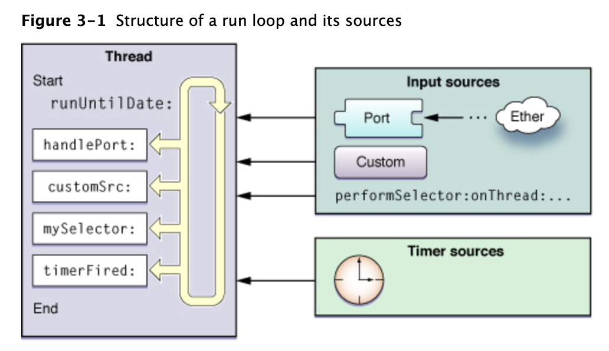

## 前言

[toc]

自我感觉良好，以为自己对多线程的知识已经掌握了。结果。。。惨不忍睹。。。尴尬到傻笑

在前3篇文章[iOS 多线程编程知识整理](https://dnduuhn.com/2018/12/02/iOS-%E5%A4%9A%E7%BA%BF%E7%A8%8B%E7%BC%96%E7%A8%8B%E7%9F%A5%E8%AF%86%E6%95%B4%E7%90%86/)、[iOS 多线编程之线程安全](https://dnduuhn.com/2018/12/11/iOS-%E5%A4%9A%E7%BA%BF%E7%BC%96%E7%A8%8B%E4%B9%8B%E7%BA%BF%E7%A8%8B%E5%AE%89%E5%85%A8/) 、[iOS Runloop与线程保活](https://dnduuhn.com/2018/12/15/iOS-Runloop%E4%B8%8E%E7%BA%BF%E7%A8%8B%E4%BF%9D%E6%B4%BB/) 中我整理了 iOS 多线程编程的知识。殊不知，如下的题目就把我卡住：

```objective-c
- (void)print {
    dispatch_async(dispatch_get_main_queue(), ^{
        NSLog(@"a");
    });
    
    NSLog(@"b");
    
    dispatch_queue_t tempQeue = dispatch_get_global_queue(DISPATCH_QUEUE_PRIORITY_BACKGROUND, 0);
    
    dispatch_async(tempQeue, ^{
        NSLog(@"c");
    });
    
    dispatch_async(tempQeue, ^{
        NSLog(@"d");
    });
    dispatch_sync(tempQeue, ^{
        NSLog(@"e");
    });
    
    [self performSelector:@selector(method) withObject:nil afterDelay:0.0];

    NSLog(@"g");
}

- (void)method {
    NSLog(@"f");
}
```

打印结果是：？

<!--more-->

## 1 弄清概念

### 1.1 进程（Process）

> *百度百科*
>
> 是计算机中的程序关于某数据集合上的一次运行活动，是系统进行资源分配和调度的基本单位，是[操作系统](https://baike.baidu.com/item/%E6%93%8D%E4%BD%9C%E7%B3%BB%E7%BB%9F)结构的基础。在早期面向进程设计的计算机结构中，进程是程序的基本执行实体；在当代面向线程设计的计算机结构中，进程是线程的容器。程序是指令、数据及其组织形式的描述，进程是程序的实体。

### 1.2 线程（Thread）

>*百度百科*
>
>有时被称为轻量进程(Lightweight Process，LWP），是程序执行流的最小单元。一个标准的线程由线程ID，当前指令[指针](https://baike.baidu.com/item/%E6%8C%87%E9%92%88/2878304)(PC），[寄存器](https://baike.baidu.com/item/%E5%AF%84%E5%AD%98%E5%99%A8/187682)集合和[堆栈](https://baike.baidu.com/item/%E5%A0%86%E6%A0%88/1682032)组成。另外，线程是进程中的一个实体，是被系统独立调度和分派的基本单位，线程自己不拥有系统资源，只拥有一点儿在运行中必不可少的资源，但它可与同属一个进程的其它线程共享进程所拥有的全部资源。一个线程可以创建和撤消另一个线程，同一进程中的多个线程之间可以并发执行。由于线程之间的相互制约，致使线程在运行中呈现出间断性。线程也有[就绪](https://baike.baidu.com/item/%E5%B0%B1%E7%BB%AA/10932509)、[阻塞](https://baike.baidu.com/item/%E9%98%BB%E5%A1%9E/9032404)和[运行](https://baike.baidu.com/item/%E8%BF%90%E8%A1%8C/5480697)三种基本状态。就绪状态是指线程具备运行的所有条件，逻辑上可以运行，在等待处理机；运行状态是指线程占有处理机正在运行；阻塞状态是指线程在等待一个事件（如某个信号量），逻辑上不可执行。每一个程序都至少有一个线程，若程序只有一个线程，那就是程序本身。
>
>线程是程序中一个单一的顺序控制流程。进程内有一个相对独立的、可调度的执行单元，是系统独立调度和分派CPU的基本单位指令[运行](https://baike.baidu.com/item/%E8%BF%90%E8%A1%8C)时的程序的调度单位。在单个程序中同时运行多个线程完成不同的工作，称为[多线程](https://baike.baidu.com/item/%E5%A4%9A%E7%BA%BF%E7%A8%8B/1190404)。

### 1.3 同步

> *维基百科*
>
> 指对在一个系统中所发生的事件（event）之间进行协调，在时间上出现一致性与统一化的现象。在系统中进行同步，也被称为及时（in time）、同步化的（synchronous、in sync）。

### 1.4 异步

> *维基百科*
>
> 在[远程通信](https://zh.wikipedia.org/wiki/%E8%BF%9C%E7%A8%8B%E9%80%9A%E4%BF%A1)和[计算机科学](https://zh.wikipedia.org/wiki/%E8%AE%A1%E7%AE%97%E6%9C%BA%E7%A7%91%E5%AD%A6)中，**串行通信**（英语：**Serial communication**）是指在计算机[总线](https://zh.wikipedia.org/wiki/%E6%80%BB%E7%BA%BF)或其他数据信道上，每次传输一个[比特](https://zh.wikipedia.org/wiki/%E4%BD%8D%E5%85%83)数据，并连续进行以上单次过程的通信方式。与之对应的是[并行通信](https://zh.wikipedia.org/wiki/%E5%B9%B6%E8%A1%8C%E9%80%9A%E4%BF%A1)，它在[串行端口](https://zh.wikipedia.org/wiki/%E4%B8%B2%E8%A1%8C%E7%AB%AF%E5%8F%A3)上通过一次同时传输若干比特数据的方式进行通信。串行通信被用于长距离通信以及大多数[计算机网络](https://zh.wikipedia.org/wiki/%E8%AE%A1%E7%AE%97%E6%9C%BA%E7%BD%91%E7%BB%9C)，在这些应用场合里，电缆和同步化使并行通信实际应用面临困难。凭借着其改善的[信号完整性](https://zh.wikipedia.org/wiki/%E4%BF%A1%E5%8F%B7%E5%AE%8C%E6%95%B4%E6%80%A7)和传播速度，串行通信总线正在变得越来越普遍，甚至在短程距离的应用中，其优越性已经开始超越并行总线不需要串行化组件(serializer)，并解决了诸如[时钟偏移](https://zh.wikipedia.org/wiki/%E6%97%B6%E9%92%9F%E5%81%8F%E7%A7%BB)（Clock skew）、互联密度（interconnect density）等缺点。

### 1.5 串行

> *维基百科*
>
> 在远程通信和计算机科学中，**串行**通信（英语：Serial communication）是指在计算机总线或其他数据通道上，每次传输一个位元数据，并连续进行以上单次过程的通信方式。 与之对应的是并行通信，它在**串行**端口上通过一次同时传输若干位元数据的方式进行通信。

### 1.6 并行

> *维基百科*
>
> **并行**是指多比特数据同时通过并行线进行传送，这样数据传送速度大大提高，但并行传送的线路长度受到限制，因为长度增加，干扰就会增加，数据也就容易出错。


> ### 并发与并行(Concurrency VS. Parallel)
>
> 下面这段话摘自维基百科词条 [Concurrency (computer science)](https://en.wikipedia.org/wiki/Concurrency_(computer_science))：
>
> According to Rob Pike, concurrency is the composition of independently executing computations,[2] and concurrency is not parallelism: concurrency is about dealing with lots of things at once but parallelism is about doing lots of things at once. Concurrency is about structure, parallelism is about execution, concurrency provides a way to structure a solution to solve a problem that may (but not necessarily) be parallelizable.

- 并发的关键是你有处理多个任务的能力，不一定要同时。
- 并行的关键是你有同时处理多个任务的能力。


因为个人对多线程编程的理解还不够，怕总结错了，所以从百度百科和维基百科找到了上述概念。


## 2 解题

接下来，我们是时候谈谈文章开始的时候那道题了。


### 2.1 dispatch_async

```objective-c
/*!
 * @function dispatch_async
 *
 * @abstract
 * Submits a block for asynchronous execution on a dispatch queue.
 *
 * @discussion
 * The dispatch_async() function is the fundamental mechanism for submitting
 * blocks to a dispatch queue.
 *
 * Calls to dispatch_async() always return immediately after the block has
 * been submitted, and never wait for the block to be invoked.
 *
 * The target queue determines whether the block will be invoked serially or
 * concurrently with respect to other blocks submitted to that same queue.
 * Serial queues are processed concurrently with respect to each other.
 *
 * @param queue
 * The target dispatch queue to which the block is submitted.
 * The system will hold a reference on the target queue until the block
 * has finished.
 * The result of passing NULL in this parameter is undefined.
 *
 * @param block
 * The block to submit to the target dispatch queue. This function performs
 * Block_copy() and Block_release() on behalf of callers.
 * The result of passing NULL in this parameter is undefined.
 */
```

**Discussion** 中的内容：

`dispatch_async()`函数的基本机制是将`block`方式的任务提交到调度队列。
调用`dispatch_async()`总是在提交`block`**后立即返回**，并且永远不会等待执行`block`任务。
目标队列确定是否将相对于提交到同一队列的其他`block`串行或并行调用该`block`。
串行队列与此同理。

### 2.2 dispatch_sync

```objective-c
/*!
 * @function dispatch_sync
 *
 * @abstract
 * Submits a block for synchronous execution on a dispatch queue.
 *
 * @discussion
 * Submits a workitem to a dispatch queue like dispatch_async(), however
 * dispatch_sync() will not return until the workitem has finished.
 *
 * Work items submitted to a queue with dispatch_sync() do not observe certain
 * queue attributes of that queue when invoked (such as autorelease frequency
 * and QOS class).
 *
 * Calls to dispatch_sync() targeting the current queue will result
 * in dead-lock. Use of dispatch_sync() is also subject to the same
 * multi-party dead-lock problems that may result from the use of a mutex.
 * Use of dispatch_async() is preferred.
 *
 * Unlike dispatch_async(), no retain is performed on the target queue. Because
 * calls to this function are synchronous, the dispatch_sync() "borrows" the
 * reference of the caller.
 *
 * As an optimization, dispatch_sync() invokes the workitem on the thread which
 * submitted the workitem, except when the passed queue is the main queue or
 * a queue targetting it (See dispatch_queue_main_t,
 * dispatch_set_target_queue()).
 *
 * @param queue
 * The target dispatch queue to which the block is submitted.
 * The result of passing NULL in this parameter is undefined.
 *
 * @param block
 * The block to be invoked on the target dispatch queue.
 * The result of passing NULL in this parameter is undefined.
 */
```

Discussion 中的内容：

追加`workitem`到**调度队列**一样和`dispatch_async()`，**不同的是`dispatch_sync()`追加的`workitem`在执行完成之前不会返回**。

使用`dispatch_sync()`提交到调度队列的`workitem`在调用时不会观察该队列的某些队列属性（例如自动释放频率和`QOS`类）。ps.`QOS `见后边的补充。

调用针对当前队列的`dispatch_sync()`将导致死锁。 使用`dispatch_sync()`也会受到使用互斥锁可能导致的多方死锁问题的影响。最好使用`dispatch_async()`

与`dispatch_async()`不同，`dispatch_sync()`**不对目标队列强引用**。 因为对此函数的调用是同步的，所以`dispatch_sync()`**“借用”**调用者的引用。

作为优化，`dispatch_sync()`在提交`workitem`的线程除了主队列里调用 `workitem`，也可以通过设置目标队列的有优先级来执行 `workitem`（请参阅`dispatch_queue_main_t`，`dispatch_set_target_queue()`）。


> 补充：
>
> Quality of Service (QoS)
>
> 这是在iOS8之后提供的新功能，苹果提供了几个Quality of Service枚举来使用:user interactive, user initiated, utility 和 background，通过这告诉系统我们在进行什么样的工作，然后系统会通过合理的资源控制来最高效的执行任务代码，其中主要涉及到CPU调度的优先级、IO优先级、任务运行在哪个线程以及运行的顺序等等，我们通过一个抽象的Quality of Service参数来表明任务的意图以及类别。
>
> - NSQualityOfServiceUserInteractive
>    与用户交互的任务，这些任务通常跟UI级别的刷新相关，比如动画，这些任务需要在一瞬间完成
> - NSQualityOfServiceUserInitiated
>    由用户发起的并且需要立即得到结果的任务，比如滑动scroll view时去加载数据用于后续cell的显示，这些任务通常跟后续的用户交互相关，在几秒或者更短的时间内完成
> - NSQualityOfServiceUtility
>    一些可能需要花点时间的任务，这些任务不需要马上返回结果，比如下载的任务，这些任务可能花费几秒或者几分钟的时间
> - NSQualityOfServiceBackground
>    这些任务对用户不可见，比如后台进行备份的操作，这些任务可能需要较长的时间，几分钟甚至几个小时
> - NSQualityOfServiceDefault
>    优先级介于user-initiated 和 utility，当没有 QoS信息时默认使用，开发者不应该使用这个值来设置自己的任务

### 2.3 队列优先级

```objective-c
/*!
 * @typedef dispatch_queue_priority_t
 * Type of dispatch_queue_priority
 *
 * @constant DISPATCH_QUEUE_PRIORITY_HIGH
 * Items dispatched to the queue will run at high priority,
 * i.e. the queue will be scheduled for execution before
 * any default priority or low priority queue.
 *
 * @constant DISPATCH_QUEUE_PRIORITY_DEFAULT
 * Items dispatched to the queue will run at the default
 * priority, i.e. the queue will be scheduled for execution
 * after all high priority queues have been scheduled, but
 * before any low priority queues have been scheduled.
 *
 * @constant DISPATCH_QUEUE_PRIORITY_LOW
 * Items dispatched to the queue will run at low priority,
 * i.e. the queue will be scheduled for execution after all
 * default priority and high priority queues have been
 * scheduled.
 *
 * @constant DISPATCH_QUEUE_PRIORITY_BACKGROUND
 * Items dispatched to the queue will run at background priority, i.e. the queue
 * will be scheduled for execution after all higher priority queues have been
 * scheduled and the system will run items on this queue on a thread with
 * background status as per setpriority(2) (i.e. disk I/O is throttled and the
 * thread's scheduling priority is set to lowest value).
 */
#define DISPATCH_QUEUE_PRIORITY_HIGH 2
#define DISPATCH_QUEUE_PRIORITY_DEFAULT 0
#define DISPATCH_QUEUE_PRIORITY_LOW (-2)
#define DISPATCH_QUEUE_PRIORITY_BACKGROUND INT16_MIN
```

题目中的队列优先级是`DISPATCH_QUEUE_PRIORITY_BACKGROUND`是上述列出的最低的，这样尽可能的让出CPU资源处理其他任务。

上边关于`QOS`的概述。官方建议是`iOS 8`以上优先使用`QOS`，他们的对应关系：

```objective-c
* The global queue priorities map to the following QOS classes:
 *  - DISPATCH_QUEUE_PRIORITY_HIGH:         QOS_CLASS_USER_INITIATED
 *  - DISPATCH_QUEUE_PRIORITY_DEFAULT:      QOS_CLASS_DEFAULT
 *  - DISPATCH_QUEUE_PRIORITY_LOW:          QOS_CLASS_UTILITY
 *  - DISPATCH_QUEUE_PRIORITY_BACKGROUND:   QOS_CLASS_BACKGROUND
```

### 2.4 performSelector里的 aSelector方法被延迟调用

````objective-c
- (void)performSelector:(SEL)aSelector 
             withObject:(id)arg
             afterDelay:(NSTimeInterval)delay;
````

> Invokes a method of the receiver on the current thread using the default mode after a delay.
>
> delay
>
> The minimum time before which the message is sent. Specifying a delay of 0 does not necessarily cause the selector to be performed immediately. The selector is still queued on the thread’s run loop and performed as soon as possible.
>
> 关键点：即使 delay 是 0 也不会立即执行。

 这个方法其实是增加了一个定时器，而这时`aSelector`会被添加到了队列的最后面，所以要等当前调用此方法的函数执行完毕后，`selector` 方法才会执行。

```objective-c
- (void)performSelector:(SEL)aSelector 
             withObject:(id)anArgument 
             afterDelay:(NSTimeInterval)delay 
                inModes:(NSArray<NSRunLoopMode> *)modes;
```

>Invokes a method of the receiver on the current thread using the specified modes after a delay.
>
>aSelector
>
>A [Selector](https://developer.apple.com/library/archive/documentation/General/Conceptual/DevPedia-CocoaCore/Selector.html#//apple_ref/doc/uid/TP40008195-CH48) that identifies the method to invoke. The method should not have a significant return value and should take a single argument of type id, or no arguments.
>
>anArgument
>
>The argument to pass to the method when it is invoked. Pass `nil` if the method does not take an argument.
>
>delay
>
>The minimum time before which the message is sent. Specifying a delay of 0 does not necessarily cause the selector to be performed immediately. The selector is still queued on the thread’s run loop and performed as soon as possible.
>
>modes
>
>An array of strings that identify the modes to associate with the timer that performs the selector. This array must contain at least one string. If you specify `nil` or an empty array for this parameter, this method returns without performing the specified selector. For information about run loop modes, see [Run Loops](https://developer.apple.com/library/archive/documentation/Cocoa/Conceptual/Multithreading/RunLoopManagement/RunLoopManagement.html#//apple_ref/doc/uid/10000057i-CH16) in [Threading Programming Guide](https://developer.apple.com/library/archive/documentation/Cocoa/Conceptual/Multithreading/Introduction/Introduction.html#//apple_ref/doc/uid/10000057i).
>
>| Mode           | Name                                                         | Description                                                  |
>| :------------- | :----------------------------------------------------------- | :----------------------------------------------------------- |
>| Default        | `NSDefaultRunLoopMode` (Cocoa)`kCFRunLoopDefaultMode` (Core Foundation) | The default mode is the one used for most operations. Most of the time, you should use this mode to start your run loop and configure your input sources. |
>| Connection     | `NSConnectionReplyMode` (Cocoa)                              | Cocoa uses this mode in conjunction with `NSConnection` objects to monitor replies. You should rarely need to use this mode yourself. |
>| Modal          | `NSModalPanelRunLoopMode` (Cocoa)                            | Cocoa uses this mode to identify events intended for modal panels. |
>| Event tracking | `NSEventTrackingRunLoopMode` (Cocoa)                         | Cocoa uses this mode to restrict incoming events during mouse-dragging loops and other sorts of user interface tracking loops. |
>| Common modes   | `NSRunLoopCommonModes` (Cocoa)`kCFRunLoopCommonModes` (Core Foundation) | This is a configurable group of commonly used modes. Associating an input source with this mode also associates it with each of the modes in the group. For Cocoa applications, this set includes the default, modal, and event tracking modes by default. Core Foundation includes just the default mode initially. You can add custom modes to the set using the `CFRunLoopAddCommonMode` function. |



#### 2.4.1 Special Considerations

> This method registers with the runloop of its current context, and depends on that runloop being run on a regular basis to perform correctly. One common context where you might call this method and end up registering with a runloop that is not automatically run on a regular basis is when being invoked by a dispatch queue. If you need this type of functionality when running on a dispatch queue, you should use [`dispatch_after`](https://developer.apple.com/documentation/dispatch/1452876-dispatch_after?language=objc) and related methods to get the behavior you want.

`performSelector: withObject: afterDelay:`是在当前Runloop中延时执行的，而子线程的Runloop默认不开启，因此无法响应方法。需要加上`[[NSRunLoop currentRunLoop]run];`

```objective-c
dispatch_async(dispatch_get_global_queue(0, 0), ^{
    [self performSelector:@selector(testMethod:)
               withObject:params
               afterDelay:3];
    // 这是因为若想开启某线程的Runloop，必须具有timer、source、observer任一事件才能触发开启。执行 [[NSRunLoop currentRunLoop]run]前没有任何事件添加到当前Runloop，因此该线程的Runloop是不会开启的，从而延迟事件不执行。
    [[NSRunLoop currentRunLoop]run];
});

//----分割线----
dispatch_after(dispatch_time(DISPATCH_TIME_NOW, (int64_t)(3 * NSEC_PER_SEC)), dispatch_get_global_queue(0, 0), ^{
        if ([self respondsToSelector:@selector(testMethod:)]) {
            [self performSelector:@selector(testMethod:) withObject:params];
        }
});

- (void)testMethod:(id)objcet {
    NSLog(@"testMethodCall");
}
```

#### 2.4.2 performSelector 动态调用方法

```objectivec
NSArray *objectArray = @[@{@"methodName":@"dynamicParameterString:",@"value":@"String"},@{@"methodName":@"dynamicParameterNumber:",@"value":@2}];
for (NSDictionary *dic in objectArray) { 
    [self performSelector:NSSelectorFromString([dic objectForKey:@"methodName"]) withObject:[dic objectForKey:@"value"]];
}

- (void)dynamicParameterString:(NSString *)string{
    
    NSLog(@"DynamicParameterString: %@",string);
}

- (void)dynamicParameterNumber:(NSNumber *)number{
    
    NSLog(@"DynamicParameterNumber: %@",number);
}

```

##### 2.4.2.1 performSelector 使用 NSInvocation 传参

```objective-c
- (id)performSelector:(SEL)selector withObjects:(NSArray *)objects
{
    // 方法签名(方法的描述)
    NSMethodSignature *signature = [[self class] instanceMethodSignatureForSelector:selector];
    if (signature == nil) {
        
        //可以抛出异常也可以不操作。
    }
    
    // NSInvocation : 利用一个NSInvocation对象包装一次方法调用（方法调用者、方法名、方法参数、方法返回值）
    NSInvocation *invocation = [NSInvocation invocationWithMethodSignature:signature];
    invocation.target = self;
    invocation.selector = selector;
    
    // 设置参数
    NSInteger paramsCount = signature.numberOfArguments - 2; // 除self、_cmd以外的参数个数
    paramsCount = MIN(paramsCount, objects.count);
    for (NSInteger i = 0; i < paramsCount; i++) {
        id object = objects[i];
        if ([object isKindOfClass:[NSNull class]]) continue;
        [invocation setArgument:&object atIndex:i + 2];
    }
    
    // 调用方法
    [invocation invoke];
    
    // 获取返回值
    id returnValue = nil;
    if (signature.methodReturnLength) { // 有返回值类型，才去获得返回值
        [invocation getReturnValue:&returnValue];
    }
    
    return returnValue;
}

//----分割线----

NSString *str = @"字符串";
NSNumber *num = @20;
NSArray *arr = @[@"数组值1", @"数组值2"];
SEL sel = NSSelectorFromString(@"NSInvocationWithString:withNum:withArray:");
NSArray *objs = [NSArray arrayWithObjects:str, num, arr, nil];
    
[self performSelector:sel withObjects:objs];

//----分割线----
- (void)NSInvocationWithString:(NSString *)string withNum:(NSNumber *)number withArray:(NSArray *)array {
    NSLog(@"%@, %@, %@", string, number, array[0]);
}
```


##### 2.4.2.2 参数中有结构体

```objective-c
typedef struct ParameterStruct{
    int a;
    int b;
}MyStruct;
//----分割线----

NSString *str = @"字符串 把结构体转换为对象";
NSNumber *num = @20;
NSArray *arr = @[@"数组值1", @"数组值2"];

// 把结构体包装成对象
MyStruct mystruct = {10,20};
NSValue *value = [NSValue valueWithBytes:&mystruct objCType:@encode(MyStruct)];
    
SEL sel = NSSelectorFromString(@"NSInvocationWithString:withNum:withArray:withValue:");
NSArray *objs = [NSArray arrayWithObjects:str, num, arr, value,nil];
    
[self performSelector:sel withObjects:objs];

//----分割线----
- (void)NSInvocationWithString:(NSString *)string withNum:(NSNumber *)number withArray:(NSArray *)array withValue:(NSValue *)value{
    
    MyStruct struceBack;
    [value getValue:&struceBack];
    
    NSLog(@"%@, %@, %@, %d", string, number, array[0],struceBack.a);
}
```


##### 2.4.2.3 Objc_msgSend

```objective-c
NSString *str = @"字符串objc_msgSend";
NSNumber *num = @20;
NSArray *arr = @[@"数组值1", @"数组值2"];
SEL sel = NSSelectorFromString(@"ObjcMsgSendWithString:withNum:withArray:");
    
((void (*) (id, SEL, NSString *, NSNumber *, NSArray *)) objc_msgSend) (self, sel, str, num, arr);

//----分割线----

- (void)ObjcMsgSendWithString:(NSString *)string withNum:(NSNumber *)number withArray:(NSArray *)array {
    NSLog(@"%@, %@, %@", string, number, array[0]);
}
```


#### 2.4.3 防止按钮多次点击

1. 是在0.2秒内取消之前的点击事件，以做到防止多次点击。

```objectivec
-(void)clicked:(UIButton *)sender {
    [[self class] cancelPreviousPerformRequestsWithTarget:self selector:@selector(buttonClick:) object:sender];
    [self performSelector:@selector(buttonClick:) withObject:sender afterDelay:0.2f];
}
```

2. 在点击后设为不可被点击的状态，1秒后恢复

```objectivec
-(void)buttonClicked:(id)sender {
    self.button.enabled = NO;
    [self performSelector:@selector(changeButtonStatus) withObject:nil afterDelay:1.0f];//防止重复点击
}

-(void)changeButtonStatus {
    self.button.enabled =YES;
}
```


### 2.5 打印日志顺序分析

基于上述的知识点，我们再来看这个打印顺序：

> 2~4行 `dispatch_sync()`提交到队列后，立即返回，继续往下执行 第6行代码 输出 b
>
> Ps.打印a的任务添加到了主队列，在主线程执行


> 8~16 行 `dispatch_sync()`提交到队列后，立即返回，17~19 行 任务通过`dispatch_sync()`函数被添加到优先级是`DISPATCH_QUEUE_PRIORITY_BACKGROUND`的全局队列，会在主线程执行完打印输出 e，才继续往下执行
>
> Ps. 打印c和d的任务通过`dispatch_async()`添加到了全局队列，会开启新线程执行


> 21 行 延迟执行，会添加到队列的最后，f 最后打印。


> 23 行 输出 g


此时有了一个打印顺序：

```
b->e->xxx->f
```

a和g、c和d 分别在`mainQueue`和`tempQueue `而且在不同的线程，所以执行起来互不相干，他们的打印顺序取决于任务执行的时间。不过我多次执行最终得到了如下的结果：

#### 打印结果

我在 `Version 10.1 (10B61)`、`iOS 12.1` 模拟器 `iPhoneXR`上跑出的结果：

```pseudocode
b->e->g->c->d->a->f
```

or

```pseudocode
b->e->g->d->c->a->f
```


## 4 小结

至此，文章一开始的问题就算解答完成了。其中考察的知识点：

- GCD
  - 队列
    - 并发队列
    - 主队列
  - 任务
    - 异步任务
    - 同步任务
- performSelector

哎，回想当时的场景。。。尬。。。在这里撂下狠话，不能做光会用的搬砖工，我得懂！！！


## 参考文献

- [关于GCD开发的一些事儿](https://www.jianshu.com/p/f9e01c69a46f)
- [GCD 中那些你可能不熟悉的知识](http://liuduo.me/2018/02/17/gcd-maybe-you-dont-know/)
- [消息处理之performSelector](https://www.jianshu.com/p/672c0d4f435a)
- [iOS线程、同步异步、串行并行队列](https://juejin.im/post/5b28ca5de51d4558e03cc847)


