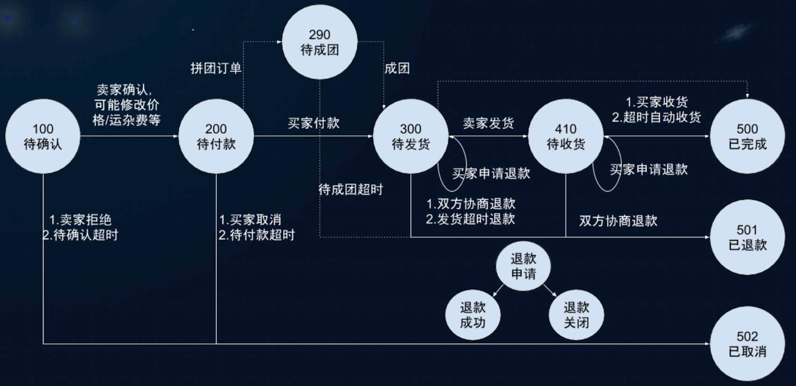

## 一场技术沙龙-1

> “当你考察那些生存了几百年的公司，你就会发现这些公司往往都是经营酒业的，这是一个非常有趣的现象。” ——贝佐斯
>
> 因为酒业是时间的朋友，越放越值钱，稀缺性随着时间成长，生产力的进步几乎无法消除这样的稀缺性，而其他商品大多都不具备这样的特征。

### PING++

#### 1 新场景支付

- 聚合小程序支付

- 先用后付

- 会员订阅

- 自由分账

- 多级分销

- 合规预付费

- 合规资金存管

- S2B2C 模式支付

#### 2 裂变坊

- 一次分享，让用户带来用户

#### 3 推荐大使

- 你的零花钱就在你的朋友圈里

---

### 电商平台交易系统

> **一亩田**
>
> 农业电商：通过担保交易、即时代收、自营交易等交易形式，服务合作社、种养殖户、代办、采购商、商超、微商、社群等群体，提高农业流通效率，推动农产品上行。

#### 农业电商的特点

##### 无法按照特定的价格购买特定数量，特定包装，特定规格的农产品。

- 弱库存：付款了也不一定有货
- 价格变化快：打电话沟通1块3，1小时以后可能变成1块4
- 非标，品类差异大：货不对板，易损易腐

##### 行业落后，加速进化

- 整车物流：交易无法闭环
- 大额支付困难：费率高，小贩商户多
- 在线交易渗透率低：数百年【一手交钱一手交货】的交易惯性

#### 交易系统的核心角色

| 角色   | 描述                                     |
| ------ | ---------------------------------------- |
| 买家   | 真正付钱的人                             |
| 商家   | 直接卖货的人                             |
| 代理商 | N 道贩子                                 |
| 供应商 | 通过合作伙伴协作完成交易，合作方式是联营 |

交易平台，一般作为上帝视角切入其他参与者。协调利益各方，促进达成交易。一般而言，农产品交易是买方市场，供远大于求。

更多角色：

|            |          |            |              |            |
| ---------- | -------- | ---------- | ------------ | ---------- |
| 夫妻水果店 | 商超     | 产地加工厂 | 产地贸易商   | 一级批发商 |
| 二级批发商 | 社群电商 | 生鲜电商   | 水果连锁超市 | 微商       |
| 代办       | 合作社   | 种植户     | 养殖户       | 家庭农场   |

#### 交易系统构成：

运营系统：

- 流程引擎
- 订单管理
- 纠纷处理

订单核心：

- 订单信息
- 订单流程

营销系统：

- 活动管理
- 优惠管理

##### 交易流程（下单）：

#### 交易模式

##### 担保交易

​	买家付款到平台，卖家发货，买家确认收货后平台结算给卖家。

##### 联营

​	买家付款到平台，供应商返货，平台按账期给供应商结算。

##### 代收

​	买家付款到平台，直接结算给卖家，为卖家提供收款工具。

##### 代卖

#### 交易系统的关联系统

| 系统            | 描述                                          |
| --------------- | --------------------------------------------- |
| 通用域-用户中心 | 登录 / 用户信息 / 收货地址                    |
| 通用域-商品     | 分类 / SKU/ 价格 / 库存，交易快照             |
| 核心-营销系统   | 活动 / 优惠券 / 活动管理 / SKU管理 / 会场管理 |
| 核心-订单       | 订单 创建 / 流转 / 管理                       |
| 支撑域-支付系统 | 订单支付方式 / 账户                           |
| 支撑域-风控结算 | 渠道 / 商户 / 供应商结算                      |
| 支撑域-物流     | 物流追踪与管理                                |
| 通用域-消息通知 | SMS/ 站内信 / 卡片                            |

#### 订单信息

##### 状态流转

1. 待卖家确认，由于农产品库存属性较弱，卖家下单后一般默认需要卖家确认订单，当然也存在其他流程变种，例如：不需要卖家确认或待确认超时订单自动取消。
2. 待买家付款，卖家确认订单后，订单有效，等待买家付款，付款时效性从30分钟到3天不等，超时订单自动取消。
3. 待卖家发货，交易品类不同，发货时效性从1天到一个月不等，超期不发货、订单自动取消并原路退款。
4. 待买家收货，交易品类不同，待收货时效性不同，从 5 天到 10 天不等，买家可以延迟收货，超期系统默认自动确认收货
5. 交易完成，会进行风控结算、交易统计、商家等级更新等。

##### 流转

### 系统设计经验

- 基于 Event 的订单状态迁移引擎
- 数据库 MySQL Online DDL 的收益读写分离
- 订单统计与资金结算分离
- 订单转化率监控的难点：订单数，订单完成率，按下单时间切分

