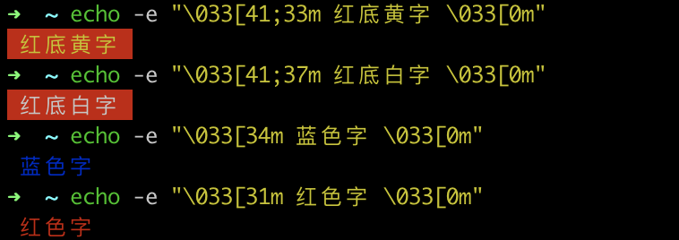
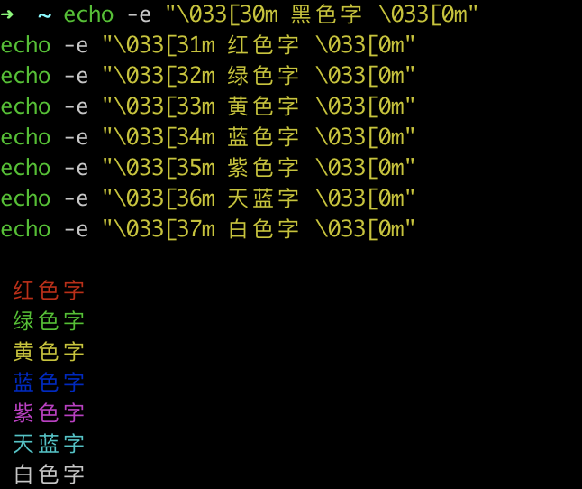
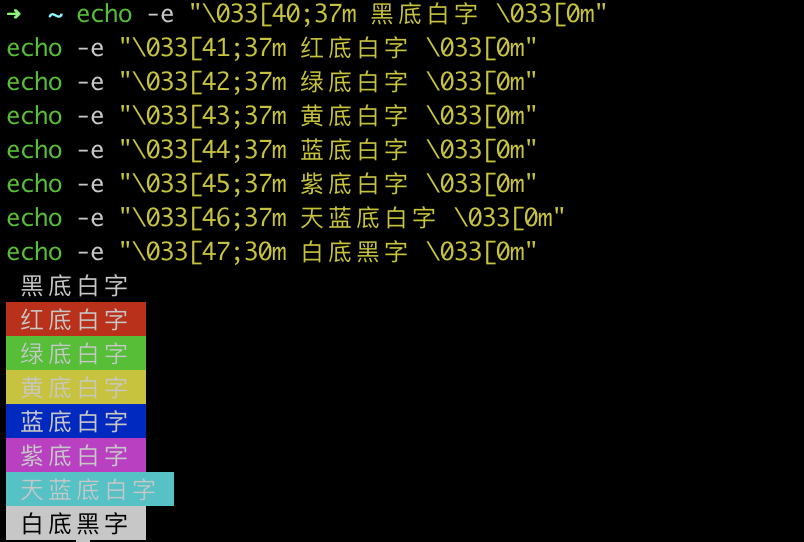
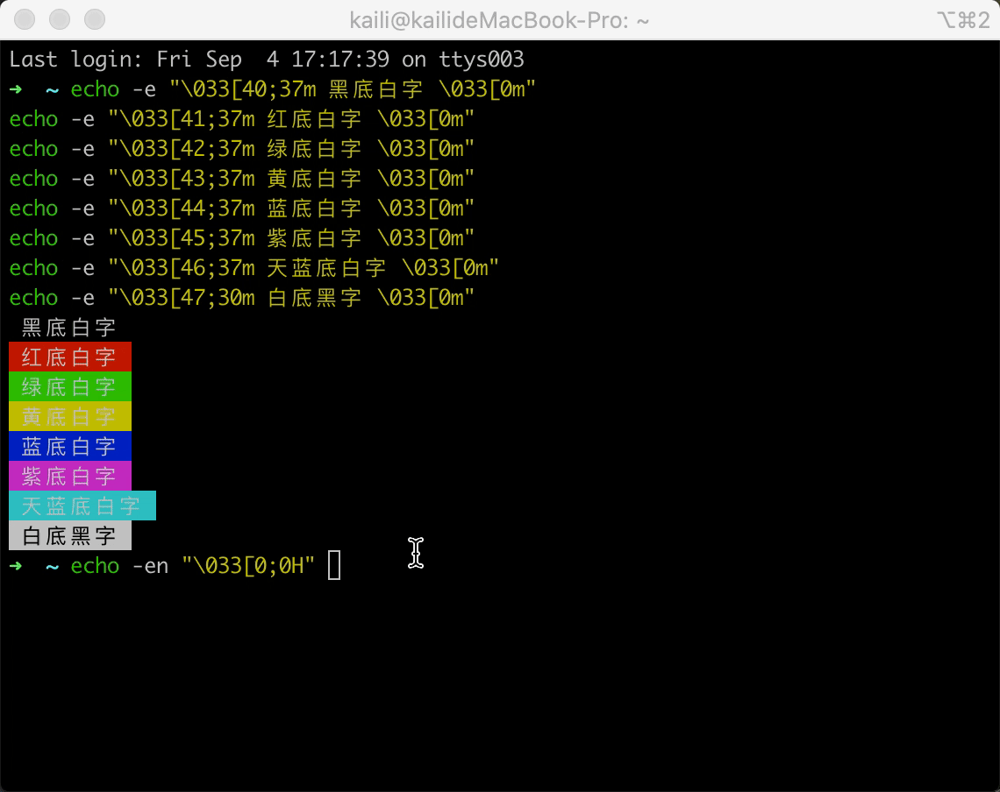

# shell 脚本中 echo 显示内容带颜色

shell 脚本中 `echo`显示内容带颜色显示，需要使用参数 `-e` 格式如下： 

```shell
echo -e "\033[字背景颜色;文字颜色m字符串\033[0m" 
```

注： 

     　　1. 字背景颜色和文字颜色之间是英文的`"" `
     　　2. 文字颜色后面有个`m `
     　　3. 字符串前后可以没有`空格`，如果有的话，输出也是同样有`空格 `

例如： 

```shell
echo -e "\033[41;36m something here \033[0m" 
```

其中41的位置代表底色， 36的位置是代表字的颜色。下面是相应的字和背景颜色，可以自己来尝试找出不同颜色搭配。例： 

```shell
echo -e "\033[41;33m 红底黄字 \033[0m"
echo -e "\033[41;37m 红底白字 \033[0m"
echo -e "\033[34m 蓝色字 \033[0m"
echo -e "\033[31m 红色字 \033[0m"
```




### 字颜色：30~37 

```shell
echo -e "\033[30m 黑色字 \033[0m"
echo -e "\033[31m 红色字 \033[0m"
echo -e "\033[32m 绿色字 \033[0m"
echo -e "\033[33m 黄色字 \033[0m"
echo -e "\033[34m 蓝色字 \033[0m"
echo -e "\033[35m 紫色字 \033[0m" 
echo -e "\033[36m 天蓝字 \033[0m" 
echo -e "\033[37m 白色字 \033[0m" 
```




### 字背景颜色范围：40~47 

```shell
echo -e "\033[40;37m 黑底白字 \033[0m"
echo -e "\033[41;37m 红底白字 \033[0m"
echo -e "\033[42;37m 绿底白字 \033[0m"
echo -e "\033[43;37m 黄底白字 \033[0m"
echo -e "\033[44;37m 蓝底白字 \033[0m"
echo -e "\033[45;37m 紫底白字 \033[0m"
echo -e "\033[46;37m 天蓝底白字 \033[0m"
echo -e "\033[47;30m 白底黑字 \033[0m"
```




### 最后面控制选项说明 

```shell
   \33[0m # 关闭所有属性 
　　\33[1m # 设置高亮度 
　　\33[4m # 下划线 
　　\33[5m # 闪烁 
　　\33[7m # 反显 
　　\33[8m # 消隐 
　　\33[30m — \33[37m # 设置前景色 
　　\33[40m — \33[47m # 设置背景色 
　　\33[nA # 光标上移n行 
　　\33[nB # 光标下移n行 
　　\33[nC # 光标右移n行 
　　\33[nD # 光标左移n行 
　　\33[y;xH #设置光标位置 
　　\33[2J # 清屏 
　　\33[K # 清除从光标到行尾的内容 
　　\33[s # 保存光标位置 
　　\33[u # 恢复光标位置 
　　\33[?25l # 隐藏光标 
　　\33[?25h # 显示光标
```


比如：

```shell
echo -en "\033[0;0H" # 将光标位置设置在左上角
```



### 选项标准化

在创建 shell 脚本时，尽量保持**选项**与 Linux 通用的选项含义相同，Linux 通用选项有：

```shell
-a # 显示所有对象
-c # 生产一个计数
-d # 指定一个目录
-e # 扩展一个对象
-f # 指定读入数据的文件
-h # 显示命令的帮助信息
-i # 忽略文本大小写
-l # 产生输出得长格式文本
-n # 使用非交互模式
-o # 指定将所有输出重定向到输出文件
-q # 以安静模式运行    
-r # 递归的处理目录和文件
-s # 以安静模式运行    
-v # 生成详细输出  
-x # 排除某个对象 
-y # 对所有问题回答yes
```