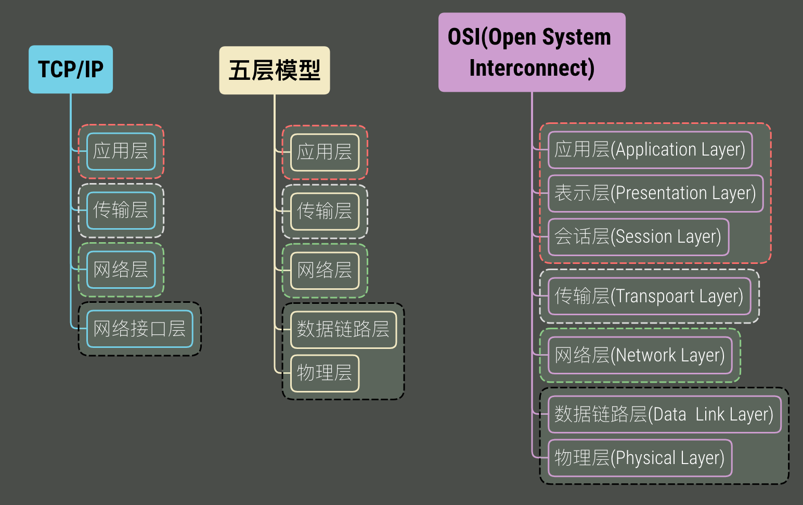
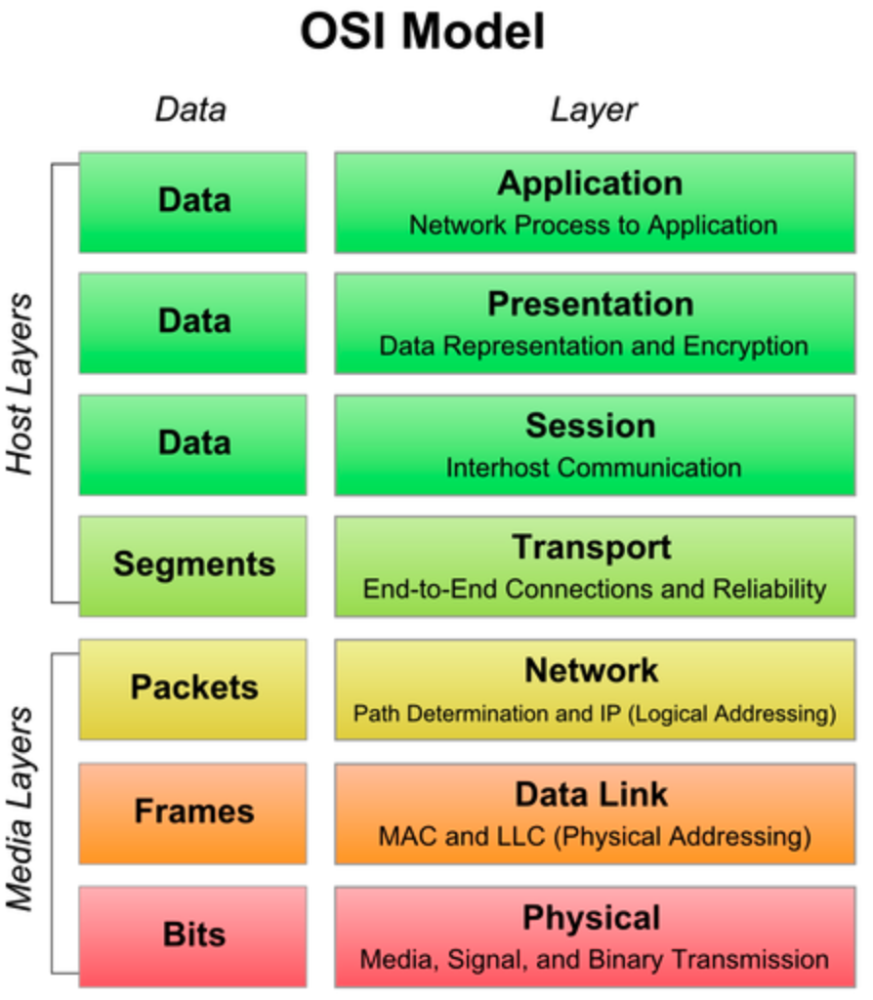
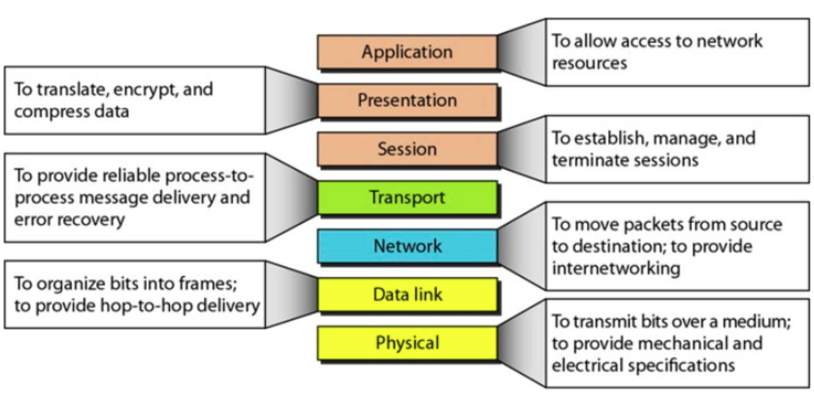
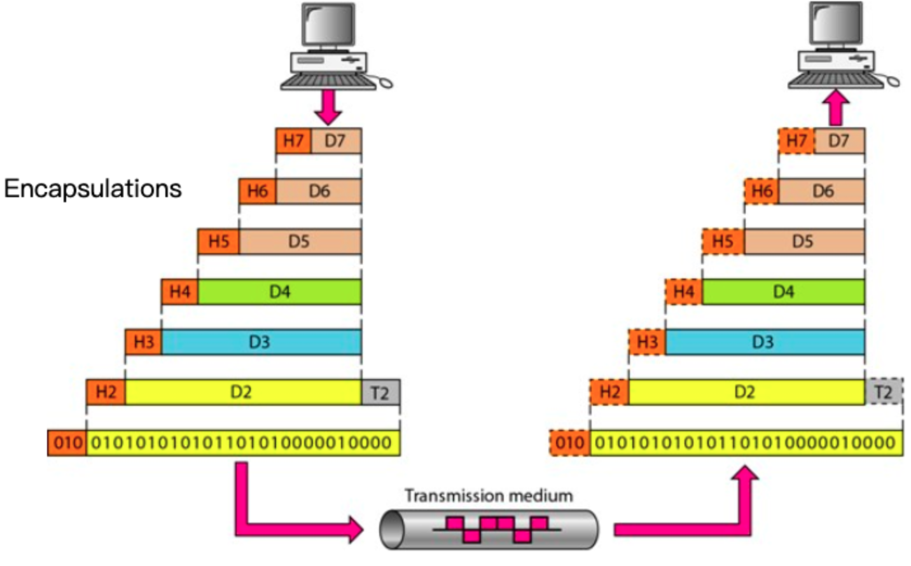

## 互联网协议（一）

### 四、五还是七层网络模型？

### 四层网络模型

> **互联网协议套件**（英语：Internet Protocol Suite，缩写IPS）[[1\]](https://zh.wikipedia.org/wiki/TCP/IP协议族#cite_note-1)是一个网络通信模型，以及一整个[网络传输协议](https://zh.wikipedia.org/wiki/网络传输协议)家族，为[网际网络](https://zh.wikipedia.org/wiki/网际网络)的基础通信架构。它常被通称为**TCP/IP协议族**（英语：TCP/IP Protocol Suite，或TCP/IP Protocols），简称**TCP/IP**[[2\]](https://zh.wikipedia.org/wiki/TCP/IP协议族#cite_note-2)。因为该协议家族的两个核心协议：**TCP（[传输控制协议](https://zh.wikipedia.org/wiki/传输控制协议)）**和**IP（[网际协议](https://zh.wikipedia.org/wiki/网际协议)）**，为该家族中最早通过的标准[[3\]](https://zh.wikipedia.org/wiki/TCP/IP协议族#cite_note-3)。由于在网络通讯协议普遍采用分层的结构，当多个层次的协议共同工作时，类似计算机科学中的[堆栈](https://zh.wikipedia.org/wiki/堆栈)，因此又被称为**TCP/IP协议栈**（英语：TCP/IP Protocol Stack）[[4\]](https://zh.wikipedia.org/wiki/TCP/IP协议族#cite_note-4)[[5\]](https://zh.wikipedia.org/wiki/TCP/IP协议族#cite_note-5) 。这些协议最早发源于[美国国防部](https://zh.wikipedia.org/wiki/美国国防部)（缩写为DoD）的[ARPA网](https://zh.wikipedia.org/wiki/ARPA网)项目，因此也被称作**DoD模型**（DoD Model）[[6\]](https://zh.wikipedia.org/wiki/TCP/IP协议族#cite_note-6)。这个协议族由[互联网工程任务组](https://zh.wikipedia.org/wiki/互联网工程任务组)负责维护。
>
> TCP/IP提供了点对点链接的机制，将资料应该如何封装、寻址、传输、路由以及在目的地如何接收，都加以标准化。它将软件通信过程[抽象化](https://zh.wikipedia.org/wiki/抽象化_(計算機科學))为四个[抽象层](https://zh.wikipedia.org/wiki/抽象層)，采取[协议堆栈](https://zh.wikipedia.org/w/index.php?title=協定堆疊&action=edit&redlink=1)的方式，分别实现出不同通信协议。协议族下的各种协议，依其功能不同，被分别归属到这四个层次结构之中[[7\]](https://zh.wikipedia.org/wiki/TCP/IP协议族#cite_note-7)[[8\]](https://zh.wikipedia.org/wiki/TCP/IP协议族#cite_note-8)，常被视为是简化的七层[OSI模型](https://zh.wikipedia.org/wiki/OSI模型)。

| 4    | **应用层** application layer                    | 例如[HTTP](https://zh.wikipedia.org/wiki/超文本传输协议)、[FTP](https://zh.wikipedia.org/wiki/文件传输协议)、[DNS](https://zh.wikipedia.org/wiki/DNS) *（如[BGP](https://zh.wikipedia.org/wiki/边界网关协议)和[RIP](https://zh.wikipedia.org/wiki/路由信息协议)这样的路由协议，尽管由于各种各样的原因它们分别运行在TCP和UDP上，仍然可以将它们看作网络层的一部分）* |
| ---- | ----------------------------------------------- | ------------------------------------------------------------ |
| 3    | **传输层** transport layer                      | 例如[TCP](https://zh.wikipedia.org/wiki/传输控制协议)、[UDP](https://zh.wikipedia.org/wiki/用户数据报协议)、[RTP](https://zh.wikipedia.org/wiki/RTP)、[SCTP](https://zh.wikipedia.org/wiki/SCTP) *（如[OSPF](https://zh.wikipedia.org/wiki/OSPF)这样的路由协议，尽管运行在IP上也可以看作是网络层的一部分）* |
| 2    | **网络互连层** internet layer                   | 对于TCP/IP来说这是[因特网协议](https://zh.wikipedia.org/wiki/因特网协议)（IP） *（如[ICMP](https://zh.wikipedia.org/wiki/互联网控制消息协议)和[IGMP](https://zh.wikipedia.org/wiki/因特网组管理协议)这样的必须协议尽管运行在IP上，也仍然可以看作是网络互连层的一部分；[ARP](https://zh.wikipedia.org/wiki/地址解析协议)不运行在IP上）* |
| 1    | **网络访问(链接)层** Network Access(link) layer | 例如[以太网](https://zh.wikipedia.org/wiki/以太网)、[Wi-Fi](https://zh.wikipedia.org/wiki/Wi-Fi)、[MPLS](https://zh.wikipedia.org/wiki/多协议标签交换)等。 |

### 五层网络模型

> OSI 七层网络模型由国际标准化组织进行制定，它是正统意义上的国际标准。但其实现过于复杂，且制定周期过长，在其整套标准推出之前，TCP/IP 模型已经在全球范围内被广泛使用，所以 TCP/IP 模型才是事实上的国际标准。TCP/IP 模型定义了应用层、传输层、网际层、网络接口层这四层网络结构，但并没有给出网络接口层的具体内容，因此在学习和开发中，通常将网络接口层替换为 OSI 七层模型中的数据链路层和物理层来进行理解。

### 七层网络模型

> **开放式系统互联模型**（英语：**O**pen **S**ystem **I**nterconnection Model，缩写：OSI；简称为**OSI模型**）是一种[概念模型](https://zh.wikipedia.org/wiki/概念模型)，由[国际标准化组织](https://zh.wikipedia.org/wiki/国际标准化组织)提出，一个试图使各种计算机在世界范围内互连为网络的标准框架。定义于ISO/IEC 7498-1。
>
> | 7    | **应用层** application layer   | 例如[HTTP](https://zh.wikipedia.org/wiki/超文本传输协议)、[SMTP](https://zh.wikipedia.org/wiki/简单邮件传输协议)、[SNMP](https://zh.wikipedia.org/wiki/简单网络管理协议)、[FTP](https://zh.wikipedia.org/wiki/文件传输协议)、[Telnet](https://zh.wikipedia.org/wiki/Telnet)、[SIP](https://zh.wikipedia.org/wiki/会话发起协议)、[SSH](https://zh.wikipedia.org/wiki/Secure_Shell)、[NFS](https://zh.wikipedia.org/wiki/网络文件系统)、[RTSP](https://zh.wikipedia.org/wiki/RTSP)、[XMPP](https://zh.wikipedia.org/wiki/XMPP)、[Whois](https://zh.wikipedia.org/wiki/WHOIS)、[ENRP](https://zh.wikipedia.org/w/index.php?title=ENRP&action=edit&redlink=1)、[TLS](https://zh.wikipedia.org/wiki/傳輸層安全性協定) |
> | ---- | ------------------------------ | ------------------------------------------------------------ |
> | 6    | **表示层** presentation layer  | 例如[XDR](https://zh.wikipedia.org/wiki/外部数据表示法)、[ASN.1](https://zh.wikipedia.org/wiki/ASN.1)、[NCP](https://zh.wikipedia.org/wiki/网络控制协议)、[TLS](https://zh.wikipedia.org/wiki/TLS)、[ASCII](https://zh.wikipedia.org/wiki/ASCII) |
> | 5    | **会话层** session layer       | 例如[ASAP](https://zh.wikipedia.org/w/index.php?title=ASAP&action=edit&redlink=1)、ISO 8327 / CCITT X.225、[RPC](https://zh.wikipedia.org/wiki/遠程過程調用)、[NetBIOS](https://zh.wikipedia.org/wiki/NetBIOS)、[Winsock](https://zh.wikipedia.org/wiki/Winsock)、[BSD sockets](https://zh.wikipedia.org/wiki/Berkeley套接字)、[SOCKS](https://zh.wikipedia.org/wiki/SOCKS)、[密码验证协议](https://zh.wikipedia.org/wiki/PAP) |
> | 4    | **传输层** transport layer     | 例如[TCP](https://zh.wikipedia.org/wiki/传输控制协议)、[UDP](https://zh.wikipedia.org/wiki/用户数据报协议)、[RTP](https://zh.wikipedia.org/wiki/实时传输协议)、[SCTP](https://zh.wikipedia.org/wiki/流控制传输协议)、[SPX](https://zh.wikipedia.org/wiki/序列分組交換)、[ATP](https://zh.wikipedia.org/wiki/AppleTalk)、[IL](https://zh.wikipedia.org/w/index.php?title=IL_Protocol&action=edit&redlink=1) |
> | 3    | **网络层** network layer       | 例如[IP](https://zh.wikipedia.org/wiki/网际协议)、[ICMP](https://zh.wikipedia.org/wiki/互联网控制消息协议)、[IPX](https://zh.wikipedia.org/wiki/互联网分组交换协议)、[BGP](https://zh.wikipedia.org/wiki/边界网关协议)、[OSPF](https://zh.wikipedia.org/wiki/OSPF)、[RIP](https://zh.wikipedia.org/wiki/路由信息协议)、[IGRP](https://zh.wikipedia.org/wiki/IGRP)、[EIGRP](https://zh.wikipedia.org/wiki/EIGRP)、[ARP](https://zh.wikipedia.org/wiki/地址解析协议)、[RARP](https://zh.wikipedia.org/wiki/RARP)、[X.25](https://zh.wikipedia.org/wiki/X.25) |
> | 2    | **数据链路层** data link layer | 例如[以太网](https://zh.wikipedia.org/wiki/以太网)、[令牌环](https://zh.wikipedia.org/wiki/令牌环)、[HDLC](https://zh.wikipedia.org/wiki/HDLC)、[帧中继](https://zh.wikipedia.org/wiki/帧中继)、[ISDN](https://zh.wikipedia.org/wiki/ISDN)、[ATM](https://zh.wikipedia.org/wiki/异步传输模式)、[IEEE 802.11](https://zh.wikipedia.org/wiki/IEEE_802.11)、[FDDI](https://zh.wikipedia.org/wiki/FDDI)、[PPP](https://zh.wikipedia.org/wiki/点对点协议) |
> | 1    | **物理层** physical layer      | 例如[调制解调器](https://zh.wikipedia.org/wiki/數據機)、[无线电](https://zh.wikipedia.org/wiki/无线电)、[光纤](https://zh.wikipedia.org/wiki/光纤) |

看完上述，已经给出了答案，而且更重要的是要理解**分层**的思想！

> 计算机科学领域的任何问题都可以通过增加一个间接的中间层来解决.

- 同一层中的各网络节点都有相同的层次结构，具有同样的功能。
- 同一节点内相邻层之间通过接口（可以是逻辑接口）进行通信。
- 每一层使用下一层提供的服务，并且向其上层提供服务。
- 不同节点的同等层按照协议实现对等层之间的通信。

## 参考文献

- [OSI 参考模型](https://zh.wikipedia.org/wiki/OSI%E6%A8%A1%E5%9E%8B)

- [RFC](https://zh.wikipedia.org/wiki/RFC)

| RFC [768](https://tools.ietf.org/html/rfc768)                | [UDP](https://zh.wikipedia.org/wiki/用户数据报协议)    |
| ------------------------------------------------------------ | ------------------------------------------------------ |
| RFC [783](https://tools.ietf.org/html/rfc783)                | [TFTP](https://zh.wikipedia.org/wiki/简单文件传输协议) |
| RFC [791](https://tools.ietf.org/html/rfc791)                | [IP](https://zh.wikipedia.org/wiki/网际协议)           |
| RFC [792](https://tools.ietf.org/html/rfc792)                | [ICMP](https://zh.wikipedia.org/wiki/ICMP)             |
| RFC [793](https://tools.ietf.org/html/rfc793)                | [TCP](https://zh.wikipedia.org/wiki/TCP)               |
| RFC [826](https://tools.ietf.org/html/rfc826)                | [ARP](https://zh.wikipedia.org/wiki/ARP)               |
| RFC [854](https://tools.ietf.org/html/rfc854)                | [Telnet](https://zh.wikipedia.org/wiki/Telnet)         |
| RFC [894](https://tools.ietf.org/html/rfc894)                | IP over Ethernet                                       |
| RFC [903](https://tools.ietf.org/html/rfc903)                | [RARP](https://zh.wikipedia.org/wiki/逆地址解析协议)   |
| RFC [959](https://tools.ietf.org/html/rfc959)                | [FTP](https://zh.wikipedia.org/wiki/文件传输协议)      |
| RFC [1034](https://tools.ietf.org/html/rfc1034) RFC [1035](https://tools.ietf.org/html/rfc1035) | [DNS](https://zh.wikipedia.org/wiki/域名系统)          |

