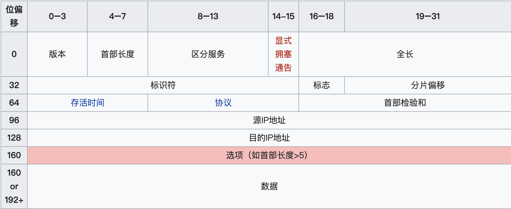
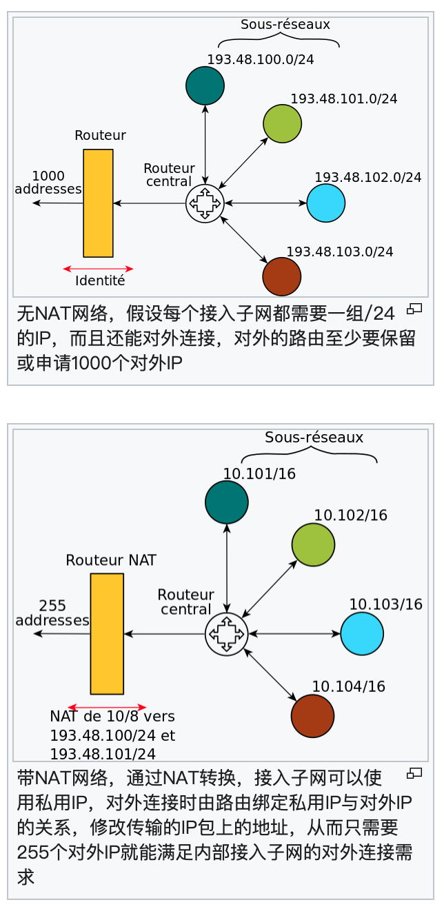

## 互联网协议（三）

之前两篇文章[互联网协议（一）](./2018-7-23-互联网协议1.md) 和 [互联网协议（二）](./2018-8-12-互联网协议2.md)。分别介绍了互联网分层模型和局域网通讯。接下来的文章介绍一下，网络层 IP 协议。先上个预告，后续会再分别介绍 TCP 协议 和 UDP 协议。

### IP 协议

概念：

> **IP地址**（英语：IP Address，全称Internet Protocol Address），又译为**网际协议地址**、**互联网协议地址**。当设备连接网络，设备将被分配一个IP地址，用作标识。通过IP地址，设备间可以互相通讯，如果没有IP地址，我们将无法知道哪个设备是发送方，无法知道哪个是接收方。[[2\]](https://zh.wikipedia.org/wiki/IP地址#cite_note-:0-2) IP地址有两个主要功能：**标识设备或网络** 和 **[寻址](https://zh.wikipedia.org/wiki/網路位址)**（英语：location addressing）。
>
> 常见的IP地址分为 [IPv4](https://zh.wikipedia.org/wiki/IPv4) 与 [IPv6](https://zh.wikipedia.org/wiki/IPv6) 两大类，IP地址由一串数字组成。[IPv4](https://zh.wikipedia.org/wiki/IPv4) 由十进制数字组成，并以点分隔，如：`172.16.254.1` ； [IPv6](https://zh.wikipedia.org/wiki/IPv6) 由十六进制数字组成，以冒号分割，如：`2001:db8:0:1234:0:567:8:1`。

上一篇局域网通讯中也涉及到了 IP 地址，但是没有展开。这里我们就专门聊一下这个话题。

#### IPv4 地址

##### 格式：

|                             格式                             |          值           |       从点分十进制转换       |
| :----------------------------------------------------------: | :-------------------: | :--------------------------: |
|    [点分十进制](https://zh.wikipedia.org/wiki/点分十进制)    |     `192.0.2.235`     |            不适用            |
| 点分十六进制[[2\]](https://zh.wikipedia.org/wiki/IPv4#cite_note-inet-2) | `0xC0.0x00.0x02.0xEB` | 每个字节被单独转换为十六进制 |
| 点分八进制[[2\]](https://zh.wikipedia.org/wiki/IPv4#cite_note-inet-2) | `0300.0000.0002.0353` |  每个字节被单独转换为八进制  |
|      [十六进制](https://zh.wikipedia.org/wiki/十六进制)      |     `0xC00002EB`      |    将点分十六进制连在一起    |
|        [十进制](https://zh.wikipedia.org/wiki/十进制)        |     `3221226219`      |    用十进制写出的32位整数    |
|        [八进制](https://zh.wikipedia.org/wiki/八进制)        |    `030000001353`     |    用八进制写出的32位整数    |

##### 分类：

| 前8位地址范围 |  类  |                  路由形式                  | 占地址总空间的比例 |
| :-----------: | :--: | :----------------------------------------: | :----------------: |
|     0-127     |  A   | [单播](https://zh.wikipedia.org/wiki/單播) |        1/2         |
|    128-191    |  B   | [单播](https://zh.wikipedia.org/wiki/單播) |        1/4         |
|    192-223    |  C   | [单播](https://zh.wikipedia.org/wiki/單播) |        1/8         |
|    224-239    |  D   | [多播](https://zh.wikipedia.org/wiki/多播) |        1/16        |
|    240-255    |  E   |                     -                      |        1/16        |

| **类别** | **w 的值** | **网络 ID 部分** | **主机 ID 部分** | **网络 ID 数** | **每个网络的主机 ID 数** |
| -------- | ---------- | ---------------- | ---------------- | -------------- | ------------------------ |
| A        | 1-126      | w                | x.y.z            | 126            | 16 777 214               |
| B        | 128-191    | w.x              | y.z              | 16 384         | 65 534                   |
| C        | 192-223    | w.x.y            | z                | 2 097 152      | 254                      |

通过对 IP 地址的分类，我们能够更合理地分配 IP 地址块，不过虽然它对 IP 地址进行了分类，但是**分类网络架构（Classful Network Architecture）**中过小的地址块往往不够用、稍大的地址块却会造成较大的浪费。IETF 在 1993 年提出的**无类别域间路由（Classless Inter-Domain Routing、CIDR）**取而代之，CIDR 基于**可变长子网掩码（Variable-length Subnet Masking、VLSM）**它的主要目的有：

1. 缓解互联网中路由器中转发表的增长速度；
2. 缓解 IPv4 地址耗尽的速度；

分类网络架构可以理解为只使用 8、16 和 24 固定长度的子网掩码将 IP 地址块划分成三类。CIDR 可以使用其他的数字更灵活的划分地址块，表示特定网络数和主机数的子网。如下所示的 CIDR 表示中，N 表示前缀长度，它可以是从 0 到 32 的任意值：

```
	A.B.C.D/N

  A.B.C.D/8
  A.B.C.D/16
  A.B.C.D/24
分别表示分类网络架构中的 A、B 和 C 三类不同的地址块
```

> 任意两个IP地址是否处在同一个子网络。如果不在一个子网络就需要通过网关转发。也就是说，接收方的MAC地址将是网关的MAC地址。
>
> 计算方法是：
>
> 将两个IP地址与子网掩码分别进行AND运算（两个数位都为1，运算结果为1，否则为0），然后比较结果是否相同，如果是的话，就表明它们在同一个子网络中，否则就不是。


##### 特殊用途的地址：

| [CIDR](https://zh.wikipedia.org/wiki/CIDR)地址块 |                             描述                             |                    参考资料                     |
| :----------------------------------------------: | :----------------------------------------------------------: | :---------------------------------------------: |
|                    0.0.0.0/8                     |                 本网络（仅作为源地址时合法）                 | [RFC 6890](https://tools.ietf.org/html/rfc6890) |
|                    10.0.0.0/8                    |      [专用网络](https://zh.wikipedia.org/wiki/专用网络)      | [RFC 1918](https://tools.ietf.org/html/rfc1918) |
|                  100.64.0.0/10                   |     [电信级NAT](https://zh.wikipedia.org/wiki/电信级NAT)     | [RFC 6598](https://tools.ietf.org/html/rfc6598) |
|                   127.0.0.0/8                    | [环回](https://zh.wikipedia.org/wiki/Localhost)（主要用于检查TCP/IP协议栈是否正确运行和本机对本机的链接。） | [RFC 5735](https://tools.ietf.org/html/rfc5735) |
|                  169.254.0.0/16                  |    [链路本地](https://zh.wikipedia.org/wiki/链路本地地址)    | [RFC 3927](https://tools.ietf.org/html/rfc3927) |
|                  172.16.0.0/12                   |      [专用网络](https://zh.wikipedia.org/wiki/专用网络)      | [RFC 1918](https://tools.ietf.org/html/rfc1918) |
|                   192.0.0.0/24                   |                         保留（IANA）                         | [RFC 5735](https://tools.ietf.org/html/rfc5735) |
|                   192.0.2.0/24                   |                    TEST-NET-1，文档和示例                    | [RFC 5735](https://tools.ietf.org/html/rfc5735) |
|                  192.88.99.0/24                  |        [6to4](https://zh.wikipedia.org/wiki/6to4)中继        | [RFC 3068](https://tools.ietf.org/html/rfc3068) |
|                  192.168.0.0/16                  |      [专用网络](https://zh.wikipedia.org/wiki/专用网络)      | [RFC 1918](https://tools.ietf.org/html/rfc1918) |
|                  198.18.0.0/15                   |                         网络基准测试                         | [RFC 2544](https://tools.ietf.org/html/rfc2544) |
|                 198.51.100.0/24                  |                    TEST-NET-2，文档和示例                    | [RFC 5737](https://tools.ietf.org/html/rfc5737) |
|                  203.0.113.0/24                  |                    TEST-NET-3，文档和示例                    | [RFC 5737](https://tools.ietf.org/html/rfc5737) |
|                   224.0.0.0/4                    | [多播](https://zh.wikipedia.org/wiki/多播)（之前的D类网络）  | [RFC 3171](https://tools.ietf.org/html/rfc3171) |
|                   240.0.0.0/4                    |                    保留（之前的E类网络）                     | [RFC 1700](https://tools.ietf.org/html/rfc1700) |
|                255.255.255.255/32                |      [受限广播](https://zh.wikipedia.org/wiki/受限广播)      |  [RFC 919](https://tools.ietf.org/html/rfc919)  |


#### IPv4 报文结构




#### IPv6 地址

##### 格式：

IPv6二进位制下为128位长度，以16位为一组，每组以冒号“:”隔开，可以分为8组，每组以4位[十六进制](https://zh.wikipedia.org/wiki/十六進制)方式表示。

```
同时IPv6在某些条件下可以省略：
    1. 每项数字前导的0可以省略，省略后前导数字仍是0则继续，例如下组IPv6是等价的。
      2001:0DB8:02de:0000:0000:0000:0000:0e13
      2001:DB8:2de:0000:0000:0000:0000:e13
      2001:DB8:2de:000:000:000:000:e13
      2001:DB8:2de:00:00:00:00:e13
      2001:DB8:2de:0:0:0:0:e13
    2. 可以用双冒号“::”表示一组0或多组连续的0，但只能出现一次：
      1. 如果四组数字都是零，可以被省略。遵照以上省略规则，下面这两组IPv6都是相等的。
        2001:DB8:2de:0:0:0:0:e13
        	2001:DB8:2de::e13
        2001:0DB8:0000:0000:0000:0000:1428:57ab
          2001:0DB8:0000:0000:0000::1428:57ab
          2001:0DB8:0:0:0:0:1428:57ab
          2001:0DB8:0::0:1428:57ab
          2001:0DB8::1428:57ab
      2. 2001::25de::cade 是非法的，因为双冒号出现了两次。它有可能是下种情形之一，造成无法推断。
          2001:0000:0000:0000:0000:25de:0000:cade
          2001:0000:0000:0000:25de:0000:0000:cade
          2001:0000:0000:25de:0000:0000:0000:cade
          2001:0000:25de:0000:0000:0000:0000:cade
      3. 如果这个地址实际上是IPv4的地址，后32位可以用10进制数表示；
      	 因此::ffff:192.168.89.9 相等于::ffff:c0a8:5909。
另外，::ffff:1.2.3.4 格式叫做IPv4映射地址。
```


##### 分类：

1. [单播](https://zh.wikipedia.org/wiki/單播)（unicast）地址

   单播地址标示一个网络接口。协议会把送往地址的数据包送往给其接口。IPv6的单播地址可以有一个代表特殊地址名字的范畴，如链路本地地址（link local address）和唯一区域地址（ULA，unique local address）。单播地址包括可聚类的全球单播地址、链路本地地址等。

2. [任播](https://zh.wikipedia.org/wiki/任播)（anycast）地址

   任播像是Unicast（单点传播）与Broadcast（多点广播）的综合。单点广播在来源和目的地间直接进行通信；多点广播存在于单一来源和多个目的地进行通信。

   而Anycast则在以上两者之间，它像多点广播（Broadcast）一样，会有一组接收节点的地址列表，但指定为Anycast的数据包，只会发送给距离最近或发送成本最低（根据路由表来判断）的其中一个接收地址，当该接收地址收到数据包并进行回应，且加入后续的传输。该接收列表的其他节点，会知道某个节点地址已经回应了，它们就不再加入后续的传输作业。

   以目前的应用为例，Anycast地址只能分配给中间设备（如路由器、三层交换机等），不能分配给终端设备（手机、电脑等），而且不能作为发送端的地址。

3. [多播](https://zh.wikipedia.org/wiki/多播)（multicast）地址

   多播地址也称组播地址。多播地址也被指定到一群不同的接口，送到多播地址的数据包会被发送到所有的地址。多播地址由皆为一的字节起始，亦即：它们的前置为FF00::/8。其第二个字节的最后四个比特用以标明"范畴"。

   一般有node-local(0x1)、link-local(0x2)、site-local(0x5)、organization-local(0x8)和global(0xE)。多播地址中的最低112位会组成多播组群标识符，不过因为传统方法是从[MAC地址](https://zh.wikipedia.org/wiki/MAC位址)产生，故只有组群标识符中的最低32位有使用。定义过的组群标识符有用于所有节点的多播地址0x1和用于所有路由器的0x2。

   另一个多播组群的地址为"solicited-node多播地址"，是由前置FF02::1:FF00:0/104和剩余的组群标识符（最低24位）所组成。这些地址允许经由[邻居发现协议](https://zh.wikipedia.org/wiki/邻居发现协议)（NDP，Neighbor Discovery Protocol）来解译链接层地址，因而不用干扰到在区网内的所有节点。

##### 特殊用途的地址：

- 未指定地址：`::/128`－所有比特皆为零的地址称作未指定地址。

- [链路本地地址](https://zh.wikipedia.org/wiki/链路本地地址)

  - `::1/128`－是一种单播[绕回](https://zh.wikipedia.org/wiki/回环)地址。如果一个应用程序将数据包送到此地址，IPv6堆栈会转送这些数据包绕回到同样的虚拟接口（相当于IPv4中的[127.0.0.1/8](https://zh.wikipedia.org/wiki/127.0.0.1)）。
  - `fe80::/10`－这些链路本地地址指明，这些地址只在区域连线中是合法的，这有点类似于IPv4中的`169.254.0.0/16`。

- 唯一区域地址

  `fc00::/7`－[唯一区域地址](https://zh.wikipedia.org/w/index.php?title=唯一區域位址&action=edit&redlink=1)（ULA，unique local address）只可用于本地通信，类似于[IPv4](https://zh.wikipedia.org/wiki/IPv4)的[专用网络](https://zh.wikipedia.org/wiki/专用网络)地址10.0.0.0/8、*172.16.0.0/12和192.168.0.0/16*。这定义在RFC 4193中，是用来取代站点本地位域。这地址包含一个40比特的[伪随机数](https://zh.wikipedia.org/wiki/伪随机数)，以减少当网站合并或数据包误传到网络时碰撞的风险。这些地址除了只能用于区域外，还具备全局性的范畴，这点违反了唯一区域位域所取代的站点本地地址的定义。

- 多播地址

  `ff00::/8`－这个前置表明定义在"IP Version 6 Addressing Architecture"（[RFC 4291](https://tools.ietf.org/html/rfc4291)）中的[多播地址](https://zh.wikipedia.org/w/index.php?title=多播位址&action=edit&redlink=1)[[12\]](https://zh.wikipedia.org/wiki/IPv6#cite_note-ipv6multicast-12)。其中，有些地址已用于指定特殊协议，如`ff0X::101`对应所有区域的NTP服务器（[RFC 2375](https://tools.ietf.org/html/rfc2375)）。

- 请求节点多播地址（Solicited-node multicast address）

  `ff02::1:FFXX:XXXX`－XX:XXXX为相对应的单播或任播地址中的三个最低的字节。

- IPv4转译地址

  `::ffff:x.x.x.x/96`－用于[IPv4映射地址](https://zh.wikipedia.org/w/index.php?title=IPv4映射位址&action=edit&redlink=1)。（参见以下的[转换机制](https://zh.wikipedia.org/wiki/IPv6#转换机制)）。
  `2001::/32`－用于[Teredo隧道](https://zh.wikipedia.org/wiki/Teredo隧道)。
  `2002::/16`－用于[6to4](https://zh.wikipedia.org/wiki/6to4)。

#### IPv6 报文结构

```
   +-+-+-+-+-+-+-+-+-+-+-+-+-+-+-+-+-+-+-+-+-+-+-+-+-+-+-+-+-+-+-+-+
   |Version| Traffic Class |           Flow Label                  |
   +-+-+-+-+-+-+-+-+-+-+-+-+-+-+-+-+-+-+-+-+-+-+-+-+-+-+-+-+-+-+-+-+
   |         Payload Length        |  Next Header  |   Hop Limit   |
   +-+-+-+-+-+-+-+-+-+-+-+-+-+-+-+-+-+-+-+-+-+-+-+-+-+-+-+-+-+-+-+-+
   |                                                               |
   +                                                               +
   |                                                               |
   +                         Source Address                        +
   |                                                               |
   +                                                               +
   |                                                               |
   +-+-+-+-+-+-+-+-+-+-+-+-+-+-+-+-+-+-+-+-+-+-+-+-+-+-+-+-+-+-+-+-+
   |                                                               |
   +                                                               +
   |                                                               |
   +                      Destination Address                      +
   |                                                               |
   +                                                               +
   |                                                               |
   +-+-+-+-+-+-+-+-+-+-+-+-+-+-+-+-+-+-+-+-+-+-+-+-+-+-+-+-+-+-+-+-+
```


> **现在大家都在用 IPv6 了吗？**
>
> 答案是：并没有。
>
> IPv6 协议在设计时就没有考虑与更早版本协议的兼容性。虽然 IPv4 和 IPv6 虽然都是 IP 协议，不过因为它们两者互不兼容，所以我们只能通过
>
> - 双协议栈
> - 隧道技术
> - NAT64 
>
> 实现协议的过渡。
>
> 早在 2011 年，顶级的 IPv4 地址就已经被全部分配出去了。**网络地址转换**（Network Address Translation、NAT）缓解了 IPv4 地址短缺的问题。
>
> 


### 参考文献

- [Classless_Inter-Domain_Routing](https://en.wikipedia.org/wiki/Classless_Inter-Domain_Routing)
- [ipv6](https://zh.wikipedia.org/wiki/IPv6)
- [ipv4](https://zh.wikipedia.org/wiki/IPv4)
- [NAT](https://zh.wikipedia.org/wiki/%E7%BD%91%E7%BB%9C%E5%9C%B0%E5%9D%80%E8%BD%AC%E6%8D%A2#%E7%BD%91%E7%BB%9C%E5%9C%B0%E5%9D%80%E7%AB%AF%E5%8F%A3%E8%BD%AC%E6%8D%A2%EF%BC%88NAPT%EF%BC%89)
- [RFC 2460](https://tools.ietf.org/html/rfc2460)
-  [Biggest mistake for IPv6: It's not backwards compatible, developers admit](https://www.networkworld.com/article/2265836/biggest-mistake-for-ipv6--it-s-not-backwards-compatible--developers-admit.html)

