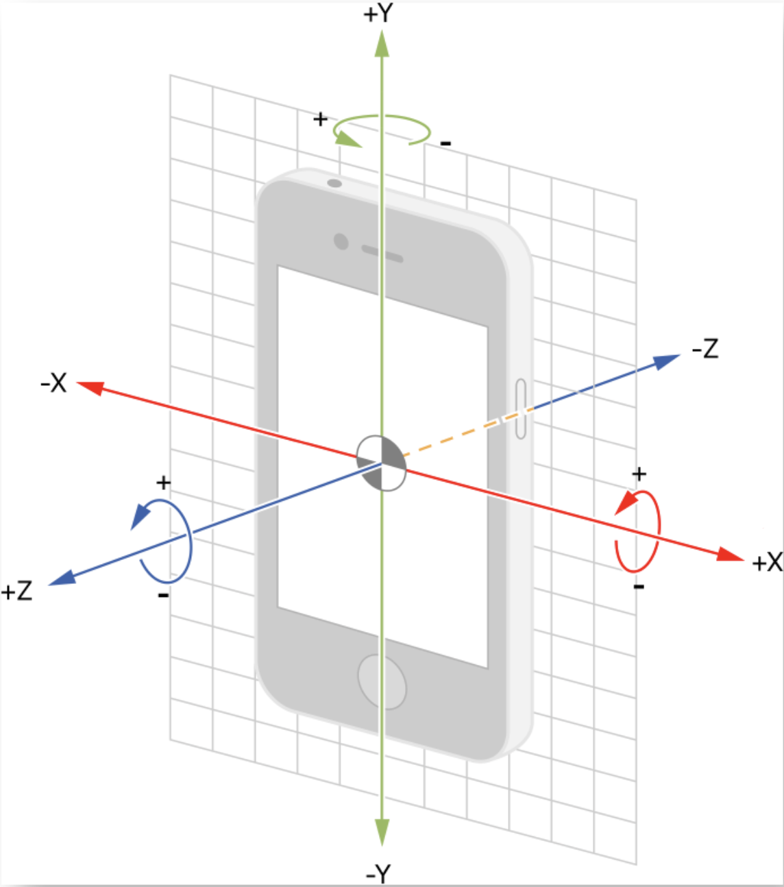

iOS 实现摇一摇

[toc]




### 第一种实现方式 

把响应摇一摇的 VC 变成第一响应者

```objective-c
- (void)viewDidLoad {
    [super viewDidLoad];
    // // 设置允许摇一摇功能 
    [UIApplication sharedApplication].applicationSupportsShakeToEdit = YES;
    [self becomeFirstResponder];
    // ...
}

- (void)viewWillDisappear:(BOOL)animated {
    [super viewWillDisappear:animated];
    
    [self resignFirstResponder];
    // ...
}
```


监听摇一摇的回调

```objective-c
- (void)motionBegan:(UIEventSubtype)motion withEvent:(UIEvent *)event { 
    // 检测到摇动开始
    if (motion == UIEventSubtypeMotionShake) {
    		NSLog(@"开始摇动");  
    }
    return;  
}  

- (void)motionCancelled:(UIEventSubtype)motion withEvent:(UIEvent *)event {  
    NSLog(@"取消摇动");  
    return;  
}  

- (void)motionEnded:(UIEventSubtype)motion withEvent:(UIEvent *)event {  
    if (event.subtype == UIEventSubtypeMotionShake) { // 判断是否是摇动结束  
        NSLog(@"摇动结束");  
    }  
    return;  
}  
```


### 第二种基于 CoreMotion 库的加速器

导入 `#import <CoreMotion/CoreMotion.h>`头文件。震动效果需要导入 `#import <AudioToolbox/AudioToolbox.h>`

```objective-c
@interface CustomMotionSensor : NSObject

  /// 开启监听加速器
- (void)startAccelerometerUpdatesWithInteractType:(MotionSensorInteractType)interactType
                                     timeInterval:(NSTimeInterval)timeInterval
                                       completion:(MotionSensorCompletion)completion;

/// 停止加速器
- (void)stopAccelerometer;

@end

typedef void(^MotionSensorCompletion)(void);

@interface CustomMotionSensor ()

/// motionManager
@property (nonatomic, strong) CMMotionManager *motionManager;
@property (nonatomic, strong) NSOperationQueue *motionOperationQueue;
@property (nonatomic, copy) MotionSensorCompletion mCompletion;

@end
  
@implementation CustomMotionSensor

#pragma mark - Initialize
- (instancetype)init {
    self = [super init];
    if (self) {
        [self configMotionSensor];
    }
    return self;
}

- (void)configMotionSensor {
    self.motionManager = [[CMMotionManager alloc] init];
    self.motionOperationQueue = [[NSOperationQueue alloc] init];
    Log(@"[CustomMotionSensor] Initialize!");
}

#pragma mark - public of accelerometer
- (void)startAccelerometerUpdatesWithInteractType:(MotionSensorInteractType)interactType
                                     timeInterval:(NSTimeInterval)timeInterval
                                       completion:(MotionSensorCompletion)completion {
    // motionManager instance
    if (!self.motionManager) {
        self.motionManager = [[CMMotionManager alloc] init];
        Log(@"[MotionSensor] motion error: CMMotionManager instance can not be nil");
    }
    // Available
    if (self.motionManager.accelerometerAvailable && !self.motionManager.isAccelerometerActive) {
        // set timeInterval 加速仪更新频率，以秒为单位
        self.motionManager.accelerometerUpdateInterval = timeInterval > 0 ? timeInterval : 0.2;
        
        // call back
        __weak typeof(self) _self = self;;
        [self.motionManager startAccelerometerUpdatesToQueue:self.motionOperationQueue withHandler:^(CMAccelerometerData * _Nullable accelerometerData, NSError * _Nullable error) {
           __strong typeof(_self) self = _self;
            if (error) {
                // 停止更新加速仪
								[self.motionManager stopAccelerometerUpdates];
                Log(@"[MotionSensor] Motion error: %@", error.localizedDescription);
            } else {
                self.mCompletion = completion;
                [self outputAccelertionData:accelerometerData.acceleration];
            }
        }];
    } else {
        Log(@"[MotionSensor] Motion Unavailable!");
    }
}
// 停止更新加速仪
- (void)stopAccelerometer {
    if (self.motionManager.isAccelerometerActive) {
        Log(@"[MotionSensor] Motion Stop");
        [self.motionManager stopAccelerometerUpdates];
    } else {
        Log(@"[MotionSensor] Motion Unactive!");
    }
}

#pragma mark - private
- (void)outputAccelertionData:(CMAcceleration)acceleration {
    // 综合3个方向的加速度
    double accelerameter = sqrt(pow(acceleration.x,2) + pow(acceleration.y,2) + pow(acceleration.z,2));
    // 当综合加速度大于2时，就激活效果（此数值根据需求可以调整，数据越小，用户摇动的动作就越小，越容易激活，反之加大难度，但不容易误触发）
    if(accelerameter > 2) {
        // 立即停止更新加速仪
        [self.motionManager stopAccelerometerUpdates];
        [self motionInteractNotice];
    }
}

- (void)motionInteractNotice {
    if (![NSThread isMainThread]) {
        dispatch_sync(dispatch_get_main_queue(), ^{
            [self motionCallBack];
        });
    } else {
        [self motionCallBack];
    }
}
- (void)motionCallBack {
    Log(@"[MotionSensor] Motion Click Call");
    AudioServicesPlaySystemSoundWithCompletion(kSystemSoundID_Vibrate, nil);
    if (self.mCompletion) {
        self.mCompletion();
        Log(@"[MotionSensor] Motion Click Real");
    }
}

@end
```

注意 `stopAccelerometerUpdates`  的时机需要根据具体场景和需求处理。


### 参考

- [iOS通过加速计计算摇一摇次数](https://juejin.cn/post/6844903640159748110)

  > 几个优化点： 
  >
  > 1. 通过加速度乘时间获取位移速度，在本方案的基础上加上位移的判断。 
  > 2. 减去默认存在的重力加速度（我暂时没找到减去默认存在的重力加速度）。

- [怎么在iOS中使用CoreMotion实现摇一摇功能](https://m.yisu.com/zixun/197744.html)

  > 1) 摇一摇动作捕捉——如果仅是以加速度大小来判定，有可能用户突然快速移动手机时就激活了摇动，但用户比较稍稍慢一些来回晃动手机却不会激活，可能与用户期望的稍微有出入。系统的ShakeToEdit就能做得比较到位。我们可以结合定时器与加速度的正反方向来更精确判定用户的摇一摇动作，例如：综合加速度改为带方向的向量，然后当1.5秒内有相反两个方向大于某个数值的加速度，才算为一个摇动行为。这个1.5秒时间需要通过实际测试来取值，当某次取得的加速度值大于某个值开始统计下一个加速度向量，此值也需要实测来取值，可能1.5左右就够了。
  > 2) App状态更改——如果激活的摇一摇是个长时间等待行为，例如弹出ActionSheet让用户选择操作。在用户进行下一步操作前，ActionSheet没消失前，不应该启动下一次监听，包括应用从后台回到当前状态后，也要判断用户是否有过下一步行为。

---

### 2021.10.8 震动反馈的补充

#### Taptic Engine

*TAPTIC ENGINE* 伴随着iPhone 不断升级，如下为 iPhone 13 的  比 iPhone 12 更小更强大


##### 1 获取 `_tapticEngine`

```objective-c
id tapticEngine = [[UIDevice currentDevice] performSelector: NSSelectorFromString(@"_tapticEngine")
              withObject:nil];
[tapticEngine performSelector: NSSelectorFromString(@"actuateFeedback:")
      withObject:@(0)];
```


```objective-c
id tapticEngine = [[UIDevice currentDevice] performSelector: NSSelectorFromString(@"_tapticEngine")
              withObject:nil];

SEL selector = NSSelectorFromString(@"actuateFeedback:");
int32_t arg = 1001;
 
NSInvocation *inv = [NSInvocation invocationWithMethodSignature:[tapticEngine methodSignatureForSelector:selector]];
[inv setTarget:tapticEngine];
[inv setSelector:selector];
[inv setArgument:&arg atIndex:2];
[inv invoke];
```

| iPhone 7（iOS 10）      | 无振动 |
| ----------------------- | ------ |
| iPhone 6s Puls（iOS 9） | 长振   |
| iPhone 6（iOS 10）      | 无振动 |


##### 2 UIImpactFeedbackGenerator

> [Using Feedback Generators](https://developer.apple.com/documentation/uikit/uifeedbackgenerator?language=objc#2555399)
>
> [Haptics](https://developer.apple.com/design/human-interface-guidelines/ios/user-interaction/haptics/) 触摸反馈

```objective-c
/*
typedef NS_ENUM(NSInteger, UIImpactFeedbackStyle) {
    UIImpactFeedbackStyleLight,
    UIImpactFeedbackStyleMedium,
    UIImpactFeedbackStyleHeavy,
    UIImpactFeedbackStyleSoft     API_AVAILABLE(ios(13.0)),
    UIImpactFeedbackStyleRigid    API_AVAILABLE(ios(13.0))
};
*/

if (@available(iOS 10.0, *)) {
    UIImpactFeedbackGenerator *generator = [[UIImpactFeedbackGenerator alloc] initWithStyle: UIImpactFeedbackStyleLight];

    // Calling the generator’s prepare method puts the Taptic Engine in a prepared state.
    [generator prepare];

    [generator impactOccurred];
} else {
    //
}
```


| UIImpactFeedbackGenerator | Light    | Medium   | Heavy    |
| :------------------------ | :------- | :------- | :------- |
| iPhone 7（iOS 10）        | 微弱短振 | 中等短振 | 明显短振 |
| iPhone 6s Puls（iOS 9）   | 长振     | 长振     | 长振     |
| iPhone 6（iOS 10）        | 无振动   | 无振动   | 无振动   |

UIFeedbackGenerator 可以帮助实现 haptic feedback。它的要求是：

- 支持 Taptic Engine 机型 (iPhone 7 以及 iPhone 7 Plus).
- app 需要在前台运行
- 系统 Haptics setting 需要开启


##### 3 AudioServicesPlaySystemSound

```objective-c

// 普通短震，3D Touch 中 Peek 震动反馈
AudioServicesPlaySystemSound(1519);
// 普通短震，3D Touch 中 Pop 震动反馈
AudioServicesPlaySystemSound(1520);
// 连续三次短震
AudioServicesPlaySystemSound(1521);
```

| AudioServicesPlaySystemSound | 1519      | 1520     | 1521         |
| :--------------------------- | :-------- | :------- | :----------- |
| iPhone 7（iOS 10）           | peek 触感 | pop 触感 | 三次连续短振 |
| iPhone 6s Puls（iOS 9）      | peek 触感 | pop 触感 | 三次连续短振 |
| iPhone 6（iOS 10）           | 无振动    | 无振动   | 无振动       |
