## 前言：装修设计解剖

在这个系列的第一篇文章 [程序员自装修系列--基础设计](https://dnduuhn.com/2019/01/13/%E7%A8%8B%E5%BA%8F%E5%91%98%E8%87%AA%E8%A3%85%E4%BF%AE%E7%B3%BB%E5%88%97-%E5%9F%BA%E7%A1%80%E8%AE%BE%E8%AE%A1/) 中我已经对家的设计有了初步的了解，接下来希望通过阅读《装修设计解剖书》中摘录的内容结合自身的想法继续写这个系列的文章。

<!-- more -->

## 1. 推开门

### 1.1 玄关

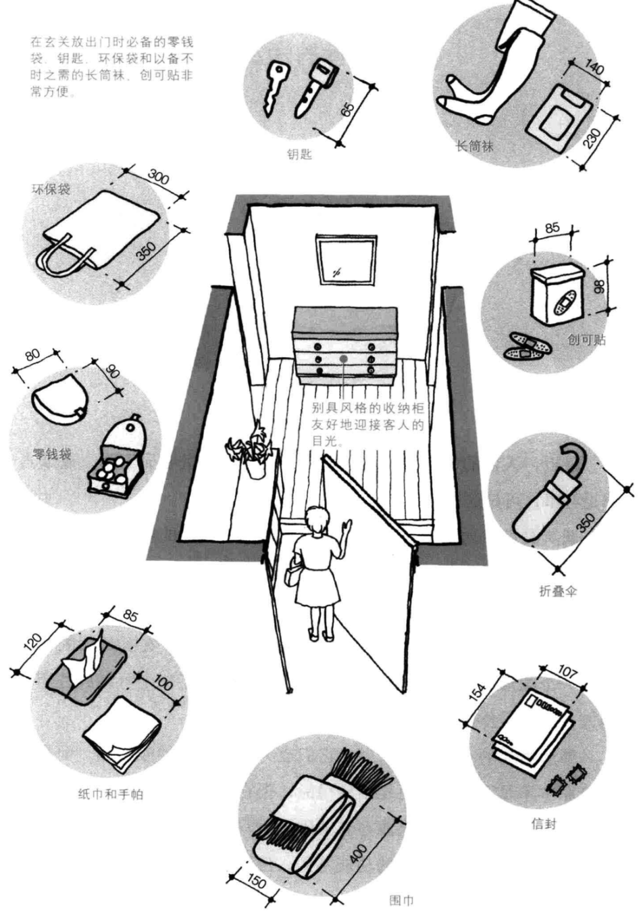

## 2. 餐厅和厨房

餐厅和厨房展现了**吃饭**和**做饭**两大生活核心，毕竟优先解决温饱问题，啧啧啧。。。。

### 2.1 各式各样的厨房

### 2.2 厨房设计中的几个尺寸（单位为 mm）

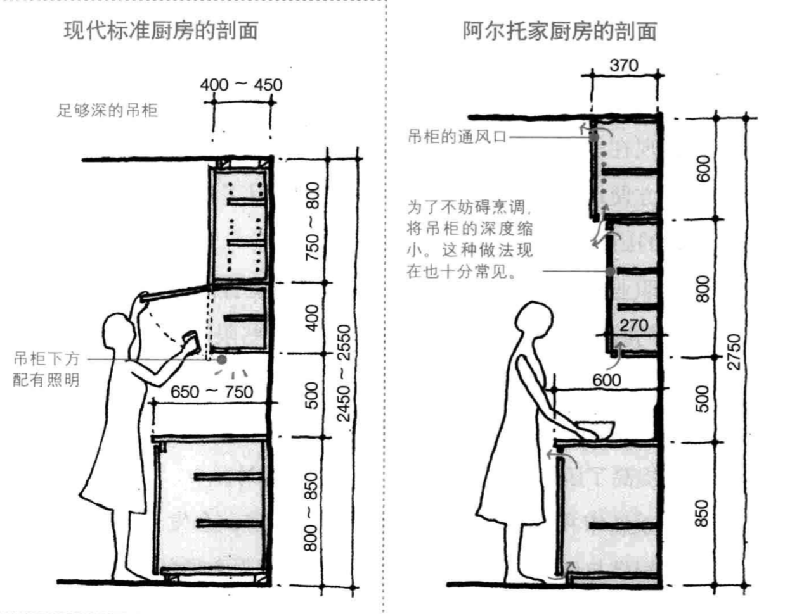

### 2.3 用餐人数决定餐桌的位置与大小

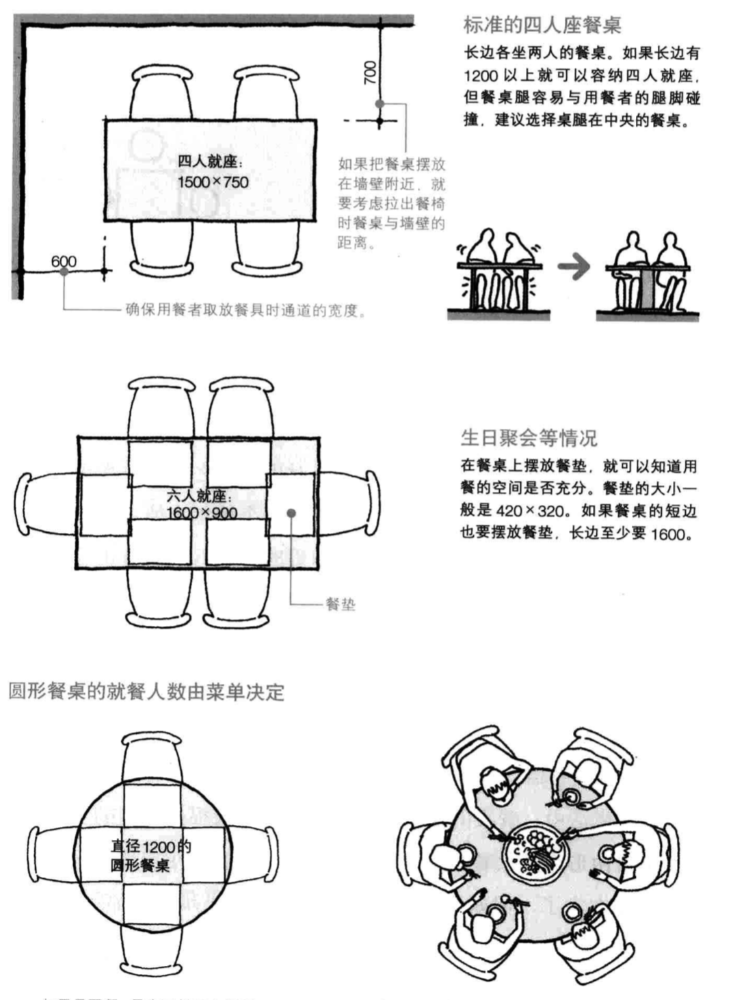

### 2.4 促进食欲的照明

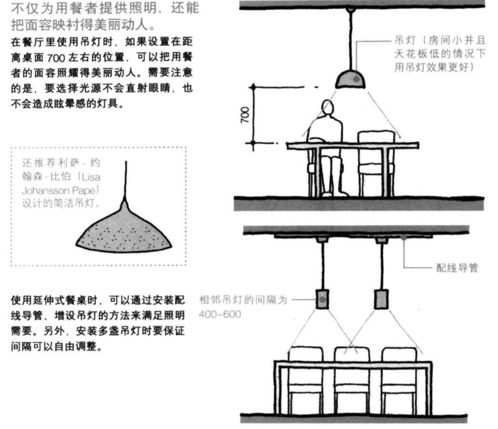

## 3 客厅

现在很多户型看上去都是客厅与餐厅在同一个空间里。我们在装修的时候可能就会根据自己的想法来间隔。

### 3.1 客厅的空间感

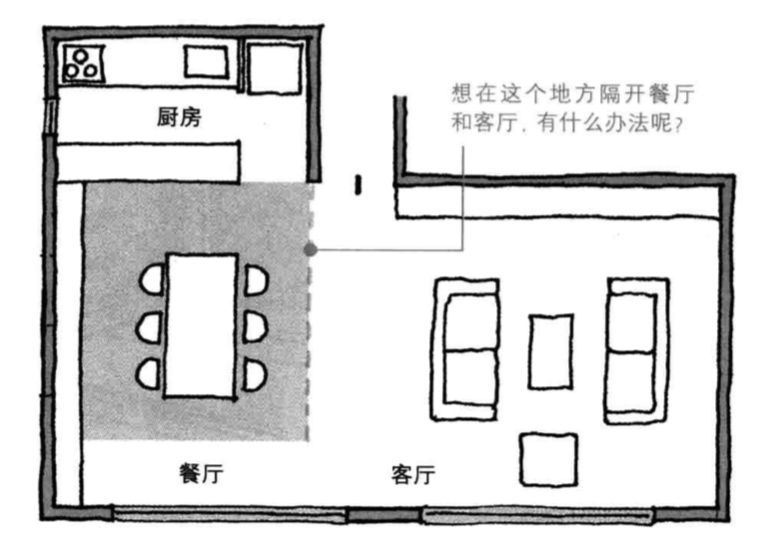

先来看看如下的方法：

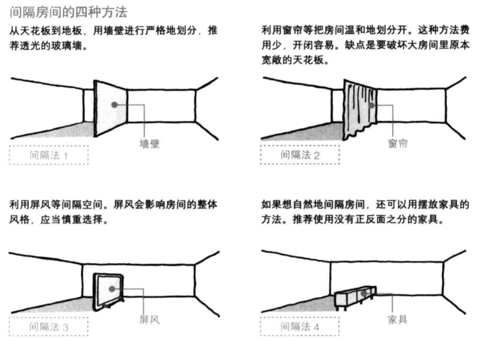

### 3.2 取代书房的大书桌

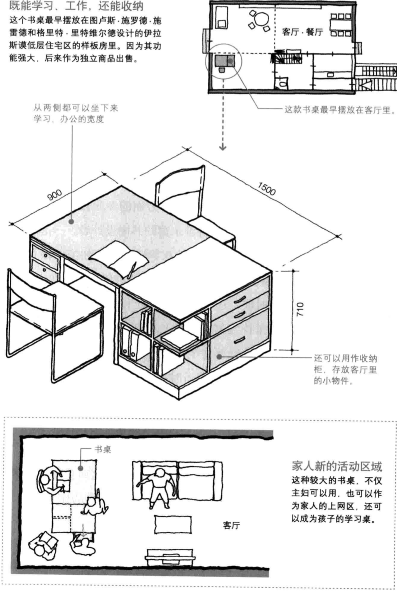

### 3.3 客厅里你可能需要这样几张椅子

## 4. 卧室

### 4.1 床的摆放

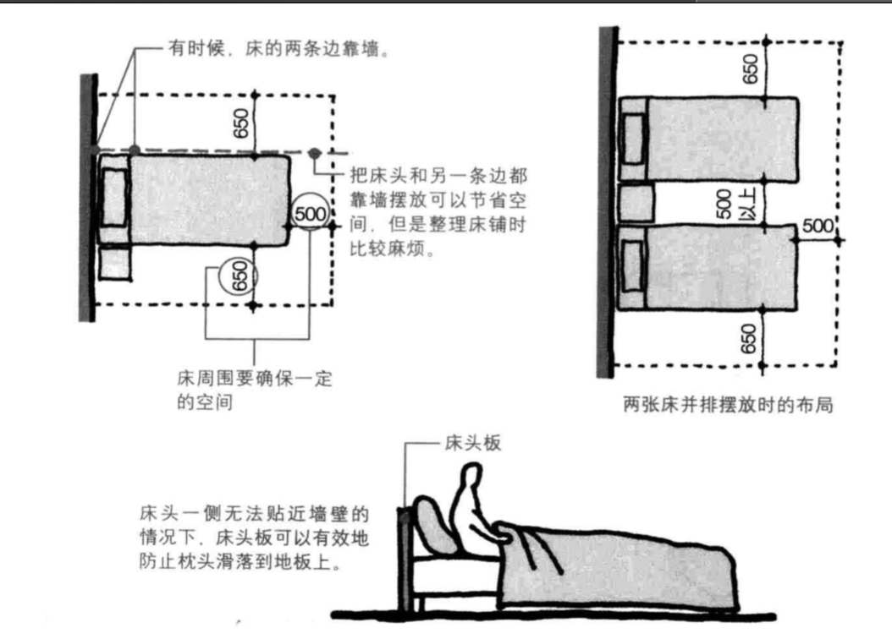

### 4.2 床的尺寸和规格

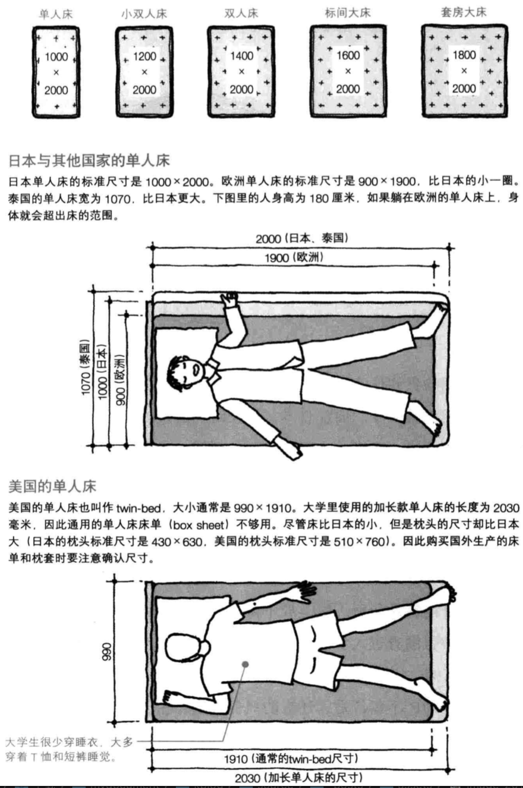

### 4.3 床周围

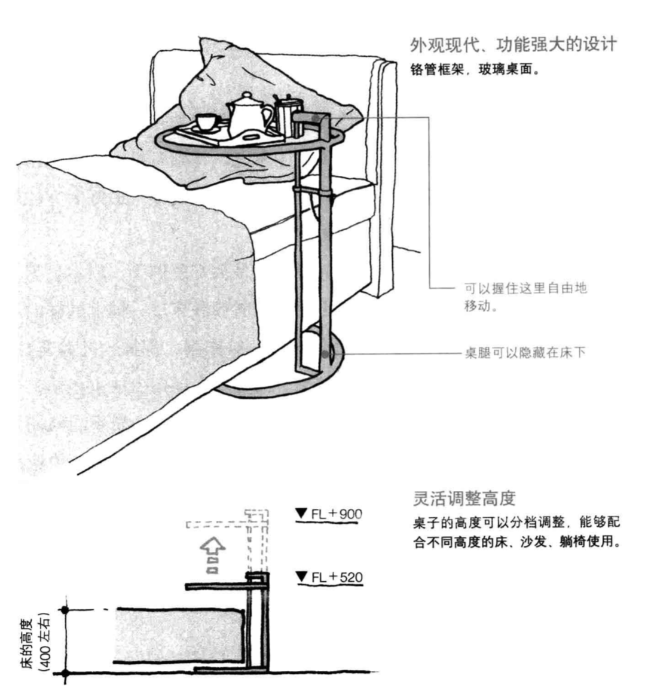

### 4.4 小朋友的卧室

#### 4.4.1 空间感

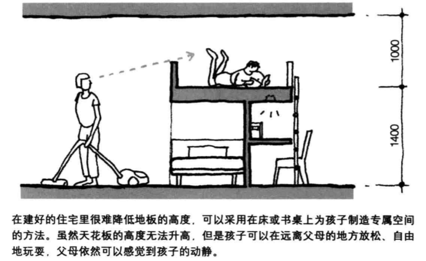

#### 4.4.2 家具的灵活性

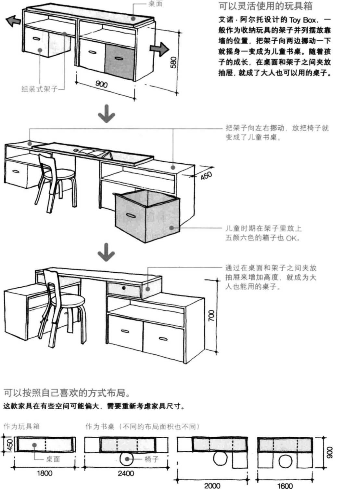

## 5. 照明

### 5.1 天花板上设置照明

#### 5.1.1 并不是只照亮就好

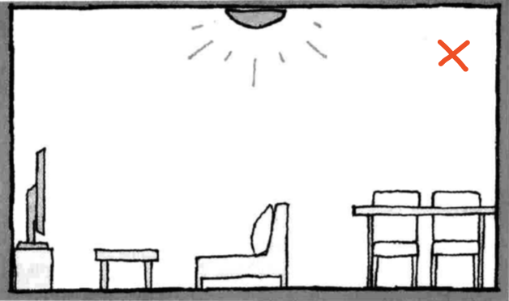

#### 5.1.2 卧室设置照明的注意

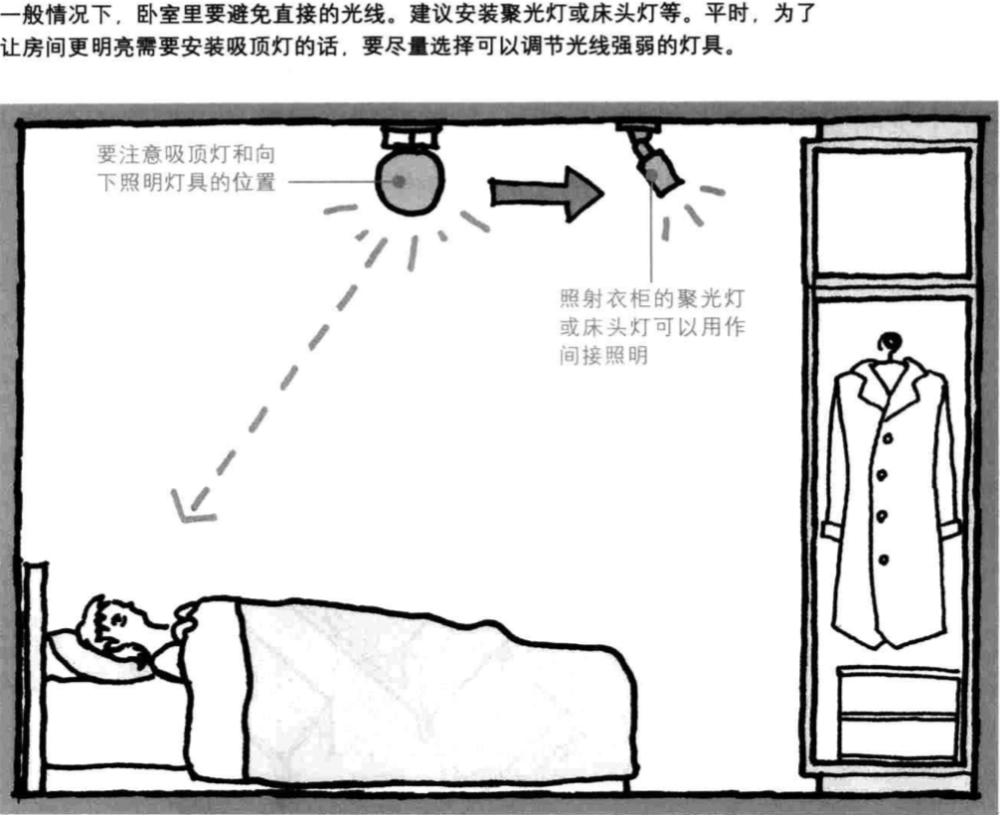

### 5.2 落地灯和台灯

#### 5.2.1 落地灯照向天花板：

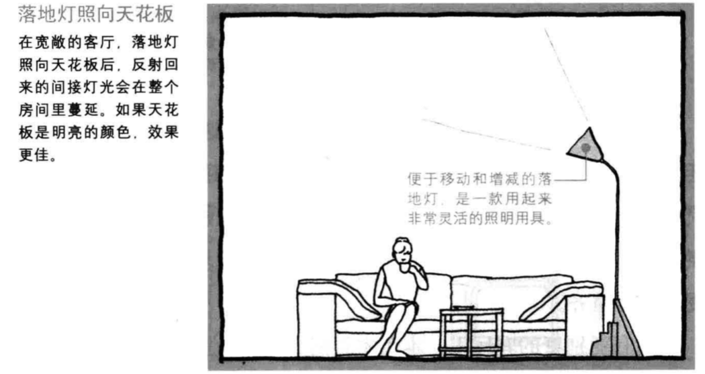

### 5.3 台灯

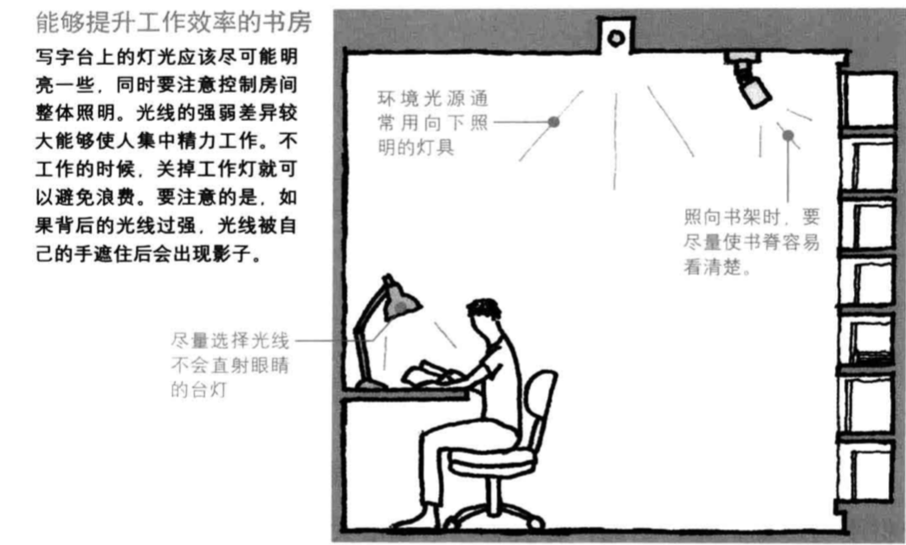

## 参考文献

- 《装修设计解剖书》【日】松下希和 著 温俊杰 译