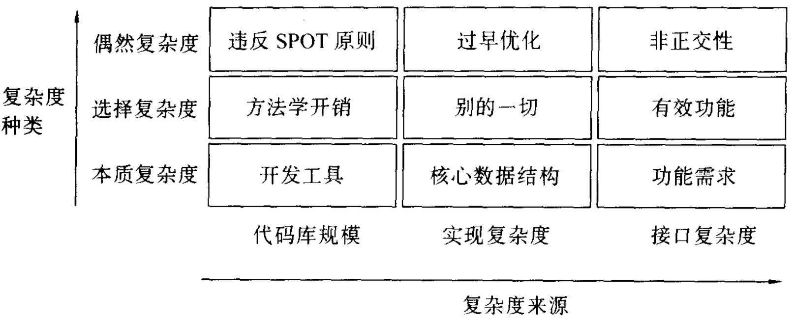
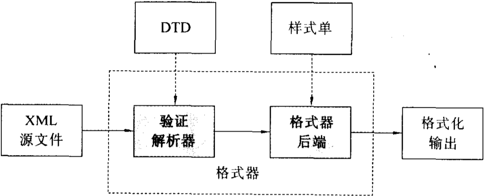
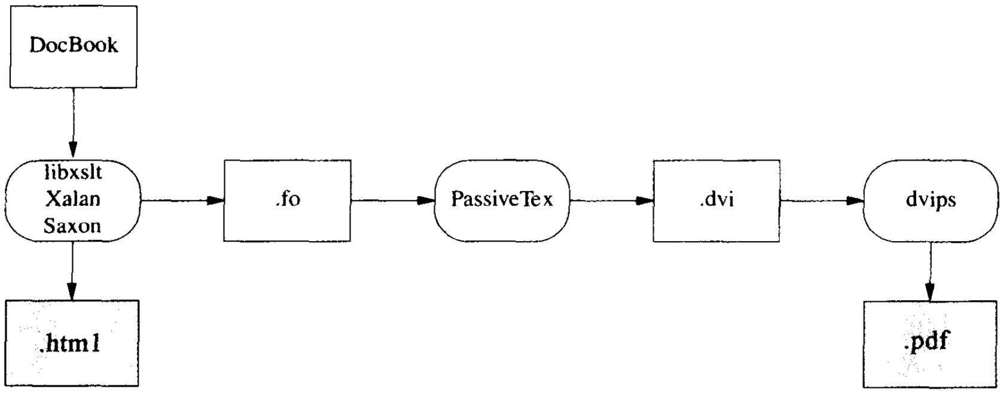
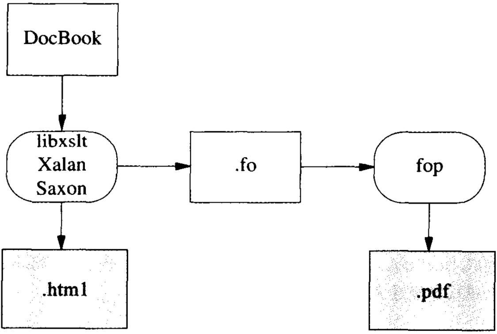

## 前言

《Unix编程艺术》断断续续读了俩月了，通篇读了一遍，有做笔记，有很多地方不明白，因为没有Unix开发的场景，也没有直接的使用 C 语言开发的场景，文中讲述的很多领域专属语言（DSL）以及一些Unix强大的工具、指令包都不甚了解，所以这本书对于我个人而言其实是有难度的。更多的收获应该是对作者的总结、经验的学习以及对程序开发的深入思考。

<!--more-->

## 9 生成：提升规格说明的层次

尽可能把设计的复杂度从程序代码转移到数据中是个好实践，选择便于人类维护和操作的数据表示法也是好实践。

#### 9.1.1 案例分析；ascii

所有字符名的字符串都放在一个表结构中。

这种结构使得增加新字符名、改变现有字符名或删除旧字符名都非常容易，只要简单编辑数据表就行，不需要改动代码。但是输出格式有问题，不能很好地和其他程序合作。

#### 9.1.2 案例分析；统计学的垃圾邮件统计

Paul Graham《A Plan for Spam》（反垃圾邮件计划）

看透模式匹配的诱惑

#### 9.1.3 案例分析；fetchmailconf 中的元类改动

点文件配置器

数据驱动编程--可以分析初始化器形态和成员、自查寻类定义自身成员，然后阻抗匹配这两个集合的代码。

### 9.2 专用代码的生成

#### 9.2.1 案例分析；生成 ascii 显示的代码

任何内嵌用法屏幕的方法显然都会陷入行首或行尾没有足够空间容纳标点的困境。

通过从数据产生代码，我们能够使可编辑的用法屏幕和它的显示一致。

#### 9.2.2 案例分析；为列表生成 HTML 代码

尽可能少干活；

让数据塑造代码；

依靠工具；

把机制从策略中分离；

## 10 配置：迈出正确的第一步

- 启动环境查询
- 交互通道

### 10.1 什么是可配置？

- 对于能够可靠的进行自动检测的东西，就不要提供配置开关。

提高适应能力，除非这样做会产生超过 0.7 秒的延迟。

- 用户不应该看到优化开关。

> make it complicated and hide it（搞复杂后藏起来）

- 能有脚本包装器或简单管道实现的任务，就不要用配置开关实现。

无论何时想增加配置选项，请考虑一下这些比较普遍的问题：

- 能省掉这个功能吗？为什么在加厚手册之外还要加重用户负担？
- 能否用某种无伤大雅的方式改变程序的常规行为从而无需这个选项？
- 这个选项是否花俏没用？是否应该少考虑用户界面的可配置性而多考虑正确性？
- 这个选项附加的行为是否应该用一个独立的程序来代替？

### 10.2 配置在哪里？

控制信息：

- `/etc` 下的运行控制文件（或系统中其他固有位置）
- 由系统设置的环境变量
- 用户主目录中的运行控制文件（或点文件）
- 由用户设置的环境变量
- 启动程序的命令行所传递的开关和参数。

### 10.3 运行控制文件

运行控制文件存放与程序相关的声明或命令，在程序启动时解析。

用户专有配置信息通常存放用户主目录下一个隐藏的控制文件中。此类文件通常叫做”点文件“，这是因为他们利用了Unix 目录列表工具通常通常不显示点开头文件名的约定。

文件或者目录约定俗成的命名方式是：运行控制文件信息的位置和与读取该信息的可执行文件的基本文件名一致。

较老约定：使用可执行文件名后加`rc`后缀代表”运行控制“。

如果作为语言的设计者发现不能用语言本身表达所有的启动设置，Unix 程序员就会认定存在设计问题--应该修改，而不是设计一个特殊的控制语法。

运行控制语法的一些通用的风格规定：

- 支持说明性注释，并以`#`开始。语法也应该忽略`#`前的空白符，这样注释和配置命令才能写在同一行
- 不要区别隐匿的空白符。文件的解释不应该被人眼不能分辨的区别所干扰。
- 把多个空行和注释行视为单个空行
- 词法上把文件视作简单的用空白分隔的标记序列，或多行标记。
- 支持以字符串语法对待内嵌空白符的标记。
- 支持反斜杠语法以在字符串中嵌入不可打印字符和特殊字符。

#### 10.3.1 实例分析： `.netrc` 文件

一组主机、登录、口令的三元组，每个三元组都描述了远程主机上的一个账户。

#### 10.3.2 到其他操作系统的可移植性

多用户

用户级主目录

### 10.4 环境变量

Unix 环境下，环境变量往往携带文件搜索路径、系统默认值、当前用户 ID  和 进程号等信息，以及其他有关程序运行时环境的关键信息。

#### 10.4.1 系统环境变量

USER 当前对话登录的账号（BSD约定）

LOGNAME 当前对话登录的账号名（System V约定）

HOME 用户运行当前对话的主目录

COLUMNS 控制终端和终端仿真器窗口以字符为单元的列数

LINES 控制终端和终端仿真器窗口以字符为单元的行数

SHELL 用户终端 shell 的名字（通常由shellout 命令使用）

PATH shell 寻找匹配名字的可执行命令时搜索的目录列表

TERM 对话控制台或终端仿真器窗口的终端类型名称。

注意

- 当程序用shell 方法以外的方法启动时，这些系统环境变量的一部分或者全部都还未设置。
- 当一个环境变量必须包含多个值域，尤其是值域可作为某种搜索路径解释时，使用冒号作为分隔符是个传统。

#### 10.4.2 用户环境变量

EDITOR 用户首选的编辑器名称（通常由 shellout 命令使用）

MAILER 用户首选的邮件用户代理的名称（通常由 shellout 命令使用）

PAGER 用户浏览纯文本的首选程序名称

BROWSER 用户浏览网页 URL 的首选程序名称。

#### 10.4.3 何时使用环境变量

- 变量值根据共享点文件或父进程需要向多个子进程传递信息的上下文环境的不同而变化。
- 变量值随点文件不同而频繁改变，但每次启动都不变化。
- 进程唯一的覆盖必须以不要求改变命令行调用的方式来表述

总的来说，当变量值经常改变，以至于每次编辑点文件很不方便，但又未必每次都会改变，则用户定义的环境变量是一种有效的设计方案。

#### 10.4.4 到其他操作系统的可移植性，非常有限

### 10.5 命令行选项

原始的 Unix 风格，命令行选项是以连字符`-`开头的单个字符。后面不带参数的模式标志选项可以组合在一起使用；如果选项有参数的话，这些参数紧接着选项后面。

GNU 风格，使用前面有两个连字符的选项关键字。选项不用空格分隔就不能组合使用

X toolkit 风格，使用了单连字符和关键字选项并由 X toolkit 进行解析。

#### 10.5.1 从`-a` 到`-z`的命令行选项

### 10.6 如何挑选方法

允许后面的设置覆盖前面的设置，这是Unix 中非常严格的约定。

环境变量设置通常覆盖点文件设置，但又可能被命令行选项覆盖。

考虑使用哪一种方法依赖于程序在调用间隙需要保持多少持久的配置状态

#### 10.6.1 实例分析：fetchmail

如果代码膨胀是唯一的问题，那么除了几个维护者之外，没有人会在意。但是，选项过多提高了代码错误的几率，尤其当那些很少使用的选项发生无法预料的交互作用时。

处理这种情况又不弄乱代码或手册的另一个方法就是拥有一个”设置选项变量“（set option variable）。提供在命令行覆盖配置信息的方法，从而不需要为每一个需要被覆盖的配置信息提供独立选项。

#### 10.6.2 实例分析：xfree86 服务器

## 11 接口：Unix 环境下的用户接口设计模式

一个程序的接口就是程序同人类用户以及其他程序通讯的方法总和。

- 与其他程序通讯方式的前瞻性设计
- 最小立异原则

启动之后，通过系列来源获得输入或命令：

- 程序标准输入端的数据和命令
- 通过 IPC 的输入
- 已知位置的文件和设备

### 11.1 最小立异原则的应用

如有可能，尽量允许用户将接口功能委派给熟悉的程序来完成。不能委派时，就效仿。

尽可能减少用户在使用接口时必须学习的复杂过程。

### 11.2 Unix 接口设计的历史

面向行的

面向屏幕字符阵列

基于 X 的

### 11.3 接口设计评估

- 简洁，简洁的接口会以相对较少的比特或状态变化包装更多的作用效果。
- 表现力，接口可以触发相当广泛的行为。
- 易用，编程语言的记忆负荷越高、易用性越低
- 透明，接口透明度是用户在使用接口时，几乎没有什么问题、数据或程序的相关状态需要记忆。一个高度透明的接口，对于用户动作的效果，能够自然的给出中间结果、有用反馈和错误通知。
- 脚本化能力，是指接口能够容易的为其他程序（通常作为组件）所使用。

### 11.4 CLI 和可视接口之间的权衡

CLI 优点：

- 命令行和命令语言接口比起可视接口来说，更具表达力，尤其是针对复杂的任务
- CLI 接口具有高度的脚本化能力

数据库查询就是一个很好的例子。

缺点：

- 几乎总是需要费劲的记忆（易用性低），并且透明度通常也很低。

绘图程序、网页浏览器和幻灯演示软件

既支持CLI又支持可视接口都是非常重要的。

#### 11.4.1 实例分析：编写计算程序的两种方式

### 11.5 透明、表现力和可配置

Unix 程序员默认的使得接口富有表现力和透明度，并且更愿意牺牲易用性来换取这些品质。

> 学会倾听他人的声音是明智的，而理解对立观点的前提无疑同样明智。

### 11.6 Unix 接口设计模式

关于GUI的设计模式的讨论《经验--用户界面设计的模式描述》（Experience -- A Pattern Language for User Interface Design）

#### 11.6.1 过滤器模式

`tr(1) `实用程序以命令行指定的转换原则将标准输入端的数据转换成标准输出端的结果。

`grep(1)` 程序根据命令行指定的匹配表达式从标准输入端选出匹配行；并将结果输出到标准输出端。

- Postel 原则：宽进严出
- 在过滤时，不需要的信息也绝不丢弃
- 在过滤时，绝不增加无用数据

#### 11.6.2 Cantrip 模式

没有输入，没有输出，只被调用一次，产生退出状态数值。只能由启动条件来控制。

用脚本语言编写一个交互的包装器，调用一个` cantrip `程序完成真正的工作。

#### 11.6.3 源模式

不需要输入；它的输出只能在启动条件中控制

`ls(1) ` `ps(1)` ` who(1)`

#### 11.6.4 接收器模式

只接收标准输入，没有输出；它对输人端数据的作用只能在启动条件中控制

#### 11.6.5 编译器模式

类似编译器的程序既无标准输入也无标准输出；然而他们会将错误信息发送到标准错误端。

#### 11.6.6 ed 模式

上述的模式，都只有极低的交互能力；这些程序仅仅使用启动时传入的控制信息，并且同数据是分离的。然而许多程序，在启动之后需要由与用户持续的对话来驱动。

ed(1) 程序需要一个文件名作为参数；然后可以修改那个文件。

#### 11.6.7 Roguelike 模式

Roguelike 模式存在一个现在已成为陈旧部分的传统，那就是任何时候，只要不作为编辑窗口的带插入字符解释，`h` `j` `k` `L`

既不能脚本化，又不符合为终编用户设计这个新潮流。但是它仍然相当流行，究其原因：

- 效率
- 指法熟练的人更喜欢它
- roguelike 式的接口对于 X 显示上的有限屏幕空间，其使用量是可以预计的，而且非常节俭。
- 提供了 类 GUI 元素的直接操作

#### 11.6.8 ”引擎和接口分离“模式

将程序的”引擎“部分（程序定义域的核心算法和逻辑规格）从”接口“部分（接收用户命令、显示结果、或者提供交互帮助和命令历史记录）分离。

- 模型，在Unix 世界里通常成为”引擎“。应用程序专用定义域的数据结构和逻辑。
- 视图，将定义域的对象渲染成可视形式。在一个真正分离得当的模型、视图、控制器应用程序中，视图组件由模型通知更新，并且自身做出相应反应，而不是由控制器或被显式更新请求来同步驱动。
- 控制器，处理用户请求，并将它们作为命令传递给模型。

##### 11.6.8.1 配置者/执行者组合

接口部分控制运行时无需用户命令的过滤器或者类似守护进程的启动环境。

`fetchmail(1) `和 `fetchmailconf(1)`

##### 11.6.8.2 假脱机/守护进程组合

当一个定义得当的任务流或申请序列需要访问某些共享资源，又没有单个任务要求用户交互的情形下。

经典的例子是Unix 打印服务系统，`lpr(1)/lpd(1)`，前端是`lpr`；简单的将要打印的文件放入 spool 区域共 ` lpd ` 定时扫描。

##### 11.6.8.3 驱动引擎组合

组合的接口部分需要向引擎提供命令并在启动后解释引擎的输出。

驱动器不仅要知道，引擎期望的启动环境，还必须知道它的命令集和响应格式。

一个给定的引擎，有不止一个前端驱动。

设计引擎，重要的是不仅要让他能够正确的完成任务，还要通知驱动他要做什么，这样驱动才能表现为一个具有恰当给反馈信息的优雅接口。

##### 11.6.8.4 客户端/服务器组合

类似驱动/引擎组合，然而引擎部分是一个不需要交互、运行在后台、不需要自身用户界面的程序。通常，设计后台程序，来调度对某种共享资源的访问。

#### 11.6.9 CLI 服务器模式

这种程序以前端方式触发时，有一个简单的CLI界面读取标准输入而写入标准输出；以后台方式运行时，一旦程序检测到这种方式就将标准输入和标准输出连接到专门的 TCP/IP 服务端口。

POP IMAP SMTP 和 HTTP 服务器程序通常都遵循这种模式。

#### 11.6.10 基于语言的接口模式

Unix 的 shell 本身即是一例。

GUI 前端同 CLI 微型语言后端的组合。

内嵌脚本语言

### 11.7 应用  Unix 接口设计模式

当”选择最简单的模式“同生成一个 GUI的需求相抵触时，Unix 的方法是将程序一分为二。

#### 11.7. 1多价程序模式

特征：

- 程序的应用定义域逻辑封存在一个文档化的 API库中，该库可被其他程序链接。
- 一种 UI 方式是 cantrip 模式，类似编译器或以批处理方式执行交互命令的CLI模式
- 一种 UI 方式是 GUI 模式，可直接链接到核心库，或者作为一个独立进程来驱动 CLI 接口。
- 一种 UI 方式是 脚本接口，使用现在的通用脚本语言，如 Perl Python。
- 额外可选的一种 UI 方式是，使用 curse(3)的Roguelike式接口。

### 11.8 网页浏览器作为通用前端

优点：

- 不必非要编写 GUI 程序代码

缺点：

- 网页强迫以批处理风格处理交互操作
- 使用无状态协议管理持久会话非常困难

CGI -- 公用网关接口（Common Gateway Interface）

### 11.9 沉默是金

## 12 优化 Optimization

### 12.1 什么也别做，就站在那儿

如果仅仅是为了减少资源使用的一个常数部分而优化，那是很不值得的。更明智的做法是集中精力将时间复杂度或空间复杂度从 O(n^2)降至O(n)或 O(nlogn)，或者类似的从一个更高次的指数降下来。线性性能增益往往很快就被摩尔定律覆盖。

### 12.2 先估量后优化

profiler 诊断

- 工具误差
- 外部强加的延迟
- 过度调用图中顶部节点

将这些误差源影响降到最低的一个方法，就是综合多次profile结果，可以在一般情况下得到更好的运行时间图。

### 12.3 非定域性之害

最有效的代码优化就是保持代码短小简单。

永远不要将核心数据结构和时间关键循环抛出缓存。

把目标机器看成一个存储类型的分层结构，按照距离处理器的远近来排列：

- 处理器自身的寄存器
  - 指令管线
    - 一级缓存
      - 二级缓存
        - 三级缓存
          - 主存（核心）以及交换空间所在的磁盘驱动器

随着机器资源成本的直线下降，庞大数据结构的平均开销也随之而降。但是因为相邻级别缓存的切换开销上升了，大型结构突破缓存容量对性能的影响也就增加了。

### 12.4 吞吐量和延迟

快速处理器的另一个效应是性能经常受限于 `I/o` 以及--尤其是网络程序--网络事务的开销。

3 种策略来减少延时：

- 对可以共享启动开销的事务进行批处理
- 允许事务重叠
- 缓存

#### 12.4.1 批操作

持续的服务守护进程是更典型的 Unix 式批处理实例。

#### 12.4.2 重叠操作

对于减少延迟来说，阻塞或等待中间结果都是致命的

#### 12.4.3 缓存操作结果

主文本的所有变化都必须通过一个能够更新二进制格式的包装器来完成。

主文本的更新模式越复杂，同步代码就越容易产生漏洞。确保缓存和主文本一致的代码容易产生漏洞和bug。

一致性再简单情况下可以保障。

- Python 解析器，p-code 以扩展名 `.pyc`的形式存放在磁盘上。以后运行都是p-code 的一份缓存拷贝，除非源码发生改动。

认为迫切需要缓存的时候，明智的做法是能够从更深层次来考虑，并问问为什么缓存是必须的。

## 13 复杂度：尽可能简单，但别简单过了头

> Everything should be made as simple as possible, but no simpler. -- Albert Einstein

### 13.1 谈谈复杂度

#### 13.1.1 复杂度的三个来源

- 简单性
- 复杂度
- 软件最佳规模

1. Unix 程序员往往注重于实现的复杂度--为了能够试图理解一个程序，从而建立其思维模型并调试该程序的困难程度。
2. 顾客和用户往往从程序界面的复杂度来看待这个问题。复杂度与记忆负担紧密相连。
3. 系统中的代码行总数，即代码量。

功能蠕变可能会导致：

- 代码量
- 接口复杂度
- 实现复杂度

同时上升。

- manularity（人力尺度）陷阱
- blivet （硬撑）陷阱
- adhocity（过专用）陷阱

#### 13.1.2 接口复杂度和实现复杂度的折中

Richard Gabriel 《Lips：好消息，坏消息以及如何获得大胜》（Lips: Good News, Bad News, and How to Win Big）

Unix 设计中的一个主题就是强调，工具小巧锐利，设计从零开始，接口简单一致。

#### 13.1.3 本质的、选择的和偶然的复杂度

偶然复杂度的产生是因为没有找到实现规定功能集合的最简单方法。可以由良好的设计或重新设计来去除。另一方面，选择复杂度，同某个期望的功能相关联，只能由改变工程的目标来去除。

#### 13.1.4 映射复杂度

我们注意到偶然复杂度常常源于接口设计并非正交—即没有仔细的分解接口操作以使得每个操作只完成一件事情。偶然代码复杂度常源于过早的优化。臃肿的偶然代码库往往源于对 SPOT 原则的违背、重复的代码或糟糕的组织，以至于重用机会渺茫。

代码库的本质大小同选择的工具有关，因为如果功能清单固定不变，决定代码库规模大小的因素最有可能就是实现语言的选择。

选择很难有效地归纳可能复杂的来源，因为他们往往依赖于值得为何种功能付出复杂度代价的精微判断。

#### 13.1.5 当简洁不能胜任

### 13.2 五个编辑器的故事

基准任务：

- 纯文本编辑
- 富文本编辑
- 句法感知
- 批命令输出的输出解析
- 同辅助子进程交互
  - 从编辑器内部可以驱动版本控制系统，无需离开编辑器到一个 shell 窗口或独立的公共程序就可以实施文件的检入检出（checkin/checkout）
  - 编辑器可以作为符号调试器的前端，当发生那些诸如调试程序运行停止在某个断点上之类的情况时，编辑器可以自动访问恰当的文件及其文本行。
  - 通过识别指向另一个主机的文件名，可以在编辑期内编辑远程文件。

#### 13.2.1 ed

`ed(1)`是真正 Unix 简约主义者编辑纯文本的方式。

`ed(1)`及其衍生产品最著名的特征就是命令的对象操作格式。

今天`ed(1)`主要作为在脚本中由程序驱动的编辑工具来使用

#### 13.2.1 vi

`vi(1)`现代版本加入了鼠标支持、编辑菜单、无线撤销操作、独立缓冲区的多重文件，以及用运行控制文件进行定制。

vi 编辑器不支持子进程的交互。

#### 13.2.3 Sam

Sam 编辑器是 ed 一个相当直接的后裔，比 vi 更接近他们的父辈 ed。加入了两个新观念：

- curses 风格的文本显示
- 能够用鼠标选中文本

每个Sam 对话都只有一个命令窗口，以及一个或多个文本窗口。文本窗口编辑文本，命令窗口接受 ed 风格的编辑命令。鼠标用来在两个窗口间进行切换，以及用来在文本窗口内选择文本区域范围。

Sam 编辑器将处理文件和搜索的后端，从处理屏幕的前端分离开来。

Sam 编辑器被设计成：

- 不支持富文本编辑
- 不支持输出解析
- 不支持子进程间交互

#### 13.2.4 Emacs

Emacs 拥有一个完整的编程语言，可以编写出任何强大的编辑器功能。

Emacs 可以用作任何拥有交互文本界面命令的定制前端。

#### 13.2.5 Wily

Wily 可以视作是满足最低要求的 IDE ，可以视作是 Emacs 风格可扩展性的一个实现，而无伴随Emacs 数十年之久的累赘。

### 13.3 编辑器的适当规模

#### 13.3.1 甄别复杂度问题

每款文本编辑器都有一定量的本质复杂度。至少，他必须支持文件 或多个文件的内部缓冲区拷贝。最低要求是文件数据的导入导出功能。

Emacs 子进程交互是必须的

Wily 本身不能直接与普通的Unix工具进行子进程交互。

#### 13.3.2 折中无用

Sam 和  vi 的比较显著昭示了至少在编辑器方面，试图在简约主义的 ed 和 无所不能的 Emacs 之间进行折中是达不到好的效果的。

#### 13.3.3 Emacs 是个反Unix 传统的论据吗

让我们避免否认或接受Emacs既有用有庞大--这其实是反Unix 简约主义的论据

### 13.4 软件的适度规模

Unix 风格的小巧锐利工具存在数据共享的困难，除非他们能生存在彼此之间通讯便利的框架结构之中。Emacs 就是这样一个框架，而对**共享上下文统一环境的管理**正是其选择复杂度换来的。

**选择需要管理的上下文环境，并且按照边界所允许的最小化方式构建程序**

如果单个小程序无法完成这项工作，尝试在现有框架结构内构造一个协作小程序工具包来解决问题。如果两者都失败了，才可以自由的构建一个巨型程序，而不会觉得完败于设计挑战。

## 14 语言 C 还是 非 C

### 14.1 Unix 下语言的丰饶

### 14.2 为什么不是 C

C 和C++ 的中心问题在于他们要求程序员自己完成内存管理-- 声明变量、显示管理链表、设置缓冲大小、检测或防止缓冲溢出，以及分配和回收动态存储。

### 14.3 解释型语言和混合策略

避免手工管理内存的语言通过在运行期可执行体中嵌入一个内存管理器来完成内存管理。通常情况下，这些语言的运行环境分成：

- 程序部分
- 解释器部分（解释器管理动态存储）

高级 Shell 编程可自由混合语言编程，从数种或更多语言中为子任务开发二进制和解释型组件。

### 14.4 语言评估

混合语言是一种知识密集型的编程。要让它工作，我们不仅应该具备相当数量的多种语言应用知识，并且还必须具备能够判断这些语言在什么地方最合适、以及怎样把他们组合在一起的浅经验。

#### 14.4.1 C 语言

要求速度最快并且具有实时需求的程序，或者与 OS 内核紧密联系的程序非常适合用C。

必须在多个系统上移植的程序也非常适合用 C。目前看来，在非Unix 操作系统上优势不再。

对于所有 C 的替换语言开发者来说，C 都是不可或缺的。

最糟糕的是：其编程简直就是资源管理的炼狱。

##### 14.4.1.1 C 实例分析：fetchmail

#### 14.4.2 C++

OO 方法往往导致厚重胶合层和维护问题，吹捧为解决软件复杂度问题的“银弹”。

C++ 的使用仍然大量集中于：

- GUI
- 多媒体工具包
- 游戏

C++ 的最佳之处是编译效率以及面向对象和泛型编程的结合。最糟糕之处是它非常怪异复杂，往往鼓励过分复杂的设计。

##### 14.4.2.1 C++ 实例分析：QT 工具包

Qt 工具包不仅提供 GUI服务，也提供了可移植应用层，具备众多类库，可供完成XML、文件访问、套接字、线程、定时器、时间/日期处理、数据库访问，各种抽象数据类型和 Unicode 处理。

#### 14.4.3  Shell

Bourne Shell（sh）

Korn Shell（ksh）

Bourne Again Shell（bash）

也存在一些 shell、也可交互使用，但这些语言不足以作为编程语言，C shell （csh）

Unix 使用解释型语言的快速原型设计传统就始于 shell

现在复杂的胶合层通常使用 Python或者Perl，而shell 只是为最简单的包装器和系统启动时的初始化脚本而保留。

《Unix 编程环境》（The Unix Programming Environment）

Shell 写小型脚本非常自然快捷；大型 shell 脚本必须依靠大量辅助命令，而这些辅助命令不一定在所有目标机器上都表现一致甚至不一定存在。

##### 14.4.3.1 Shell 实例分析：xmlto

是一个 驱动脚本，调用所有必要的命令将XML-DocBook文件转换成HTML、PostScript、纯文本或其他格式中的任何一种它用 bash 编写而成。

##### 14.4.3.1 Shell 实例分析：Sorcery Linux

Sorcerer GNU/Linux 是一个 Linux 发布版本，作为一个小型可启动简单系统而安装

#### 14.4.4 Perl

Perl 是增强了的 shell。它为代替 awk(1)而专门设计

Perl 的最佳之处是作为强力工具以供大量涉及正则表达式匹配的小型胶合脚本使用。糟糕之处在于当程序很大时Perl变得非常丑陋、刻板，几乎无法维护。

##### 14.4.4.1 小型Perl程序案例分析：blq

blq 是查询拒收列表的工具。Net::DNS Perl 扩展模块可能需要额外安装。

##### 14.4.4.2 大型Perl程序案例分析：keeper

是在ibiblio 站点为大型Linux自由软件档案归档外来包并维护FTP和WWW索引文件而使用的工具。

#### 14.4.5 Tcl

Tcl 是一个设计来连入C编译库的小型语言解释器，提供C代码的脚本控制（扩展脚本）。

在Tcl之上构建的两个重要功能：

- Tk 工具包，更亲切、友好的X接口
- Except，一种更容易编写具有更多种响应纯交互程序的语言。

Tcl 缺点是：纯Tcl 语言只有十分薄弱的命名空间控制和模块性功能。除了关联列表以外，Tcl 没有数据结构

##### 14.4.5.1 实例分析：TKMan

是Unix 手册页和Textinfo文件使用的浏览器。

##### 14.4.5.2 大型Tcl案例分析：Moodss

系统管理员使用的图形界面监控应用程序。

直观的 TK GUI 界面

#### 14.4.6 Python

与C紧密集成。

代码块结构通过缩进来控制。

出色的模块化设计。

非常适合构建协议机器人和网络管理工具。

非常适合  web CGI 任务。

java 实现的 Python-- jython

运行期类型多态

《Python 编程》（Programming Python）

##### 14.4.6.1 小型Python案例分析：imgsizer

是一个改写 www 网页的公用程序，能够在图像表几中加入图像的正确尺寸。

动态字符串处理和复杂正则表达式匹配

##### 14.4.6.2 中型Python案例分析：fetchmailconf

##### 14.4.6.3 大型Python案例分析：PIL

Python Imaging Library（Python 图像库），支持位图图像处理。

它表明Python可以直接使用可装载的目标码扩展模块增强Python解释器。

#### 14.4.7 Java

Sun 公司

自动管理内存

支持在C中把 java作为嵌入语言调用。

良好的文档。

java 类的可见于不可见区域的规定非常复杂。

接口功能虽然避免了多继承产生的复杂问题，但是理解和使用并不会简单多少

内部类和匿名内部类可能会导致非常混乱的代码。

缺乏可靠的析构方法意味着内存以外的其他资源，例如互斥和文件锁定等，难以保证得到正确管理。

Unix 操作系统的重要功能也无法从java主体中访问，包括，信号、poll和select等。

java 没有管理不同库版本的方法。

java 无法和 C 或 C++在原始执行速度方面竞争，也无法和Perl在大量使用模式引导编辑的小项目中竞争。

##### 14.4.7.1 案例分析：FreeNet

是一个对等网路项目，目的是创建没有审查和内容禁止的网站。

- 争议信息的不审查发布
- 高带宽高效内容发布
- 通用个人发布

Java 作为这个项目的选择至少有两个理由：

- 兼容
- 标准的网络API（内置强大API）

#### 14.4.8 Emacs Lisp

Emacs Lisp 是一种脚本语言，用于 Emacs编辑器的行为编程。自动进行内存管理。

并不是一种通用语言，也正因此在相当范围的应用中，Emacs Lisp比其他语言更为高效。

任何涉及交互编辑特定文件格式或文本数据库的应用程序，使用Emacs模式进行原型设计都是上佳之选。

必须和文本编辑器紧密整合在一起的程序或是主要作为文本浏览器而兼具某些编辑功能的应用程序，也适用。

糟糕的是其性能较差，难以和其他和程序通讯。

### 14.5 未来趋势

### 14.6 选择X工具包

同选择开发语言相关的问题是选择GUI编辑工具包。

| 工具包    | 原生语言 | 发布对象    |
| --------- | -------- | ----------- |
| Tk        | Tcl      | Tcl，Python |
| GTK       | C        | Gnome       |
| Qt        | C++      | KDE         |
| wxWindows | C++      | --          |

绑定接口：

| 绑定接口  | C    | C++  | Perl | Tcl  | Python |
| --------- | ---- | ---- | ---- | ---- | ------ |
| Tk        | Y    | Y    | Y    | Y    | Y      |
| GTK       | Y    | Y    | Y    | Y    | Y      |
| Qt        | Y    | Y    | Y    | Y    | Y      |
| wxWindows | --   | Y    | Y    | Y    | Y      |

## 15 工具：开发的战术

### 15.1 开发者友好的操作系统

精力更多放在设计层面而不是低层次的细节操作。

Unix 中尽管需要的工具都是现成的，文档也很棒，但名没有通过一个集成开发环境（IDE）结合在一起。所以往往需要花费相当的努力才能找到它们，装配起来，从而形成一套合适的工具。

IDE 对于缺乏工具的单一语言编程非常有意义。

Unix 下，语言和实现的选择广泛多样。所以，同时使用多个代码生成器、定制配置器以及许多其他标准定制工具就是司空见惯的事情了。Unix 提倡一种更灵活的风格，一种以编辑、编译、调试循环为中心，排他性更少的风格。

《用 GNU 软件编程》（Programming with GNU Software）

### 15.2 编辑器选择

vi 和 Emacs 各自拥有了客观的用户量。

#### 15.2.1 visual editor（可视编辑器）

vim、vile、elvis和xvi，都遵循 vi 版本依赖就没有变化过的核心命令集。

#### 15.2.2 Emacs（Editing MACros）宏编辑器

《学习 GNU Emacs》（Learining GNU Emacs）

#### 15.2.3 非虔诚的选择：两者兼备

vi 最适合用来完成小型任务—邮件的快速回复、系统配置的简单调整等。

Emacs 在处理复杂任务、修改多个文件、需要使用其他程序的结果扩展编辑时。

### 15.3 专用代码生成器

#### 15.3.1 yacc 和 lex

是用来生成语言词法分析器的工具。

如果有需要计划从头开始实现一门微型语言，而不是扩展和内嵌一个现有的脚本语言或者解析XML，那么 yacc和lex 也许就是仅次于C编辑器的最重要工具。

lex 是一个词法分析器的生成器。

yacc 是一个词法分析生成器。

良好设计的程序代码生成器，应该永远不需要用户手动的改变甚至看到自动生成的部分。

#### 15.3.2 实例分析：fetchmailrc 的语法

#### 15.3.3 实例分析： Glade

GLade 是应用程序代码生成器的当代范例。

- 并不是胶合成一个大个单体（Glade 的GUI 和 Glade 代码生成器遵循分离原则）
- GUI 和 代码生成器文本数据文件格式相连，可以由其他工具浏览和修改
- 支持多个目标语言

### 15.4 make：自动化编译

程序源码自身并不能形成一个应用。如何将他们装配在一起以及如何打包发布版本的方式才真正重要。

《使用Make管理项目》（Managing Projects with Make）

《用GNU 软件编程》（Programming with GNU Software）

#### 15.4.1 make 的基本理论

如果使用C 或者 C++进行开发，构建应用程序的一个重要部分是将源代码编程二进制可运行文件的编译和链接命令集合。

可以再一个或多个makefile中书写项目文件之间的依赖关系。每个 makefile 都由一组”生成物“构成；其中每项都告知make给定的某个目标文件会依赖那些源文件夹，并且告知make如果那些源文件比目标文件更新时该做什么。

《递给Make有害论》（Recursive Make Considered Harmful）

#### 15.4.2 非 C/C++ 开发中的make

使用make来讲规格说明文件和生成的源码文件结合在一起。这回确保无论何时修改规格说明之后重新make，生成码都会自动重新编译。

使用makefile来完成只做文档的任务也非常普遍。

##### 15.4.2.1 案例分析：make用于文档转换

FAQ、FEATURES和NOTES，通HTML的源文件 fetchmai-FAQ.html、fetchmai-features.html、fetchmai-notes.html 相关。

#### 15.4.3 通用生成目标

很多常用典型 makefile 中根本没有文件依赖关系。

它们是将某些开发者想要自动化的小过程捆绑在一起的方法，例如制作一个发布包或在编译源码时取出所有中间生成的目标文件。

`all`，生成工程中所有可执行者。

`test`，运行程序的自动测试套件。

`clean`，删除make all 时产生的所有文件。重置到良好的初始状态。

`dist`，制作原文件档案，它可作为在另一台机器上重新变异的单元。该目标应该同make all 做同样的依赖关系检测。

`distclean`，删掉所有的文件，除了那些使用make dist打包时指定包含的文件。

`realclean`，删除所有用makefile构建的文件。

`install`，在系统目录中安装项目工程的可执行文件和文档以让普通用户访问。

`uninstall`，删除由make install 安装在系统目录中的所有文件（一般要求root用户权限）。应该是make install 彻底完美的逆过程。

#### 15.4.4 生成 Makefile

编写工具来自动维护makefil的部分或全部过程。

- 可移植性
- 派生依赖关系

##### 15.4.4.1 makedepend

收集C源码集合，然后从他们的#include指令中为响应的`.o`文件生成依赖关系。

##### 15.4.4.2 imake

Imake 是为了 X window系统及细化生成Makefile而编写的。

imakefile

##### 15.4.4.3 autoconf

为每个工程生成类似旧有的客户脚本配置器的 configure shell 脚本。

configure.in 

##### 15.4.4.4 automake

automake 尝试在autoconf(1)上增加一个Imake式的依赖派生关系。

### 15.5 版本控制系统

#### 15.5.1 为什么需要版本控制

- 最重要的是回归。
- 同样重要的是变化追踪。
- bug 追踪

#### 15.5.2 手工版本控制

定期手工地将一切文件复制到一个备份以作为项目的快照。

#### 15.5.3 自动化的版本控制

版本控制系统 (Version-control system VCS)

#### 15.5.4 Unix 的版本控制工具

##### 15.5.4.1 源码控制系统（Source Code Control System，SCCS）贝尔实验室专有

##### 15.5.4.2 修订控制系统（Revision COntrol System，RCS）

##### 15.5.4.3 并发版本系统（Concurrent Version System，CVS）

在 check out   时并不排它地锁定文件。相反，在 check in 时，他尝试自动地调和不相冲突的改动，同时让人来帮助仲裁冲突的变化。

##### 15.5.4.4 其他版本控制系统

Aegis

Subversion

BitKeeper

### 15.6 运行期调试

透明性设计

当需要 在运行期调试一个程序时，能够检查运行期的程序状态、设置断点以及以一种可控的方式执行某个低至单一语句层次部分是极其有用的。

多数开源 Unix 都拥有威力巨大的  gdb 支持 C 和 C++ 调试。

Perl/Python/Java/Emacs Lisp 都支持设置断点、控制执行以及一般的运行期调试操作的标准软件包或程序。Tcl 这个设计用来为小型项目开发的小语言，没有这方面的功能（尽管它存在可以在运行期监视变量的跟踪功能）。

### 15.7 性能分析

profiler

编译型语言的 profiler 工具依赖于度量对象代码，所以他们比编译器更依赖于平台。编译型语言的 profiler并不关心其衡量程序的实现语言。所以在 Unix 下，一个 profiler 程序 gprof(1) 就可以处理 C、C++和其他所有的编译型语言。

Perl、Python 和 Emacs Lisp 在他们的基本发布版本中都包含有自带的 profiler 程序。Java 有内建的 profiler。但Tcl 至03年还没有profiling支持。

### 15.8 使用 Emacs 整合工具

作为其他开发工具的前端。

#### 15.8.1 Emacs和make

#### 15.8.2 Emacs和运行期调试

#### 15.8.3 Emacs 和版本控制

#### 15.8.4 Emacs和Profiling

profiling本质上是个批操作—衡测自己的程序，运行它，查看统计数据，用编辑器对代码进行速度调整，然后重复这个过程。

#### 15.8.5 像IDE一样，但更强

## 16 重用：论不要重新发明轮子

> Reuse: On Not Reinventing the Wheel

下到单个库模块，上到整个程序，在各种级别上，Unix 都支持重用，他帮你实现脚本化和重组和。

### 16.1 猪小兵的故事

程序员重用代码便是技术问题、知识产权壁垒、行政问题以及个人自我意识的综合。

### 16.2 透明性是重用的关键

### 16.3 从重用到开源

### 16.4 生命中最美好的就是”开放“

如果早先的代码是充满bug的雷区，不用等到最近的爆炸，早就有受惊的人群踩得响噼里啪啦的了。

### 16.5 何处找

在 Unix 下，最管用的技能之一就是熟练地掌握将代码粘合在一起的各种方法，从而而能够应用组合原则。

### 16.6 使用开源软件的问题

- 质量
- 文档
- 许可证条款

用软件名字或者主题关键字加上”HOWTO“或”FAQ“字符串，用它作为关键字在网上搜索。

### 16.7 许可证问题

版权

许可证条款

#### 16.7.1 开放源码的资格

权利：

- 重新分发权
- 使用权
- 供个人使用的修改权
- 修改版本的重新发布权

开放源码马定义是思考什么让软件成为”开放源码“或”自由“的产物。

- 准予无限的复制权
- 准予以无修改形式重新发布的无限权利
- 准予供个人使用的无限修改权

OSD ”OSI Cerified Open Source“

#### 16.7.2 标准开放源码许可证

MIT

MIT X

BSD

Artistic License

GPL

LGPL

MPL

传递性。如果许可证要求许可证软件任何的派生产品也同样置于许可证条款的限制之下，那该许可证就是传递的。

#### 16.7.3 何时需要律师

## 17 可移植性：软件可移植性与遵循标准

在Unix 圈，以任何方式超出C的抽象机器模型儿依赖于硬件的代码，都会别人定为不良的形式，仅允许发生在诸如操作系统内核等级为特殊的情况下。

### 17.1 C 语言的进化

#### 17.1.1 早期的C语言

C 诞生于1971年，最初作为 Unix 移植到PDP-11的系统编程语言，基于 Ken Thompson 早期的B语言解析器，脱胎于 BCPL（Basic Common Programming Language），于 1966-1967 在剑桥大学诞生。

早期C最重要的变化就是，转型为定义引用和在ANSI C 草案提议标准（Draft Proposed ANSI C Standard）中引入的函数原型。

#### 17.1.2 C 语言标准

### 17.2 Unix 标准

#### 17.2.1 标准和Unix 之战

#### 17.2.2 庆功宴上的幽灵

单一Unix规范的一致性验证检测是个昂贵的任务。

#### 17.2.3 开源世界的Unix标准

### 17.3 IETF和RFC标准化过程

（任何）候选规范在被采用为互联网标准之前，必须得到实现，对操作的正确性以及众多独立方的互操作性必须得到测试，以及必须已经使用在要求越来越高的环境中。

IETF 标准化过程有意提倡由实践而非理论驱动的标准化过程，并确保标准协议都经过严格的同行评审和测试。

### 17.4 规格 DNA，代码RNA

生成一个半自动化的测试套件被证实为一个主要优势。

### 17.5 可移植性编程

#### 17.5.1 可移植性和编程语言选择

在这里，可以执行问题往往并不在于和性的编程语言，而在于支持库以及同本地环境整合的程度。

##### 17.5.1.1 C的可移植性

《C的推荐风格和编码标准》（Recommend C Style and Coding Standards）

《程序设计实践》（The Practice of Programming）

##### 17.5.1.2 C++ 的可移植性

##### 17.5.1.3 Shell 的可移植性

大多数的 shell 脚本大量使用了其他可移植性差的命令和过虑器，而且绝不保证在任意指定机器上都存在。所以可移植性糟糕

##### 17.5.1.4 Perl 的可移植性 -- 良好

每个Perl实现中 CPAN（Comprehensive Perl Archive Network）的插件库不一定存在。

##### 17.5.1.5 Python 的可移植性 -- 出色

##### 17.5.1.6 Tcl 的可移植性 -- 良好

##### 17.5.1.7 Java 的可移植性 -- 特别出色

##### 17.5.1.8 Emacs Lisp 的可移植性 — 相当好

#### 17.5.2 避免系统依赖性

下一个可以执行问题：系统关键文件和目录放置。

#### 17.5.3 移植工具

autoconf(1)

Configure; make; make install

### 17.6 国际化

- 分离信息库和代码
  - 把程序使用的消息字符同程序代码分离开来，这样不用修改代码就能增加其他语言的消息字典
  - eg. GNU gettext
- 使用 UTF8，8位位移 Unicode 编码字符集
- 使用正则表达式时，当心字符串的范围

### 17.7 可移植性、开放标准以及开放源码

## 18 文档：向网络世界阐释代码

> I've never met a human being who would want to read 17,000 pages of documentation, and if there was, i'd kill him to get him out of th gene pool. -- Joseph Costello

### 18.1 文档概念

第一项区分，就是”所见即所得“（WYSIWYG）的文档程序同**以标记为中心**的工具之间的差异。

Unix troff(1) 标记格式器

WYSIWYG 系统实际依赖的是标记码，只不过额外支付了巨大而努力以期将此隐藏在一般使用中。这有违反了透明原则：因为无法了解所有的标记，就难以标记未知错误的损坏文档。

表现方式--关于文档外观的指令

结构标记—关于文档如何组织、有何用意的指令

### 18.2 Unix 风格

#### 18.2.1 大文档偏爱

Unix 文档工具，主要是为应对创作庞大复杂文档的挑战而设计的。对于图像的支持较弱，但是对于图表、图形和数学方面排版的支持很强。

#### 18.2.2 文化风格

BUGS -- 揭露软件的已知缺陷

### 18.3 各种Unix 文档格式

#### 18.3.1 troff 和 Documenter's Workbench Tools

troff 格式器可以看作是一个表示层的标记语言。

man(7) 宏命令包

 Documenter's Workbench 的工具被设计来完成技术文档工作。

#### 18.3.2 TEX（ /teH/）

威力强大的排版程序。TEX 是以标记为中心的系统。

TEX 的请求语言bi troff更具威力：较其他而言，在处理图像、准确的内容页面定位，以及国际化方面都做得较好。

TEX 已经成为了众多数学刊物的排版标准。

一个特别的宏命令包 LATEX

#### 18.3.3 Texinfo

文档标记，目的是为了管理GNU项目文档。

#### 18.3.4 POD

Plain Old Documentation 是 Perl支持者使用的标记系统。

#### 18.3.5 HTML

#### 18.3.6 DocBook

是为大规模、复杂技术文档而设计的SGML和XML文档类型定义。

### 18.4 当前的混乱和可能的出路

文档登记库

### 18.5  DocBook

#### 18.5.1 文档类型定义

DocBook 是一个结构级标记语言。使用了XML标签作为结构标记。

DTD 告诉文档格式器文档结构中有哪些元素，以什么样的次序出现。

隐藏在 DocBook 后的一类程序叫做验证解析器。

图中虚线框内的部分就是格式化软件或工具链。牢记：格式器还需要两个隐含的输入（DTD和样式单）

#### 18.5.2 其他 DTD

TEI（Text Encoding Initiative）主要使用在学术界书稿文本的计算机电子稿件。

XHTML

#### 18.5.3 DocBook 工具链

PDF（Protable Document Format）

FO（Formatting Objects）

FOP（FO-to-PostScript）

#### 18.5.4 移植工具

DocBook 将旧风格的表示层标记转换为DocBook标记需要大量努力。

#### 18.5.5 编辑工具

SGML/XML 结构编辑器

#### 18.5.6 相关标准和实践

可搜索文档数据库

- 文档编目
- 元数据

ScrollKeeper

#### 18.5.7 SGML（Standard Generalized Markup Language）

#### 18.5.8 DocBook 参考书籍

《XML 技术手册》（XML in a Nutshell）

《DocBook 权威指南》（DocBook： The Definitive Guide）

《使用 DocBook编写文档》（Writing Documents Using DocBook）

### 18.6 编写Unix 文档的最佳实践

## 19 开放源码：在Unix新社区中编程

### 19.1 Unix 和开放源码

1. 源码公开
2. 尽早发布，经常发布
3. 给贡献以表扬

频繁的发布是为了缩短和加速同用户和开发者见的反馈循环。

### 19.2 与开元开发者协同工作的最佳实践

#### 19.2.1 良好的修补实践

##### 19.2.1.1 发送补丁而不是完整档案包或文件

 diff(1)

 patch(1)

##### 19.2.1.2 发送针对当前版本代码的补丁

##### 19.2.1.3 不要包含可生成文件的补丁

##### 19.2.1.4 不要发送与只是优化 RCS 或者 SCCS $-symbols的补丁段

##### 19.2.1.5 使用-c 或 -u 格式而不是缺省的-e格式

##### 19.2.1.6 在补丁中包含文档

##### 19.2.1.7 在补丁中包含解释

##### 19.2.1.8 在代码中包含有用的注释

##### 19.2.1.9 如果补丁被拒绝不要往心里去

#### 19.2.2 良好的项目、档案文件命名实践

##### 19.2.2.1 使用GNU风格的命名法：主干加 major.minor.patch 的编号法

1. 项目前缀
2. 横杠
3. 版本号
4. 点
5. “src”或“bin”（可选）
6. 点号或横线（倾向点号）
7. 二进制类型和选项（可选）
8. 归档和压缩扩展名

##### 19.2.2.2 尊重适当的本地约定

有些项目和社区，对于命名和版本号有着良好的约定，并不需要遵从以上的建议。

##### 19.2.2.3 努力选择唯一且容易键入的名称前缀

#### 19.2.3 良好的开发实践

##### 19.2.3.1 不要依赖专有代码

##### 19.2.3.2 使用GNU 自动工具

配置选择应该留到编译期。

##### 19.2.3.3 先测试再发布代码

##### 19.2.3.4 发布前对代码进行健全检查

健全检查：使用可以获得的每一款工具来检查每个人类易犯的错误。

使用查找内存泄漏和运行期错误的软件：Electric Fence 和 Valgrind

对于 Python 项目，PyChecker

##### 19.2.3.5 发布前对文档和README进行拼写检查

##### 19.2.3.6 推荐的C/C++移植性实践

- 不要用编译器的专门特征
- 需要移植的代码应被隔离在一个单独区域的一组源文件中
- 移植层，基于所需功能而不是平台来编写移植层。
- 移植性的选择既可以基于代码行数也可以基于编译文件

在移植层之外的任何地方，注意这条建议：

> `#ifdef`和`#if`是最后一招，这通常是思路不当，产品过度差异化，无理由“优化”或是无用垃圾聚集的先兆。

- 不要占用系统其他部分的命名空间
- 选择一个编码规范

#### 19.2.4 良好的发行制作实践

##### 19.2.4.1 确保打包文件总是解包到单一的新目录下 

##### 19.2.4.2 包含README 文件

-  项目的简短描述
- 指向项目站点的链接（如果有）
- 开发者编译环境的注意事项以及潜在的移植性问题
- 描述重要文件和子目录的路标
- 编译及安装的指令或者指向同样内容的文件（通常是INSTALL 文件）
- 维护者光荣榜列表或者指向同样内容的文件（通常是CREDITS 文件）
- 项目的最近新闻或者指向同样内容的文件（通常是NEWS 文件）
- 项目邮件列表地址

##### 19.2.4.3 尊重和遵从标准文件命名实践

- README
- INSTALL
- AUTHORS
- NEWS
- HISTORY
- CHANGES
- COPYING
- LICENSE
- FAQ

##### 19.2.4.4 为可升级性设计

##### 19.2.4.5 在Linux 下提供 RPM（Red Hat Package Manager）

##### 19.2.4.6 提供校验和

验证文件是否损坏或是否被木马程序侵入

#### 19.2.5 良好的交流实践

##### 19.2.5.1 在Freshmeat 上发布通告

至少有一句关于软件目的的说明

##### 19.2.5.2 在相关的主题新闻组上发布通告

##### 19.2.5.3 建立一个网站

- 项目说明（项目存在的理由、项目受众等等）
- 项目源码的下载链接
- 如何加入项目邮件列表的指导
- 常见问题回答列表（FAQ）
- 项目文档的HTML版本
- 相关或竞争项目的链接

##### 19.2.5.4 提供项目邮件列表

##### 19.2.5.5 发布到主要的档案站点

### 19.3 许可证的逻辑如何挑选

### 19.4 为什么应使用某个标准许可证

### 19.5 各种开源许可证

## 20 未来：危机与机遇

Future：Dangers and  Opportunities

> The best way to predict the future is to invent it. --Alan Kay

### 20.1 Unix 中的平质和偶然

### 20.2 Plan9：未来之路

私有命名空间

### 20.3 Unix 设计中的问题

#### 20.3.1 Unix文件就是一大袋字节

没有其他文件属性。

一切都是字节流。

自描述的方式

#### 20.3.2 Unix 对GUI的支持孱弱

#### 20.3.3 文件删除不可撤销

#### 20.3.4 Unix 假定文件系统是静态的

#### 20.3.5 作业控制设计拙劣

除了挂起进程的能力外，作业控制就是在多重进程中切换终端。

#### 20.3.6 Unix API 没有使用异常

C 语言缺乏抛出附带数据的命名异常的机制。因此，Unix API 中的C函数用与众不同的返回值（-1或NULL）并设置全局变量error来报告错误。

#### 20.3.7 ioctl(2)和 fcntl(2)是个尴尬

ioctl(2)和 fcntl(2)机制提供一种在设备驱动中插入钩子的方法。

#### 20.3.8 Unix 安全模型可能太过原始

#### 20.3.9 Unix 名字种类太多

#### 20.3.10 文件系统可能有害论

#### 20.3.11 朝向全局互联网地址空间

> 我未来的理想就是开发一个文件系统的远程接口，然后使其在互联网成为标准实现，取代现在的HTML。那实在是酷毙了。-- Ken Tompson

### 20.4 Unix 的环境问题

- 经济问题
- 政治问题

### 20.5 Unix 文化中的问题

挑战：

- 内部转型
- 抛弃历史的优越感

### 20.6 信任的理由

## 参考文献

- 《The Art of UNIX Programming》（《Unix 编程艺术》）[美]Eric S. Raymond（埃瑞克.S.理曼德）著 姜宏 何源 蔡晓骏