# Flutter--从提出问题到原理探索（一）

## 好奇 & 疑问

### 我的好奇与疑问：

1. flutter 是如何在iOS/Android 上跑起来的？专业点儿描述的话就是 flutter 是如何被编译运行到设备上的？
3. Flutter如何做到Debug模式Hot Reload快速生效变更，Release模式原生体验的呢？
4. Flutter工程和我们的Android/iOS工程有何差别，关系如何，又是如何嵌入Android/iOS的呢？
5. Flutter的渲染和事件传递机制如何工作？
7. 在使用Flutter的时候，如果发现了engine的bug，如何去修改和生效？
8. 构建缓慢或出错又如何去定位，修改和生效呢？

### 抱着上述疑问，我开始了对 Flutter 的进一步了解。先说一下我的思考核查资料的历程：

1. 看了 flutter 官方网站
2. 创建了一个 flutter 工程
3. 看这个工程的目录组织结构，对比自己熟悉的平台的工程
4. 分别在 iOS 和 Android 上 run 了一下工程
5. 体验了hot reload
6. 打包了一下这个Sample工程
7. 查看打出的包的内容
8. 网上查找一些关于 flutter 运行原理的资料
   1. 中间牵扯到概念的查找
   2. 盲区的查找
   3. 英文文档的理解对比一些翻译，查找理解的出入
   4. 记录这些资料
9. 组合+理解 形成自己的文章

## Flutter 架构图

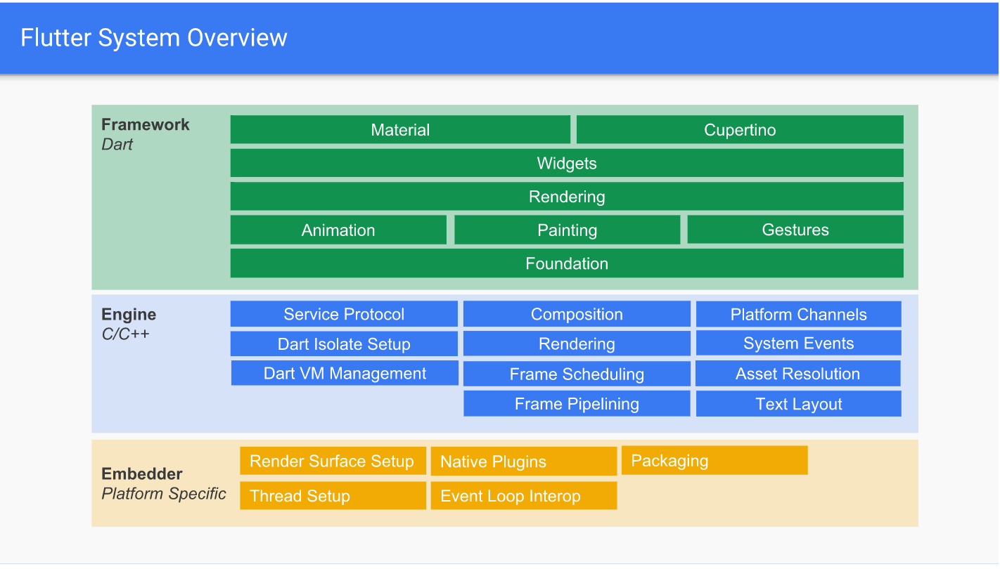

image from [technical-overview](https://github.com/flutter/flutter/wiki/The-Engine-architecture)

> Flutter's engine takes core technologies, Skia, a 2D graphics rendering library, and Dart, a VM for a garbage-collected object-oriented language, and hosts them in a shell. Different platforms have different shells, for example we have shells for [Android](https://github.com/flutter/engine/tree/master/shell/platform/android) and [iOS](https://github.com/flutter/engine/tree/master/shell/platform/darwin). We also have an [embedder API](https://github.com/flutter/engine/tree/master/shell/platform/embedder) which allows Flutter's engine to be used as a library (see [Custom Flutter Engine Embedders](https://github.com/flutter/flutter/wiki/Custom-Flutter-Engine-Embedders)).
>
> The shells implement platform-specific code such as communicating with IMEs (on-screen keyboards) and the system's application lifecycle events.
>
> The Dart VM implements the normal Dart core libraries, plus an additional library called `dart:ui` to provide low-level access to Skia features and the shell. The shells can also communicate directly to Dart code via [Platform Channels](https://flutter.io/platform-channels/) which bypass the engine.

## Flutter 工程结构

### 创建一个demo工程

`flutter create my_app`

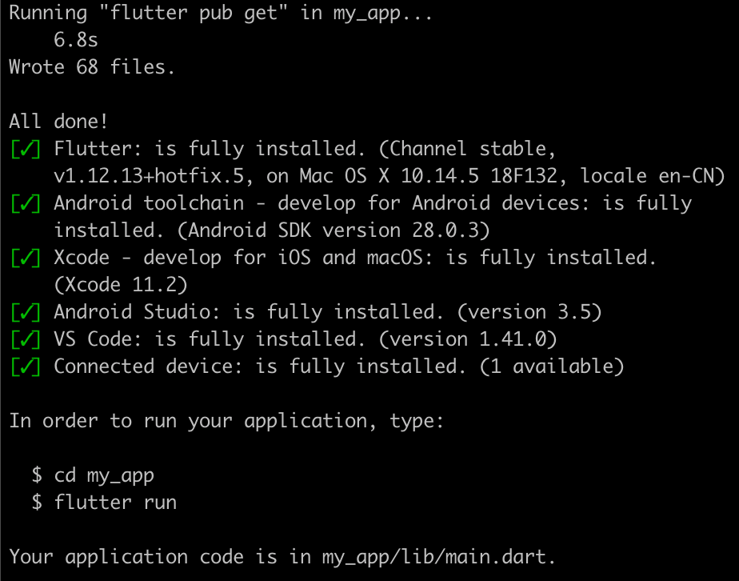

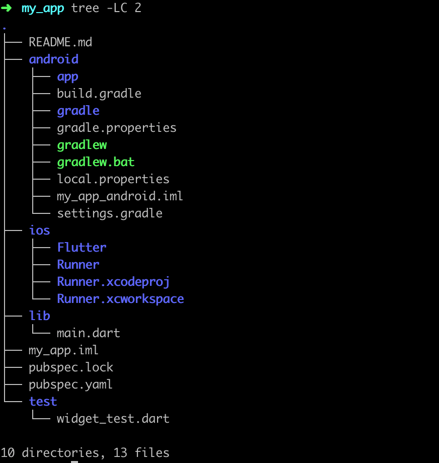

> 事实上 flutter 下的 iOS/Android 工程本质上依然是一个标准的 iOS/Android 的工程，
>
> - 对于 iOS flutter 通过在 BuildPhase 中添加 shell 来生成和嵌入 App.framework 和 Flutter.framework
> - 对于 Android flutter 通过 gradle 来添加 flutter.jar 和 `vm_snapshot_data` `vm_snapshot_instr` `isolate_snapshot_data` `isolate_snapshot_instr`
>
> 来将 Flutter 相关代码编译和嵌入原生 App 而已

### RUN 一下（命令行运行）

flutter 提供了3中运行模式

> - Use [debug](https://flutter.dev/docs/testing/build-modes#debug) mode during development, when you want to use [hot reload](https://flutter.dev/docs/development/tools/hot-reload).
> - Use [profile](https://flutter.dev/docs/testing/build-modes#profile) mode when you want to analyze performance.
> - Use [release](https://flutter.dev/docs/testing/build-modes#release) mode when you are ready to release your app.

执行run命令（默认debug模式），此时我只连了 三星手机，结果因为 gradle 同步超时终止了

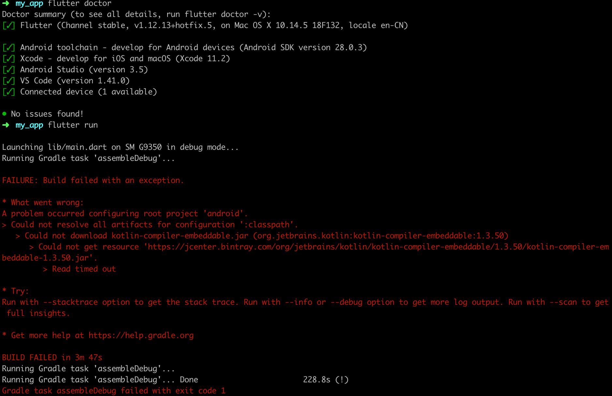

这次连了iphone和三星手机，run 的时候让我指定一个，我指定 iPhone 然后run 起来了

简单修改，然后刷新，都是几百毫秒

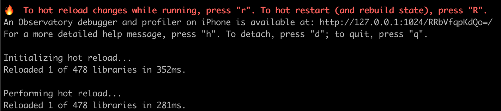

看下工程目录文件变化

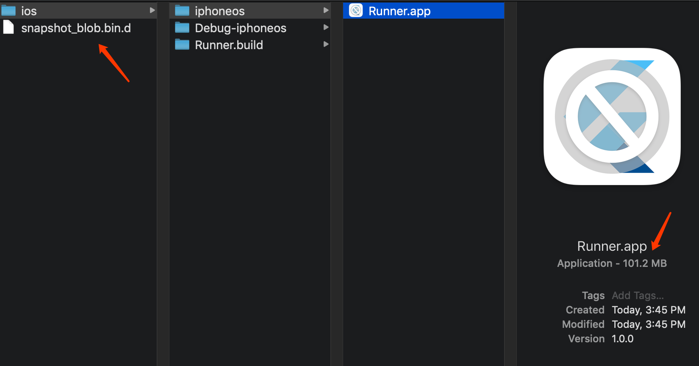

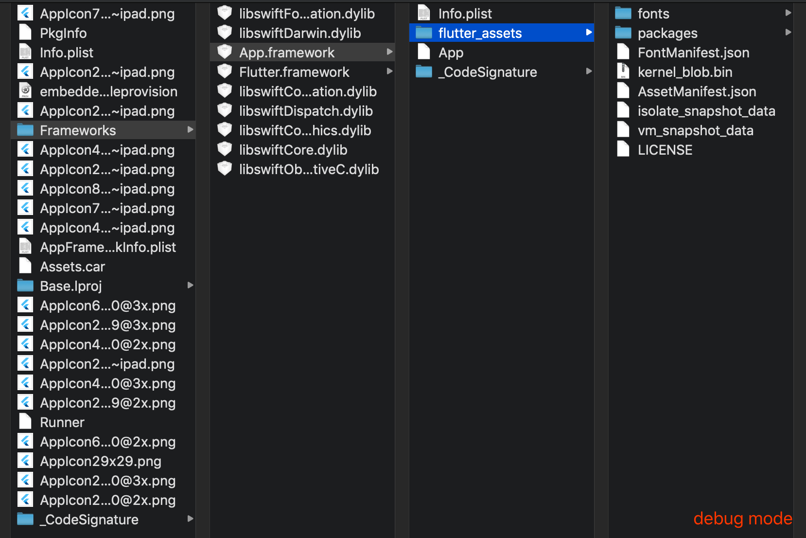

run Android 手机

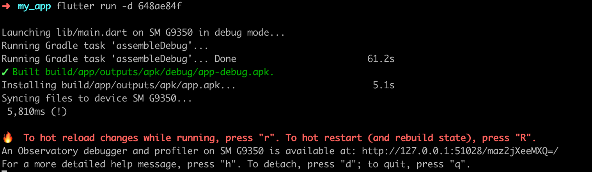

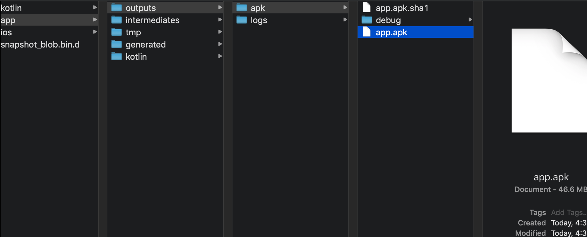

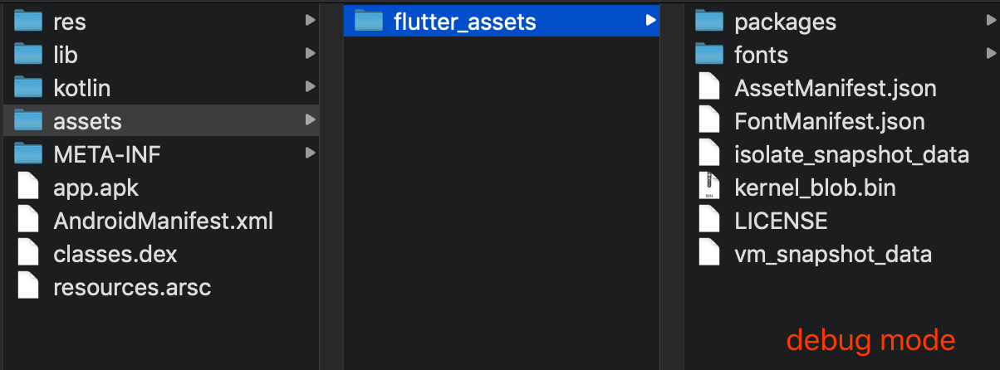

`flutter run --release`

aot

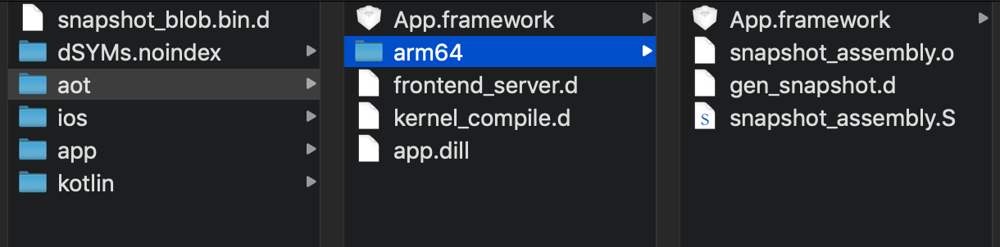

iOS

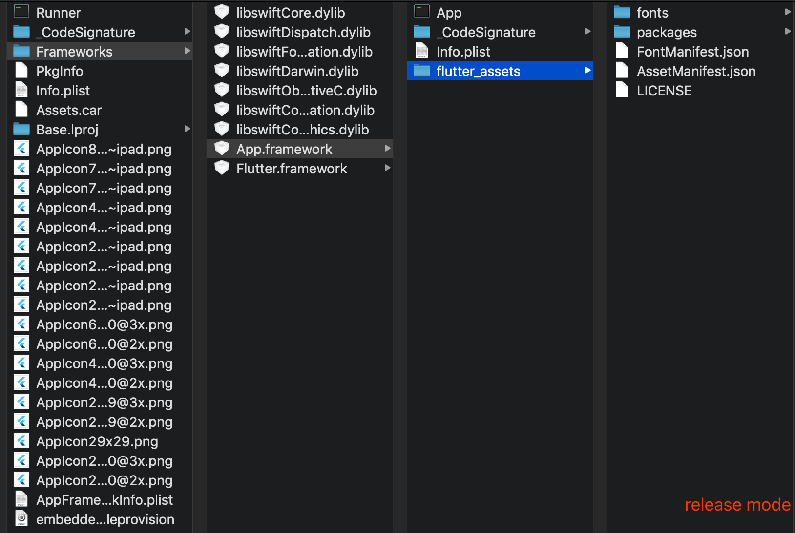

Android

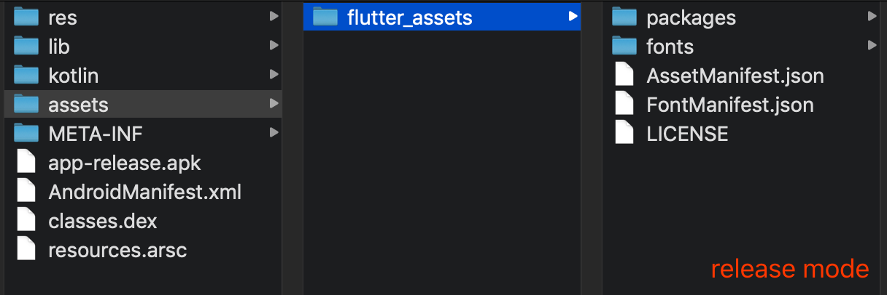

## 编译

以上执行 `flutter run` 和 `flutter run --release` 命令，我们看到了演示效果，看到了工程目录文件的变化，通过现象我想说明一个被雪藏了的过程**编译和链接**。

flutter 使用 Dart 作为编程语言，自然脱不了干系。

### dart 的编译模式

- **Script**：最常见的 JIT 模式，可以直接在虚拟机中执行 Dart 源码，像解释型语言一样使用。

  通过执行 `dart xxx.dart` 就可以运行，写一些临时脚本，非常方便。

- **Script/Kernel Snapshot**：JIT模式，和上一个不同的是，这种模式执行的是 [Kernel AST](https://github.com/dart-lang/sdk/tree/master/pkg/kernel) 的二进制数据，这里不包含解析后的类和函数，编译后的代码，所以它们可以在不同的平台之间移植。AST 这里载入的是已经 token化的 dart源代码，提前执行了上一步的 `lexer`(词法分析)步骤。Dart Kernel 是 Dart 程序中的一种中间语言，更多的资料可阅读 [Kernel Documentation](https://github.com/dart-lang/sdk/wiki/Kernel-Documentation)。

- **Application Snapshot**：JIT 模式，这里执行的是已经解析过的类和函数，所以它会运行起来会更快。但是这不是平台无关，它只能针对 32位 或者 64位 架构运行。

- **AOT**：AOT模式，直接将 dart源码编译出 `.S` 文件，然后通过汇编器生成对应架构的代码。

|      模式/比较项       | 编译模式 | 区分架构 | 打包大小 |     动态化     |      |
| :--------------------: | :------: | :------: | :------: | :------------: | ---- |
|         Script         |   JIT    |    否    |    小    |       是       |      |
| Script/Kernel Snapshot |   JIT    |    否    |   很小   |       是       |      |
|  Application Snapshot  |   JIT    |    是    |  比较大  | 是（注意架构） |      |
|          AOT           |   AOT    |    是    |  比较大  |       否       |      |

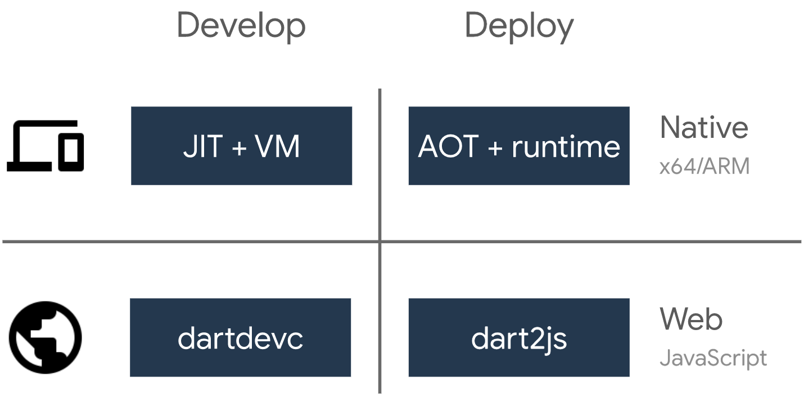

### Flutter build

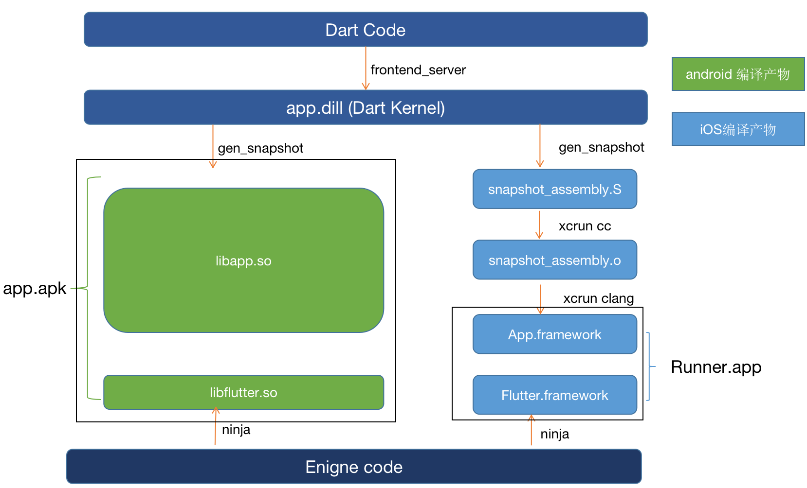

Flutter 采用了 Dart，根据Dart的编译模式，考量 Android和 iOS 平台的生态差异，给出了如下7种构建方式：

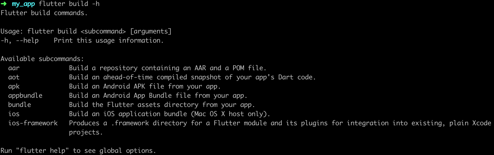

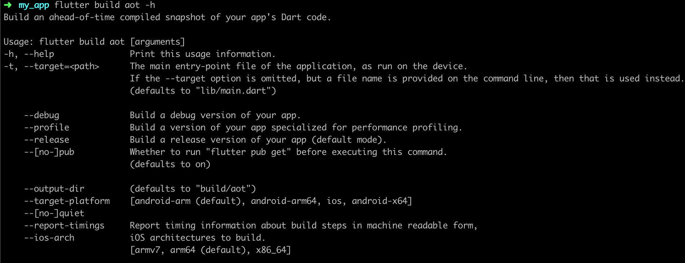

### 开发阶段的编译模式

在开发阶段，我们需要 Flutter的 Hot Reload和 Hot Restart功能，方便 UI快速成型。同时，框架层也需要比较高的性能来进行视图渲染展现。因此开发模式下，Flutter使用了 Kernel Snapshot模式编译。
在打包产物中，你将发现几样东西：

- **isolate_snapshot_data**：用于加速 isolate启动，业务无关代码，固定，仅和 flutter engine版本有关
- **app.dill**：和 dart vm相关的 kernel代码，仅和 dart版本以及 engine编译版本有关。固定，业务无关代码。
- **vm_snapshot_data**: 用于加速 dart vm启动的产物，业务无关代码，仅和 flutter engine版本有关
- **kernel_blob.bin**：业务代码产物

|  项目/平台  |       Android        |         iOS          |      |
| :---------: | :------------------: | :------------------: | ---- |
|  代码环境   |        debug         |        debug         |      |
|  编译模式   |   Kernel Snapshot    |   Kernel Snapshot    |      |
|  打包工具   |       dart vm        |       dart vm        |      |
| Flutter命令 | flutter build bundle | flutter build bundle |      |
|  打包产物   |   flutter_assets/*   |   flutter_assets/*   |      |

### 生产阶段的编译模式

在生产阶段，应用需要的是非常快的速度，所以 Android和 iOS target毫无意外地都选择了 AOT打包。不过由于平台特性不同，打包模式也是天壤之别。

|  项目/平台  |      Android      |        iOS        |      |
| :---------: | :---------------: | :---------------: | :--: |
|  代码环境   |      release      |      release      |      |
|  编译模式   |   AOT Assembly    |   AOT Assembly    |      |
|  打包工具   |   gen_snapshot    |   gen_snapshot    |      |
| Flutter命令 | flutter build aot | flutter build aot |      |
|  打包产物   |      app.so       |   App.framework   |      |

首先我们很容易认识到 iOS平台上做法的原因：App Store审核条例不允许动态下发可执行二进制代码。
所以在 iOS上，除了 JavaScript，其他语言运行时的实现都选择了 AOT。

### Before flutter 1.12.13 android 编译

- AOT Assembly

  看上文

- AOT Blob

  在 Android上，Flutter 默认是**Core JIT**的打包产物有 4个：`isolate_snapshot_data`, `vm_snapshot_data`, `isolate_snapshot_instr`, `vm_snapshot_instr`. 我们不认识的产物只有 2个：`isolate_snapshot_instr`和 `vm_snapshot_instr`，其实它俩代表着 `vm`和 `isolate`启动后所承载的指令等数据，在载入后，直接将该块内存标记为执行即可。

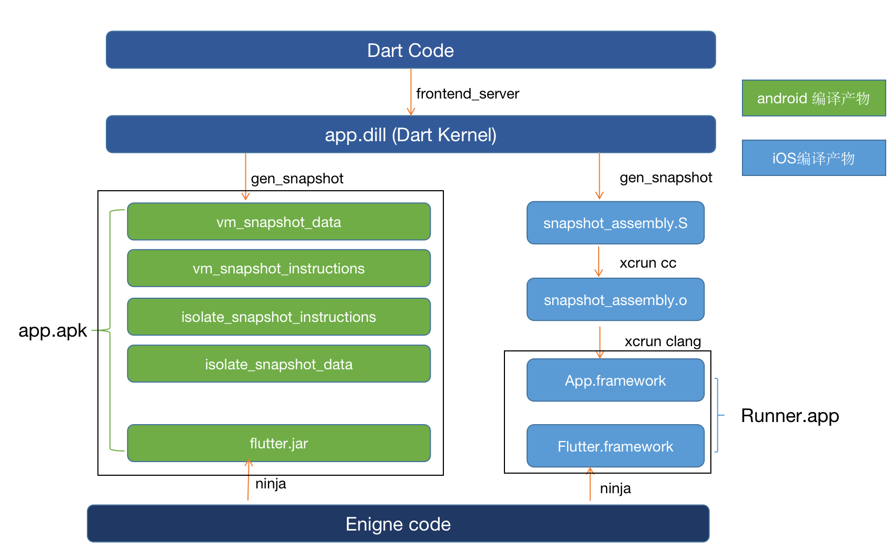

## 概念 & 名词：

#### 静态语言

静态语言通常编译成目标机器的本地机器代码（或**汇编代码**）程序，该程序在运行时直接由硬件执行

> [维基百科](https://en.wikipedia.org/wiki/Compiled_language)
>
> A **compiled language** is a [programming language](https://en.wikipedia.org/wiki/Programming_language) whose [implementations](https://en.wikipedia.org/wiki/Programming_language_implementation) are typically [compilers](https://en.wikipedia.org/wiki/Compiler) (translators that generate [machine code](https://en.wikipedia.org/wiki/Machine_code) from [source code](https://en.wikipedia.org/wiki/Source_code)), and not [interpreters](https://en.wikipedia.org/wiki/Interpreter_(computing)) (step-by-step executors of [source code](https://en.wikipedia.org/wiki/Source_code), where no pre-runtime translation takes place).
>
> The term is somewhat vague. In principle, any language can be implemented with a compiler or with an interpreter.[[1\]](https://en.wikipedia.org/wiki/Compiled_language#cite_note-1) A combination of both solutions is also common: a compiler can translate the source code into some intermediate form (often called [p-code](https://en.wikipedia.org/wiki/Byte_code) or [bytecode](https://en.wikipedia.org/wiki/Bytecode)), which is then passed to an interpreter which executes it.

#### 动态语言

动态语言由解释器执行，不产生机器语言代码。机器代码是由解释器产生。

> [维基百科](https://en.wikipedia.org/wiki/Interpreted_language)
>
> An **interpreted language** is a type of [programming language](https://en.wikipedia.org/wiki/Programming_language) for which most of its implementations execute instructions directly and freely, without previously [compiling](https://en.wikipedia.org/wiki/Compiler) a [program](https://en.wikipedia.org/wiki/Computer_program) into [machine-language](https://en.wikipedia.org/wiki/Machine_language) instructions. The [interpreter](https://en.wikipedia.org/wiki/Interpreter_(computing)) executes the program directly, translating each statement into a sequence of one or more [subroutines](https://en.wikipedia.org/wiki/Subroutines), and then into another language (often [machine code](https://en.wikipedia.org/wiki/Machine_code)).

#### VM 虚拟机

> [维基百科](https://en.wikipedia.org/wiki/Virtual_machine)
>
> In computing, a **virtual machine** (**VM**) is an [emulation](https://en.wikipedia.org/wiki/Emulator) of a computer system. Virtual machines are based on [computer architectures](https://en.wikipedia.org/wiki/Computer_architectures) and provide functionality of a physical computer. Their implementations may involve specialized hardware, software, or a combination.

它其实只是一个**高级的解释器**，用软件模拟硬件设备。虚拟机使语言移植到新的硬件平台更容易。因此，VM 的输入语言常常是[中间语言](https://en.wikipedia.org/wiki/Intermediate_representation#Intermediate_language)。例如，一种编程语言（如[ Java ](https://en.wikipedia.org/wiki/Java_(programming_language))）被编译成中间语言（[字节码](https://en.wikipedia.org/wiki/Java_bytecode)），然后在VM（eg.[ JVM ](https://en.wikipedia.org/wiki/Java_virtual_machine)）中执行。

#### JIT

JIT(Just In Time) 翻译为 **即时编译**，指的是在程序运行中，将热点代码编译成机器码，提高运行效率。常见例子有 V8 引擎 和 javaScript Core，JIT 可以充分利用解释型语言的优点，动态执行js源码，而不用考虑平台差异性。

> 这里需要区分
>
> - JIT 和解释型语言的区别，JIT 是一种编译模式，比如，Java 是编译型语言，但它也可以使用 JIT。只不过对于 JVM 来说，执行的源码指字节码，而不是 Java 源码。

#### AOT

AOT(Ahead Of Time) 称为 **运行前编译**，指的是在程序运行之前，已经编译成对应平台的机器码，不需要在运行中解释编译，就可以直接运行。常见例子有 C 和 C++。

> 虽然，我们会区别 JIT 和 AOT 两种编译模式，但实际上，有很多语言并不是完全使用 JIT 或者 AOT 的，通常它们会混用这两种模式，来达到最大的性能优化。而 dart 语言

#### C/C++ 语言编译过程：

- 预编译 
  - 主要以 `#` 开始的预编译指令
- 编译 
  - 词法分析
  - 语法分析
  - 语义分析
  - 中间代码生成
  - 目标代码生成
  - 汇编代码文件
- 汇编 
  - 将汇编代码转变成机器可执行的指令
- 链接
  - 静态链接
  - 动态链接

一般来说，只有静态语言才适合 AOT 编译为本地机器代码，因为机器语言通常需要知道数据的类型，而动态语言中的类型事先并不确定。因此，动态语言通常被解释或 JIT 编译。

在开发过程中 AOT 编译，开发周期（从更改程序到能够执行程序以查看更改结果的时间）总是很慢。但是 AOT 编译产生的程序可以更可预测地执行，并且运行时不需要停下来分析和编译。AOT 编译的程序也更快地开始执行（因为它们已经被编译）。

相反，JIT 编译提供了更快的开发周期，但可能导致执行速度较慢或时快时慢。特别是，JIT 编译器启动较慢，因为当程序开始运行时，JIT 编译器必须在代码执行之前进行分析和编译。

Dart 语言站在巨人的肩膀上在高级编译器和虚拟机上做了非常棒的工作，使得可以进行高效的 AOT 编译或 JIT 编译、解释或转译成其他语言。Dart 编译和执行不仅非常灵活，而且速度**特别快**。

#### Ninja

> [维基百科](https://en.wikipedia.org/wiki/Ninja_(build_system))
>
> **Ninja** is a small [build system](https://en.wikipedia.org/wiki/Build_automation) with a focus on speed. It differs from other build systems in two major respects: it is designed to have its input files generated by a higher-level build system, and it is designed to run builds as fast as possible.

#### GN

> [what is GN?](https://chromium.googlesource.com/chromium/src/tools/gn/+/48062805e19b4697c5fbd926dc649c78b6aaa138/README.md)
>
> GN is a meta-build system that generates [NinjaBuild](https://chromium.googlesource.com/chromium/src/tools/gn/+/48062805e19b4697c5fbd926dc649c78b6aaa138/NinjaBuild.md) files. It's meant to be faster and simpler than GYP. It outputs only Ninja build files.