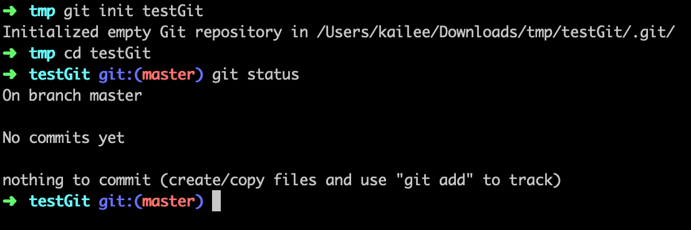
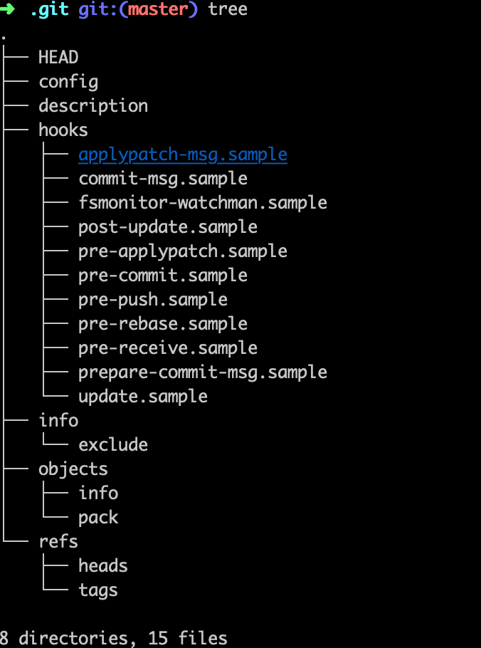
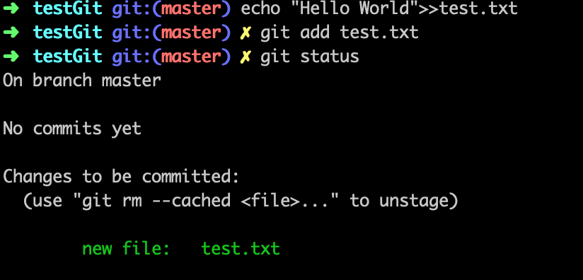
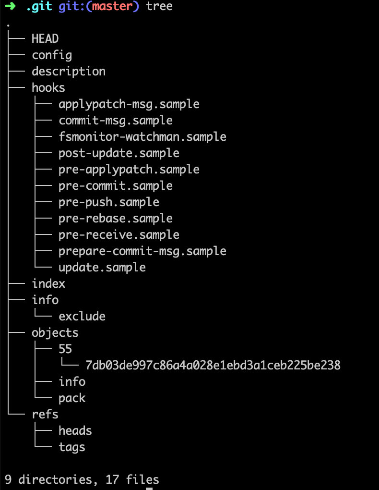
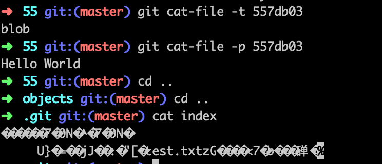
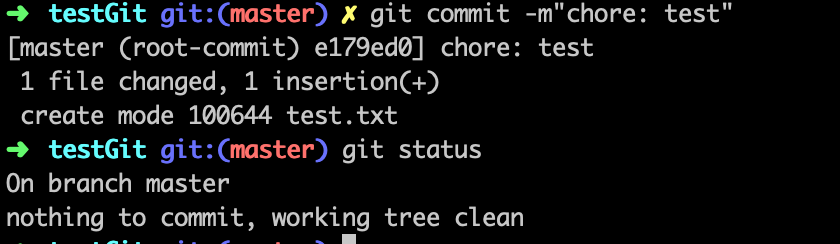
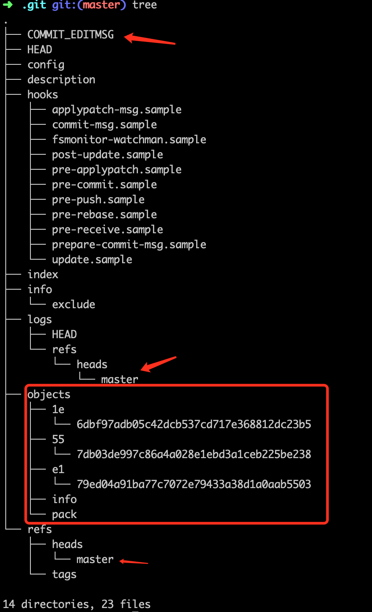
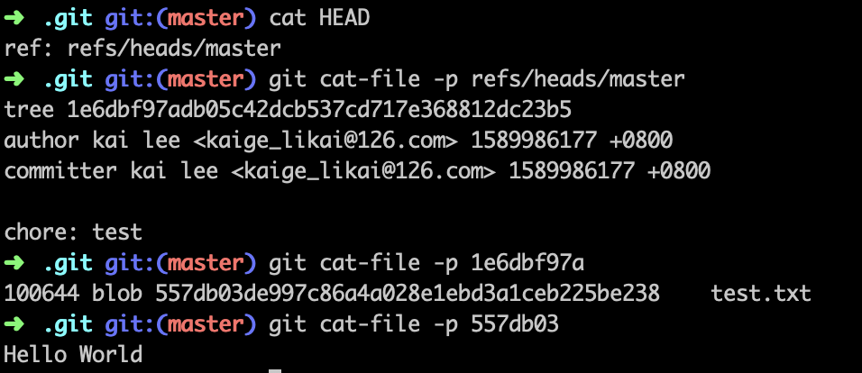

# 一直用的 Git 真的了解吗？

## Git 练习
接下来，通过具体操作来说明：

```
git init testGit
cd testGit
git status

```




1. `master` 是默认分支，分支其实是**引用** ps. 这个后面分析会解释
2. `git status` 给了一些引导信息，其中的 `git add` 相比你并不陌生，正好是接下来要讲的
3. 下图打印了 `.git` 的文件目录 ps. 后面分析




```
echo "Hello World!">>test.txt

git add test.txt

git status

```




1. 执行了 add 操作，进入 unstage 状态，
2. 可以执行 `git rm` 从暂存区移除



3. 下图打印了 `.git` 的文件目录

4. 对比 add 之前的 `.git` 目录


### 发现
1. `git init` 创建了 `.git` 目录
2. 在 testGit 下创建文件等一系列操作， `.git` 目录没有变化
3. 执行 `git add test.txt` 的时候，`.git` 多了一个目录（`55`），多了俩文件（`index` 和 `7db03de`）
    - index 是一个索引文件，主要是为了提升比对查找效率
4. cat 一下内容



- `git add` 创建了对象
- 文件内容是存储到 `blob` 类型的对象里


### 所谓暂存区

我们在操作 testGit 工作区的时候，只有执行了 `git add` 才会进入所谓的**暂存区**。总结一句话：将我们本地文件系统的改动转化为 Git 的对象存储的过程。

```
[工作区] -- git add --> [暂存区]
```
- 通过 `git add` 命令将改动暂存。
- 可以使用 `git add -p` 来依次暂存每一个文件改动，过程中我们可以灵活选择文件。中的变更内容，从而决定哪些改动暂存。
- 如果 `git add` 不会暂存被 `ignore` 的文件改动。
- 通过 `git rm` 命令，我们可以删除文件的同时将其从暂存区中剔除。

```
[工作区] -- git add --> [暂存区] <---- git reset
```

- 通过 `git reset` 命令进行修正，可以先将暂存区的内容清空
- 这个过程不会对你的文件进行任何修改操作，只是 Git 会认为目前没有改动需要被提交。
- 如果我们想分阶段(or 分文件)进行 reset，可以使用 `git reset FILE`  或 `git reset -p`命令。

### 重头戏 commit

当你对需要修改的内容和范围满意时，执行命令：`git commit -m"chore: test"` 



- `.git` 目录增加了 5个目录，6个文件




```
HEAD --> refs/heads/master --> objects/1e/6dbf97  --> objects/55/7db3de 

```




```
// logs 目录下

HEAD --> logs/heads/master --> objects/e1/79ed04 --> objects/1e/6dbf97


```


### 阶段性小结
文章介绍到这里，相信你对 git 命令有了新的认识。碍于篇幅不宜过长，我拆成两片文章。
其实整篇文章其实就只对一个文件 `test.txt` 操作了一次 `git add` 和 `git commit` 

- 每个文件修改的版本都作为独立的新对象(非增量),为什么? 删除文件git会如何操作?
- `check out` 分支git会如何操作? `merge` 呢?
- 冲突了咋办？

接下来的文章，我会讲到

 