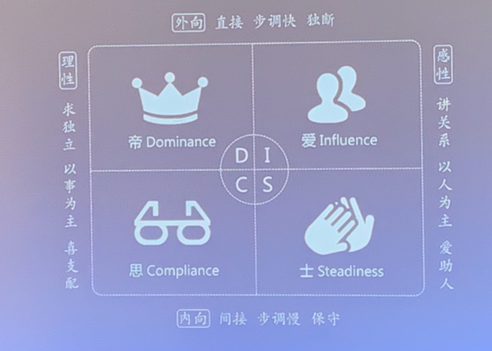

## 小课堂

### 性格

- [ ] | 理性         | 外向：              | 直接 步调快 独断     | 感性         |
  | ------------ | :------------------ | -------------------- | ------------ |
  | **求独立**   |                     |                      | **讲关系**   |
  | **以事为主** | 帝 Dominance(统治)  | 爱 Influence(影响)   | **以人为主** |
  | **喜支配**   | 思 Compliance(服从) | 士 Steadiness(稳定)  | **爱助人**   |
  |              | **内向：**          | **间接 步调慢 保守** |              |

#### D 指挥者

> Dominance
>
> 支配型、老板型
>
> 直接、控制与独断的激烈特盾

> 关注事，行动快
>
> 目标明确
>
> 反应迅速
>
> 
>
> - 目标导向
> - 行动力强
> - 创新多变
> - 善于掌控局面

##### 与 D 型人协同的方法

1. 节约时间，讲重点
2. 及时反馈，设置时间点
3. 多设置判断题，选择题
4. 不断提出新点子

#### 影响者

> Influence
>
> 影响型、互动型
>
> 爽朗、友善、外向、温柔与热情

> 关注人，行动快
>
> 热爱交际、幽默风趣
>
> 
>
> - 人来疯，自来熟
> - 充满自信，积极乐观
> - 引人注目，夸夸其谈
> - 善于营造氛围
> - 喜欢肢体接触

> 关注：
>
> - 看重别人的认可
> - 喜欢和大家在一起
> - 感觉比行动更重要
> - 更看重眼前，而不是未来

##### 与 I 型人系统的方法

1. 给予足够的认可
2. 给予足够多的反馈
3. 对他们定期跟进

#### S 支持者

> steadliness
>
> supporter
>
> 稳健型、支持型
>
> 谨慎、稳定、耐心、忠诚与同情心

> 关注人，行动慢
>
> 喜好和平
>
> 迁就他人
>
> - 口弹窗：随便，对不起
> - 乐天知命，与世无争
> - 强调平衡，追求和平
> - 不喜欢拒绝别人，乐于助人

> 关注
>
> 拥有踏实、平淡的生活
>
> 关注团队和谐
>
> 在意安全，而非挑战

#### C 思考着

> Compliance
>
> corrector
>
> 谨慎型、修正型
>
> 组织、细节、事实、精准与准确

> 关注事，行动慢
>
> 讲究条理
>
> 追求卓越
>
> - 持之以恒，坚持到底
> - 追求完美，迷恋细节
> - 习惯用数据说话
> - 与人保持距离
> - 善于研究、分析，喜欢思考

> 关注
>
> - 思虑周祥，沉稳成熟
> - 一诺千金，诚实守信
> - 计划缜密，按章办事
> - 重视制度、程序、规范和流程

##### 与 C 型人系统的方法

1. 保持必要的距离
2. 用数据说话，善于比较
3. 让C 型人先表达

### 小结

- 无忧无劣是特点
- 有优有劣因环境
- 分辨优劣考敏感
- 扬长避短是能力

如何判断自己的类型？

1. 坐标轴法
2. 观察识别法
3. 专业测评法

