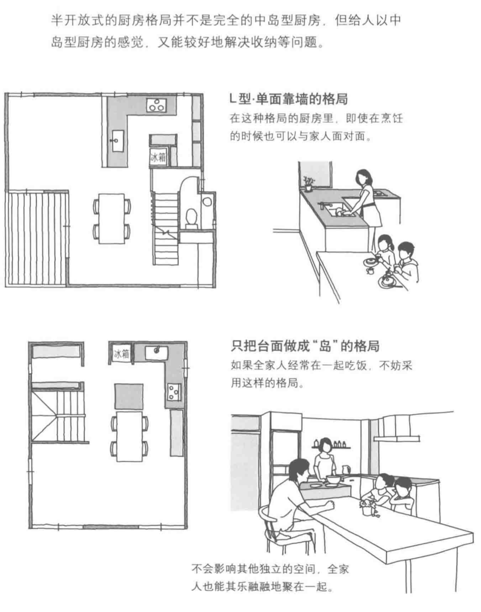
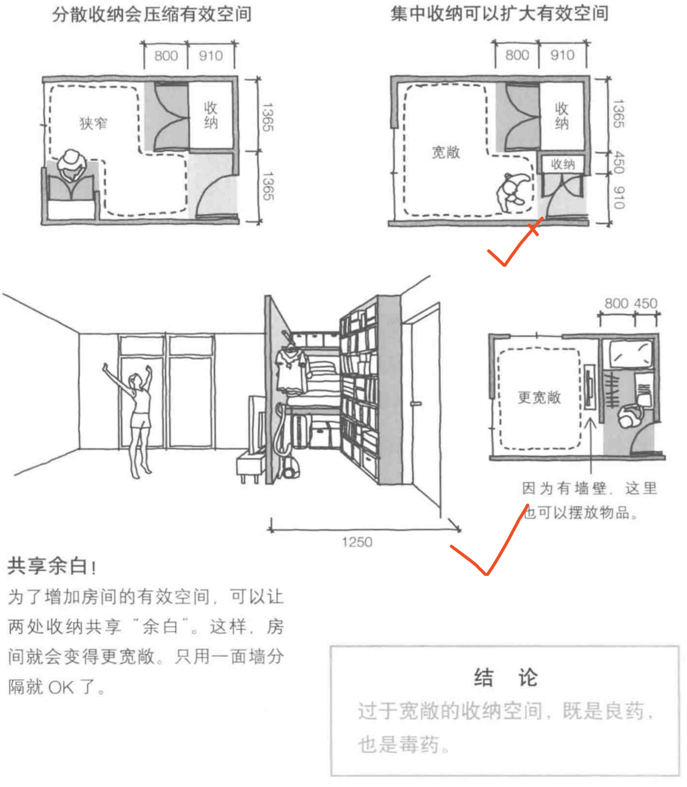
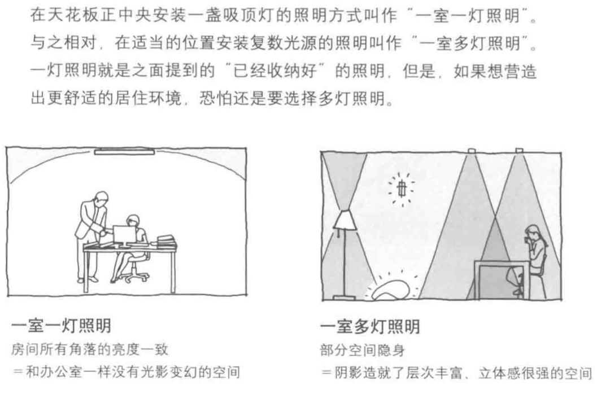
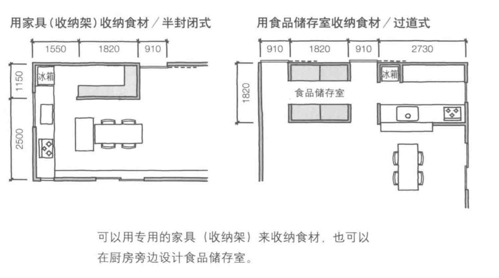

## 前言: 设计属于自己的家！

中国优秀的传统思想，对”家“的概念非常深刻、重视！所以，对家装也看得至关重要！这也是为什么我在装修之前，会看一些书籍来补充装修设计这方面知识以及写这篇博客的原因！

每个人对自己家的样子充满了理想主义色彩与浪漫主义情调！我是一个程序员，比较理性，所以这篇文章仅供参考！

<!--more-->

### 一、追随人的动向

#### 1. 玄关

> 又称**门厅**，是指建筑物入门处到[正厅](https://baike.baidu.com/item/%E6%AD%A3%E5%8E%85)之间的一段转折空间，东亚传统建筑中具有“藏”的概念，玄关是屋外和屋内的缓冲，使屋外与屋内有一定的隔开。

我家是②的格局

#### 2. 客厅

##### 2.1 电视机前是活动的广场

##### 2.2 视线

##### 2.3 沙发远比看上去大

###### 2.3.1 沙发的尺寸

###### 2.3.2 沙发周围留出必要的活动空间

#### 3. 厨房

##### 3.1 厨房的主要成员

##### 3.2 厨房的工具组合

##### 3.3 厨房的主工作流

##### 3.4 厨房的细节与布局

###### 3.4.1 沥水篮的位置

最终会是这样：

##### 3.4.2 岛型布局

#### 4. 你想尝试中岛型厨房吗？

##### 4.1 中岛式

如果收到上图的困扰，你可能迫切需要一个开放的，中岛型厨房，有点很多，比如自由、宽敞、视线好。。。但是:

有点突出，也有缺点，而且要弥补这些缺点的话你可能还需要额外的收纳橱柜。。。并不经济

##### 4.1 半开放式就很好

**不过，根据我家的户型，还是传统的厨房，更加经济适用。**

#### 5. 家务间

不知道这个是不是很多家庭需要的，关键是户型太小没有对应空间。暂时不表

#### 6 对方垃圾的地方

该书出资日本作家，日本对于垃圾的处理是**世界上顶级的**。分门别类是基本的生活常识！！！

##### 6.1 以厨房垃圾的处理为例

#### 7. 浴室和厕所

书中所述，浴室利用住宅朝南的空间比较好，但是目前，又有谁愿意花银子和牺牲向阳的空间给浴室呢？

我家的格局反正是，浴室、厕所、梳妆台都在一个空间里边，这么一来比较重要的一点是，干湿分离！！！

#### 8. 地下室

不想放在外面，也不想放在里面。的东西就放地下室吧，这个暂时不表，而且我家也没有地下室。

### 二、收纳的哲学—”所有的物品都应该有家可归“

#### 1. 洗涤物

工作链 **洗—>凉—>叠—>收**

我看了自家的户型，客厅的阳台应该是完成上述工作的核心区域。也就是说，洗衣机、晾衣架、家务桌会在这里布置。而且，热水器也在这个区域，是户型设计如此。

文中，比较核心的所谓”循环设计“，理念我非常认可，但是我们家的户型貌似是用不上，如图：

#### 2. 收纳橱柜空间

##### 2.1 壁橱的深浅与收纳的物品

##### 2.2 留下足够的空间来开合壁橱门

##### 2.3 留余白的方法与房间的宽窄

##### 2.4 直顶天花板

#### 3. 衣帽间—很多人心心念念的

##### 3.1 步入式衣橱

### 三、生活细节

#### 1. 照明

##### 1.1 一灯与多灯

##### 1.2 住宅的照明系统应该和舞台一样

核心是：**光源之间的配合！！！**

##### 1.3 过于明亮的室内住宅设计会使空间过于理性而成为办公室

#### 2. 声音

由于混净土的反射率很大，加之现代的建筑主要建材是混凝土所以，声音会不断地在房间里反射、叠加。结果人的对话和电视机里的声音都会非常嘈杂。

##### 2.1 使用什么办法吸引呢？

- 窗帘
- 地毯

#### 3. 布制品摆放

##### 3.1 布制品的优先级

##### 3.2 与抽屉不和

##### 3.3 想保持干燥，挂起来是最好的方案！

#### 4. 食材的存放

**你别想着用冰箱搞定一切。。。**

##### 4.2 你又想用收纳柜/格

##### 4.2 如果有个阴凉的储藏室完美

##### 4.3 由于我家并不是地暖，所以如下：

#### 5. 狗狗

如果你还是一个宠物爱好者，比如养狗，那么，你家的卫生项目遇多了一个严峻的问题：

- 狗掉毛
- 遛狗、洗澡

### 小结

接下来我可能还会根据个人职业特色，把这个作为一个系列来写，程序员家装。敬请期待！

### 参考文献

- 《住宅格局解剖图鉴》[日]铃木信弘 著 郑敏 译

