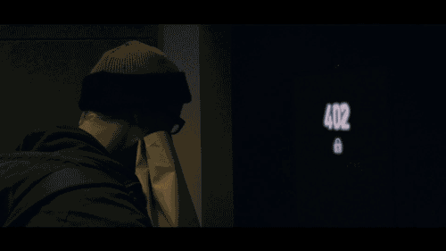

## 前言

> **物联网**(The Internet of Things)的概念是在1999年提出的，它的定义很简单：把所有物品通过射频识别等信息传感设备与互联网连接起来，实现智能化识别和管理。 **物联网**通过智能感知、识别技术与普适计算、泛在网络的融合应用，被称为继计算机、互联网之后世界信息产业发展的第三次浪潮。

你期待的是不是如下这样的场景呢？

<!--more-->

## 物联网

物联网，也可以说是互联网的一个延伸。

互联网的终端是计算机（`PC`、服务器），随着人手一部只能手机时代的到来，移动互联网的终端是手机、`pad`（`Android`、`iOS`）。我们运行的所有程序，无非都是计算机、手机、`pad` 与网络中的数据处理和数据传输。除了计算机、手机、`pad`外，为人类服务的嵌入式计算机系统及其配套的传感器终端呈现出各种形态，如穿戴设备、车载设备、环境监控设备、虚拟现实设备等等。只要有硬件或产品连上网，发生数据交互，就是物联网的范畴。

物联网一直不乏热度，更有甚者出现了各种 `All In`。。。物联网涵盖的内容其实非常多：

- 数电模电、单片机编程技术
- 网络技术
- 无线技术
- 传感器技术
- 端技术

我现在触及到的，也就占个端技术（手机端）。

回到今天的主题，我正要列举一下智能家居：

### 智能家居

- 无线路由器

  这个其实不用多说，”网“已经和水电一样不可或缺，家里有一款无线路由是必须的。

- 智能网关

  连接其他职能设备，当遇到 WIFI 不稳定甚至中断时，智能配件依然可以正常工作。

- 智能音箱

  有些厂，已经可以把自家的智能设备通过语音控制。

- 传感器
  - 人体传感器
  - 门窗传感器

- 智能墙壁开关

- 智能插座

  可以让一部分非智能家电，看上去拥有了智能体验。

- 智能锁

  更安全，多样的开锁体验（刷脸、指纹、密码。。。）

- 智能摄像机

  传感器被触发后，通知智能摄像机；联网查看家中情况。

- 智能灯
  - 吸顶灯
  - 台灯
  - 床头灯
  - 夜灯

- 扫地机器人

  解放你的双手，让他替你打扫卫生。很多反应扫不干净的：~

- 智能马桶/马桶盖

  这个应该是很多家庭都应用上了，看上去反响还不错

- 窗帘电机

  让第一缕阳光照进你的卧室

- 投影仪取代电视？

  虽然现在很多投影仪展现的画质已经非常不错，而且可以节省空间，不过我个人觉得，电视还是电视，是一种生活习惯。

#### 小结

以上这些，冠以”智能“头衔的产品，我并不都买涨，现在的城市中电视、冰箱、空调、洗衣机以及一些厨房电器比如：洗碗机、净水器、电饭煲等谁家不用啊？几乎是必买的家电。就像”某米“家的，很多产品无非就是加了可以手机遥控开关和传感器元件，加上**智能**两个字实在是有些牵强啊！！！

所以，这里我也提醒读者，不要**盲目**的追随所谓的智能！！！理性消费

### 电磁场(EMF)

> Electromagnetic Field

> 目前，涉及各行各业的电磁辐射已成为继大气污染，水污染，噪音污染后的又一大污染，随着技术革命的更新和不同波段新的应用，许多频率电磁辐射的暴露水平在显著增加。虽然不同国家对电磁辐射所造成的健康危害有着不同的看法，但是其对公众所带来的危害却是共同认可的
>
> 世界卫生组织 WHO 于 1996 年设立了国际电磁辐射（ EMF ）计划，提出超低频（ ELF ）、[中频](https://baike.baidu.com/item/%E4%B8%AD%E9%A2%91)（ IF ）及射频（ RF ）电磁场（ 0Hz-300GHz ）的静态电磁场对人体健康的影响。
>
> 在 1999 年 7 月 12 日的欧盟理事会建议（ 1999/519/EC ）中建议了大众对电磁场的暴露限制。并且 2003 年 5 月欧盟电器标准委员会（ CENELEC ）公布了新的技术标准 EN50366 。该标准规范了家电产品所产生电磁场的测量及评估方法。
>
> 2004 年 4 月 29 日， OJEU 中正式列出 EN50366 的要求，因而该标准已成为家用电器等产品 LVD （ Low Voltage Directive ）认证的项目之一。
>
> 2008年12月1日，标准EN 50366更新为EN 62233:2008，并强制执行。
>
> EMF 不同于 EMC（Electro Magnetic Compatibility） ， EMF 是为了保证人身安全目的，是研究电子产品发射出的电场、磁场噪声对人体的影响。 EMC 主要是为了保障电子产品的正常工作为目的，是为了研究电子产品发射出的噪声对其他电子产品的影响，或者不受其它电子产品的影响。
>
> 家电产品在出口欧洲时，一般要同时满足三个认证要求：**LVD+EMC+EMF+ROHS**.

所以，在装修时应当注意这方面的知识。尤其是你想加入大量上述智能家居时，更应该看一下购买的产品是否符合上述标准。

### 一份家用电器辐射榜单

1. 电热毯
2. 电吹风
3. 电动剃须刀
4. 吸尘器
5. 电暖
6. 微波炉
7. 洗衣机
8. 电熨斗
9. 洗碗机
10. 手机
11. 电脑
12. 电视机
13. 冰箱
14. 加湿器
15. 饮水机

**以上基本上是按照辐射强度排名的，整体而言，这些都是人们日常生活所必须接触的。灯也会有辐射，所以要想完全规避是不可能的，而且这些物品并不是堆在一起的，它们分散在家的各处，随着距离的增加，辐射强度会减弱。所以，不必恐慌。**

如果比较在意这个，可以买一个电磁辐射检测仪，然后把辐射高的家电换掉！

## 参考文献

- [什么是物联网？其发展前景如何？](https://www.zhihu.com/question/19751763)