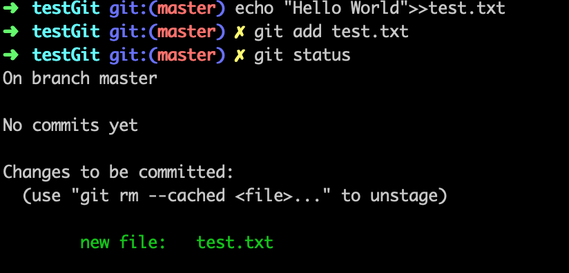
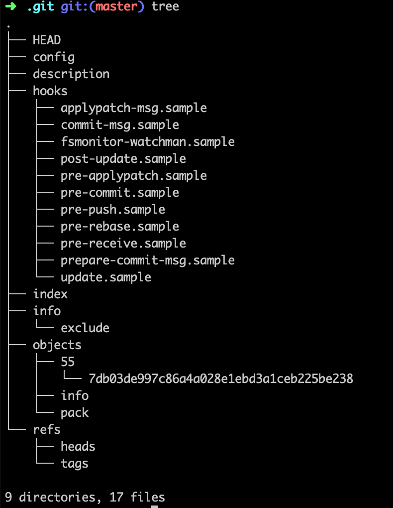
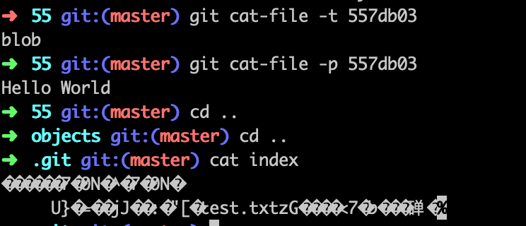
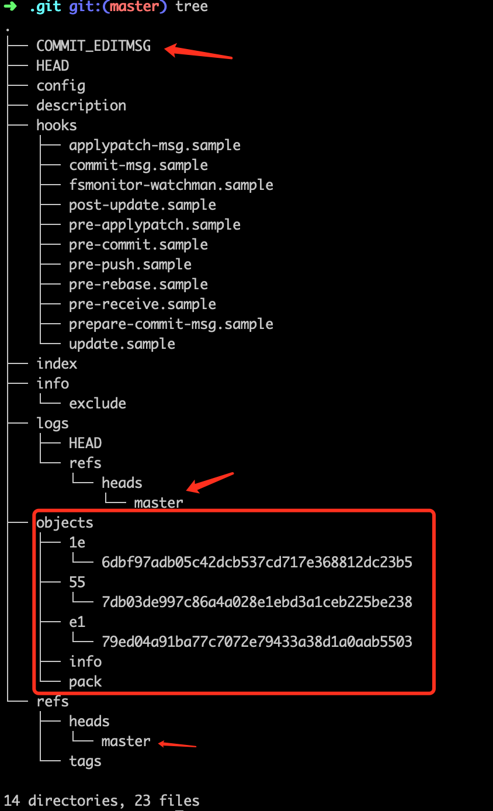
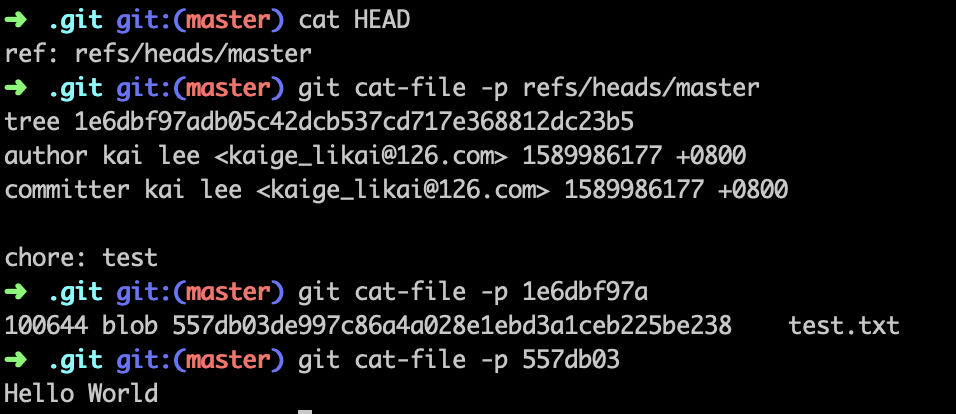

# 一直用的 Git 真的了解吗？

> 这不是一遍介绍 Git 炫酷命令的文章，也不会叫你怎么让你的代码管理优雅美丽。如果你是为了查找某一条 git 命令可以直接跳过了。

## Git 练习
接下来，通过具体操作来说明：

```
git init testGit
cd testGit
git status

```


1. `master` 是默认分支，分支其实是**引用** ps. 这个后面分析会解释
2. `git status` 给了一些引导信息，其中的 `git add` 相比你并不陌生，正好是接下来要讲的
3. 下图打印了 `.git` 的文件目录 ps. 后面分析


```
echo "Hello World!">>test.txt

git add test.txt

git status

```




1. 执行了 add 操作，进入 unstage 状态，
2. 可以执行 `git rm` 从暂存区移除



3. 下图打印了 `.git` 的文件目录

4. 对比 add 之前的 `.git` 目录


### 发现
1. `git init` 创建了 `.git` 目录
2. 在 testGit 下创建文件等一系列操作， `.git` 目录没有变化
3. 执行 `git add test.txt` 的时候，`.git` 多了一个目录（`55`），多了俩文件（`index` 和 `7db03de`）
    - index 是一个索引文件，主要是为了提升比对查找效率
4. cat 一下内容



- `git add` 创建了对象
- 文件内容是存储到 `blob` 类型的对象里


### 所谓暂存区

我们在操作 testGit 工作区的时候，只有执行了 `git add` 才会进入所谓的**暂存区**。总结一句话：将我们本地文件系统的改动转化为 Git 的对象存储的过程。

```
[工作区] -- git add --> [暂存区]
```
- 通过 `git add` 命令将改动暂存。
- 可以使用 `git add -p` 来依次暂存每一个文件改动，过程中我们可以灵活选择文件。中的变更内容，从而决定哪些改动暂存。
- 如果 `git add` 不会暂存被 `ignore` 的文件改动。
- 通过 `git rm` 命令，我们可以删除文件的同时将其从暂存区中剔除。

```
[工作区] -- git add --> [暂存区] <---- git reset
```

- 通过 `git reset` 命令进行修正，可以先将暂存区的内容清空
- 这个过程不会对你的文件进行任何修改操作，只是 Git 会认为目前没有改动需要被提交。
- 如果我们想分阶段(or 分文件)进行 reset，可以使用 `git reset FILE`  或 `git reset -p`命令。

### 重头戏 commit

当你对需要修改的内容和范围满意时，执行命令：`git commit -m"chore: test"` 


- `.git` 目录增加了 5个目录，6个文件




```
HEAD --> refs/heads/master --> objects/1e/6dbf97  --> objects/55/7db3de 

```




```
// logs 目录下

HEAD --> logs/heads/master --> objects/e1/79ed04 --> objects/1e/6dbf97


```


### 阶段性小结
文章介绍到这里，相信你对 git 命令有了新的认识。碍于篇幅不宜过长，我拆成两片文章。
其实整篇文章其实就只对一个文件 `test.txt` 操作了一次 `git add` 和 `git commit` 

- 多次commit会怎样？删除文件git会如何操作?
- `check out` 分支git会如何操作? `merge` 呢?
- 冲突了咋办？

根据上述问题，我们继续进行

```
echo "Hello World!">>test1.txt

git add test1.txt

git status

```

上述我们新建了一个 `test1.txt` 然后执行了 add ，文件目录没有变化，查看index如下：


```

git commit -m"chore: test1"
git status

```
 


```
echo "Hello Git">>test2.txt

git add test2.txt

git status

git commit -m"chore: test2"

git status

```


我们发现
- 相同内容的会指向同一个 blob 对象，本例都指向 `55`
- 每个文件修改的版本都作为独立的新 blob 对象，通过 commit 串联起来


```
# 删除 test1.txt 文件执行 add
➜  testGit git:(master) rm test1.txt
➜  testGit git:(master) ✗ git status
On branch master
Changes not staged for commit:
  (use "git add/rm <file>..." to update what will be committed)
  (use "git checkout -- <file>..." to discard changes in working directory)

	deleted:    test1.txt

no changes added to commit (use "git add" and/or "git commit -a")
➜  testGit git:(master) ✗ git add test1.txt
➜  testGit git:(master) ✗ git status
On branch master
Changes to be committed:
  (use "git reset HEAD <file>..." to unstage)

	deleted:    test1.txt

```


```
├── objects
│   ├── 1e
│   │   └── 6dbf97adb05c42dcb537cd717e368812dc23b5
│   ├── 35
│   │   └── c99b3056e72791b7b896da9c9db000f694b119
│   ├── 46
│   │   └── b40a523db0dbbf429173e5471dbe8f7a5801de
│   ├── 47
│   │   └── 521419233cdfa231561582aaeece40ba2bc60a
│   ├── 55
│   │   └── 7db03de997c86a4a028e1ebd3a1ceb225be238
│   ├── 7c
│   │   └── 92904d52765dae709fe6be9320af72952317f2
│   ├── 9f
│   │   └── 4d96d5b00d98959ea9960f069585ce42b1349a
│   ├── d9
│   │   └── d365f0a124d5598a3c9df41901520fb79ea18d
│   ├── e1
│   │   └── 79ed04a91ba77c7072e79433a38d1a0aab5503
│   ├── e5
│   │   └── 89dea504eb8eafba3992d2fa99a5bfb5eee35b
│   ├── info
│   └── pack
└── refs
    ├── heads
    │   └── master
    └── tags
21 directories, 31 files
➜  .git git:(master) cat HEAD
ref: refs/heads/master
➜  .git git:(master) cat refs/heads/master
e589dea504eb8eafba3992d2fa99a5bfb5eee35b
➜  .git git:(master) git cat-file -p e589dea504
tree 46b40a523db0dbbf429173e5471dbe8f7a5801de
parent 7c92904d52765dae709fe6be9320af72952317f2
author kai lee <kaige_likai@126.com> 1590071395 +0800
committer kai lee <kaige_likai@126.com> 1590071395 +0800
chore: test2
➜  .git git:(master) git cat-file -p 46b40a52
100644 blob 557db03de997c86a4a028e1ebd3a1ceb225be238	test.txt
100644 blob 557db03de997c86a4a028e1ebd3a1ceb225be238	test1.txt
100644 blob 9f4d96d5b00d98959ea9960f069585ce42b1349a	test2.txt

```

```
# commit 提交修改
➜  testGit git:(master) ✗ git commit -m"chore: delete test1.txt"
[master d9d365f] chore: delete test1.txt
 1 file changed, 1 deletion(-)
 delete mode 100644 test1.txt
➜  testGit git:(master) git status
On branch master
nothing to commit, working tree clean

```

```
├── objects
│   ├── 1e
│   │   └── 6dbf97adb05c42dcb537cd717e368812dc23b5
│   ├── 35
│   │   └── c99b3056e72791b7b896da9c9db000f694b119
│   ├── 46
│   │   └── b40a523db0dbbf429173e5471dbe8f7a5801de
│   ├── 47
│   │   └── 521419233cdfa231561582aaeece40ba2bc60a
│   ├── 55
│   │   └── 7db03de997c86a4a028e1ebd3a1ceb225be238
│   ├── 7c
│   │   └── 92904d52765dae709fe6be9320af72952317f2
│   ├── 9f
│   │   └── 4d96d5b00d98959ea9960f069585ce42b1349a
│   ├── d9
│   │   └── d365f0a124d5598a3c9df41901520fb79ea18d
│   ├── e1
│   │   └── 79ed04a91ba77c7072e79433a38d1a0aab5503
│   ├── e5
│   │   └── 89dea504eb8eafba3992d2fa99a5bfb5eee35b
│   ├── info
│   └── pack
└── refs
    ├── heads
    │   └── master
    └── tags
21 directories, 30 files
➜  .git git:(master) cat HEAD
ref: refs/heads/master
➜  .git git:(master) cat refs/heads/master
d9d365f0a124d5598a3c9df41901520fb79ea18d
➜  .git git:(master) git cat-file -p d9d365f0
tree 35c99b3056e72791b7b896da9c9db000f694b119
parent e589dea504eb8eafba3992d2fa99a5bfb5eee35b
author kai lee <kaige_likai@126.com> 1590072445 +0800
committer kai lee <kaige_likai@126.com> 1590072445 +0800
chore: delete test1.txt
➜  .git git:(master) git cat-file -p 35c99b30
100644 blob 557db03de997c86a4a028e1ebd3a1ceb225be238	test.txt
100644 blob 9f4d96d5b00d98959ea9960f069585ce42b1349a	test2.txt

```

发现
- 删除以后未提交前 blob 对象还存在，提交后 blob 对象就没了。我 reset 了一下，回退到上一次提交，blob 对象又出来了。所以删除不是物理删除只是逻辑删除。
- 按照这个分析过程，读者可以自行分析一下 merge 操作以冲突的情况。

## 总结
**`.git`目录结构非常清晰，git 命令实际是对记录创建和逻辑删除对象过程的抽象。**

文章阐述了一种查看 git 运行原理的思路和方法，从这个角度理解 git 会让我们加深对 git 的理解。