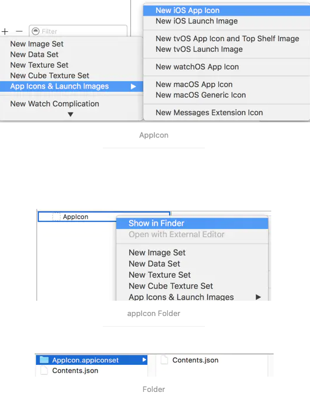

## 脚本生成 icon

### 1 Sips


```shell
➜  ~ sips --help
sips - scriptable image processing system.
This tool is used to query or modify raster image files and ColorSync ICC profiles.
Its functionality can also be used through the "Image Events" AppleScript suite.

  Usages:
    sips [image-functions] imagefile ...
    sips [profile-functions] profile ...

  Profile query functions:
    -g, --getProperty key
    -X, --extractTag tag tagFile
        --verify
    -1, --oneLine

  Image query functions:
    -g, --getProperty key
    -x, --extractProfile profile
    -1, --oneLine

  Profile modification functions:
    -s, --setProperty key value
    -d, --deleteProperty key
        --deleteTag tag
        --copyTag srcTag dstTag
        --loadTag tag tagFile
        --repair
    -o, --out file-or-directory

  Image modification functions:
    -s, --setProperty key value
    -d, --deleteProperty key
    -e, --embedProfile profile
    -E, --embedProfileIfNone profile
    -m, --matchTo profile
    -M, --matchToWithIntent profile intent
        --deleteColorManagementProperties
    -r, --rotate degreesCW
    -f, --flip horizontal|vertical
    -c, --cropToHeightWidth pixelsH pixelsW
        --cropOffset offsetY offsetH
    -p, --padToHeightWidth pixelsH pixelsW
        --padColor hexcolor
    -z, --resampleHeightWidth pixelsH pixelsW
        --resampleWidth pixelsW
        --resampleHeight pixelsH
    -Z, --resampleHeightWidthMax pixelsWH
    -i, --addIcon
        --optimizeColorForSharing
    -o, --out file-or-directory
    -j, --js file

  Other functions:
        --debug           Enable debugging output
    -h, --help            Show help
    -H, --helpProperties  Show help for properties
        --man             Generate man pages
    -v, --version         Show the version
        --formats         Show the read/write formats
```


```shell
# prepare
ROOT_DIR=$(pwd)

#check file exist
# 设置 1024 尺寸的原图片路径
SOURCE_FILE= "${ROOT_DIR}/Desktop/AutoMakeAppIcon/1024.png"
echo $SOURCE_FILE
if [[ ! -e ${SOURCE_FILE} ]]; then
echo " 文件不存在 "
exit 1
fi
# 设置自动切割生成制定尺寸图片的位置
DEST_DIR= "${ROOT_DIR}/Desktop/AutoMakeAppIcon/AppIcon"
# 如果目录有图片先清空
if [[ -d ${DEST_DIR} ]]; then
rm -rf dir ${DEST_DIR}
fi
mkdir -p "${DEST_DIR}"
# 图片自定义的名称
Image_NAME=( "Icon-Samll-20.png" " Icon-Small-20@2x.png " "Icon-Small-29.png" " Icon-Small-29-Small@2x.png " " Icon-Small-29@3x.png " "Icon-Small-40@.png" " Icon-Small-40@2x.png " "Icon-29.png" " Icon-29@2x.png " " Icon-29@3x.png " "Icon-40.png" " Icon-40@2x.png " " Icon-40@3x.png " "Icon-87.png" "Icon-57.png" " Icon-57@2x.png " "Icon-76.png" " Icon-76@2x.png " " Icon-60@2x.png " " Icon-60@3x.png " "Icon-72.png" " Icon-72@2x.png " "Icon-83.5.png" )
# 图片对应的尺寸
Image_SIZE=( "20" "40" "29" "58" "87" "40" "80" "29" "58" "87" "40" "80" "120" "87" "57" "114" "76" "152" "120" "180" "72" "144" "83.5" )


#sips starting
cp "${SOURCE_FILE}" "${DEST_DIR}"
for ((i= 0 ; i<${ #Image_SIZE[@]} ;i++)); do
size=${Image_SIZE[i]}
sips -Z ${size} "${SOURCE_FILE}" --out "${DEST_DIR}/${Image_NAME[i]}"
done
```


#### 参考

- [iOS自动生成imageset和app icon](https://www.jianshu.com/p/70e565eb8155)

ios_auto_gen_img.sh

> ```shell
> #!/bin/sh
> 
> ScalePic () {
> # 获取图片的宽高
>     imageHeight=`sips -g pixelHeight $1 | awk -F: '{print $2}'`
>     imageWidth=`sips -g pixelWidth $1 | awk -F: '{print $2}'`
>     height=`echo $imageHeight`
>     width=`echo $imageWidth`
> # 宽高乘以 2/3
>     height2x=$(($height*2/3))
>     width2x=$(($width*2/3))
> # 宽高乘以 1/3 
>     height1x=$(($height/3))
>     width1x=$(($width/3))
> 
> # 文件操作
>     imageFile=$1
>     fileName2x=${imageFile/\.png/@2x\.png}
>     fileName3x=${imageFile/\.png/@3x\.png}
> 
>     cp $imageFile $fileName3x
>     sips -z $height2x $width2x $1 --out $fileName2x
>     sips -z $height1x $width1x $1
> }
> 
> Contents () {
>     imageFile=$1
>     renameFile2x=${imageFile/\.png/@2x\.png}
>     renameFile3x=${imageFile/\.png/@3x\.png}
> 
>     echo {  >> Contents.json
>     echo "  \"images\"" : [>> Contents.json
>     echo "   "{>> Contents.json
>     echo "      \"idiom\"" : "\"universal\"",>> Contents.json
>     echo "      \"scale\"" : "\"1x\"",>> Contents.json
>     echo "      \"filename\"" : "\"$imageFile\"">> Contents.json
>     echo "   "},>> Contents.json
>     echo "   "{>> Contents.json
>     echo "      \"idiom\"" : "\"universal\"",>> Contents.json
>     echo "      \"scale\"" : "\"2x\"",>> Contents.json
>     echo "      \"filename\"" : "\"$renameFile2x\"">> Contents.json
>     echo "   "},>> Contents.json
>     echo "   "{>> Contents.json
>     echo "      \"idiom\"" : "\"universal\"",>> Contents.json
>     echo "      \"scale\"" : "\"3x\"",>> Contents.json
>     echo "      \"filename\"" : "\"$renameFile3x\"">> Contents.json
>     echo "   "}>> Contents.json
>     echo " "],>> Contents.json
>     echo "  \"info\"" : {>> Contents.json
>     echo "     \"version\"" : 1,>> Contents.json
>     echo "     \"author\"" : "\"xcode\"">> Contents.json
>     echo " "}>> Contents.json
>     echo }>> Contents.json
> }
> 
> cd $1
> # 1 遍历$1文件夹下的所有文件，即所有图片素材了。
> for file in ./*
> do
>     # 2 获取图片的文件名，并生成 “文件名.imageset”文件夹，方便下一步处理
>     imageFile=$(basename $file)
>     imageDir=${imageFile/\.png/\.imageset}
>     mkdir $imageDir
> 
>     # 3 将图片拷贝入“文件名.imageset”文件夹，并进入该文件夹
>     cp $imageFile $imageDir/
>     cd $imageDir
> 
>     # 4 执行ScalePic函数，将图片文件名作为参数。
>     #   执行Contents函数，生成描述文件Contents.json
>     #   最后处理完后，退回上一级目录
>     ScalePic $imageFile
>     Contents $imageFile
>     cd ..
> done
> cd ..
> ```
>
> ps.
>
> 1.  `Contents.json`，是一个以JSON格式表述的素材管理格式
> 2. `./ios_auto_gen_img.sh diretory`执行后，得到所需要的文件素材，拖入XCode工程的Assets.xcassets文件夹中，就可以在项目中自动识别出来了。
> 3. AppIcon 也可以：
>
> ios_auto_gen_icon.sh
>
> ```shell
> #!/bin/sh
> 
> IconWithSize() { 
>     #-Z 等比例按照给定尺寸缩放最长边。 
>     sips -Z $1 icon.png --out icon_$1x$1.png
> }
> 
> for size in 29 40 50 57 58 60 72 76 80 87 100 114 120 144 152 180; do IconWithSize $size; done;
> ```
>
> `../ios_auto_gen_icon.sh ` 脚本在素材文件的上级目录


### 2 Python 脚本生成 Icon


#### 参考



- [iOS app图标一键生成](https://www.jianshu.com/p/aea2778b650e)

```python
#!/usr/bin/env python
# coding: utf-8

# 简介: iOS app图标生成脚本, 生成后直接拖入xcode中就行
# 用法: python autoExportAppIcon.py /path/xxx.png

import sys
import os

try:
    from PIL import Image
except:
    print ('\033[31m' + '缺少Image模块，正在安装Image模块，请等待...' + '\033[0m')
    success = os.system('python -m pip install Image')
    if success == 0:
      print('\033[7;32m' + 'Image模块安装成功.' + '\033[0m')
      from PIL import Image
    else:
      print ('\033[31m' + 'Image安装失败，请手动在终端执行：\'python -m pip install Image\'重新安装.' + '\033[0m')
      quit()

outPutPath = os.path.expanduser('~') + '/Desktop/AppIcon/'

if not os.path.exists(outPutPath):
    os.mkdir(outPutPath)

if len(sys.argv) <= 1:
    print ('\033[31m' + '请输入图片路径,eg: python autoExportAppIcon.py /path/xxx.png' + '\033[0m')
    quit()

ImageName = sys.argv[1]
# print('图片名字为：' + ImageName)
originImg = ''
try:
    originImg = Image.open(ImageName)
except:
    print ('\033[31m' + '\'' + ImageName + '\'' + '，该文件不是图片文件，请检查文件路径.' + '\033[0m')
    quit()

# 20x20
img0 = originImg.resize((20,20), Image.ANTIALIAS)
img1 = originImg.resize((40,40), Image.ANTIALIAS)
img2 = originImg.resize((60,60), Image.ANTIALIAS)
img0.save(outPutPath + 'AppIcon20x20.png',"png")
img1.save(outPutPath + 'AppIcon20x20@2x.png',"png")
img2.save(outPutPath + 'AppIcon20x20@3x.png',"png")

# 29x29
img3 = originImg.resize((29,29), Image.ANTIALIAS)
img4 = originImg.resize((58,58), Image.ANTIALIAS)
img5 = originImg.resize((87,87), Image.ANTIALIAS)
img3.save(outPutPath + 'AppIcon29x29.png',"png")
img4.save(outPutPath + 'AppIcon29x29@2x.png',"png")
img5.save(outPutPath + 'AppIcon29x29@3x.png',"png")

# 40x40
img6 = originImg.resize((40,40), Image.ANTIALIAS)
img7 = originImg.resize((80,80), Image.ANTIALIAS)
img8 = originImg.resize((120,120), Image.ANTIALIAS)
img6.save(outPutPath + 'AppIcon40x40.png',"png")
img7.save(outPutPath + 'AppIcon40x40@2x.png',"png")
img8.save(outPutPath + 'AppIcon40x40@3x.png',"png")

# 60x60
img9 = originImg.resize((120,120), Image.ANTIALIAS)
img10 = originImg.resize((180,180), Image.ANTIALIAS)
img9.save(outPutPath + 'AppIcon60x60@2x.png',"png")
img10.save(outPutPath + 'AppIcon60x60@3x.png',"png")

# ipad
img11 = originImg.resize((76,76), Image.ANTIALIAS)
img12 = originImg.resize((152,152), Image.ANTIALIAS)
img13 = originImg.resize((167,167), Image.ANTIALIAS)
img11.save(outPutPath + 'AppIcon76x76.png',"png")
img12.save(outPutPath + 'AppIcon76x76@2x.png',"png")
img13.save(outPutPath + 'AppIcon83.5x83.5@2x.png',"png")


# 1024x1024 xcode10
img14 = originImg.resize((1024,1024), Image.ANTIALIAS)
img14.save(outPutPath + 'AppIcon1024x1024.png',"png")

# 创建Contents.json文件

content = '''
{
  "images" : [
    {
      "filename" : "AppIcon20x20@2x.png",
      "idiom" : "iphone",
      "scale" : "2x",
      "size" : "20x20"
    },
    {
      "filename" : "AppIcon20x20@3x.png",
      "idiom" : "iphone",
      "scale" : "3x",
      "size" : "20x20"
    },
    {
      "filename" : "AppIcon29x29@2x.png",
      "idiom" : "iphone",
      "scale" : "2x",
      "size" : "29x29"
    },
    {
      "filename" : "AppIcon29x29@3x.png",
      "idiom" : "iphone",
      "scale" : "3x",
      "size" : "29x29"
    },
    {
      "filename" : "AppIcon40x40@2x.png",
      "idiom" : "iphone",
      "scale" : "2x",
      "size" : "40x40"
    },
    {
      "filename" : "AppIcon40x40@3x.png",
      "idiom" : "iphone",
      "scale" : "3x",
      "size" : "40x40"
    },
    {
      "filename" : "AppIcon60x60@2x.png",
      "idiom" : "iphone",
      "scale" : "2x",
      "size" : "60x60"
    },
    {
      "filename" : "AppIcon60x60@3x.png",
      "idiom" : "iphone",
      "scale" : "3x",
      "size" : "60x60"
    },
    {
      "filename" : "AppIcon20x20.png",
      "idiom" : "ipad",
      "scale" : "1x",
      "size" : "20x20"
    },
    {
      "filename" : "AppIcon20x20@2x.png",
      "idiom" : "ipad",
      "scale" : "2x",
      "size" : "20x20"
    },
    {
      "filename" : "AppIcon29x29.png",
      "idiom" : "ipad",
      "scale" : "1x",
      "size" : "29x29"
    },
    {
      "filename" : "AppIcon29x29@2x.png",
      "idiom" : "ipad",
      "scale" : "2x",
      "size" : "29x29"
    },
    {
      "filename" : "AppIcon40x40.png",
      "idiom" : "ipad",
      "scale" : "1x",
      "size" : "40x40"
    },
    {
      "filename" : "AppIcon40x40@2x.png",
      "idiom" : "ipad",
      "scale" : "2x",
      "size" : "40x40"
    },
    {
      "filename" : "AppIcon76x76.png",
      "idiom" : "ipad",
      "scale" : "1x",
      "size" : "76x76"
    },
    {
      "filename" : "AppIcon76x76@2x.png",
      "idiom" : "ipad",
      "scale" : "2x",
      "size" : "76x76"
    },
    {
      "filename" : "AppIcon83.5x83.5@2x.png",
      "idiom" : "ipad",
      "scale" : "2x",
      "size" : "83.5x83.5"
    },
    {
      "filename" : "AppIcon1024x1024.png",
      "idiom" : "ios-marketing",
      "scale" : "1x",
      "size" : "1024x1024"
    }
  ],
  "info" : {
    "author" : "xcode",
    "version" : 1
  }
}
'''

f = open(outPutPath + 'Contents.json', 'w')
f.write(content)

print('\033[7;32m' + '文件输出文件夹：' + outPutPath + '\033[0m')
os.system('open ' + outPutPath)
```

