## 关于路由跳转我知道些什么-- URL Scheme 跳转

这篇文章我打算分成几篇，主要从这几个角度来总结：

- 实际跳转场景
- 页面之间的跳转
- App 之间的跳转
- App 组件间路由


### 1 跳转场景

- 消息推送
- App 外部网页打开
- App 内部网页打开
- 应用内点击打开
- 矩阵互拉打开


### 2 页面之间的跳转

#### 2.1 UIKit, 

- UITabBarController，以平行的方式管理视图
  - setViewControllers
- UINavigationController，以栈的方式管理视图
  - push
  - pop
- UIViewController，以模态窗口的形式管理视图
  - present


#### 2.2 StoryBoard

- segue

  - push
  - modal
  - custom


#### 2.3 参数传递（以A、B两个页面之间的跳转为例）

- 代理 delegate（B->A）
  - 最常见的方式，B.h 定义代理协议方法、代理属性（`weak`）；B.m 中页面消失前需要的方法中实现委托
  - A.m 中遵守协议，实现协议方法。
- block（B->A）
  - 在 B 定义一个 Block、block 属性。B 页面消失时，block 非空就执行block
  - 在 A 跳转方法中，写 block 的实现
- 通知 notification （B -> A/C/D/E...）一对多
  - A 页面要监听B 页面 x 属性值的变化，就在A初始化方法里注册通知（`addObserver:selector:name:object:`）
  - B 页面销毁时发送通知，告知监听者 x 属性发生的变化 `postNotificationName: object: userInfo:`
- 数据库或 plist
  - read
  - write
- 全局变量（or 单例）
  - 这个比较好理解，全局可访问。ps. 为了解耦和单一职责原则，不要滥用
- viewController 的属性（public）（A->B）
  - A 跳转 B时，把值赋值给 B 的属性即可


### 3 App 之间的跳转

#### 3.1 跳转系统设置界面

比如：定位服务、FaceTime、蓝牙、音乐、iCloud设置等

定位服务有很多APP都有，如果用户关闭了定位，那么，在APP里面可以提示用户打开定位服务。点击到设置界面设置，直接跳到定位服务设置界面。代码如下：

```Objective-c
    //定位服务设置界面

    NSURL *url = [NSURL URLWithString:@"prefs:root=LOCATION_SERVICES"];

    if ([[UIApplication sharedApplication] canOpenURL:url]) {
        [[UIApplication sharedApplication] openURL:url];
    }
```

其他的跳转Facetime、墙纸设置界面、蓝牙设置界面、音乐、iCloud设置界面界面都是同样的原理。


**参数配置** 首先设置一个跳转的URL，URL里面有需要跳转页面的设置字符串`@prefs:root=XXX`,想跳到哪个设置界面只需要`prefs:root=`后面的值即可,所以统一的代码格式如下：

```Objective-c
NSURL *url = [NSURL URLWithString:@"prefs:root=XXX"];

if([[UIApplication sharedApplication] canOpenUrl;url])
{
    [[UIApplication sharedApplication] openURL:url];
}
```

下面列出可以跳到这些界面的参数配置：

```Objective-c
prefs:root=General&path=About
prefs:root=General&path=ACCESSIBILITY
prefs:root=AIRPLANE_MODE
prefs:root=General&path=AUTOLOCK
prefs:root=General&path=USAGE/CELLULAR_USAGE
prefs:root=Brightness
prefs:root=General&path=Bluetooth
prefs:root=General&path=DATE_AND_TIME
prefs:root=FACETIME
prefs:root=General
prefs:root=General&path=Keyboard
prefs:root=CASTLE
prefs:root=CASTLE&path=STORAGE_AND_BACKUP
prefs:root=General&path=INTERNATIONAL
prefs:root=LOCATION_SERVICES
prefs:root=ACCOUNT_SETTINGS
prefs:root=MUSIC
prefs:root=MUSIC&path=EQ
prefs:root=MUSIC&path=VolumeLimit
prefs:root=General&path=Network
prefs:root=NIKE_PLUS_IPOD
prefs:root=NOTES
prefs:root=NOTIFICATIONS_ID
prefs:root=Phone
prefs:root=Photos
prefs:root=General&path=ManagedConfigurationList
prefs:root=General&path=Reset
prefs:root=Sounds&path=Ringtone
prefs:root=Safari
prefs:root=General&path=Assistant
prefs:root=Sounds
prefs:root=General&path=SOFTWARE_UPDATE_LINK
prefs:root=STORE
prefs:root=TWITTER
prefs:root=General&path=USAGE
prefs:root=VIDEO
prefs:root=General&path=Network/VPN
prefs:root=Wallpaper
prefs:root=WIFI
prefs:root=INTERNET_TETHERING
```


在**URL Types**中添加一个新项。

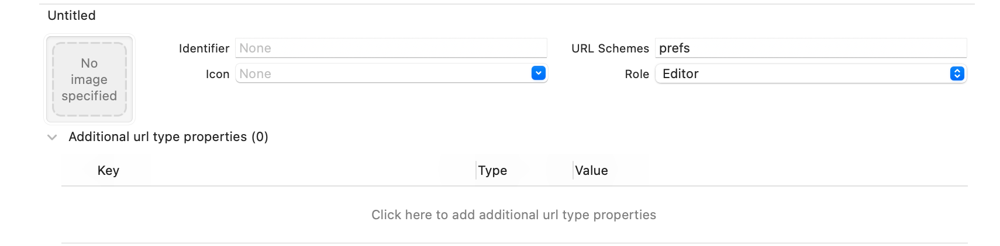


iOS 8及以后：

```objective-c
[[UIApplication sharedApplication] openURL:[NSURL URLWithString:UIApplicationOpenSettingsURLString]];
```

iOS 10及以后:

```objective-c
[[UIApplication sharedApplication] openURL:[NSURL URLWithString:UIApplicationOpenSettingsURLString] options:@{} completionHandler:nil];
```


##### 其他跳转

```objective-c
    [[UIApplication sharedApplication] openURL:[NSURL URLWithString:@"http://www.baidu.com"]];
    [[UIApplication sharedApplication] openURL:[NSURL URLWithString:@"sms://158********"]];
    [[UIApplication sharedApplication] openURL:[NSURL URLWithString:@"tel://158********"]];
    [[UIApplication sharedApplication] openURL:[NSURL URLWithString:@"mailto://362****@qq.com"]];
```


##### 跳转 App Store 进入指定的应用页面

```objective-c
// 其中myAppID为itunesconnect中的应用程序id
NSString *str = [NSString stringWithFormat: 
                 @"itms-apps://ax.itunes.apple.com/WebObjects/MZStore.woa/wa/viewContentsUserReviews?type=Purple+Software&id=%d", 
                 myAppID ];  
[[UIApplication sharedApplication] openURL:[NSURL URLWithString:str]];
```

##### 跳转 App Store 进入首页

```objective-c
NSString *str = [NSString stringWithFormat: 
                 @"itms-apps://itunes.apple.com/WebObjects/MZStore.woa/wa/viewSoftware?id=%@",
                 myAppID ];  
[[UIApplication sharedApplication] openURL:[NSURL URLWithString:str]];

```

> iOS 6 以后，苹果推出了 StoreKit ，无需再跳转到 App Store 直接在应用内即可打开


#### 3.2 `App-Prefs:WIFI` 使用私有API可能导致被拒的问题

一个解决方案from [BearsG](https://blog.csdn.net/ws1352864983/article/details/81912055)

```objective-c
//将上面的跳转字符串转成字符,在进行拼接就好了
NSData *encryptString = [[NSData alloc] initWithBytes:(unsigned char []){0x41,0x70,0x70,0x2d,0x50,0x72,0x65,0x66,0x73,0x3a,0x72,0x6f,0x6f,0x74,0x3d,0x57,0x49,0x46,0x49} length:19];//注意length长度 一定要是你所编码的字符长度

NSString *urlString = [[NSString alloc] initWithData:encryptString encoding:NSUTF8StringEncoding];
NSLog(@"urlString:%@",urlString);
if ([[UIApplication sharedApplication] canOpenURL:[NSURL URLWithString:urlString]]) {
    if ([[UIDevice currentDevice].systemVersion doubleValue] >= 10.0) {
        [[UIApplication sharedApplication] openURL:[NSURL URLWithString:urlString] options:@{} completionHandler:nil];
    } else {
        [[UIApplication sharedApplication] openURL:[NSURL URLWithString:urlString]];
    }
}
```


#### 3.3 App 间跳转

比如，分享跳转到微信、微博、QQ等；支付跳转到支付宝等。会拉起另外一个App，完成对应的操作后，又返回本App。

要点：

- URL Scheme
- 项目配置
- 跳转代理方法


##### 3.3.1 URL Scheme

URL Scheme其实就是一个URL前面的协议部分，比如这个地址 `https://testdemo.com`，其中 `https`就是一个Scheme，代表这是一个`https`的地址。

自己定义自己APP的”URL Schemes”，只有APP本身定义(支持)了URL Schemes，iOS才会去识别然后跳转。我们再看一个地址 `testdemo://jump?title=test&name=demo`，当我们访问这个地址的时候，如果系统中有注册 `testdemo:// => testdemo App`，那么系统便会使用testdemo App打开这个链接了，接着App会解析URL的path和search部分，执行对应的操作。

- 冒号`:`：在**链接头**和**命令**之间；
- 双斜杠 `//`：在**链接头和命令**之间，有时会是三斜杠 `///`；
- 问号 `?`：在**命令和参数**之间；
- 等号 `=`：在**参数和值**之间；
- **和符号** `&`：在**一组参数和另一组参数**之间。


那么如何向系统注册 `testdemo` 这个Scheme呢，安卓可以在 `manifest` 里通过 `intent-filter` 配置，iOS 则可以在 `info.plist` 文件中添加 `URL types` 来注册一个 Scheme。


##### 3.3.2 在项目 `info` 的 `url type` 中配置（被唤醒端）


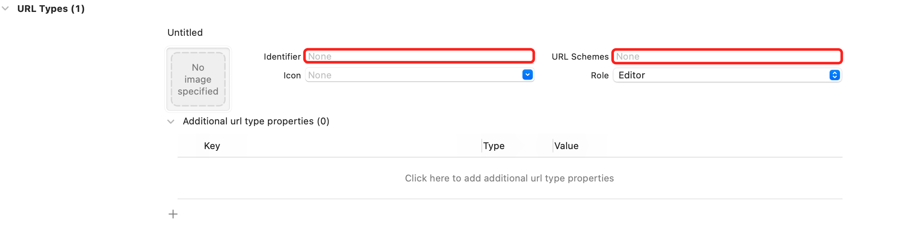

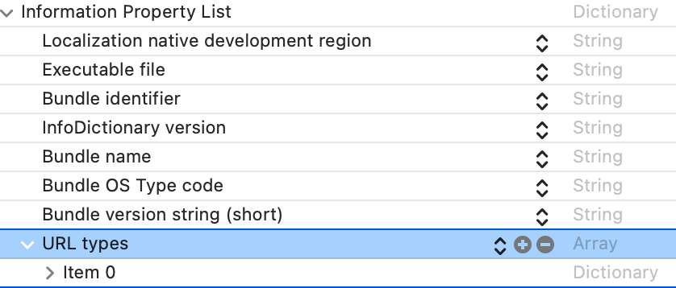

- URL Type 标识可以被那些带前缀 URL 唤起
  - URL identifier只是一个标示符，建议写成：`com.*.*`反转域名的方法保证该名字的唯一性。
  - URL Scheme就是你用来通信的命令前缀，用来定位一个应用。


#### 3.4 唤起

##### 3.4.1 Safari 浏览器 唤起 

直接在浏览器地址栏输入之前定义的 URL scheme：`testdemo://`

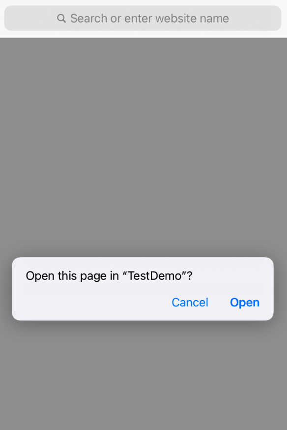

问题1：模拟器的时候，有几次没换起来

解决：杀掉模拟器里边的Safari，重新启动就好了。。。

<font color=red>问题2：模拟器没有走处理方法(3.4.2 中讲到的处理方法)，真机正常。</font>


##### 3.4.2 接收到唤起的处理

iOS 9 以下：

```objective-c
/*
application
Your singleton app object.

url
The URL resource to open. This resource can be a network resource or a file. For information about the Apple-registered URL schemes, see Apple URL Scheme Reference.

sourceApplication
The bundle ID of the app that is requesting your app to open the URL (url).

annotation
A Property list supplied by the source app to communicate information to the receiving app.

Return Value
YES if the delegate successfully handled the request or NO if the attempt to open the URL resource failed.
*/
- (BOOL)application:(UIApplication *)application 
            openURL:(NSURL *)url 
  sourceApplication:(NSString *)sourceApplication 
         annotation:(id)annotation;
```


iOS 9 以上

```objective-c
/*
app
Your singleton app object.

url
The URL resource to open. This resource can be a network resource or a file. For information about the Apple-registered URL schemes, see Apple URL Scheme Reference.

options
A dictionary of URL handling options. For information about the possible keys in this dictionary and how to handle them, see UIApplicationOpenURLOptionsKey. By default, the value of this parameter is an empty dictionary.

Return Value
YES if the delegate successfully handled the request or NO if the attempt to open the URL resource failed.
*/
- (BOOL)application:(UIApplication *)app 
            openURL:(NSURL *)url 
            options:(NSDictionary<UIApplicationOpenURLOptionsKey, id> *)options;
```

打印传参：

```objective-c
// iOS 9.0前方法
- (BOOL)application:(UIApplication *)application openURL:(NSURL *)url sourceApplication:(NSString *)sourceApplication annotation:(id)annotation {

    NSLog(@"Calling Application Bundle ID: %@", sourceApplication);
    NSLog(@"URL scheme: %@", [url scheme]);
    NSLog(@"URL query: %@", [url query]);

    return YES;
}

// iOS 9.0后方法
- (BOOL)application:(UIApplication *)app openURL:(nonnull NSURL *)url options:(nonnull NSDictionary<UIApplicationOpenURLOptionsKey,id> *)options {
    
    NSLog(@"options: %@", options);
    NSLog(@"Calling Application Bundle ID: %@", [options objectForKey:@"UIApplicationOpenURLOptionsSourceApplicationKey"]);
    NSLog(@"URL scheme: %@", [url scheme]);
    NSLog(@"URL query: %@", [url query]);
    
    return YES;
}
```


##### 3.4.3 App 拉起 App

```objective-c
- (void)pullApp {
    NSString *urlString = @"testdemo://";
    // 若有中文传输需要进行转义
    NSString *customURL = [urlString stringByAddingPercentEncodingWithAllowedCharacters:[NSCharacterSet URLQueryAllowedCharacterSet]];
    // 检查自定义 URL 是否被定义，如果定义了，则使用 shared application 实例来打开 URL
    if ([[UIApplication sharedApplication] canOpenURL:[NSURL URLWithString:customURL]]) {
        // openURL: 方法启动应用并将 URL 传入应用，在此过程中，当前的应用进入后台
        [[UIApplication sharedApplication] openURL:[NSURL URLWithString:customURL]];
    } else {
        UIAlertView *alert = [[UIAlertView alloc] initWithTitle:@"URL error" message:[NSString stringWithFormat:@"No custom URL defined for %@", customURL] delegate:self cancelButtonTitle:@"Ok" otherButtonTitles:nil];
        [alert show];
    }
}
```

iOS 10以上的 open 方法如下：

```objective-c
- (void)openURL:(NSURL *)url 
        options:(NSDictionary<UIApplicationOpenExternalURLOptionsKey, id> *)options 
completionHandler:(void (^)(BOOL success))completion;

/*
Deprecated
Use the openURL:options:completionHandler: method instead.

url
A URL (Universal Resource Locator). UIKit supports many common schemes, including the http, https, tel, facetime, and mailto schemes. You can also employ custom URL schemes associated with apps installed on the device.
*/
- (BOOL)openURL:(NSURL *)url;
```


#### 3.4.4 canOpenURL

> Returns a Boolean value that indicates whether an app is available to handle a URL scheme

```objective-c
/*
@param
A URL (Universal Resource Locator). At runtime, the system determines if an installed app is registered to handle the URL's scheme. More than one app can be registered to handle a scheme.

The URL can have a common scheme such as `http`, `https`, `tel`, or `facetime`, or a custom scheme. For information about supported schemes, see Apple URL Scheme Reference.

@return 
NO if no app installed on the device is registered to handle the URL’s scheme, or if you have not declared the URL’s scheme in your Info.plist file; otherwise, YES.

*/
- (BOOL)canOpenURL:(NSURL *)url
```


>**Important**
>
>**If your app is linked on or after iOS 9.0, you must declare the URL schemes you pass to this method by adding the `LSApplicationQueriesSchemes` key to your app's `Info.plist` file. This method always returns `NO` for undeclared schemes, whether or not an appropriate app is installed. To learn more about the key, see LSApplicationQueriesSchemes**
>
>
>
>If your app is linked against an earlier version of iOS but is running in iOS 9.0 or later, you can call this method up to 50 times. After reaching that limit, subsequent calls always return `NO`. If the user reinstalls or upgrades the app, iOS resets the limit.
>
>Unlike this method, the `openURL:options:completionHandler:` method is not constrained by the `LSApplicationQueriesSchemes` requirement. If an app is available to handle the URL, the system will launch it, whether or not you have declared the scheme.
>
>Using universal links instead of custom URL schemes removes the need to use this method to validate target links; if no app is available to handle a universal link, iOS routes it to Safari, allowing the associated website to respond. For more information on universal links, see Allowing Apps and Websites to Link to Your Content.


因为从 iOS 9 开始系统引入了 `LSApplicationQueriesSchemes`，即所谓的白名单。“白名单”的意义是要检查当前设备上是否安装了其他App，而不是打开其他App必须添加“白名单”。微信、微博等分享时，必须配置“白名单”是因为SDK要检测是否安装了微信、微博。

解决：

- 在 info.plist 增加 key：LSApplicationQueriesSchemes，类型为NSArray。
- 添加需要支持的白名单，类型为String。


### 4 URL Scheme 与 安全

> **URL Scheme非常危险，研究人员不建议使用这种方式来传递敏感信息。**

**攻击者可以利用通信过程中不进行认证源或目的地的特征。该漏洞最早发现时间是在2018年，已于2018年7月和8月通知了相关厂商。苹果也已经将URL Scheme的危险通知了开发者，并提供了安全建议：验证所有的URL参数，丢弃可能有问题的畸形的URL，限制可能对用户数据产生威胁的操作。**

**对开发者来说，建议使用通用链接、设置通用链接登陆接口，使用随机id来在本地接受login token，预防劫持和恶意login token重放攻击。**

换句话说，你找到了 URL Scheme，你就算发现了半个漏洞。。。🤷‍♀️🤷‍♀️🤷‍♀️

#### 4.1 获取 URL Scheme

##### 4.1.1 基本的URL Schemes可以在iOS APP中的`Info.plist`文件中寻找到

```xml
<key>CFBundleURLTypes</key>
	<array>
		<dict>
			<key>CFBundleTypeRole</key>
			<string>Editor</string>
			<key>CFBundleURLName</key>
			<string>com.testdemo</string>
			<key>CFBundleURLSchemes</key>
			<array>
				<string>testdemo</string>
			</array>
		</dict>
	</array>
```


##### 4.1.2 从手机站点页面获取

使用 Chrome 的 开发者工具

##### 4.1.3 解析二维码

##### 4.1.4 逆向 App


#### 4.2 转载[iOS URL Scheme劫持](https://www.4hou.com/posts/PMP2)

> 苹果通过iOS沙箱机制限制每个应用可以访问的资源以管理应用安全和隐私的问题。但该机制也有一定的安全问题，如果一个APP被黑，通过APP Store分发的所有应用可能都会出现问题。加上访问控制，app之间的通信变得更加困难。
>
> 但苹果也提供了其他方法来帮助app间的通信，最常见的方式就是URL Scheme。本质上讲，这是一个允许开发者在iOS设备上通过URL来启动APP的特征，可以将信息从一个APP传递到另外一个APP。比如，打开一个URL facetime://, FaceTime就会被调用。这是一种非常有效的快捷方式，但URL Scheme的设计是为了通信而不是安全。
>
> 下面介绍下如何滥用URL Scheme来破坏隐私，进行弹出广告和票据欺诈，文章以苏宁和微信为例进行了验证。
>
> **工作原理**
>
> iOS允许APP声明一个简单的URL Scheme。比如，两个完全隔离的app可以利用Sample://来进行消息传递。因此恶意app可以利用URL Scheme来入侵用户。
>
> Apple已经在iOS 11之后版本上解决了这一问题，使用了先来先服务原则，只有使用URL Scheme安装的APP才可以启动。但该漏洞仍然可以用其他方式来利用。
>
> **URL Schemes影响账户隐私**
>
> URL Schemes是作为APP的网关来从其他APP来接收信息。因为苹果允许不同的APP声明相同的URL scheme，因此恶意APP可以劫持特定APP的敏感数据。如果app A的登陆过程与APP B相关，那么就非常危险了。
>
> 比如，苏宁易购APP允许受害者使用微信账号来登陆。正常的认证过程是苏宁APP生成一个URL Scheme查询，并发送给微信APP。当微信APP收到苏宁APP的查询后，会从微信服务器请求一个Login-Token，并发回给苏宁APP进行认证。
>
> 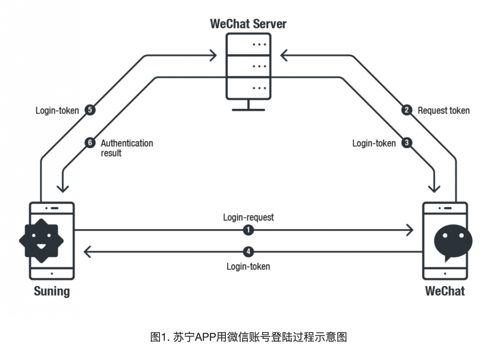
>
> 研究发现苏宁APP总是使用相同的Login-Request URL Scheme查询来请求Login-Token，但是微信并不会对登陆请求的源进行认证。因此，攻击者可以使用APP的Login-Request URL Scheme作恶意目的。
>
> 攻击者可以使用苏宁APP的Login-Request URL Scheme查询来请求受害者微信账号的Login-Token。然后可以使用该token来用微信账号来登陆苏宁APP。该过程允许攻击者收集个人信息或滥用账户的访问权限。
>
> 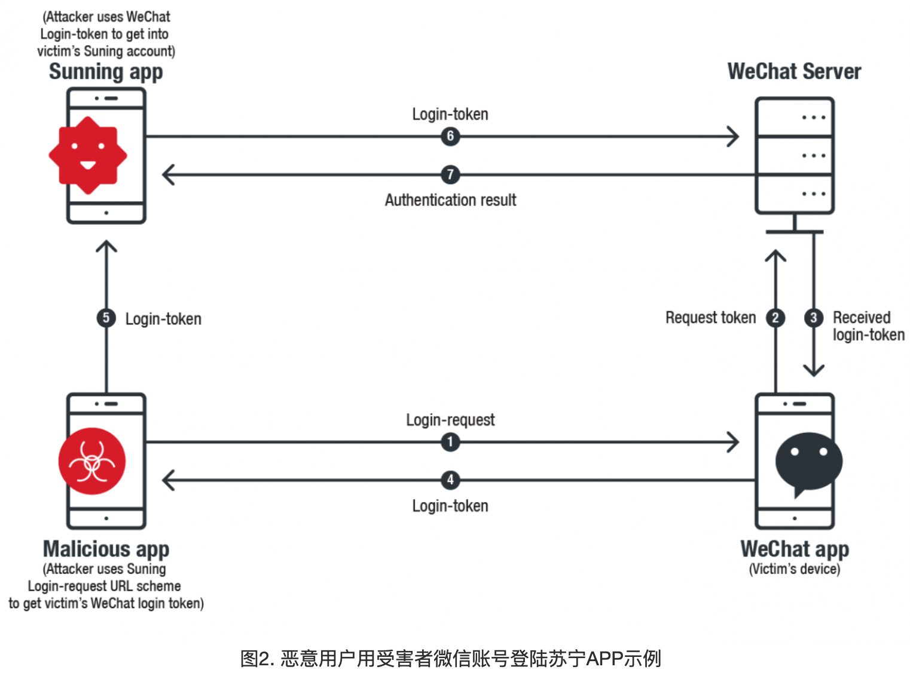
>
> 为了完成攻击，攻击者首先必须获取苏宁的Login-Request URL Scheme。要从苏宁APP获取该URL Scheme要用微信的URL Scheme创建一个完全独立的APP，微信的URL Scheme 在苏宁app的LSApplicationQueriesSchemesin Info.plist 中。有了合法的WeChat URL Scheme，就可以创建一个伪造的微信，苏宁APP就可以查询伪造的微信来请求Login-Token。
>
> 如果苏宁APP发送了该请求，伪造的APP就会获取Login-Request URL Scheme。分析发现Login-Request中包含含有常数值的常数参数的多轮查询，这样攻击者就可以重放该请求。
>
> 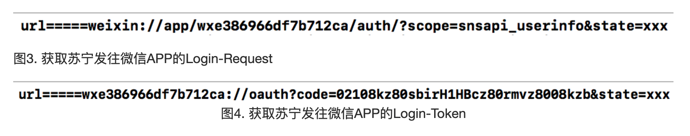
>
> 如图3和图4所示，苏宁APP会插入一个唯一的、复杂的URL Scheme（wxe386966df7b712ca）来构造查询等待微信响应。该特定的URL在苏宁登陆时会在微信上注册。微信会认出该URL但不会认证Login-Request的源，而是直接响应到请求源的Login-Token。
>
> 但请求源可能是一个滥用苏宁APP的URL scheme的恶意APP。
>
> 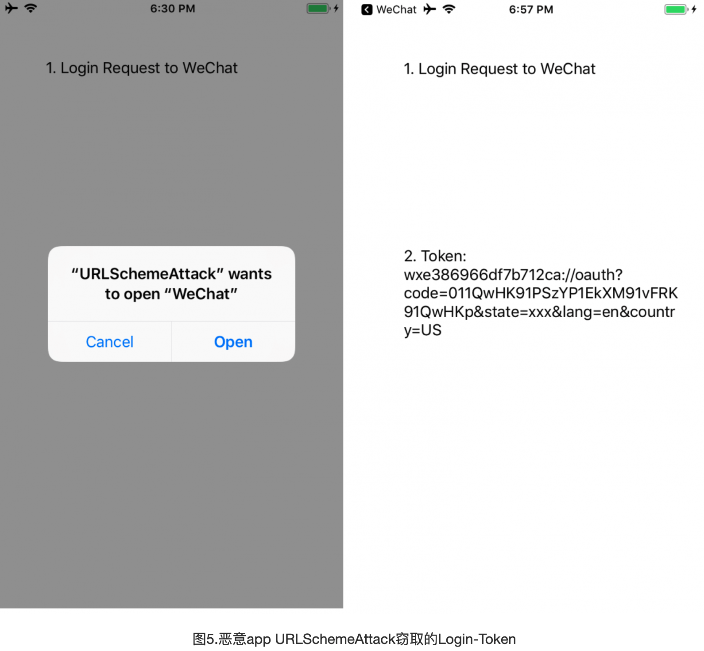
>
> 恶意攻击者可以利用该Login-Token来访问受害者的微信账号，暴露个人信息。被黑的账号也可以被用于恶意目的。
>
> 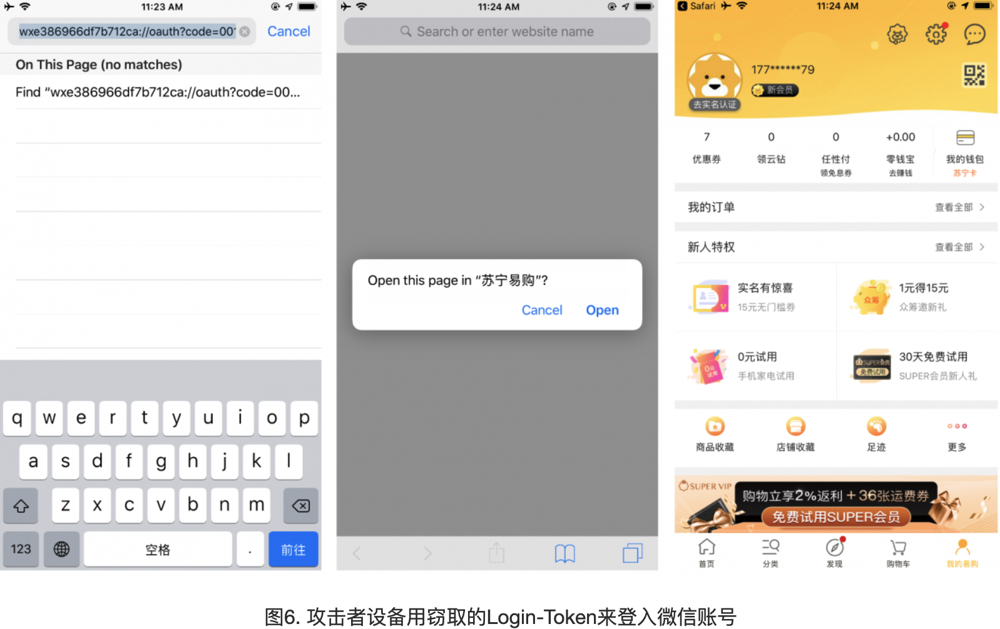
>
> 该漏洞存在于使用这种登陆方式的多个APP中，并不局限于微信和苏宁。
>
> **URL Schemes滥用账单钓鱼**
>
> 伪造的URL Scheme可以用于多个攻击场景中，另一个攻击场景是账单重放钓鱼，即诱使受害者支付其他账单。在这类攻击中，使用了社会工程技术和URL Schemes的漏洞。
>
> 一般来说，账单重放钓鱼是通过发送到特定APP的账单请求的URL Scheme +支付特征来实现的。下面用滴滴和美团打车APP来证明该攻击的可能性。
>
> 为了重放该攻击，研究人员将微信app作为支付APP。攻击者可以使用前面提到的策略：用合法APP的URL Scheme来创建一个伪造的微信，获取来自滴滴或美团打车的URL Scheme账单请求。
>
> 有了账单URL Scheme后，攻击者可以重放到合法微信APP的账单请求，并自动调用其支付接口。因此攻击者使用了窃取的滴滴或美团打车的URL Scheme请求，受害者的合法微信APP就会接受支付请求。 
>
> 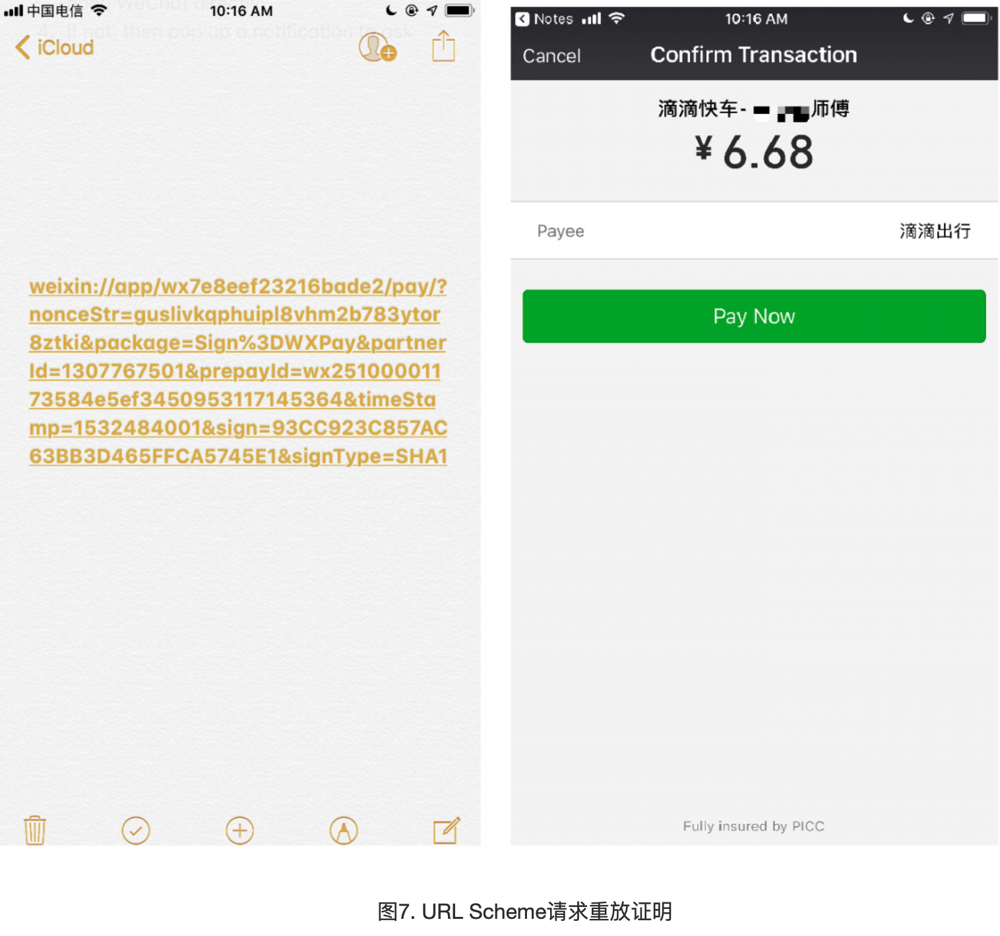
>
> 一般来说用户可能并不会被欺骗，因此这个请求可能是随机弹出的。但这一特征增加了诈骗的可能性。用户可能会无意地点击支付，或认为这是一个合法的支付请求。
>
> 另一个攻击场景可能是使用SMS社工技巧和URL Scheme。以滴滴或美团打车为例，攻击者首先利用的还是账单这一过程。
>
> 使用滴滴或美团打车的用户经常会收到短信提醒其支付未支付的账单。攻击者可以生成相似的SMS消息给受害者，SMS中含有账单请求的URL Scheme——来自攻击者。用户点击后，链接就会将受害者重定向到微信的支付接口，要求受害者支付。这是一种操作受害者使其支付本不属于他自己的账单的有效而简单的方式。
>
> 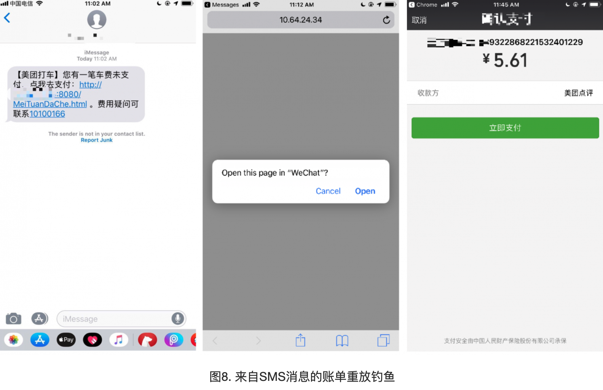
>
> 微信最新版新加入了一种安全策略来预防此类账单重放攻击，即微信不接受来自手机浏览器Safari的账单请求。但仍然支持来自Chrome, Message, Gmail等APP的账单请求。
>
> **URL Scheme用于弹窗广告**
>
> URL Scheme的另一个问题是可能被用于启动应用。也就是说恶意app注册了特定的URL Scheme后，当URL Scheme调用后，恶意app就可能会被启动。研究过程中，研究人员发现大量利用该特征来向用户展示广告的APP。恶意APP会声明与主流APP相关的URL Scheme，比如`wechat://`, `line://`, `fb://`,`fb-messenger://`。
>
> 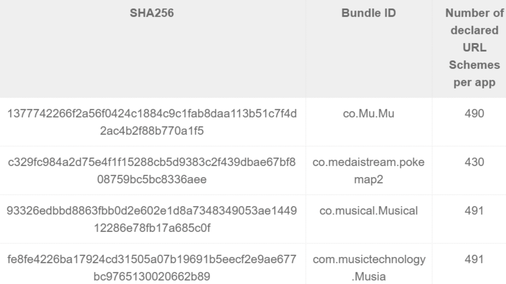


因为转载了一片文章，所以篇幅有点儿长了，Univerisal Link 会在后边的篇文章中讲到。敬请期待


### 参考

- [Apple URL Scheme Reference](https://developer.apple.com/library/archive/featuredarticles/iPhoneURLScheme_Reference/Introduction/Introduction.html#//apple_ref/doc/uid/TP40007899)
- [LSApplicationQueriesSchemes](https://developer.apple.com/library/archive/documentation/General/Reference/InfoPlistKeyReference/Articles/LaunchServicesKeys.html#//apple_ref/doc/plist/info/LSApplicationQueriesSchemes)