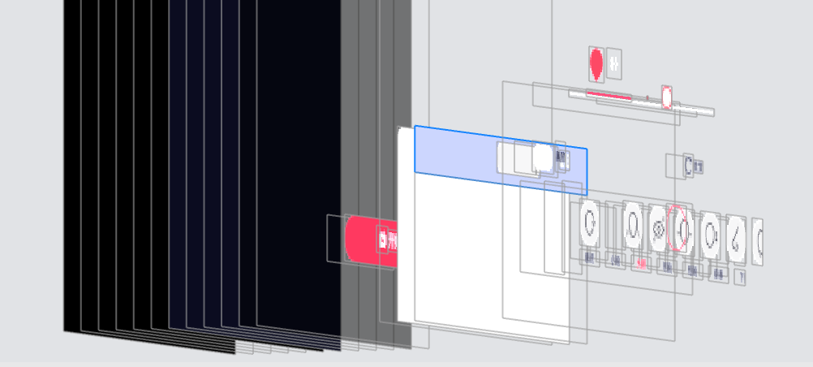
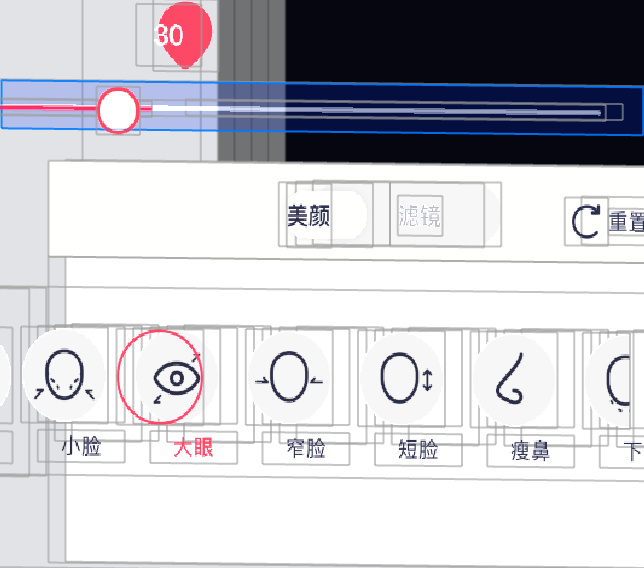

# 码页面要点记录

### 响应链相关

我之前写过相关文章 [iOS中事件的响应和传递](./articles/2020-5-27-iOS中事件的响应和传递.md) 可以先看看

**1 穿透触发事件**，比如：需要点击选中 view 触发事件。那么就需要**穿透**在选中 view 之上的 view




实现：在目标父 view 重写 `- (UIView *)hitTest:(CGPoint)point withEvent:(UIEvent *)event;` 方法

```objective-c
- (UIView *)hitTest:(CGPoint)point withEvent:(UIEvent *)event {
    if (!self.userInteractionEnabled || [self isHidden] || self.alpha <= 0.1) {
        return nil;
    }
    if ([self pointInside: point withEvent: event]) {
        __block UIView *hit = nil;
        [self.subviews enumerateObjectsWithOptions: NSEnumerationReverse usingBlock:^(__kindof UIView * _Nonnull obj, NSUInteger idx, BOOL * _Nonnull stop) {
            // 隐藏view直接跳出本次循环
            if (obj.hidden) {
                return;
            }
          	// 坐标转换
            CGPoint currentPoint = [self convertPoint: point toView: obj];
          	// 递归调用
            hit = [obj hitTest: currentPoint withEvent: event];
            // 透传目标点击事件
            CGPoint aimViewPoint = [obj convertPoint:currentPoint toView:self.container];
            if (CGRectContainsPoint(self.aimView.frame, aimViewPoint)) {
                hit = self.aimView;
            }
            // 命中退出循环
            if (hit) {
                *stop = YES;
            }
            
        }];
        
        if (hit) {
            return hit;
        } else {
            return self;
        }
    } else {
        return nil;
    }
}
```


**2 超出父 view 的 frame，触发事件**。比如：要拖动超出父 view 的 slider 





实现：重写 slider 父 view 的  `- (UIView *)hitTest:(CGPoint)point withEvent:(UIEvent *)event;` 方法

```objective-c
- (UIView *)hitTest:(CGPoint)point withEvent:(UIEvent *)event {
  	// slider 在所在view父视图的frame
    CGRect frameInSuper = [self convertRect:self.slider.frame toView: self.superview];
    if ((!self.slider.hidden) && CGRectContainsPoint(frameInSuper, point)) {
        return self.slider.hidden;
    }
    return [super hitTest:point withEvent:event];
}

```


### Gesture 手势相关

遇到的问题是：iOS 13 在给 view 添加了 swipe 手势后，页面上的 slider 滑动**不跟手**。

解决：给 slider 添加了一个无效的 pan 手势

```objective-c
// target nil / action NULL
UIPanGestureRecognizer *panGesture = [[UIPanGestureRecognizer alloc] initWithTarget:nil action:NULL];
panGesture.cancelsTouchesInView = false;
[_slider addGestureRecognizer:panGesture];
```


### 获取 top Window 和 top VC

给 UIViewController 添加分类方法：

```objective-c
/// 获取top window
+ (UIWindow *)xxx_topWindow {
    NSArray *windows = [UIApplication sharedApplication].windows;
    for (UIWindow *window in [windows reverseObjectEnumerator]) {
        if ([window isKindOfClass:NSClassFromString(@"UITextEffectsWindow")]) {
            continue;
        }
        if (!window.isHidden && [window isKindOfClass:[UIWindow class]] && CGRectEqualToRect(window.bounds, [UIScreen mainScreen].bounds))
            return window;
    }
    return [[UIApplication sharedApplication].delegate window];
}
/// 获取 top viewcontroller
+ (UIViewController *)xxx_topViewController {
    UIViewController *topController = [[self xxx_topWindow] rootViewController];
    while (topController.presentedViewController) {
        topController = topController.presentedViewController;

        if ([topController isKindOfClass:[UINavigationController class]]) {
            topController = [(UINavigationController *)topController visibleViewController];
        } else if ([topController isKindOfClass:[UITabBarController class]]) {
            topController = [(UITabBarController *)topController selectedViewController];
        }
    }
    return topController;
}
```


### 调整 progressView 的宽、高以及两端弧度

```objective-c
//这里是设定progressView的模式为默认模式
self.progressView = [[UIProgressView alloc] initWithProgressViewStyle:UIProgressViewStyleDefault];
self.progressView.frame = CGRectMake(16, CGRectGetMaxY(label1.frame) + 15, SCREEN_WIDTH - 32 - image3.size.width - 25, 8);
//设定progressView的显示颜色
self.progressView.progressTintColor=COLOR_THEME;
CGAffineTransform transform = CGAffineTransformMakeScale(1.0f, 2.0f);
//设定宽高
self.progressView.transform = transform;
//设定宽高
self.progressView.trackImage = image4;
self.progressView.contentMode = UIViewContentModeScaleAspectFill;
//设定两端弧度
self.progressView.layer.cornerRadius = 1.0;
self.progressView.layer.masksToBounds = YES;
//设定progressView的现实进度（一般情况下可以从后台获取到这个数字）
[self.progressView setProgress:0.70 animated:YES];
[self.view addSubview:self.progressView];
```


### 关于UIButton

1. `title`和`image`位置问题，如下通过 **EdgeInsets** 调整

```objective-c
// how to center an image and a text using imageEdgeInsets and titleEdgeInsets?
// the space between the image and text
CGFloat spacing = 6.0;

// lower the text and push it left so it appears centered 
//  below the image
CGSize imageSize = button.imageView.image.size;
button.titleEdgeInsets = UIEdgeInsetsMake(
  0.0, - imageSize.width, - (imageSize.height + spacing), 0.0);

// raise the image and push it right so it appears centered
//  above the text
CGSize titleSize = [button.titleLabel.text sizeWithAttributes:@{NSFontAttributeName: button.titleLabel.font}];
button.imageEdgeInsets = UIEdgeInsetsMake(
  - (titleSize.height + spacing), 0.0, 0.0, - titleSize.width);

// increase the content height to avoid clipping
CGFloat edgeOffset = fabsf(titleSize.height - imageSize.height) / 2.0;
button.contentEdgeInsets = UIEdgeInsetsMake(edgeOffset, 0.0, edgeOffset, 0.0);
```

2. 通过设置`UIButton`的`contentEdgeInsets`属性和`UIControl`（`UIControl`是`UIButton`的父类）的`contentVerticalAlignment`和`contentHorizontalAlignment`属性可以将按钮中的内容（图片或者文字或者图片和文字的整体）整体移动

```objective-c
typedefNS_ENUM(NSInteger, UIControlContentHorizontalAlignment) {
UIControlContentHorizontalAlignmentCenter =0,//居中
UIControlContentHorizontalAlignmentLeft =1,//居左
UIControlContentHorizontalAlignmentRight =2,//居右
UIControlContentHorizontalAlignmentFill =3,//

```

3. 防止按钮被连击

```objective-c
// 1 取消之前的操作
- (void)buttonClicked:(id)sender{
    //点击按钮后先取消之前的操作，再进行需要进行的操作
    [[self class] cancelPreviousPerformRequestsWithTarget:self selector:@selector(buttonClicked:) object:sender];
    [self performSelector:@selector(buttonClicked: )withObject:sender afterDelay:0.2f];
}
// 2 点击后设为不可被点击的状态，几秒后恢复
-(void)buttonClicked:(id)sender{
    self.button.enabled =NO;
    [selfperformSelector:@selector(changeButtonStatus)withObject:nilafterDelay:1.0f];//防止重复点击
}

-(void)changeButtonStatus{
    self.button.enabled =YES;
}

// 3 使用runtime 0.5秒内不会被重复点击
// 1.导入 objc/runtime.h
// 2.创建 uicontrol 或 UIButton 的category

// -------代码如下：-------
// .h文件
#import
#define defaultInterval 0.5f // 默认时间间隔
@interfaceUIControl (UIControl_buttonCon)
@property(nonatomic, assign) NSTimeInterval timeInterval; // 用这个给重复点击加间隔
@property(nonatomic, assign) BOOL isIgnoreEvent; // YES不允许点击NO允许点击
@end
  
// .m文件
#import"UIControl+UIControl_buttonCon.h"
@implementationUIControl (UIControl_buttonCon)

- (NSTimeInterval)timeInterval {
    return [objc_getAssociatedObject(self,_cmd) doubleValue];
}

- (void)setTimeInterval:(NSTimeInterval)timeInterval {
    objc_setAssociatedObject(self,@selector(timeInterval),@(timeInterval),OBJC_ASSOCIATION_RETAIN_NONATOMIC);
}

// runtime动态绑定属性
- (void)setIsIgnoreEvent:(BOOL)isIgnoreEvent {
    objc_setAssociatedObject(self,@selector(isIgnoreEvent),@(isIgnoreEvent),OBJC_ASSOCIATION_RETAIN_NONATOMIC);
}

- (BOOL)isIgnoreEvent {
    return [objc_getAssociatedObject(self,_cmd) boolValue];
}

- (void)resetState {
    [self setIsIgnoreEvent:NO];
}

+ (void)load {
    static dispatch_once_t onceToken;
    dispatch_once(&onceToken, ^{
        SEL selA =@selector(sendAction:to:forEvent:);
        SEL selB =@selector(mySendAction:to:forEvent:);
        Method methodA =class_getInstanceMethod(self, selA);
        Method methodB =class_getInstanceMethod(self, selB);
        // 将methodB的实现添加到系统方法中也就是说将methodA方法指针添加成方法methodB的返回值表示是否添加成功
        BOOL isAdd =class_addMethod(self, selA,method_getImplementation(methodB),method_getTypeEncoding(methodB));
        // 添加成功了说明本类中不存在methodB所以此时必须将方法b的实现指针换成方法A的，否则b方法将没有实现。
        if(isAdd) {
            class_replaceMethod(self, selB,method_getImplementation(methodA),method_getTypeEncoding(methodA));
        }else {
            // 添加失败了说明本类中有methodB的实现，此时只需要将methodA和methodB的IMP互换一下即可。
            method_exchangeImplementations(methodA, methodB);
        }
    });
}

- (void)mySendAction:(SEL)action to:(id)target forEvent:(UIEvent*)event{
    if([NSStringFromClass(self.class) isEqualToString:@"UIButton"]) {
        self.timeInterval=self.timeInterval==0?defaultInterval:self.timeInterval;
        if(self.isIgnoreEvent){
            return;
        }elseif(self.timeInterval>0){
            [self performSelector:@selector(resetState) withObject:nil afterDelay:self.timeInterval];
        }
    }
    // 此处methodA和methodB方法IMP互换了，实际上执行sendAction；所以不会死循环
    self.isIgnoreEvent=YES;
    [self mySendAction:action to:target forEvent:event];
}
@end

```


### TextField

#### 自定义继承自 UITextField 的类

>1、 propert type XXXTextFieldDelegate is incompatible with type UITextFieldDelegate inherited from UITextField。
>
>2、 Auto property synthesis will not synthesize property 'delegate'; it will be implemented by its superclass,use @dynamic to...

1. 遵循父类的代理方法
2. 用`@dynamic`告诉编译器,属性的setter与getter方法由用户自己实现，不自动生成


#### 禁止粘贴

```objective-c
// 方法1: 重写 canPerformAction:withSender: 方法并返回 NO 即可。
- (BOOL)canPerformAction:(SEL)action withSender:(id)sender {
       if (action == @selector(paste:)) { //禁止粘贴
           return NO;
       }
       if (action == @selector(select:)) { // 禁止选择   
           return NO; 
       }
       if (action == @selector(selectAll:)) { // 禁止全选   
           return NO;  
       }
       return [super canPerformAction:action withSender:sender];
}

// 方法2:
-(BOOL)canPerformAction:(SEL)action withSender:(id)sender {
    UIMenuController *menuController = [UIMenuController sharedMenuController];
    if (menuController) {
        [UIMenuController sharedMenuController].menuVisible = NO;
    }
    return NO;
}
```

#### 输入限制（字数限制、字符限制）

主要在如下代理方法中实现逻辑：

```objective-c
// UITextView
- (BOOL)textView:(UITextView *)textView shouldChangeTextInRange:(NSRange)range replacementText:(NSString *)text;
// UITextField
- (BOOL)textField:(UITextField *)textField shouldChangeCharactersInRange:(NSRange)range replacementString:(NSString *)string;
```

比如手机号、姓名等等，以金额输入为例：

```objective-c
/**
 * 限制输入两位小数
 * 输入小数点后两位之后，再输入其他字符回收键盘
 */
- (BOOL)textField:(UITextField *)textField shouldChangeCharactersInRange:(NSRange)range replacementString:(NSString *)string {
    NSMutableString * currentString = [NSMutableString stringWithString:textField.text];
    NSMutableString * futureString = [NSMutableString stringWithFormat:@"%@%@",currentString,string];

    // 禁止输入除数字和‘.’之外的其他字符
    if (![@"1234567890." containsString:string] && ![string isEqualToString:@""]) {
        return NO;
    }

    NSInteger flag=0;
    const NSInteger limited = 2;
    if (![textField.text containsString:@"."]){
        _numberOfPoint = 0;
    }else if(0 == _numberOfPoint){
        _numberOfPoint = 1;
    }

    // 如果text field中没有字符，且输入的字符位 ‘.’，则自动填充 ‘0’
    if (textField.text.length < 1 && [string isEqualToString:@"."]) {
        textField.text = @"0";
        _numberOfPoint ++;
        return YES;
    }else if(0 == textField.text.length && [string isEqualToString:@"0"]) {
        textField.text = @"0.";
        _numberOfPoint ++;
        return NO;
    }else {
        // 只能有一个小数点
        if (_numberOfPoint > 0 && [string isEqualToString:@"."]) {
            return NO;
        }
        if (_numberOfPoint == 0 && [string isEqualToString:@"."]) {
            _numberOfPoint ++;
        }

        if (range.location >= futureString.length - 3) {
            // 从后往前遍历字符串flag用于记录小数点后的数字位数
            for (int i = (int)futureString.length-1 ; i>=0; i--) {
                if ([futureString characterAtIndex:i] == '.') {
                    if (flag > limited) {
                        //回收键盘
                        [textField resignFirstResponder];
                        return NO;
                    }
                    break;
                }
                flag++;
            }
        }
    }
    return YES;
}
```


#### 样式调整

```objective-c
//控制清除按钮的位置
-(CGRect)clearButtonRectForBounds:(CGRect)bounds;

//控制placeHolder的位置，左右缩20
-(CGRect)placeholderRectForBounds:(CGRect)bounds;

//控制显示文本的位置
-(CGRect)textRectForBounds:(CGRect)bounds;

//控制编辑文本的位置
-(CGRect)editingRectForBounds:(CGRect)bounds;

//控制左视图位置
- (CGRect)leftViewRectForBounds:(CGRect)bounds;

//控制placeHolder的颜色、字体
- (void)drawPlaceholderInRect:(CGRect)rect;

```

#### UIView 的 exclusiveTouch 属性 (default is NO)

exclusiveTouch 的意思是 UIView 会独占整个 Touch 事件，具体的来说，就是当设置了exclusiveTouch 的 UIView 是事件的第一响应者，
那么到你的所有手指离开前，其他的视图UIview 是不会响应任何触摸事件的，对于多点触摸事件，这个属性就非常重要，
值得注意的是：手势识别（GestureRecognizers）会忽略此属性。
使用该属性可以达到同一界面上多个控件接受事件时的排他性，从而避免一些问题。