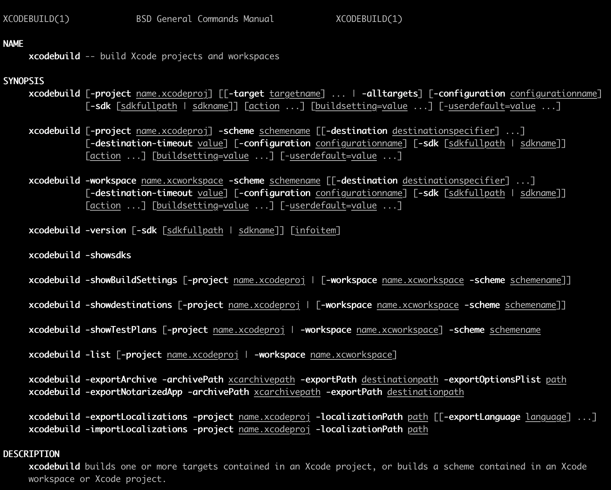
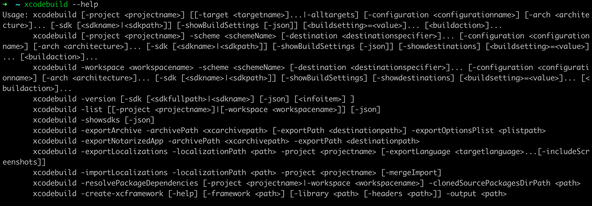

## XCODEBUILD 打包Framework



上图是在 Terminal 输入: `man xcodebuild` 看到的手册。`xcodebuild --help` 可以获得更详细的帮助：



### XCODEBUILD

> xcodebuild builds one or more targets contained in an Xcode project, or builds a scheme contained in an Xcode workspace or Xcode project.

```sh
xcodebuild \
[-project name.xcodeproj] \
[[-target targetname] ... | -alltargets] [-configuration configurationname] [-sdk [sdkfullpath | sdkname]] \
[action ...] \
[buildsetting=value ...] \
[-userdefault=value ...] \
```

xcodebuild 的 Options 可以自行查阅手册这里不再赘述。其中我想说的打包framework常用的 action 其实就只有：

- `build` , *Build the target in the build root (SYMROOT).  This is the default action, and is used if no action is given.*
- `clean` , *Remove build products and intermediate files from the build root (SYMROOT).*

### 应用

#### 打包脚本

```shell
#!/bin/sh
set -e

# 打印函数
print_warn() {
    echo "\033[0;33m"$1"\033[0m"
}
print_error() {
    echo "\033[0;31m"$1"\033[0m"
}

print_success() {
    echo "\033[0;32m"$1"\033[0m"
}

# 插件安装判断
has_install() {
#https://stackoverflow.com/questions/592620/how-can-i-check-if-a-program-exists-from-a-bash-script/
    if type $1 >/dev/null 2>&1;
    then
        return 0
    else
        return 1
    fi
}

# 定义常量
Target_Name=${PROJECT_NAME}
FRAMEWORK_NAME=${Product_Name}.framework
CONFIGURATION=Release
INSTALL_DIR=${SRCROOT}/Products
INSTALL_FILE=${INSTALL_DIR}/${FRAMEWORK_NAME}
# 定义一个临时真机路径来保存打包的文件，适配New Build System
IPHONE_DIR=${INSTALL_DIR}/${CONFIGURATION}-iphoneos

# 模拟器
SIMULATOR_DIR=${WRK_DIR}/${CONFIGURATION}-iphonesimulator/${FRAMEWORK_NAME}
IPHONE_SIMULATOR_DIR=${INSTALL_DIR}/${CONFIGURATION}-iphonesimulator

# 是否使用新的build系统 
_UseModernBuildSystem=NO

# 先清理旧文件
if [ -d "${INSTALL_DIR}" ]
then
rm -rf "${INSTALL_DIR}"
fi
mkdir -p "${INSTALL_DIR}"


# 编译函数
build_cmd() {
    if [[ $# -ne 2 ]]; then
        print_error "参数错误"
        exit 1
    fi
    currentARCHS="arm64 armv7"
    if [[ $1 == "iphonesimulator" ]];then
        currentARCHS="i386 x86_64"
    fi
    
    xcodebuild \
    -target "${Target_Name}" \
    -configuration "${CONFIGURATION}" \
    -sdk "${1}" \
    -UseModernBuildSystem=${_UseModernBuildSystem} \
    CONFIGURATION_BUILD_DIR="${2}" \
    BITCODE_GENERATION_MODE=bitcode \
    ENABLE_BITCODE=YES \
    ARCHS="${currentARCHS}" \
    clean build
}

iphone_sdk=iphoneos
simulator_sdk=iphonesimulator

print_warn "开始打包真机SDK..."

# 用来格式化（美化）xcodebuild命令行工具输出日志的一个小工具
xc_name="xcpretty"

result=1
if has_install ${xc_name}; then
    build_cmd "${iphone_sdk}" "${IPHONE_DIR}" | xcpretty && result=${PIPESTATUS[0]}
else
    print_warn "请安装${xc_name}命令：sudo gem install ${xc_name}"
    build_cmd "${iphone_sdk}" "${IPHONE_DIR}"
    result=$?
fi

if [[ result -ne 0 ]]; then
    print_error "打包真机sdk失败"
    exit ${result}
fi

# 拷贝 Headers、info.plist Modules 等内容，在 lipo 合成的时候使用
cp -r "${IPHONE_DIR}/${FRAMEWORK_NAME}" "${INSTALL_FILE}"

print_warn "开始打包模拟器SDK..."
if has_install ${xc_name}; then
    build_cmd "${simulator_sdk}" "${IPHONE_SIMULATOR_DIR}" | xcpretty && result=${PIPESTATUS[0]}
else
    build_cmd "${simulator_sdk}" "${IPHONE_SIMULATOR_DIR}"
    result=$?
fi

if [[ result -ne 0 ]]; then
    print_error "打包模拟器sdk失败"
    exit ${result}
fi

# 合并真机和模拟器生成通用库
lipo -create "${IPHONE_DIR}/${FRAMEWORK_NAME}/${Product_Name}" "${IPHONE_SIMULATOR_DIR}/${FRAMEWORK_NAME}/${Product_Name}" -output "${INSTALL_FILE}/${Product_Name}"

rm -r "${IPHONE_DIR}" "${IPHONE_SIMULATOR_DIR}"

if [[ $1 == "silent" ]];then
    exit 0
fi
# 打包成功打开文件夹
open "${SRCROOT}/Products"
```

##### 注意点：

- 先 `clean` 再 `build`
- 拷贝 `cp -r` 这步不能漏
- `lipo` 创建通用库