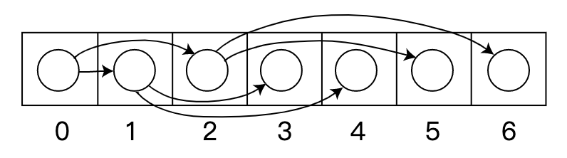

## 遍历二叉树（一）

### 树

#### 计算机科学中的定义

> 在计算机科学中，**树**（英语：tree）是一种[抽象数据类型](https://zh.wikipedia.org/wiki/抽象資料型別)（ADT）或是实现这种抽象数据类型的[数据结构](https://zh.wikipedia.org/wiki/資料結構)，用来模拟具[有树状结构](https://zh.wikipedia.org/wiki/樹狀結構)性质的数据集合。它是由n（n>0）个有限节点组成一个具有层次关系的[集合](https://zh.wikipedia.org/wiki/集合)。它具有以下**特点**：
>
> - 每个节点都只有有限个子节点或者无子节点
> - 没有父节点的节点称为根节点
> - 每个非根节点有且只有一个父节点
> - 除了根节点以外，每个子节点可以分为多个不相交的子树
> - 树里面没有环路
>
> **术语**：
>
> 1. **节点的度**：一个节点含有的子树的个数称为该节点的度；
> 2. **树的度**：一棵树中，最大的节点度称为树的度；
> 3. **叶节点**或**终端节点**：度为零的节点；
> 4. **非终端节点**或**分支节点**：度不为零的节点；
> 5. **父亲节点**或**父节点**：若一个节点含有子节点，则这个节点称为其子节点的父节点；
> 6. **孩子节点**或**子节点**：一个节点含有的子树的根节点称为该节点的子节点；
> 7. **兄弟节点**：具有相同父节点的节点互称为兄弟节点；
> 8. 节点的**层次**：从根开始定义起，根为第1层，根的子节点为第2层，以此类推；
> 9. **深度**：对于任意节点n,n的深度为从根到n的唯一路径长，根的深度为0；
> 10. **高度**：对于任意节点n,n的高度为从n到一片树叶的最长路径长，所有树叶的高度为0；
> 11. **堂兄弟节点**：父节点在同一层的节点互为堂兄弟；
> 12. **节点的祖先**：从根到该节点所经分支上的所有节点；
> 13. **子孙**：以某节点为根的子树中任一节点都称为该节点的子孙。
> 14. **森林**：由m（m>=0）棵互不相交的树的集合称为森林；


#### 图论中的定义

> 在[图论](https://zh.wikipedia.org/wiki/图论)中，**树**（英语：Tree）是一种[无向图](https://zh.wikipedia.org/wiki/無向圖)（undirected graph），其中任意两个[顶点](https://zh.wikipedia.org/wiki/顶点_(图论))间存在唯一一条[路径](https://zh.wikipedia.org/wiki/路径_(图论))。或者说，只要没有[回路](https://zh.wikipedia.org/wiki/環_(圖論))的[连通图](https://zh.wikipedia.org/wiki/连通图)就是树。**森林**是指互相[不交并](https://zh.wikipedia.org/wiki/不交并)树的集合。树图广泛应用于[计算机科学](https://zh.wikipedia.org/wiki/计算机科学)的[数据结构](https://zh.wikipedia.org/wiki/数据结构)中，比如[二叉查找树](https://zh.wikipedia.org/wiki/二叉查找树)，[堆](https://zh.wikipedia.org/wiki/堆_(数据结构))，[Trie树](https://zh.wikipedia.org/wiki/Trie)以及[数据压缩](https://zh.wikipedia.org/wiki/数据压缩)中的[霍夫曼树](https://zh.wikipedia.org/wiki/霍夫曼编码)等等
>
> 
>
> 如果一个无向简单图*G* 满足以下相互等价的条件之一，那么*G* 是一棵**树**：
>
> - *G* 是没有[回路](https://zh.wikipedia.org/wiki/環_(圖論))的[连通图](https://zh.wikipedia.org/wiki/连通图)。
> - *G* 没有回路，但是在*G*内添加任意一条[边](https://zh.wikipedia.org/wiki/邊_(圖論))，就会形成一个回路。
> - *G* 是连通的，但是如果去掉任意一条边，就不再连通。
> - *G*内的任意两个顶点能被唯一[路径](https://zh.wikipedia.org/wiki/路径_(图论))所连通。
>
> 
>
> 如果无向简单图*G*有有限个顶点（设为*n*个顶点），那么*G* 是一棵**树**还等价于：
>
> - *G*是连通的，有*n* − 1条边，并且*G*没有简单回路。
>
> 
>
> 如果一个无向简单图*G*中没有简单回路，那么*G*是**森林**。


#### 二叉树

> 在计算机科学中，二叉树（Binary Tree）是每个节点最多只有两个分支的树结构。

> 在图论中的定义，二叉树是一个连通的无环图，并且每个定点的度不大于3。有根二叉树还要满足根节点的度，不大于2。有了根节点之后，每个顶点定义了唯一的父节点，和最多2个子节点。然而，没有足够的信息来区分左节点和右节点。

> **二叉树性质**
>
> 1) 在二叉树中，第i层的结点总数不超过2^(i-1)；
>
> 2) 深度为h的二叉树最多有2^h-1个结点(h>=1)，最少有h个结点；
>
> 3) 对于任意一棵二叉树，如果其叶结点数为N0，而度数为2的结点总数为N2，则N0=N2+1；
>
> 4) 具有n个结点的[完全二叉树](https://zh.wikipedia.org/wiki/%E5%AE%8C%E5%85%A8%E4%BA%8C%E5%8F%89%E6%A0%91)的深度为int（log2n）+1
>
> 5） 给定N个节点，能构成h(N)种不同的二叉树。 h(N)为 [卡特兰数](https://zh.wikipedia.org/wiki/%E5%8D%A1%E5%A1%94%E5%85%B0%E6%95%B0) 的第N项。h(n)=C(n,2*n)/(n+1)。


### 构造二叉树

在程序设计语言中能用多种方法来构造二叉树。

#### 顺序存储表示

**数组**



如果某个节点的索引为i，（假设根节点的索引为0）则在它左子节点的索引会是2i+1，以及右子节点会是2i+2；而它的父节点（如果有）索引则为 floor(i-1/2) 。ps. floor 向下取整

```c++
#define MAX_TREE_SIZE 100 /* 二叉树的最大节点数 */
typedef TElemType SqBiTree[MAX_TREE_SIZE]; /* 0号单元存储根节点 */
typedef struct {
	int level, order; /* 即节点的层（按满二叉树计算）*/
} position;
```

> 这种方法更有利于紧凑存储和更好的[访问的局部性](https://zh.wikipedia.org/w/index.php?title=訪問的局部性&action=edit&redlink=1)，特别是在[前序遍历](https://zh.wikipedia.org/wiki/树的遍历)中。然而，它需要连续的[存储空间](https://zh.wikipedia.org/w/index.php?title=存儲空間&action=edit&redlink=1)，这样在存储高度为*h*的*n*个节点所组成的一般树时，将浪费很多空间。在最糟糕的情况下，如果深度为h的二叉树其每个节点都只有右孩子，则该存储结构需要占用 2^h -1 的空间，实际上却有h个节点，浪费了不少空间，是顺序存储结构的一大缺点。


#### 链表存储表示

##### 二叉链表存储结构

```c++
typedef struct BiTNode {
	TElemType data;
	struct BiTNode *lchild, *rchild;
} BiTNode, *BiTree;
```

> 使用链表能避免顺序存储浪费空间的问题，算法和结构相对简单，但使用二叉链表，由于缺乏父链的指引，在找回父节点时需要重新扫描树得知父节点的节点地址。
>
> Ps. 此处结构体声明类型的同时定义变量，通过`typedef`关键字，定义**结构体类型 BiTNode** 和 **结构体指针类型BiTree**。


##### 三叉链表存储结构

```c++
typedef struct BiTPNode {
	TElemType data;
	struct BiTPNode *parent, *lchild, *rchild;
} BiTPNode, *BiPTree;
```

> 改进于二叉链表，增加父节点的指引，能更好地实现节点间的访问，不过算法相对复杂。 当二叉树用三叉链表表示时，有N个结点，就会有N+2个空指针。

具体的构造过程及代码，这里不展开。下面展开讲一下遍历二叉树。

### 递归遍历

#### 前序遍历

```c++
//递归前序遍历  根→左→右 BiTree T <=> BiTNode *T
void preOrderRecursive(BiTree T) {
    if (T != nullptr) {
        cout<<T->data<<"";
        preOrderRecursive(T->lchild);
        preOrderRecursive(T->rchild);
    }
}
```

#### 中序遍历

```c++
//递归中序遍历  左→根→右
void inOrderRecursive(BiTree T) {
    if(T != nullptr) {
        inOrderRecursive(T->lchild);
        cout<<T->data<<"";
        inOrderRecursive(T->rchild);
    }
} 
```

#### 后序遍历

```c++
//递归后序遍历 左→右→根
void postOrderRecursive(BiTree T) {
    if(T != nullptr) {
        postOrderRecursive(T->lchild);
        postOrderRecursive(T->rchild);
        cout<<T->data<<"";
    }    
} 
```


### 非递归遍历

#### 前序遍历

> 根据前序遍历访问的顺序，优先访问根结点，然后再分别访问左孩子和右孩子。即对于任一结点，其可看做是根结点，因此可以直接访问，访问完之后，若其左孩子不为空，按相同规则访问它的左子树；当访问其左子树时，再访问它的右子树。

```c++
//非递归前序遍历 
void preOrder(BiTNode *T) {
    stack<BiTNode*> s;
    BiTNode *p = T;
    while(p != nullptr || !s.empty()) {
        while(p != nullptr) {
            cout<<p->data<<"";
            s.push(p);
            p=p->lchild;
        }
        if(!s.empty()) {
            p=s.top();
            s.pop();
            p=p->rchild;
        }
    }
}
```


#### 中序遍历

>  根据中序遍历的顺序，对于任一结点，优先访问其左孩子，而左孩子结点又可以看做一根结点，然后继续访问其左孩子结点，直到遇到左孩子结点为空的结点才进行访问，然后按相同的规则访问其右子树。

```c++
//非递归中序遍历
void inOrder(BiTNode *T) {
    stack<BiTNode*> s;
    BiTNode *p=T;
    while(p!=nullptr||!s.empty()) {
        while(p!=nullptr) {
            s.push(p);
            p=p->lchild;
        }
        if(!s.empty()) {
            p=s.top();
            cout<<p->data<<"";
            s.pop();
            p=p->rchild;
        }
    }    
} 
```


#### 后序遍历

> 在后序遍历中，要保证左孩子和右孩子都已被访问并且左孩子在右孩子前访问才能访问根结点。下面介绍两种思路。
>
> 第一种思路：
>
> 对于任一结点P，将其入栈，然后沿其左子树一直往下搜索，直到搜索到没有左孩子的结点，此时该结点出现在栈顶，但是此时不能将其出栈并访问，因此其右孩子还为被访问。所以接下来按照相同的规则对其右子树进行相同的处理，当访问完其右孩子时，该结点又出现在栈顶，此时可以将其出栈并访问。这样就保证了正确的访问顺序。
>
> 可以看出，在这个过程中，每个结点都两次出现在栈顶，只有在第二次出现在栈顶时，才能访问它。因此需要多设置一个变量标识该结点是否是第一次出现在栈顶。

```c++
//非递归后序遍历1
// 需要一个额外的节点
typedef struct EBiTNode
{
    BiTNode *btnode;
  	// 标识该结点是否是第一次出现在栈顶
    bool isFirst;
} EBiTNode;

void postOrder1(BiTNode *T) {
  	// 存储带有标记的节点
    stack<EBiTNode*> s;
    BiTNode *p=T;
    EBiTNode *temp;
    while(p!=nullptr||!s.empty()) {
      	//沿左子树一直往下搜索，直至出现没有左子树的结点 
        while(p!=nullptr) {
            EBiTNode *btn=(EBiTNode *)malloc(sizeof(EBiTNode));
            btn->btnode=p;
            btn->isFirst=true;
            s.push(btn);
            p=p->lchild;
        }
        if(!s.empty()) {
            temp=s.top();
            s.pop();
	          //表示是第一次出现在栈顶 
            if(temp->isFirst==true) {
                temp->isFirst=false;
                s.push(temp);
                p=temp->btnode->rchild;    
            } else { //第二次出现在栈顶 
                cout<<temp->btnode->data<<"";
                p=nullptr;
            }
        }
    }    
}
```

> 第二种思路：
>
> 要保证根结点在左孩子和右孩子访问之后才能访问，因此对于任一结点P，先将其入栈。
>
> - 如果P不存在左孩子和右孩子，则可以直接访问它；
>
> - 或者P存在左孩子或者右孩子，但是其左孩子和右孩子都已被访问过了，则同样可以直接访问该结点。
>
> 若非上述两种情况，则将P的右孩子和左孩子依次入栈，这样就保证了每次取栈顶元素的时候，左孩子在右孩子前面被访问，左孩子和右孩子都在根结点前面被访问。

```c++
//非递归后序遍历2
void postOrder2(BiTNode *T) {
    stack<BiTNode*> s;
    BiTNode *cur;                      //当前结点 
    BiTNode *pre=nullptr;                 //前一次访问的结点 
    s.push(T);
    while(!s.empty()) {
        cur=s.top();
        if((cur->lchild==nullptr&&cur->rchild==nullptr)||
           (pre!=nullptr&&(pre==cur->lchild||pre==cur->rchild))) {
            cout<<cur->data<<"";  //如果当前结点没有孩子结点或者孩子节点都已被访问过 
            s.pop();
            pre=cur; 
        } else {
            if(cur->rchild!=nullptr) {
                s.push(cur->rchild);
            }
            if(cur->lchild!=nullptr) {    
                s.push(cur->lchild);
            }
        }
    }    
}
```


