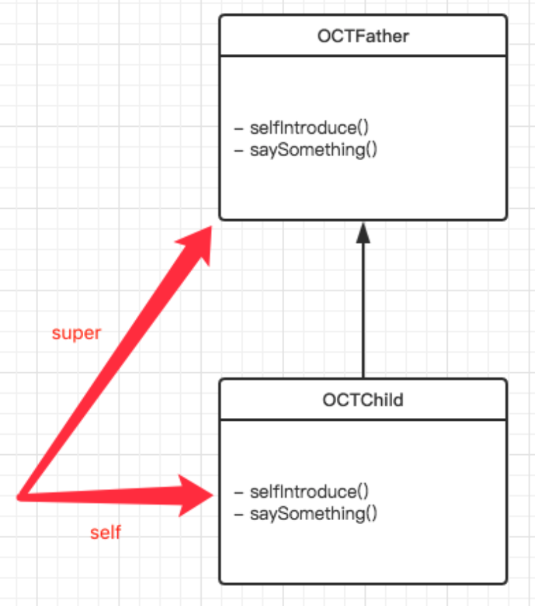
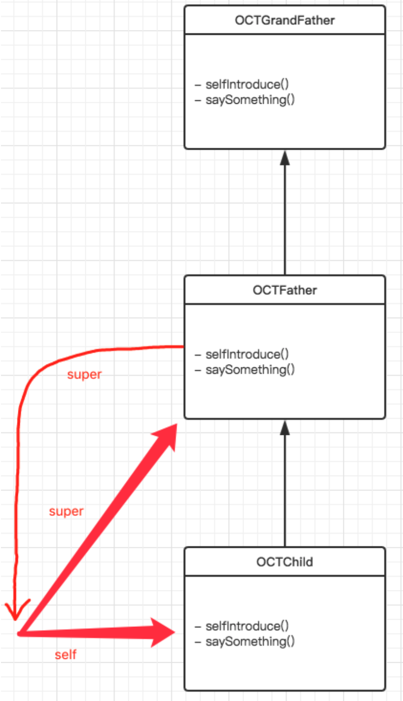

## OC 中的 self 和 super 关键字


> [《招聘一个靠谱的iOS》](https://github.com/ChenYilong/iOSInterviewQuestions/blob/master/01%E3%80%8A%E6%8B%9B%E8%81%98%E4%B8%80%E4%B8%AA%E9%9D%A0%E8%B0%B1%E7%9A%84iOS%E3%80%8B%E9%9D%A2%E8%AF%95%E9%A2%98%E5%8F%82%E8%80%83%E7%AD%94%E6%A1%88/%E3%80%8A%E6%8B%9B%E8%81%98%E4%B8%80%E4%B8%AA%E9%9D%A0%E8%B0%B1%E7%9A%84iOS%E3%80%8B%E9%9D%A2%E8%AF%95%E9%A2%98%E5%8F%82%E8%80%83%E7%AD%94%E6%A1%88%EF%BC%88%E4%B8%8A%EF%BC%89.md#21-%E4%B8%8B%E9%9D%A2%E7%9A%84%E4%BB%A3%E7%A0%81%E8%BE%93%E5%87%BA%E4%BB%80%E4%B9%88)
>
>调用 `[self method]` 时，会转化成 `objc_msgSend`函数。看下函数定义：
> 
>    ```objc
>    id objc_msgSend(id self, SEL op, ...)
> ```
> 
> 我们把 `self` 做为第一个参数传递进去。
> 
> 而在调用` [super method]`时，会转化成 `objc_msgSendSuper`函数。看下函数定义:
> 
> ```objc
>    id objc_msgSendSuper(struct objc_super *super, SEL op, ...)
> ```
> 
>第一个参数是 `objc_super` 这样一个结构体，其定义如下:
> 
>```objc
> struct objc_super {
>    /// Specifies an instance of a class.
>     __unsafe_unretained id receiver;
> 
>     /// Specifies the particular superclass of the instance to message. 
>    __unsafe_unretained Class super_class;
>     /* super_class is the first class to search */
>};
> ```
>
> 结构体有两个成员，第一个成员是 `receiver`, 类似于上面的 `objc_msgSend`函数第一个参数`self` 。第二个成员是记录当前类的父类是什么。
> 


Apple 官方文档 [Working with Objects](https://developer.apple.com/library/archive/documentation/Cocoa/Conceptual/ProgrammingWithObjectiveC/WorkingwithObjects/WorkingwithObjects.html) 

1. Objects Send and Receive Messages

2. Objects Are Created Dynamically

3. Objective-C Is a Dynamic Language

其中，第1部分，消息机制下 Objects Can Send Messages to Themselves 和 Objects Can Call Methods Implemented by Their Superclasses 就分别讲述了关键字 `self`  和 ` super`。


### self
>  [Working with Objects](https://developer.apple.com/library/archive/documentation/Cocoa/Conceptual/ProgrammingWithObjectiveC/WorkingwithObjects/WorkingwithObjects.html) 
>
> Whenever you’re writing a method implementation, you have access to an important hidden value, `self`. Conceptually, `self` is a way to refer to “the object that’s received this message.” It’s a pointer, just like the `greeting` value above, and can be used to call a method on the current receiving object.

`self` 是类的隐藏参数，指向当前调用方法的这个类的实例。


### super

>  [Working with Objects](https://developer.apple.com/library/archive/documentation/Cocoa/Conceptual/ProgrammingWithObjectiveC/WorkingwithObjects/WorkingwithObjects.html) 
>
> There’s another important keyword available to you in Objective-C, called `super`. Sending a message to `super` is a way to call through to a method implementation defined by a superclass further up the inheritance chain. The most common use of `super` is when overriding a method.

 `super` 是一个关键字，给 `super` 发消息实际上是一种调用继承链上父类实现的方法的方式，通常用于子类需要重写父类方法又想保留父类行为的时候。

> [Chapter 5. Objective-C Instance](http://www.apeth.com/iOSBook/ch05.html)
>
> The keyword `super` is class-based, and it means: “Start the search for messages I receive in the superclass of this class” (where “this class” is the class where the keyword `super` appears).

`super` 关键字 调用 `method` 这个方法时，要去父类的方法列表找，找到后调用，而不是本类的。


#### 进阶(以下为引用文)：

> [iOS super关键字帮我们做了什么？](https://www.jianshu.com/p/87fe5efe104e)
>
> 总结：
>
> 所以，从真实的IR代码中，**`super`关键字其实是直接指明本类 Son，再结合`_objc_msgSendSuper2`函数直接获取父类去查找方法的，而并非像clang重写的那样，指明本类，再通过runtime查找父类。**
>
> 其实先指明本类，再通过 runtime 查找父类，也是没有问题的，这还可以避免一些运行时**更改父类**的情况。但是LLVM的做法应该是有他的道理的，可能是出于性能考虑？


> [简谈 OC 中陌生而又熟悉的 super](https://zesming.com/oc-super/)
>
> ```objective-c
> @implementation OCTFather
> 
> - (void)selfIntroduce {
>     [self saySomething];
> }
> 
> - (void)saySomething {
>     NSLog(@"%s", "I am a father!");
> }
> 
> @end
> 
> @implementation OCTChild : OCTFather
> 
> - (void)selfIntroduce {
>     [self saySomething];
>     [super selfIntroduce];
> }
> 
> - (void)saySomething {
>     NSLog(@"%s", "I am a child!");
> }
> 
> @end
> 
> // I am a child!
> // I am a child!
> 
> ```
>
> 1 一开始的 `child` 对象调用自己的实例方法 `- selfIntroduce`，实际上底层调用是这样子的：
>
> ```objc
> objc_msgSend(self, @selector(selfIntrduce))
> ```
>
> 2 然后执行方法实现中 `[self saySomething]` 和 `[super selfIntroduce]`
>
> ```objc
> objc_msgSend(self, @selector(selfIntrduce))
> objc_msgSendSuper({self, class_getSuperclass(objc_getClass("OCTChild"))},@selector(selfIntroduce))
> 
> // 注意：这里的 self 为我们一开始生成的 OCTChild 的实例对象 child
> ```
>
> 3 `[self saySomething]` 执行，打印出 `OCTChild` 中的实现 `I am a child!`
>
> 4 `[super selfIntroduce]` 执行，查找 `OCTChild` 父类中是否有 `- selfIntroduce` 方法，按照继承链，找到它的第一个父类 `OCTFather`，然后调用其实现，执行 `[self saySomething]`
>
> ```objc
> objc_msgSend(self, @selector(selfIntrduce))
> // 注意：这里的 self 仍为我们一开始生成的 OCTChild 的实例对象 child，它是通过 objc_msgSendSuper 里面的 objc_super 这一 struct 带过来的。
> ```
>
> 5 `[self saySomething]` 执行，打印出 `OCTChild` 中的实现 `I am a child!`
>
> 执行过程完成。
>
> 总结：
>
> 1. `super` 不同于 `self`，它不是个对象，而是个 flag
> 2. 用于 `objc_msgSendSuper` 的结构体 `objc_super` 是**编译时确定**的，里面包含了当前类的父类信息
> 3. `[super someMethod]` 会去利用结构体中的父类信息，从这个父类开始顺着继承链向上查找，直到找到第一个实现 `- someMethod` 这个方法的类
> 4. 找到方法后，利用结构体中的 receiver，也就是一开始触发这个方法调用的实例，调用这个方法实现。
>
> 所以说，`[super class]` 经过这么一大圈的转换，实际上变成了 `[self class]` 了。
>
> 由于碰巧和父类有同样的实现逻辑，并且还覆写了同样的方法，最后才有这样的奇怪结果。
>
> #### 为什么不在运行时确定？
>
> 既然 OC 是一个动态语言，那么为什么 `super` 不能和 `self` 一样运行时来查找所属关系呢？
>
> 这个问题问得好，我们先来看下 `self` 在运行时是怎么玩的？
>
> ```objc
> NSLog(@"%@", self);
> ```
>
> 得到的答案很明确，`self` 是自己这个类的实例对象。
>
> 很好，我们就按照这个思路假设 `super` 就是一个 “`self` 的父类”。
>
> 那么就简单的重新回顾下我们之前的那个例子：
>
> `self` 是一个 `OCTChild` 的实例对象，那么 `super` 是这个对象的父类。
>
> 
>
> 看上去没啥问题，那么我们现在如果加一个 `OCTGrandFather` 类，使 `OCTFather` 继承这个类，那结果呢？
>
> `self` 还是 `OCTChild` 的一个实例对象，只不过在 `OCTFather` 中增加一个 `super` 的方法调用，按照我们的期望，应该是会找到 `OCTGrandFather` 这个类。
>
> 但实际上呢？
>
> 
>
> 如图所示，一开始调用没啥问题，刚才我们也验证过了，但是当 `OCTFather` 调用 `super` 方法的时候，由于是运行时确定 `super` 为 “`self` 的父类”，那么它就又会回到 `self` 所表示的 `OCTChild` 的实例对象这里来，然后重新向上找父类。
>
> 等于说，如果是运行时确定的，那么 `super` 仅仅只能找到 `self` 自己的父类，再往上就会回来往复循环。
>
> 正是因为这个原因，所以要在编译期就确定 `super` 的从属关系而不是在运行时去做。
>
> 同理，如果你想要打印一个 `super` 或者添加一个带有 `super` 方法调用的运行时方法，编译器就会立刻告诉你我不认识这个 `super`。
>
>  **Use of undeclared identifier 'super' **


## 参考文献

- [Working with Objects](https://developer.apple.com/library/archive/documentation/Cocoa/Conceptual/ProgrammingWithObjectiveC/WorkingwithObjects/WorkingwithObjects.html)
- [Chapter 5. Objective-C Instance](http://www.apeth.com/iOSBook/ch05.html)
- [简谈 OC 中陌生而又熟悉的 super](https://zesming.com/oc-super/)
- [iOS super关键字帮我们做了什么？](https://www.jianshu.com/p/87fe5efe104e)
- [《招聘一个靠谱的iOS》](https://github.com/ChenYilong/iOSInterviewQuestions/blob/master/01%E3%80%8A%E6%8B%9B%E8%81%98%E4%B8%80%E4%B8%AA%E9%9D%A0%E8%B0%B1%E7%9A%84iOS%E3%80%8B%E9%9D%A2%E8%AF%95%E9%A2%98%E5%8F%82%E8%80%83%E7%AD%94%E6%A1%88/%E3%80%8A%E6%8B%9B%E8%81%98%E4%B8%80%E4%B8%AA%E9%9D%A0%E8%B0%B1%E7%9A%84iOS%E3%80%8B%E9%9D%A2%E8%AF%95%E9%A2%98%E5%8F%82%E8%80%83%E7%AD%94%E6%A1%88%EF%BC%88%E4%B8%8A%EF%BC%89.md#21-%E4%B8%8B%E9%9D%A2%E7%9A%84%E4%BB%A3%E7%A0%81%E8%BE%93%E5%87%BA%E4%BB%80%E4%B9%88)

